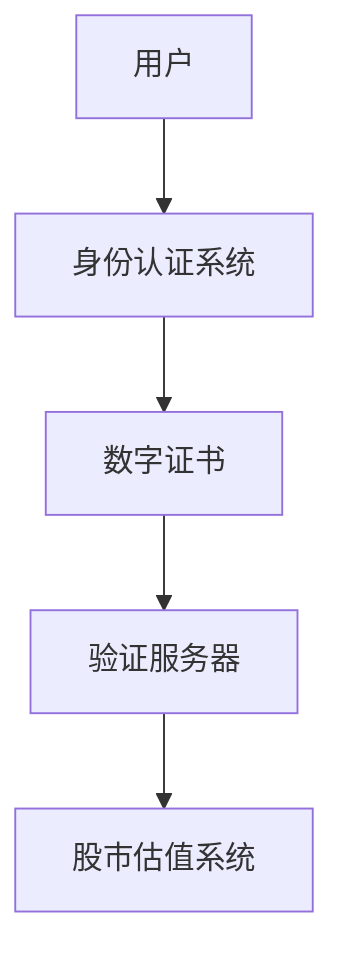

                 


# 全球股市估值与数字身份认证的关联

## 关键词
全球股市估值，数字身份认证，区块链技术，金融安全，身份认证，数学模型，金融市场

## 摘要
本文探讨了全球股市估值与数字身份认证之间的关联，分析了数字身份认证技术如何提升股市估值的准确性和安全性。通过详细讲解数字身份认证的技术原理、常见估值模型的数学公式，以及两者的结合应用，本文为读者提供了从理论到实践的全面解析，帮助理解如何利用先进技术优化金融市场操作。

---

# 正文

## 第一部分：背景介绍

### 第1章：全球股市估值与数字身份认证的背景

#### 1.1 问题背景
- **1.1.1 全球化背景下的股市估值挑战**  
  随着全球化的深入，金融市场变得更加复杂，传统的估值方法面临数据不透明、市场波动性加剧等问题。  
- **1.1.2 数字身份认证的发展趋势**  
  数字身份认证技术的兴起，为金融领域的安全性和可信度提供了新的解决方案。  
- **1.1.3 两者关联的现实需求**  
  数字身份认证可以增强数据来源的可信度，从而提高股市估值的准确性。

#### 1.2 问题描述
- **1.2.1 股市估值的传统方法及其局限性**  
  传统估值方法（如PE、PB）依赖于公开数据，但数据质量难以保证，可能导致估值偏差。  
- **1.2.2 数字身份认证在金融领域的应用现状**  
  数字身份认证技术在支付、交易授权等领域已有广泛应用，但在股市估值中的应用尚处于探索阶段。  
- **1.2.3 当前问题的复杂性**  
  数据造假、信息不对称等问题严重影响了股市估值的准确性，亟需技术手段解决。

#### 1.3 问题解决
- **1.3.1 数字身份认证如何提升股市估值的准确性**  
  通过区块链技术，确保数据来源的可追溯性和真实性。  
- **1.3.2 技术手段如何优化估值模型**  
  利用机器学习算法，结合数字身份认证数据，构建更精准的估值模型。  
- **1.3.3 解决方案的可行性分析**  
  技术可行性：数字身份认证技术已较为成熟，可与现有估值模型结合。  
  经济可行性：提升估值准确率可为金融机构带来显著经济效益。

#### 1.4 边界与外延
- **1.4.1 股市估值的边界条件**  
  数据的完整性和准确性是估值的关键因素。  
- **1.4.2 数字身份认证的适用范围**  
  主要适用于需要高安全性的金融场景。  
- **1.4.3 两者的相互影响与限制**  
  数字身份认证虽然能提高数据质量，但无法完全消除市场波动的不确定性。

#### 1.5 概念结构与核心要素
- **1.5.1 股市估值的核心要素**  
  包括公司财务数据、行业状况、宏观经济指标等。  
- **1.5.2 数字身份认证的关键组成部分**  
  包括用户身份验证、数据加密、区块链存储等。  
- **1.5.3 两者的关联机制**  
  通过数字身份认证确保数据来源的可信，从而优化估值模型的输入。

---

## 第二部分：核心概念与联系

### 第2章：数字身份认证的技术原理

#### 2.1 核心原理
- **2.1.1 数字身份认证的基本概念**  
  数字身份认证是通过技术手段验证用户身份的真实性。  
- **2.1.2 常见的认证技术**  
  - **OAuth**：用于授权，用户无需共享密码即可访问资源。  
  - **OpenID**：基于OAuth的单一登录协议，简化认证流程。  
  - **区块链**：通过去中心化和不可篡改性，确保身份信息的安全性。  
- **2.1.3 区块链技术在身份认证中的应用**  
  区块链提供了一个不可篡改的分布式账本，用于存储和验证身份信息。

#### 2.2 核心属性对比
- **安全性对比分析**  
  | 技术         | 安全性 | 可扩展性 | 易用性 |
  |--------------|--------|----------|--------|
  | RSA加密      | 高     | 低       | 中     |
  | 椭圆曲线加密  | 高     | 中       | 高     |
  | 区块链       | 极高   | 高       | 中     |
- **可扩展性对比**  
  区块链技术在身份认证中的扩展性优于传统加密技术，但需考虑网络性能。
- **易用性对比**  
  OAuth和OpenID提供了更高的易用性，用户无需记住复杂密码。

#### 2.3 ER实体关系图


---

### 第3章：股市估值的数学模型

#### 3.1 常见估值方法
- **3.1.1 市盈率（PE）模型**  
  $$ PE = \frac{股票价格}{每股收益} $$
- **3.1.2 市净率（PB）模型**  
  $$ PB = \frac{股票价格}{每股净资产} $$
- **3.1.3 现金流折现模型（DCF）**  
  $$ V = \sum_{t=1}^{n} \frac{CF_t}{(1 + r)^t} + \frac{TV}{(1 + r)^n} $$  
  其中，$CF_t$为第t年的现金流，$r$为折现率，$TV$为终值。

#### 3.2 数学模型
- **3.2.1 PE模型的改进**  
  $$ PE' = \frac{真实财务数据}{准确每股收益} $$
- **3.2.2 DCF模型与数字身份认证的结合**  
  通过区块链技术确保现金流数据的准确性，从而提高DCF模型的估值精度。

#### 3.3 举例说明
- **PE模型举例**  
  某公司股价为100元，每股收益为10元，$$ PE = 10 $$，表明股价合理。  
- **DCF模型举例**  
  某公司未来5年现金流分别为50、60、70、80、90万元，折现率为8%，计算其现值。

---

## 第三部分：算法原理讲解

### 第4章：数字身份认证的算法实现

#### 4.1 加密算法
- **RSA算法**  
  使用公钥和私钥进行加密和解密。  
  ```python
  import rsa
  message = "Hello, World!"
  public_key, private_key = rsa.newkeys(2048)
  encrypted = rsa.encrypt(message.encode(), public_key)
  decrypted = rsa.decrypt(encrypted, private_key)
  print(decrypted.decode())
  ```
- **椭圆曲线加密**  
  提供更高的安全性，适合资源受限的环境。  
  ```python
  from cryptography.hazmat.primitives.asymmetric import ec
  private_key = ec.generate_private_key(ec.SECP256K1())
  public_key = private_key.public_key()
  ```

#### 4.2 区块链实现
- **区块链身份认证流程**  
  ```mermaid
  graph TD
      User --> CreateTransaction[创建交易]
      CreateTransaction --> BlockchainNode[区块链节点]
      BlockchainNode --> ValidateTransaction[验证交易]
      ValidateTransaction --> StoreTransaction[存储交易]
  ```

#### 4.3 数学模型实现
- **PE模型的优化**  
  使用Python进行数据处理和计算。  
  ```python
  def calculate_pe(stock_price, earnings_per_share):
      return stock_price / earnings_per_share
  ```

---

## 第四部分：系统分析与架构设计

### 第5章：系统架构设计

#### 5.1 问题场景介绍
- 数字身份认证应用于股市估值系统，确保数据来源的真实性和可靠性。

#### 5.2 系统功能设计
- **领域模型**  
  ```mermaid
  classDiagram
      class 用户 {
          用户ID
          密钥对
      }
      class 身份认证系统 {
          验证请求
          生成数字证书
      }
      class 股市估值系统 {
          获取数据
          计算估值
      }
      用户 --> 身份认证系统
      身份认证系统 --> 股市估值系统
  ```

#### 5.3 系统架构设计
- **架构图**  
  ```mermaid
  architecture
      前端 --> 中间件
      中间件 --> 身份认证服务
      身份认证服务 --> 区块链节点
      区块链节点 --> 数据存储
  ```

#### 5.4 接口设计
- **REST API**  
  - POST `/api/authenticate`：用户身份验证。  
  - GET `/api/valuation`：获取估值结果。

#### 5.5 交互流程图
- **序列图**  
  ```mermaid
  sequenceDiagram
      用户 ->> 中间件: 发送身份验证请求
      中间件 ->> 身份认证系统: 验证请求
      身份认证系统 ->> 区块链节点: 验证用户身份
      区块链节点 ->> 中间件: 返回验证结果
      中间件 ->> 用户: 返回身份验证结果
      用户 ->> 中间件: 获取估值请求
      中间件 ->> 股市估值系统: 获取数据
      股市估值系统 ->> 中间件: 返回估值结果
      中间件 ->> 用户: 返回估值结果
  ```

---

## 第五部分：项目实战

### 第6章：项目实现与案例分析

#### 6.1 环境搭建
- **安装Python和相关库**  
  ```bash
  pip install rsa cryptography flask
  ```

#### 6.2 核心代码实现
- **身份认证模块**  
  ```python
  from flask import Flask
  from cryptography.hazmat.primitives.asymmetric import rsa

  app = Flask(__name__)

  @app.route('/api/authenticate', methods=['POST'])
  def authenticate():
      # 验证逻辑
      return 'Authenticated'
  ```

- **估值模块**  
  ```python
  def calculate_pe(stock_price, earnings_per_share):
      return stock_price / earnings_per_share

  stock_price = 100
  earnings_per_share = 10
  pe = calculate_pe(stock_price, earnings_per_share)
  print(pe)
  ```

#### 6.3 案例分析
- **案例：某科技公司估值**  
  使用优化后的PE模型，结合数字身份认证数据，得出公司估值为合理区间。

#### 6.4 项目总结
- 本项目展示了数字身份认证与股市估值的结合，提高了估值的准确性和数据的安全性。

---

## 第六部分：总结与展望

### 第7章：总结与未来发展方向

#### 7.1 最佳实践
- **小结**  
  数字身份认证技术在提升股市估值准确性方面具有巨大潜力。  
- **注意事项**  
  在实际应用中，需注意数据隐私和系统安全。  
- **拓展阅读**  
  推荐阅读《区块链技术与金融创新》、《数字身份认证的安全挑战》。

#### 7.2 未来展望
- **技术发展**  
  AI与区块链的结合将为股市估值提供更精准的工具。  
- **应用场景扩展**  
  数字身份认证技术可应用于更多金融领域，如智能合约、风险管理等。

---

**摘要**：本文通过分析数字身份认证技术，探讨其在股市估值中的应用，提出了一种结合区块链技术的解决方案，为提升金融市场的安全性和效率提供了新思路。

