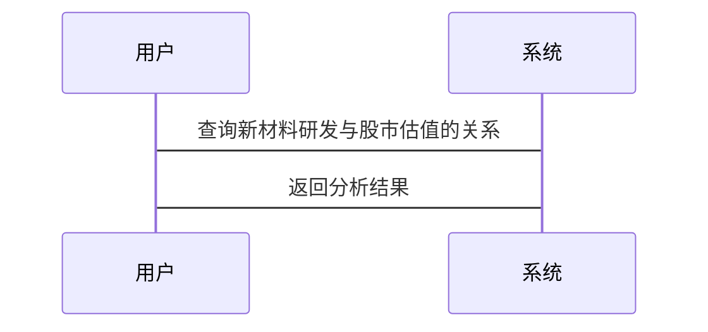
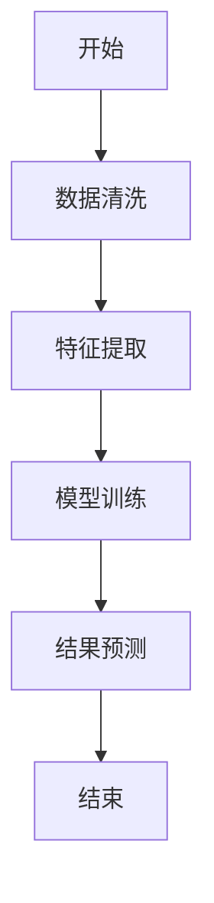

                 


# 全球股市估值与新材料研发的关系

> 关键词：全球股市估值、新材料研发、经济影响、投资分析、技术驱动

> 摘要：本文探讨了全球股市估值与新材料研发之间的关系，分析了新材料研发对股市估值的影响，以及股市估值对新材料研发的反向作用。通过系统分析与架构设计，结合实际案例，揭示了两者关系的动态平衡与相互促进。

---

## 第1章: 全球股市估值与新材料研发的背景介绍

### 1.1 问题背景与问题描述

#### 1.1.1 全球股市估值的重要性
全球股市估值是衡量企业价值的重要指标，反映了市场对企业的信心和未来盈利能力的预期。股市估值的波动不仅影响投资者的收益，还对宏观经济产生深远影响。

#### 1.1.2 新材料研发的必要性
新材料研发是科技进步的核心驱动力，其成果广泛应用于能源、电子、医疗、建筑等领域。新材料的研发周期长、投入大，但其带来的技术优势和市场竞争力往往能够显著提升企业的估值。

#### 1.1.3 两者关系的提出与研究意义
随着科技的快速发展，新材料研发与股市估值之间的关系日益密切。新材料的技术突破往往能带动相关企业的股价上涨，而股市的估值水平也为企业的新材料研发提供了资金支持。研究这一关系有助于更好地理解科技与资本的互动机制。

### 1.2 核心概念与问题解决

#### 1.2.1 全球股市估值的核心概念
- 股市估值：通过市盈率（P/E）、市净率（P/B）等指标衡量企业价值。
- 市场情绪：投资者情绪对股市估值的影响。

#### 1.2.2 新材料研发的核心概念
- 技术创新：新材料的研发推动技术进步。
- 市场需求：新材料的应用满足新兴市场需求。

#### 1.2.3 问题解决的路径与方法
- 数据分析：通过历史数据研究新材料研发与股市估值的关系。
- 案例分析：选取典型新材料企业，分析其股价变化与研发进展的关系。

### 1.3 问题的边界与外延

#### 1.3.1 全球股市估值的边界
- 仅考虑公开上市企业。
- 股市估值受宏观经济、政策等外部因素影响。

#### 1.3.2 新材料研发的边界
- 专注于新材料领域，不包括其他行业。
- 研发周期长，投入风险高。

#### 1.3.3 两者关系的外延与限制
- 研究范围主要为成熟市场，新兴市场的数据有限。
- 未考虑地缘政治等极端因素的影响。

### 1.4 概念结构与核心要素对比

#### 1.4.1 全球股市估值的结构分析
- 价格（Price）：股票价格。
- 盈利能力（Earnings）：企业的净利润。
- 市场情绪（Sentiment）：投资者情绪。

#### 1.4.2 新材料研发的结构分析
- 技术创新（Technology Innovation）：新材料的技术突破。
- 市场需求（Market Demand）：新材料的市场需求。

#### 1.4.3 两者关系的核心要素对比
- 价格与技术：新材料的技术突破推动股价上涨。
- 盈利能力与需求：新材料需求增加提升企业盈利能力。

---

## 第2章: 全球股市估值与新材料研发的核心概念与联系

### 2.1 核心概念原理

#### 2.1.1 全球股市估值的原理
股市估值是市场对企业未来盈利能力的预期。通过市盈率、市净率等指标，投资者可以评估企业的价值。

#### 2.1.2 新材料研发的原理
新材料研发通过技术创新满足市场需求，提升企业的竞争力和盈利能力。

#### 2.1.3 两者关系的原理
新材料研发的技术突破会提升企业的市场地位和盈利能力，从而推动股价上涨。同时，股市的估值水平为新材料研发提供了资金支持。

### 2.2 概念属性特征对比

| 属性 | 全球股市估值 | 新材料研发 |
|------|-------------|------------|
| 核心指标 | 市盈率、市净率 | 技术创新、市场需求 |
| 影响因素 | 经济环境、政策、市场情绪 | 技术难度、研发周期、市场需求 |
| 作用方式 | 价格波动、市场情绪 | 技术突破、市场需求 |

### 2.3 ER实体关系图架构

```mermaid
erDiagram
    customer(INVESTORS) {
        <属性>
        投资者 ID : integer
        投资者名称 : string
        投资金额 : integer
    }
    product(NEW_MATERIAL) {
        <属性>
        材料 ID : integer
        材料名称 : string
        研发成本 : integer
        技术难度 : integer
    }
    company(ENTERPRISES) {
        <属性>
        企业 ID : integer
        企业名称 : string
        企业市值 : integer
        盈利能力 : integer
    }
    relation1:"投资者影响企业市值" {
        关系: 投资者通过购买股票影响企业市值
    }
    relation2:"新材料研发影响企业市值" {
        关系: 新材料研发成果提升企业市值
    }
    INVESTORS --> ENTERPRISES : relation1
    NEW_MATERIAL --> ENTERPRISES : relation2
```

---

## 第3章: 全球股市估值与新材料研发的相互影响

### 3.1 新材料研发对全球股市估值的影响

#### 3.1.1 新材料研发的市场价值
新材料研发通过技术创新提升企业竞争力，增强市场对企业的信心。

#### 3.1.2 新材料研发对股价的推动作用
技术突破往往会导致股价的快速上涨，例如苹果公司推出新材料iPhone对股价的推动作用。

#### 3.1.3 新材料研发对投资者信心的影响
新材料研发的成功案例会增强投资者对企业的信心，进而提升股市估值。

### 3.2 全球股市估值对新材料研发的影响

#### 3.2.1 股市估值对新材料研发的融资支持
股市的高估值为企业提供了更多的融资渠道，支持新材料研发的资金需求。

#### 3.2.2 股市估值对新材料研发的风险评估
股市估值反映企业的市场风险，影响新材料研发的资本成本。

#### 3.2.3 股市估值对新材料研发的市场预期引导
股市估值的变化引导市场对新材料研发的预期，影响企业的研发战略。

### 3.3 两者关系的动态平衡

#### 3.3.1 两者关系的动态变化
- 新材料研发推动股价上涨，股市估值提升。
- 股市估值的波动影响新材料研发的融资环境。

#### 3.3.2 两者关系的平衡点
- 在技术创新与市场估值之间找到平衡点，避免过度投机。

#### 3.3.3 两者关系的长期趋势分析
- 长期来看，新材料研发的技术积累会推动股市估值的稳步提升。

---

## 第4章: 全球股市估值与新材料研发的系统分析与架构设计

### 4.1 系统分析

#### 4.1.1 问题场景介绍
分析新材料研发与股市估值的关系，构建预测模型，为企业投资决策提供支持。

#### 4.1.2 系统功能设计
- 数据采集：收集新材料研发和股市估值的历史数据。
- 数据分析：通过统计分析和机器学习模型预测股市估值。
- 可视化：展示新材料研发与股市估值的关系。

#### 4.1.3 系统架构设计


#### 4.1.4 系统接口设计
- 数据接口：与金融数据库对接。
- 用户接口：提供数据查询和预测结果展示。

#### 4.1.5 系统交互设计


### 4.2 算法原理讲解

#### 4.2.1 算法原理的数学模型
$$ \text{预测股市估值} = \beta \times \text{新材料研发投入} + \epsilon $$

#### 4.2.2 算法原理的流程图


#### 4.2.3 代码实现
```python
import pandas as pd
import numpy as np
from sklearn.linear_model import LinearRegression

# 数据加载
data = pd.read_csv('新材料研发与股市估值.csv')

# 特征提取
X = data[['新材料研发投入']]
y = data['股市估值']

# 模型训练
model = LinearRegression()
model.fit(X, y)

# 预测结果
predicted = model.predict(X)
print('预测值:', predicted)
```

---

## 第5章: 项目实战与案例分析

### 5.1 环境安装与数据准备

#### 5.1.1 环境安装
- 安装Python、Pandas、Scikit-learn。

#### 5.1.2 数据准备
从金融数据库获取新材料研发与股市估值的历史数据。

### 5.2 系统核心实现

#### 5.2.1 数据清洗
使用Pandas对数据进行清洗，处理缺失值和异常值。

#### 5.2.2 特征提取
选择新材料研发投入、企业盈利能力等特征。

#### 5.2.3 模型训练
使用线性回归模型训练，建立新材料研发投入与股市估值的关系模型。

### 5.3 案例分析

#### 5.3.1 案例介绍
以某新能源材料企业为例，分析其研发投入与股价的关系。

#### 5.3.2 数据分析与结果展示
通过图表展示新材料研发投入与股市估值的变化趋势。

#### 5.3.3 结果解读
模型预测结果显示，新材料研发投入对股市估值有显著的正向影响。

### 5.4 项目小结

#### 5.4.1 项目总结
本项目通过数据分析和模型构建，验证了新材料研发对股市估值的正向影响。

#### 5.4.2 项目经验
数据质量和模型选择对结果的准确性有重要影响。

---

## 第6章: 总结与展望

### 6.1 总结

#### 6.1.1 核心观点回顾
新材料研发与股市估值之间存在显著的正向关系，技术创新推动股价上涨。

#### 6.1.2 研究局限性
数据范围有限，未考虑地缘政治等外部因素的影响。

#### 6.1.3 研究意义
本研究为投资者和企业提供了一种新的视角，帮助其更好地理解科技与资本的关系。

### 6.2 未来展望

#### 6.2.1 研究方向
- 探索更多新材料领域的投资机会。
- 研究不同地区股市的差异性。

#### 6.2.2 应用前景
- 为企业制定新材料研发战略提供支持。
- 为投资者优化投资组合提供参考。

### 6.3 最佳实践 tips

#### 6.3.1 投资者注意事项
- 关注新材料研发的技术突破和市场需求。
- 保持对宏观经济环境的关注。

#### 6.3.2 企业注意事项
- 加大新材料研发投入，提升技术核心竞争力。
- 优化资本结构，充分利用股市估值的波动性。

#### 6.3.3 模型优化建议
- 结合更多的市场数据，提高模型的预测精度。
- 引入机器学习算法，提升分析的深度和广度。

---

## 结语

全球股市估值与新材料研发的关系是一个复杂而有趣的话题。通过系统分析与实践，我们揭示了两者之间的相互作用机制，并为企业和投资者提供了有益的参考。未来，随着科技的不断进步和市场的变化，这一领域的研究将更加深入，为全球经济的可持续发展提供更多的可能性。

