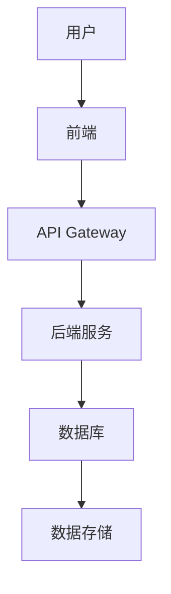
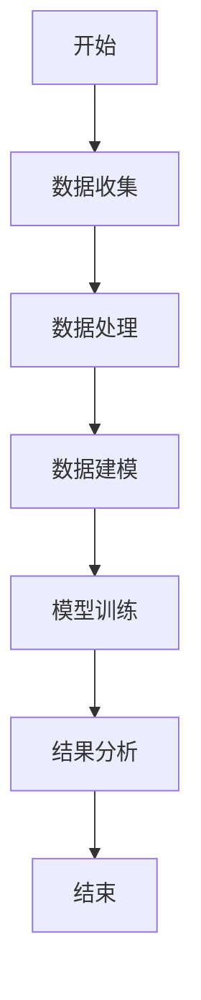

                 


```markdown
# 全球股市估值与智慧城市建设的互动

> 关键词：全球股市估值，智慧城市建设，互动关系，大数据分析，系统架构，城市规划

> 摘要：本文探讨了全球股市估值与智慧城市建设之间的互动关系，分析了股市估值对智慧城市建设的影响，以及智慧城市建设对股市的反作用。通过详细分析两者的核心概念、算法原理和系统架构，结合实际案例，总结了互动机制的数学模型和最佳实践，为智慧城市建设提供了新的视角和方法。

---

## 第一部分：全球股市估值与智慧城市建设的背景与概述

### 第1章：全球股市估值与智慧城市建设的背景与概述

#### 1.1 全球股市估值的基本概念
- 股市估值的定义与意义
- 全球化背景下的股市特点
- 智慧城市建设的定义与目标

#### 1.2 股市估值与智慧城市建设的互动关系
- 股市估值对智慧城市建设的影响
- 智慧城市建设对股市的影响
- 互动机制的初步分析

#### 1.3 本章小结

---

## 第二部分：全球股市估值的核心方法与模型

### 第2章：全球股市估值的核心方法与模型

#### 2.1 股市估值的传统方法
- 市盈率法
- 市净率法
- 股息率法

#### 2.2 现代股市估值方法
- 现金流折现法
- 股权自由现金流模型
- 经济利润模型

#### 2.3 大数据与人工智能在股市估值中的应用
- 机器学习在股票预测中的应用
- 自然语言处理在财经新闻分析中的应用
- 数据挖掘在股票市场中的应用

#### 2.4 本章小结

---

## 第三部分：智慧城市建设的核心技术与规划

### 第3章：智慧城市建设的核心技术与规划

#### 3.1 智慧城市建设的技术基础
- 大数据技术
- 云计算技术
- 物联网技术

#### 3.2 智慧城市建设的规划与实施
- 智慧城市规划的步骤
- 智慧城市实施的阶段
- 智慧城市评估指标

#### 3.3 智慧城市建设中的数据共享与隐私保护
- 数据共享的重要性
- 数据隐私保护的挑战
- 数据安全的解决方案

#### 3.4 本章小结

---

## 第四部分：全球股市估值与智慧城市建设的互动机制

### 第4章：全球股市估值与智慧城市建设的互动机制

#### 4.1 股市估值对智慧城市建设的影响
- 股市资金对智慧城市建设的支撑
- 股市波动对智慧城市建设的影响
- 股市政策对智慧城市建设的引导

#### 4.2 智慧城市建设对股市的影响
- 智慧城市建设对相关企业股票的影响
- 智慧城市建设对整体股市环境的影响
- 智慧城市建设对投资者信心的影响

#### 4.3 互动机制的数学模型与分析
- 互动机制的数学模型
- 模型的验证与应用
- 模型的局限性与改进方向

#### 4.4 本章小结

---

## 第五部分：智慧城市建设中的数据共享与隐私保护

### 第5章：智慧城市建设中的数据共享与隐私保护

#### 5.1 数据共享的重要性
- 数据共享对智慧城市建设的支撑作用
- 数据共享对城市运营效率的提升

#### 5.2 数据隐私保护的挑战
- 数据隐私保护的法律与伦理问题
- 技术手段在数据隐私保护中的应用

#### 5.3 数据安全的解决方案
- 数据加密技术
- 数据脱敏技术
- 数据访问控制技术

#### 5.4 本章小结

---

## 第六部分：系统架构与设计

### 第6章：智慧城市建设的系统架构与设计

#### 6.1 系统功能设计
- 领域模型设计（使用Mermaid类图）
- 功能模块划分

#### 6.2 系统架构设计
- 分层架构设计（使用Mermaid架构图）
- 模块之间的交互关系

#### 6.3 系统接口设计
- API接口设计
- 接口调用流程

#### 6.4 系统交互设计
- 使用Mermaid序列图展示系统交互流程

#### 6.5 本章小结

---

## 第七部分：项目实战与案例分析

### 第7章：项目实战与案例分析

#### 7.1 项目背景与目标
- 项目背景介绍
- 项目目标设定

#### 7.2 项目核心实现
- 环境安装与配置
- 核心代码实现（使用Python）
- 代码功能解读

#### 7.3 案例分析
- 实际案例介绍
- 案例分析与解读

#### 7.4 项目小结
- 项目成果总结
- 经验与教训

---

## 第八部分：最佳实践与未来展望

### 第8章：最佳实践与未来展望

#### 8.1 最佳实践
- 数据共享与隐私保护的最佳实践
- 系统架构设计的优化建议

#### 8.2 未来展望
- 互动机制的未来发展方向
- 技术创新对互动关系的深远影响

#### 8.3 本章小结

---

## 第九部分：总结与参考文献

### 第9章：总结与参考文献

#### 9.1 全文总结
- 核心观点回顾
- 创新点总结

#### 9.2 参考文献
- 主要参考文献列表
- 进一步阅读的推荐资源

---

### 附录：工具与代码示例

#### 附录A：算法实现代码
```python
# 示例代码：使用机器学习进行股票预测
import pandas as pd
from sklearn.linear_model import LinearRegression

data = pd.read_csv('stock_data.csv')
X = data[['PE', 'PB', 'ROE']]
y = data['Price']

model = LinearRegression()
model.fit(X, y)

# 预测新数据
new_data = pd.DataFrame({'PE': [15], 'PB': [2], 'ROE': [0.1]})
predicted_price = model.predict(new_data)
print(predicted_price)
```

#### 附录B：系统架构图


#### 附录C：流程图


---

### 符号说明
- $$：用于表示数学公式，独立段落中使用。
- $：用于表示数学公式，段落内使用。
- Mermaid图表：用于展示系统架构、流程图等。

---

### END
```

