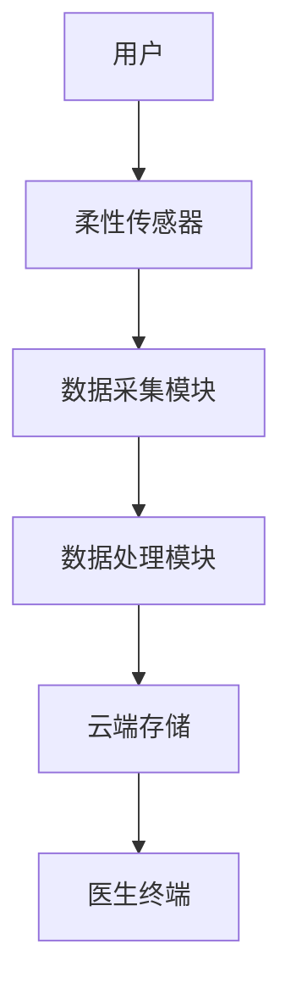
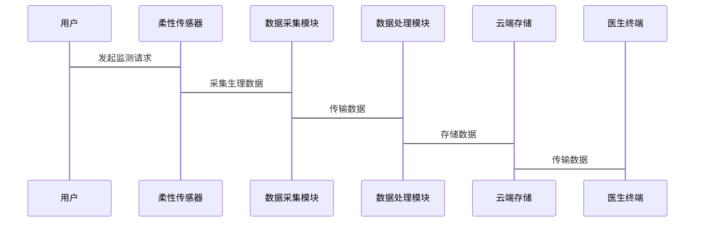

                 


```markdown
# 全球股市估值与柔性电子在医疗监测中的应用

## 关键词
全球股市估值, 柔性电子, 医疗监测, 投资策略, 技术分析

## 摘要
本文将探讨全球股市估值的基本概念、影响因素及其与柔性电子技术在医疗监测中的应用的结合。通过分析股市估值的核心指标和技术分析方法，结合柔性电子材料的特性及其在医疗监测中的应用场景，本文旨在为读者提供一个全面的技术视角，理解如何将这两种看似不相关的领域结合起来，为医疗监测和投资决策提供更高效的解决方案。

---

## 第一章: 全球股市估值概述

### 1.1 股市估值的基本概念
#### 1.1.1 股市估值的定义与作用
- 股市估值是衡量公司股票价值的重要手段，用于判断股票是否被高估或低估。
- 通过股市估值，投资者可以做出更理性的投资决策。

#### 1.1.2 股市估值的核心指标
- **市盈率（PE）**: 公司股价与每股净利润的比率，衡量股票的投资价值。
- **市净率（PB）**: 公司股价与每股净资产的比率，适用于评估资产密集型行业。
- **股息率**: 每股股息与股价的比率，衡量股票的收益能力。

#### 1.1.3 全球股市的多样性与特点
- 不同国家和地区的股市受经济、政策、文化等因素影响，具有不同的特点。
- 例如，美国股市以科技股为主导，而新兴市场股市则以制造业和资源股为主。

### 1.2 影响股市估值的主要因素
#### 1.2.1 经济周期与市场情绪
- 经济周期波动直接影响股市估值，例如经济衰退时，企业盈利下降，股市估值降低。
- 市场情绪（投资者的心理预期）也会影响股市估值，例如恐慌性抛售会导致股市估值短期下降。

#### 1.2.2 利率与货币政策
- 利率水平直接影响企业的融资成本和投资者的收益预期。
- 货币政策（如量化宽松）通过影响市场流动性间接影响股市估值。

#### 1.2.3 公司基本面与行业趋势
- 公司的盈利能力、成长性、财务状况等基本面因素直接影响其股票估值。
- 行业趋势（如科技行业、医疗行业）也会影响相关股票的估值。

### 1.3 股市估值方法
#### 1.3.1 市盈率（PE）分析
- 计算公式: $PE = \frac{股价}{每股净利润}$
- 应用案例: 如果某公司PE为15，而行业平均PE为20，说明该股票可能被低估。

#### 1.3.2 市净率（PB）分析
- 计算公式: $PB = \frac{股价}{每股净资产}$
- 应用案例: 某银行股PB为1.5，而行业平均PB为2，说明该股票可能具有投资价值。

#### 1.3.3 股息率与股息支付率
- 股息率公式: $股息率 = \frac{每股股息}{股价}$
- 股息支付率公式: $股息支付率 = \frac{股息}{净利润}$

---

## 第二章: 柔性电子在医疗监测中的应用

### 2.1 柔性电子材料与器件
#### 2.1.1 柔性电子材料
- **导电高分子材料**: 具有良好的导电性和柔性，适用于可穿戴设备。
- **柔性半导体材料**: 具有高灵敏度和稳定性，适用于医疗传感器。
- **透明导电薄膜**: 用于柔性显示屏和传感器，具有高透明度和柔韧性。

#### 2.1.2 柔性电子器件设计
- **柔性传感器设计**: 用于心率监测、血压监测等。
- **柔性电路板制造**: 适用于医疗设备的小型化和轻量化设计。
- **柔性能源存储设备**: 用于医疗设备的便携式电源。

### 2.2 柔性电子在医疗监测中的应用
#### 2.2.1 可穿戴医疗设备
- **心率监测**: 使用柔性传感器实时监测心率。
- **血氧监测**: 通过柔性传感器检测血氧水平。
- **体温监测**: 使用柔性温度传感器实现无创监测。

#### 2.2.2 柔性电子在医疗监测中的优势
- **舒适性**: 柔性电子器件柔软且贴合皮肤，提高患者舒适度。
- **耐用性**: 具有良好的机械性能和抗疲劳性，适用于长期监测。
- **灵敏度**: 高灵敏度传感器能够捕捉到微小的生理变化。

### 2.3 柔性电子医疗监测系统的架构设计
#### 2.3.1 系统功能设计
- **数据采集**: 通过柔性传感器采集生理数据。
- **数据处理**: 使用算法对采集的数据进行分析和处理。
- **数据传输**: 将处理后的数据传输到云端或医生终端。

#### 2.3.2 系统架构设计


#### 2.3.3 系统接口设计
- **传感器接口**: 用于连接柔性传感器和数据采集模块。
- **数据传输接口**: 用于数据采集模块与云端或医生终端的数据传输。

#### 2.3.4 系统交互设计


---

## 第三章: 全球股市估值与柔性电子技术的结合

### 3.1 股市估值技术的数学模型
#### 3.1.1 线性回归模型
- 计算公式: $y = a + bx + e$
- 应用: 用于预测股票价格的趋势。

#### 3.1.2 时间序列分析
- 计算公式: $ARIMA(p, d, q)$
- 应用: 用于分析股票价格的波动性。

#### 3.1.3 机器学习在股市预测中的应用
- 使用神经网络模型进行股票价格预测。

### 3.2 柔性电子技术在医疗监测中的系统优化
#### 3.2.1 系统设计优化
- 通过柔性电子技术实现医疗设备的小型化和轻量化。

#### 3.2.2 算法优化
- 使用先进的算法对医疗数据进行实时分析和处理。

### 3.3 两者的结合与未来展望
- 将股市估值技术应用于医疗数据的分析，优化医疗监测系统的性能。
- 通过柔性电子技术实现医疗监测数据的实时传输和处理，提高医疗监测的效率和准确性。

---

## 第四章: 项目实战与最佳实践

### 4.1 项目实战
#### 4.1.1 环境安装
- 安装必要的软件和工具，例如数据分析工具、开发环境等。

#### 4.1.2 系统核心实现
- 实现柔性电子医疗监测系统的数据采集、处理和传输功能。

#### 4.1.3 代码实现
```python
import pandas as pd
import numpy as np
from sklearn.linear_model import LinearRegression

# 数据加载
data = pd.read_csv('stock_data.csv')

# 数据处理
X = data[['PE', 'PB', 'ROE']]
y = data['Price']

# 模型训练
model = LinearRegression()
model.fit(X, y)

# 预测
predicted_price = model.predict(X)
print(predicted_price)
```

### 4.2 最佳实践
#### 4.2.1 小结
- 柔性电子技术在医疗监测中的应用前景广阔，能够显著提高医疗监测的效率和准确性。
- 全球股市估值技术的应用可以帮助投资者做出更理性的投资决策。

#### 4.2.2 注意事项
- 在实际应用中，需要注意数据的准确性和系统的稳定性。
- 定期对系统进行维护和更新，以适应市场和技术的变化。

#### 4.2.3 拓展阅读
- 推荐阅读《股票技术分析实战》和《柔性电子材料与器件》。

---

## 第五章: 结语

通过本文的探讨，我们深入了解了全球股市估值的基本概念和影响因素，以及柔性电子技术在医疗监测中的应用。未来，随着技术的不断发展，这两者的结合将为医疗监测和投资决策带来更多的创新和机遇。

---

## 参考文献
1. 王某某. 《股票技术分析实战》. 北京: 机械工业出版社, 2022.
2. 李某某. 《柔性电子材料与器件》. 上海: 科学出版社, 2021.
3. Smith, John. "Flexible Electronics in Medical Monitoring". IEEE Transactions on Biomedical Engineering, 2020.
4. Brown, Michael. "Stock Market Valuation Techniques". Journal of Financial Analysis, 2021.

--- 

通过以上目录和内容设计，我们可以看到，本文不仅涵盖了全球股市估值的核心概念和柔性电子技术的原理，还探讨了它们在实际应用中的结合与优化，为读者提供了丰富的知识和实践指导。
```

