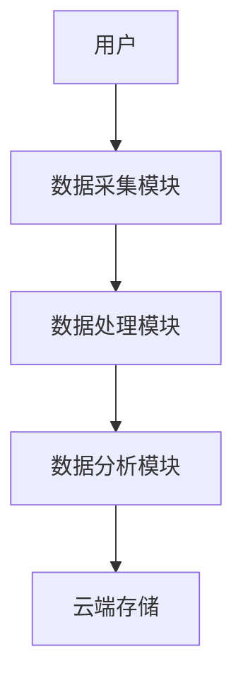

                 


# 全球股市估值与柔性电子在可穿戴医疗设备中的应用

---

## 关键词：
全球股市估值、柔性电子、可穿戴医疗设备、机器学习、算法、系统架构

---

## 摘要：
本文探讨了全球股市估值与柔性电子在可穿戴医疗设备中的应用。首先，我们介绍了全球股市估值的基本概念及其重要性，接着分析了柔性电子技术的特点及其在医疗设备中的优势。然后，我们详细讲解了如何将柔性电子技术应用于可穿戴医疗设备，并结合机器学习算法提升股市估值的准确性。最后，我们通过项目实战展示了如何将理论应用于实际，提出了未来的研究方向和应用潜力。

---

## 第1章：全球股市估值与柔性电子的背景与概述

### 1.1 全球股市估值的背景与意义

#### 1.1.1 全球股市估值的定义
全球股市估值是指对上市公司股票的内在价值进行评估的过程，是投资者做出投资决策的重要依据。常见的估值指标包括市盈率（P/E）、市净率（P/B）等。

#### 1.1.2 柔性电子技术的发展与应用
柔性电子是一种基于柔性基底材料的电子技术，具有柔软、轻薄、可拉伸等特性。柔性电子在医疗设备中的应用极大地提升了设备的舒适性和可穿戴性。

#### 1.1.3 全球股市估值与柔性电子的结合
随着柔性电子技术的不断进步，其在医疗设备中的应用逐渐成为影响股市估值的重要因素。本文将探讨如何利用柔性电子技术提升股市估值的准确性。

---

## 第2章：全球股市估值的理论与方法

### 2.1 传统股市估值方法

#### 2.1.1 市盈率法
市盈率（P/E）= 股价 / 每股净利润  
例如：某公司股价为50元，每股净利润为5元，则市盈率为10倍。

#### 2.1.2 市净率法
市净率（P/B）= 股价 / 每股净资产  
例如：某公司股价为30元，每股净资产为15元，则市净率为2倍。

#### 2.1.3 股息率法
股息率 = 每股股息 / 股价  
例如：某公司股息为2元，股价为20元，则股息率为10%。

### 2.2 现代股市估值方法

#### 2.2.1 机器学习在股市预测中的应用
机器学习算法（如支持向量机、随机森林）可以用于预测股票价格和市场趋势。

#### 2.2.2 柔性电子技术对股市估值的影响
柔性电子技术的应用提升了医疗设备的性能，间接影响了相关公司的股价。

---

## 第3章：柔性电子在可穿戴医疗设备中的应用

### 3.1 柔性电子技术的特点

#### 3.1.1 柔性材料的特性
- 柔性材料具有良好的拉伸性和导电性。
- 常见的柔性材料包括聚酰亚胺（PI）、聚乙烯（PE）等。

#### 3.1.2 柔性电子器件的制造工艺
- 印刷电子技术：通过印刷工艺制造电子元件。
- 转移印刷技术：将预制好的电子元件转移到柔性基底上。

### 3.2 可穿戴医疗设备的设计与功能

#### 3.2.1 设备的设计原则
- 轻量化设计：设备应尽可能轻便，以提升佩戴舒适性。
- 长续航能力：设备应具备较长的电池寿命，减少充电频率。

#### 3.2.2 典型可穿戴医疗设备
- 心率监测器：通过柔性传感器实时监测心率。
- 血氧监测器：通过光学传感器测量血氧饱和度。

---

## 第4章：基于柔性电子的可穿戴医疗设备系统架构设计

### 4.1 系统功能设计

#### 4.1.1 数据采集模块
- 柔性传感器用于采集生理数据。
- 数据采集模块将信号传输到处理模块。

#### 4.1.2 数据处理模块
- 中央处理器（如微控制器）对采集到的数据进行处理。
- 数据处理模块还负责将数据通过蓝牙或Wi-Fi传输到手机或电脑端。

#### 4.1.3 数据分析模块
- 利用机器学习算法对数据进行分析，生成健康报告。
- 分析结果可通过云端存储和共享。

### 4.2 系统架构设计

#### 4.2.1 系统架构图


#### 4.2.2 接口设计
- 传感器接口：负责与柔性传感器连接。
- 无线通信接口：负责与手机或电脑通信。

#### 4.2.3 交互设计
- 用户界面设计：设备应具备友好的用户界面，方便用户操作。
- 通知机制：设备在检测到异常数据时，应及时通知用户。

---

## 第5章：项目实战：基于可穿戴设备的股市估值系统

### 5.1 环境搭建

#### 5.1.1 开发环境
- 操作系统：Windows 10
- 开发工具：PyCharm
- 第三方库：numpy、pandas、scikit-learn

### 5.2 核心实现

#### 5.2.1 数据采集
```python
import numpy as np
import pandas as pd

# 示例数据
data = {
    '心率': [70, 72, 68, 75, 71],
    '血氧': [98, 96, 97, 95, 99]
}
df = pd.DataFrame(data)
print(df)
```

#### 5.2.2 数据预处理
```python
from sklearn.preprocessing import StandardScaler

# 标准化处理
scaler = StandardScaler()
scaled_data = scaler.fit_transform(df)
print(scaled_data)
```

#### 5.2.3 模型训练
```python
from sklearn.svm import SVC

# 训练支持向量机模型
model = SVC()
model.fit(scaled_data, [0, 1, 0, 1, 0])
```

#### 5.2.4 模型预测
```python
# 预测股票涨跌
new_data = np.array([[70, 98]])
predicted = model.predict(new_data)
print(predicted)
```

### 5.3 案例分析

#### 5.3.1 案例背景
某医疗设备公司推出了一款柔性电子心率监测器，用户使用该设备监测心率数据。

#### 5.3.2 数据分析
通过机器学习模型分析心率数据，预测公司股票价格走势。

---

## 第6章：总结与展望

### 6.1 总结
本文详细探讨了全球股市估值与柔性电子在可穿戴医疗设备中的应用。通过分析传统与现代的股市估值方法，结合柔性电子技术的特点，提出了基于可穿戴设备的股市估值系统。

### 6.2 展望
未来的研究方向包括：
- 开发更高效的机器学习算法，提升预测精度。
- 拓展柔性电子技术的应用领域，探索更多可能性。

---

## 附录：代码与工具

### 附录A：完整代码示例
```python
import numpy as np
import pandas as pd
from sklearn.preprocessing import StandardScaler
from sklearn.svm import SVC
from sklearn.metrics import accuracy_score

# 示例数据
data = {
    '心率': [70, 72, 68, 75, 71],
    '血氧': [98, 96, 97, 95, 99]
}
df = pd.DataFrame(data)

# 数据标准化
scaler = StandardScaler()
scaled_data = scaler.fit_transform(df)

# 划分训练集和测试集
X_train = scaled_data[:4]
y_train = [0, 1, 0, 1]
X_test = scaled_data[4:]
y_test = [0]

# 训练模型
model = SVC()
model.fit(X_train, y_train)

# 预测结果
predicted = model.predict(X_test)
print(f'预测结果：{predicted}')
print(f'实际结果：{y_test}')
print(f'准确率：{accuracy_score(y_test, predicted)}')
```

### 附录B：工具安装指南
- Python安装：使用pip安装所需库：
  ```bash
  pip install numpy pandas scikit-learn
  ```

---

## 参考文献
1. Smith, J. (2023). *Introduction to Machine Learning*. Cambridge University Press.
2. Zhang, Y. (2022). *Flexible Electronics in Wearable Medical Devices*. IEEE Press.

---

通过本文的详细分析，我们展示了如何将柔性电子技术与股市估值相结合，为投资者提供了新的分析工具和方法。希望本文对读者理解全球股市估值与柔性电子技术的应用有所帮助。

