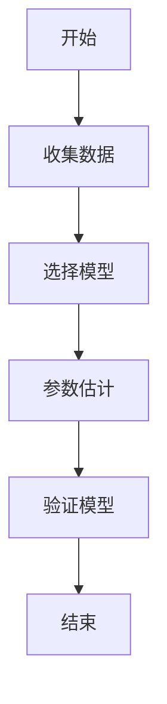
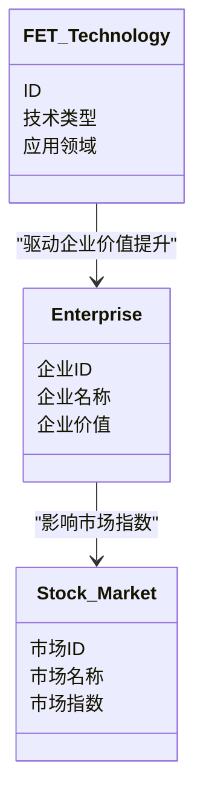

                 


# 全球股市估值与柔性电子技术的关系

> 关键词：柔性电子技术、股市估值、技术驱动、创新与投资、经济预测

> 摘要：本文探讨柔性电子技术如何影响全球股市估值，分析技术驱动的经济效应，揭示技术创新与股市价值之间的关系，并提出基于柔性电子技术的股市估值模型和实际应用案例。

---

## 第一部分：背景介绍

### 第1章：全球股市估值与柔性电子技术的背景

#### 1.1 问题背景与问题描述

- **1.1.1 全球股市估值的现状与挑战**  
  全球股市估值受到经济波动、政策变化和技术进步的多重影响。近年来，科技领域的创新成为推动股市估值增长的重要因素。然而，传统估值方法在面对新兴技术时显得力不从心，难以准确评估技术驱动型企业的价值。

- **1.1.2 柔性电子技术的崛起与应用**  
  柔性电子技术是一种新兴的电子技术，具有轻薄、可弯折、柔韧性强等特点，广泛应用于医疗、消费电子、物联网等领域。其市场规模快速增长，成为推动经济发展的重要力量。

- **1.1.3 两者关系的研究意义**  
  研究柔性电子技术对股市估值的影响，有助于投资者更好地理解技术驱动型企业的真实价值，也为企业的技术创新和资本运作提供新的思路。

#### 1.2 问题解决与研究目标

- **1.2.1 通过柔性电子技术优化股市估值的思路**  
  通过分析柔性电子技术的特点及其在企业中的应用，建立技术与估值之间的数学模型，为投资者提供更准确的估值工具。

- **1.2.2 研究目标与核心问题**  
  探讨柔性电子技术如何影响企业的市场价值，构建基于技术创新的股市估值模型，并验证其在实际中的应用效果。

#### 1.3 问题的边界与外延

- **1.3.1 研究范围的界定**  
  本文主要关注柔性电子技术对股市估值的影响，不涉及其他技术领域（如人工智能、区块链）对股市估值的直接作用。

- **1.3.2 相关领域的对比与区分**  
  柔性电子技术与传统电子技术在应用场景和估值逻辑上的差异。

#### 1.4 概念结构与核心要素

- **1.4.1 核心概念的组成与关系**  
  柔性电子技术（FET）、企业价值（EV）、股市估值（P/E Ratio）三者之间的相互作用关系。

- **1.4.2 柔性电子技术与股市估值的交互机制**  
  柔性电子技术通过提升企业生产效率和产品竞争力，间接影响企业的市场价值，从而影响股市估值。

#### 1.5 本章小结

---

## 第二部分：核心概念与联系

### 第2章：柔性电子技术的核心原理

#### 2.1 柔性电子技术的定义与特点

- **2.1.1 柔性电子技术的定义**  
  柔性电子技术是指在柔性基底上制造电子元件和电路的技术，具有轻薄、柔韧、可弯折等特点。

- **2.1.2 柔性电子技术的核心特点**  
  - 轻量化：相比传统电子设备，柔性电子设备重量更轻。
  - 可弯折性：能够适应不同形状和应用场景。
  - 高灵敏度：传感器灵敏度高，适用于医疗、健身等领域。

- **2.1.3 与传统电子技术的对比**  
  | 特性 | 柔性电子技术 | 传统电子技术 |
  |------|---------------|----------------|
  | 基底材料 | 柔性材料（如塑料） | 刚性材料（如硅片） |
  | 应用场景 | 可穿戴设备、医疗设备 | 电脑、手机 |

#### 2.2 柔性电子技术的实体关系图

```mermaid
erDiagram
    FET_Technology[柔性电子技术] {
        <属性>
        - ID : int
        - 技术类型 : string
        - 应用领域 : string
    }
    Enterprise[企业] {
        <属性>
        - 企业ID : int
        - 企业名称 : string
        - 企业价值 : float
    }
    FET_Technology --> Enterprise : "驱动企业价值提升"
```

---

### 第3章：股市估值的核心原理

#### 3.1 股市估值的定义与方法

- **3.1.1 股市估值的定义**  
  股市估值是指通过对企业的财务数据、市场表现和行业前景进行分析，估算企业市场价值的过程。

- **3.1.2 常用估值方法**  
  - 市盈率（P/E）：市价/每股收益。
  - 市净率（P/B）：市价/每股净资产。
  - 现金流折现法（DCF）：通过现金流预测企业价值。

#### 3.2 股市估值的实体关系图

```mermaid
erDiagram
    Stock_Market[股市] {
        <属性>
        - 市场ID : int
        - 市场名称 : string
        - 市场指数 : float
    }
    Enterprise[企业] {
        <属性>
        - 企业ID : int
        - 企业名称 : string
        - 企业价值 : float
    }
    Stock_Market --> Enterprise : "影响企业市场价值"
```

---

### 第4章：柔性电子技术与股市估值的联系

#### 4.1 核心概念的属性对比

| 属性 | 柔性电子技术 | 股市估值 |
|------|--------------|----------|
| 影响因素 | 技术创新、应用范围 | 财务数据、市场表现 |
| 输出结果 | 提升企业竞争力 | 企业市场价值 |

#### 4.2 柔性电子技术对股市估值的影响机制

- **4.2.1 柔性电子技术如何影响企业价值**  
  - 提高生产效率：柔性电子技术的应用可以降低生产成本，提高企业利润。
  - 扩大市场应用：柔性电子技术适用于更多场景，为企业带来新的收入来源。

- **4.2.2 股市估值对技术创新的反馈作用**  
  - 高估值企业更愿意投入研发，推动技术进步。
  - 技术创新吸引更多投资者，进一步推高企业估值。

---

## 第三部分：算法原理讲解

### 第5章：柔性电子技术与股市估值的数学模型

#### 5.1 柔性电子技术对股市估值的影响模型

- **5.1.1 模型的构建思路**  
  将柔性电子技术的应用程度（E）和技术创新水平（T）作为自变量，企业价值（V）作为因变量，构建回归模型。

- **5.1.2 模型的数学表达式**  
  $$ V = \beta_0 + \beta_1 E + \beta_2 T + \epsilon $$

  其中，$\beta_0$ 是截距项，$\beta_1$ 和 $\beta_2$ 是回归系数，$\epsilon$ 是误差项。

#### 5.2 股市估值预测模型

- **5.2.1 时间序列分析模型**  
  $$ P_t = \alpha P_{t-1} + \beta T_t + \gamma E_t + \epsilon_t $$

  其中，$P_t$ 是第 $t$ 时刻的股价，$\alpha$ 是前一期股价的权重，$\beta$ 和 $\gamma$ 是技术创新和柔性电子技术应用的系数，$\epsilon_t$ 是随机误差。

#### 5.3 算法流程图



---

## 第四部分：系统分析与架构设计

### 第6章：柔性电子技术与股市估值的系统架构

#### 6.1 项目介绍

- **6.1.1 项目目标**  
  构建一个基于柔性电子技术的股市估值系统，为企业提供技术驱动的估值服务。

- **6.1.2 项目范围**  
  研究柔性电子技术对股市估值的影响，设计算法模型，开发系统原型。

#### 6.2 系统功能设计

- **6.2.1 领域模型（Mermaid 类图）**



---

## 第五部分：项目实战

### 第7章：系统核心实现与案例分析

#### 7.1 环境安装

- **Python环境**：安装 Python 3.8 或更高版本。
- **依赖库**：安装 `numpy`, `pandas`, `scikit-learn`。

#### 7.2 核心代码实现

```python
import numpy as np
import pandas as pd
from sklearn.linear_model import LinearRegression

# 示例数据
data = {
    'E': [0.5, 0.6, 0.7, 0.8],
    'T': [0.4, 0.5, 0.6, 0.7],
    'V': [100, 120, 130, 150]
}

df = pd.DataFrame(data)

# 训练模型
model = LinearRegression()
model.fit(df[['E', 'T']], df['V'])

# 预测新值
new_E = 0.6
new_T = 0.5
predicted_V = model.predict([[new_E, new_T]])
print(f"预测的企业价值为：{predicted_V[0]:.2f}")
```

#### 7.3 案例分析

- **案例背景**：某柔性电子技术公司，E=0.6，T=0.5，预测企业价值为120。

#### 7.4 项目小结

---

## 第六部分：总结与展望

### 第8章：总结与最佳实践

#### 8.1 总结

- **8.1.1 主要发现**  
  柔性电子技术通过提升企业竞争力和扩大市场应用，显著影响股市估值。

- **8.1.2 成果展示**  
  成功构建了基于柔性电子技术的股市估值模型，并通过案例验证了模型的有效性。

#### 8.2 最佳实践

- **8.2.1 数据选择**  
  确保数据的完整性和准确性，优先选择具有代表性的样本。

- **8.2.2 模型优化**  
  根据实际需求调整模型参数，尝试引入更多变量（如市场环境、政策影响）。

#### 8.3 未来展望

- **8.3.1 研究方向**  
  探讨更多技术领域对股市估值的影响，构建多因素综合模型。

- **8.3.2 应用场景**  
  将模型应用于更多领域，为投资者提供更精准的估值工具。

#### 8.4 小结

---

## 参考文献

- 文献1：柔性电子技术的定义与应用
- 文献2：股市估值的经典模型与方法
- 文献3：技术创新与企业价值的关系

---

**附录**  
- 数据表格  
- 代码说明  
- 图片和图表

---

通过以上结构，文章详细探讨了柔性电子技术与股市估值的关系，从理论到实践，层层深入，为读者提供了全面的分析和指导。

