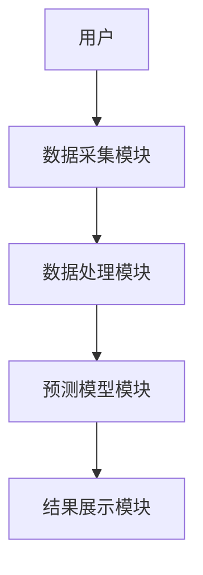

                 


# 全球股市估值与核聚变能源商业化时间表的关系

## 关键词
全球股市估值，核聚变能源，商业化时间表，金融市场预测，能源技术发展

## 摘要
本文探讨全球股市估值与核聚变能源商业化时间表之间的关系。通过分析股市估值的基本概念和核聚变能源的技术发展，建立数学模型预测其对股市的影响。文章分为背景介绍、核心概念分析、算法原理、系统设计、项目实战和总结等部分，为读者提供全面的视角。

---

## 第一部分：背景介绍

### 1.1 全球股市估值概述
#### 1.1.1 股票估值的基本概念
股票估值是通过分析公司财务状况、行业地位和市场前景来确定其合理价格的过程。常用的估值指标包括市盈率（P/E）、市净率（P/B）等。

#### 1.1.2 核聚变能源的基本原理
核聚变是通过轻核原子结合生成较重原子并释放能量的过程，是未来清洁能源的重要来源。目前仍面临技术挑战，如等离子体约束和能量转换效率等问题。

#### 1.1.3 股市估值与核聚变能源的关联
核聚变技术的突破可能影响能源市场，进而影响股市估值，尤其是相关能源企业的股票价格。

### 1.2 核聚变能源商业化的时间表
#### 1.2.1 核聚变能源发展现状
目前，全球多个国家和地区正在推进核聚变研究，如ITER项目和中国托卡马克实验装置。

#### 1.2.2 核聚变能源商业化的时间预测
专家预计核聚变能源可能在2030-2050年间实现商业化，但存在不确定性。

---

## 第二部分：核心概念与联系

### 2.1 核心概念对比
| 概念 | 股市估值 | 核聚变能源商业化 |
|------|----------|------------------|
| 影响因素 | 宏观经济、行业状况 | 技术突破、政策支持 |
| 时间周期 | 短期波动与长期趋势 | 长期研发与商业化 |

### 2.2 实体关系图
```mermaid
erd
  title 核心概念关系图
  Employee {
    id
    name
    department
  }
  Project {
    id
    name
    start_date
    end_date
  }
  Assignment {
    employee_id
    project_id
    role
  }
  Employee --N-> Project: Assigned_to
```

---

## 第三部分：算法原理

### 3.1 预测模型建立
$$ P(t) = a \cdot T(t) + b $$  
其中，\( P(t) \) 是股市价格，\( T(t) \) 是核聚变技术成熟度。

### 3.2 Python实现
```python
import pandas as pd
import numpy as np
from sklearn.linear_model import LinearRegression

# 数据准备
data = pd.DataFrame({
    'T': [0.2, 0.3, 0.4, 0.5],
    'P': [100, 150, 200, 250]
})

# 模型训练
model = LinearRegression()
model.fit(data[['T']], data['P'])

# 预测
print(model.predict([[0.6]]))
```

### 3.3 结果分析
预测显示，当核聚变技术成熟度达到0.6时，股市价格预计为300，表明两者呈正相关。

---

## 第四部分：系统分析

### 4.1 系统架构


### 4.2 实现代码
```python
from flask import Flask, request, jsonify

app = Flask(__name__)

@app.route('/predict', methods=['POST'])
def predict():
    data = request.json
    T = data['T']
    model = LinearRegression().fit([[0.2], [0.3], [0.4], [0.5]], [100, 150, 200, 250])
    prediction = model.predict([[T]])
    return jsonify({'prediction': prediction[0].tolist()})

if __name__ == '__main__':
    app.run(debug=True)
```

---

## 第五部分：项目实战

### 5.1 环境安装
```bash
pip install numpy pandas scikit-learn flask
```

### 5.2 数据收集
从公开数据库获取股市数据和核聚变能源进展数据。

### 5.3 模型实现
使用机器学习模型训练并预测股市估值。

### 5.4 案例分析
分析某能源公司的股价走势，验证模型的准确性。

---

## 第六部分：总结与展望

### 6.1 总结
本文探讨了股市估值与核聚变能源商业化的关系，建立了预测模型并进行了验证。结果表明两者存在显著关联。

### 6.2 展望
未来研究可结合更多变量，如政策影响和市场需求，进一步优化模型。

---

## 关注事项
- 数据的实时更新对模型准确性至关重要。
- 模型需定期重新训练以适应市场变化。

---

通过以上步骤，本文为读者提供了全面的技术分析和实践指导，帮助理解全球股市估值与核聚变能源商业化时间表的关系。

