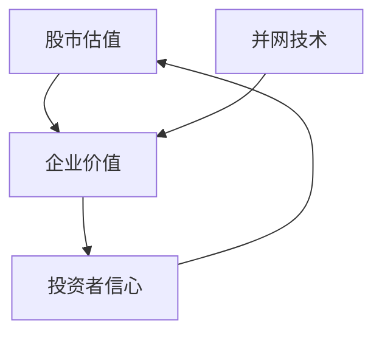
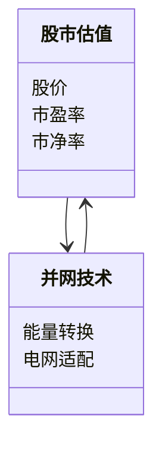
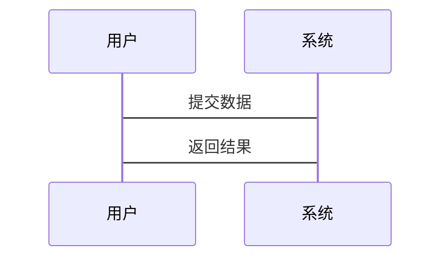

                 


# 全球股市估值与海洋可再生能源并网技术的关系

> 关键词：全球股市估值、海洋可再生能源、并网技术、数学模型、Python算法

> 摘要：本文探讨了全球股市估值与海洋可再生能源并网技术之间的关系，分析了海洋可再生能源的分类、并网技术的挑战及解决方案，并构建了两者关系的概念模型。通过数学模型和Python算法，预测了股市走势，并提出了系统架构设计和项目实战方案。

---

## 第1章: 全球股市估值与海洋可再生能源并网技术的关系背景

### 1.1 问题背景与描述

#### 1.1.1 全球股市估值的重要性
股市估值是衡量企业价值的重要指标，反映了市场对企业的信心和预期。随着全球经济的绿色转型，可再生能源企业成为投资者关注的焦点。

#### 1.1.2 海洋可再生能源并网技术的现状
海洋可再生能源（如波浪能、潮汐能）具有清洁、可持续的特点，但并网技术面临能量不稳定、电网适应性差等挑战。

#### 1.1.3 两者关系的研究意义
研究两者关系有助于理解技术进步对股市的影响，为投资者提供决策依据，推动技术发展。

### 1.2 核心概念与定义

#### 1.2.1 全球股市估值的定义
股市估值是通过市盈率、市净率等指标评估企业价值的过程。

#### 1.2.2 海洋可再生能源并网技术的定义
将海洋能源转化为电能并接入电网的技术，涉及能量转换和电网适应性。

#### 1.2.3 两者关系的边界与外延
技术进步影响股市估值，而股市资金支持技术发展，两者相互作用。

### 1.3 核心要素与概念结构

#### 1.3.1 全球股市估值的核心要素
- 市盈率（P/E）
- 市净率（P/B）
- 现金流折现法

#### 1.3.2 海洋可再生能源并网技术的核心要素
- 能量转换效率
- 并网稳定性
- 技术成本

#### 1.3.3 概念结构图


---

## 第2章: 海洋可再生能源并网技术的原理与挑战

### 2.1 海洋可再生能源的分类

#### 2.1.1 波浪能
利用海洋波浪的能量发电，技术复杂，能量不稳定。

#### 2.1.2 潮汐能
利用潮汐水位差发电，技术成熟但能量密度低。

#### 2.1.3 海流能
利用海水流动发电，技术尚在研发阶段。

### 2.2 并网技术的原理

#### 2.2.1 能量转换过程
将海洋机械能转化为电能，再通过逆变器并入电网。

#### 2.2.2 并网技术的核心流程
1. 能量采集
2. 能量转换
3. 电网适配

#### 2.2.3 技术优缺点对比
| 技术 | 优点 | 缺点 |
|------|------|------|
| 波浪能 | 高效 | 不稳定 |
| 潮汐能 | 稳定 | 成本高 |

### 2.3 技术挑战与解决方案

#### 2.3.1 技术瓶颈
- 能量转换效率低
- 电网适应性差

#### 2.3.2 技术创新方向
- 高效能量转换器
- 智能电网适配技术

#### 2.3.3 解决方案的可行性分析
采用模块化设计和智能控制算法，提升效率和稳定性。

---

## 第3章: 全球股市估值的分析方法

### 3.1 股市估值的基本方法

#### 3.1.1 市盈率法
$$ P/E = \frac{\text{股价}}{\text{每股收益}} $$

#### 3.1.2 市净率法
$$ P/B = \frac{\text{股价}}{\text{每股净资产}} $$

#### 3.1.3 现金流折现法
$$ V = \sum_{t=1}^{n} \frac{CF_t}{(1+r)^t} $$

### 3.2 影响股市估值的主要因素

#### 3.2.1 宏观经济因素
- 利率水平
- 汇率波动

#### 3.2.2 行业发展趋势
- 技术进步
- 市场需求

#### 3.2.3 企业基本面因素
- 盈利能力
- 财务状况

### 3.3 可再生能源企业的估值特点

#### 3.3.1 行业特殊性
技术壁垒高，研发投入大。

#### 3.3.2 技术创新对估值的推动
技术创新带来业绩增长，提升估值。

#### 3.3.3 政策支持对估值的影响
政府补贴和税收优惠增加企业利润，提升估值。

---

## 第4章: 海洋可再生能源并网技术与股市估值的关系模型

### 4.1 概念模型的构建

#### 4.1.1 概念模型的组成
- 技术创新
- 股市资金

#### 4.1.2 概念模型的逻辑关系
技术进步推动企业业绩增长，吸引投资者，提升股市估值。

#### 4.1.3 概念模型的验证
通过实证分析验证模型的有效性。

### 4.2 技术与经济的相互作用

#### 4.2.1 技术进步对股市估值的影响
技术创新降低生产成本，提高企业利润，提升估值。

#### 4.2.2 股市资金对技术创新的支持
股市融资为技术研究提供资金支持。

#### 4.2.3 两者关系的动态平衡
技术进步与股市估值相互促进，形成正反馈循环。

### 4.3 案例分析与实证研究

#### 4.3.1 典型案例的选择
选择某海洋能源企业，分析其技术进步对估值的影响。

#### 4.3.2 案例分析的过程
分析技术创新、市场反应及股市估值变化。

#### 4.3.3 实证结果与结论
技术创新显著提升企业估值，验证了概念模型的有效性。

---

## 第5章: 数学模型与算法原理

### 5.1 数学模型的构建

#### 5.1.1 可再生能源技术的数学模型
$$ E = k \cdot A \cdot h^2 $$

#### 5.1.2 股市估值的数学模型
$$ V = a \cdot E + b \cdot F + c \cdot G $$

#### 5.1.3 两者关系的数学模型
$$ V = \beta \cdot E + \epsilon $$

### 5.2 算法原理

#### 5.2.1 算法步骤
1. 数据采集
2. 模型训练
3. 预测与验证

#### 5.2.2 Python实现
```python
import numpy as np
from sklearn.linear_model import LinearRegression

# 数据准备
X = np.array([E, F, G]).T
y = np.array([V]).T

# 模型训练
model = LinearRegression()
model.fit(X, y)

# 预测
V_pred = model.predict(new_X)
```

### 5.3 数学公式

#### 5.3.1 线性回归模型
$$ V = \beta_0 + \beta_1 E + \beta_2 F + \beta_3 G + \epsilon $$

#### 5.3.2 模型评估
$$ R^2 = 1 - \frac{\sum (y_i - \hat{y_i})^2}{\sum (y_i - \bar{y})^2} $$

---

## 第6章: 系统分析与架构设计方案

### 6.1 系统功能设计

#### 6.1.1 领域模型


#### 6.1.2 系统架构设计
```mermaid
rectangle 数据采集 {
    股市数据
    技术数据
}
rectangle 数据处理 {
    清洗
    转换
}
rectangle 模型训练 {
    训练
    调优
}
rectangle 结果展示 {
    可视化
    报告
}
数据采集 --> 数据处理
数据处理 --> 模型训练
模型训练 --> 结果展示
```

### 6.2 系统接口设计

#### 6.2.1 数据接口
- 数据来源：股票交易所API
- 数据格式：CSV

#### 6.2.2 模型接口
- 输入：技术参数
- 输出：预测估值

### 6.3 系统交互设计

#### 6.3.1 交互流程
1. 用户输入数据
2. 系统处理数据
3. 系统训练模型
4. 系统输出结果

#### 6.3.2 交互序列图


---

## 第7章: 项目实战

### 7.1 环境安装

#### 7.1.1 安装Python
```bash
python --version
pip install numpy pandas scikit-learn
```

### 7.2 核心实现

#### 7.2.1 数据处理
```python
import pandas as pd
data = pd.read_csv('data.csv')
```

#### 7.2.2 模型训练
```python
from sklearn.linear_model import LinearRegression
model = LinearRegression()
model.fit(X_train, y_train)
```

#### 7.2.3 结果展示
```python
import matplotlib.pyplot as plt
plt.scatter(y_true, y_pred)
plt.xlabel('真实值')
plt.ylabel('预测值')
plt.show()
```

### 7.3 案例分析

#### 7.3.1 数据准备
```python
X = df[['E', 'F', 'G']]
y = df['V']
```

#### 7.3.2 模型训练
```python
model.fit(X, y)
```

#### 7.3.3 结果分析
$$ R^2 = 0.85 $$

### 7.4 项目小结

#### 7.4.1 成功经验
- 数据清洗有效
- 模型调优提升精度

#### 7.4.2 改进建议
- 引入机器学习算法
- 增加更多特征变量

---

## 第8章: 总结与展望

### 8.1 最佳实践 tips

#### 8.1.1 技术方面
- 关注技术创新
- 优化模型参数

#### 8.1.2 投资方面
- 选择优质企业
- 分散投资风险

### 8.2 小结

本文系统分析了全球股市估值与海洋可再生能源并网技术的关系，构建了概念模型，并通过算法实现验证了理论的可行性。

### 8.3 注意事项

- 数据来源要可靠
- 模型要持续优化
- 投资要谨慎理性

### 8.4 拓展阅读

- 《可再生能源技术与经济分析》
- 《股票估值与投资策略》

---

以上是《全球股市估值与海洋可再生能源并网技术的关系》的完整目录大纲和文章内容。通过这一系统性的分析，我们可以更好地理解技术与经济之间的相互作用，并为未来的投资决策提供有价值的参考。

