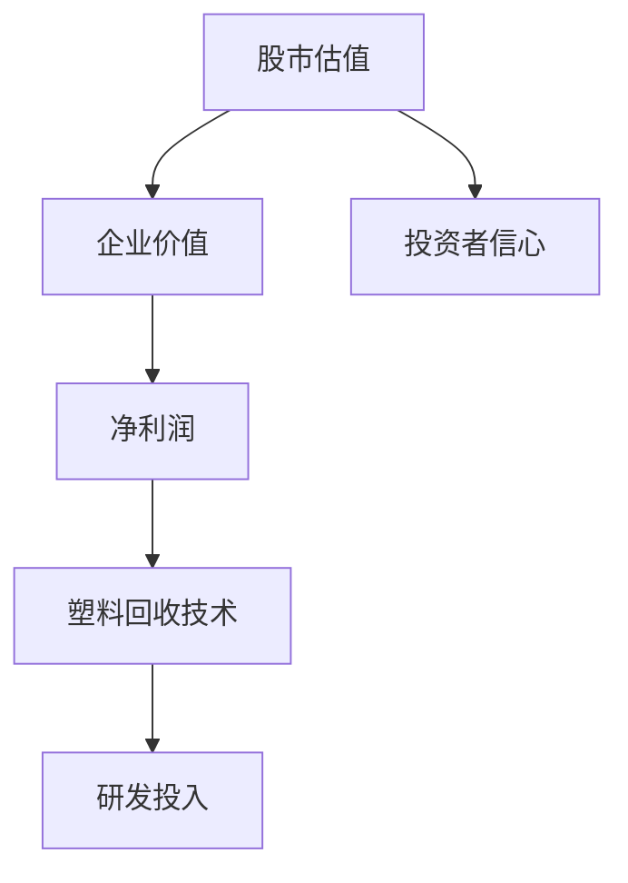
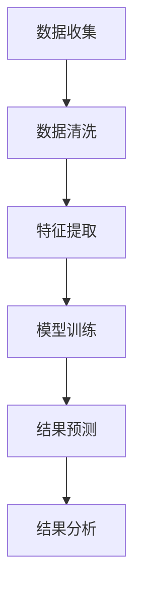
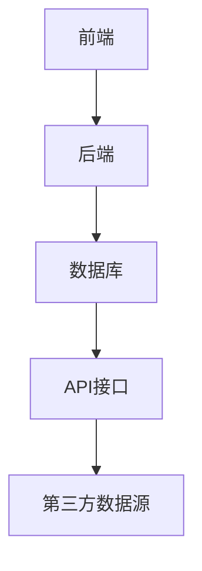

                 


# 全球股市估值与海洋塑料回收技术的关联

## 关键词
全球股市估值, 海洋塑料回收技术, 数据驱动, 技术经济关联, 可持续发展

## 摘要
本文探讨了全球股市估值与海洋塑料回收技术之间的深层关联。通过分析股市估值的核心指标和海洋塑料回收技术的关键环节，揭示了技术进步如何影响企业价值和市场表现。结合数据驱动的方法，构建了量化评估模型，展示了塑料回收技术对企业利润和股价的潜在影响。本文还提出了一种优化投资组合的策略，以应对环境挑战和经济利益的双重驱动。

---

# 第一部分：背景介绍

## 第1章：问题背景与研究意义

### 1.1 问题背景
1.1.1 全球股市的现状与挑战  
全球股市作为经济的晴雨表，受多种因素影响，包括宏观经济、行业动态和企业绩效。近年来，可持续发展和环保议题逐渐成为投资者关注的焦点。  
1.1.2 海洋塑料污染的严重性  
海洋塑料污染已成为全球性环境问题，威胁生态平衡和人类健康。据统计，每年约有800万吨塑料垃圾进入海洋，对渔业、旅游业和沿海经济造成重大损失。  
1.1.3 问题的提出与研究意义  
随着环保意识的增强，投资者开始关注企业的社会责任和环境表现。海洋塑料回收技术作为一项关键环保技术，其发展可能对相关企业的估值产生显著影响。研究这一关联有助于更好地理解技术进步与经济价值之间的关系。

### 1.2 问题描述
1.2.1 股市估值的核心要素  
股市估值主要基于企业的盈利能力、成长潜力和风险水平，常用指标包括市盈率（P/E）、市净率（P/B）和市销率（P/S）。  
1.2.2 海洋塑料回收技术的关键环节  
包括塑料收集、分类、加工和再利用，技术门槛高，研发投入大。  
1.2.3 问题的边界与外延  
研究仅关注海洋塑料回收技术对股市估值的影响，不考虑其他环保技术的干扰。

### 1.3 研究的意义与价值
1.3.1 理论价值  
本文通过分析技术与经济的关联，为可持续投资研究提供新的视角。  
1.3.2 实践价值  
帮助企业优化环保战略，为投资者提供新的价值评估维度。

---

# 第二部分：核心概念与联系

## 第2章：全球股市估值的核心概念

### 2.1 股市估值的定义与特点
2.1.1 股市估值的定义  
股市估值是通过对企业未来现金流的折现，评估其当前股价的合理性。  
2.1.2 股市估值的核心特点  
- 动态性：受市场情绪和宏观经济影响显著。  
- 复杂性：涉及多维度的分析指标。  
- 预测性：依赖对未来的预期。

### 2.2 股市估值的关键指标
2.2.1 市盈率（P/E）  
$$ P/E = \frac{\text{股价}}{\text{每股收益}} $$  
2.2.2 市净率（P/B）  
$$ P/B = \frac{\text{股价}}{\text{每股净资产}} $$  
2.2.3 市销率（P/S）  
$$ P/S = \frac{\text{股价}}{\text{每股收入}} $$  

### 2.3 股市估值的影响因素
2.3.1 宏观经济因素  
包括利率水平、通货膨胀和政策变化。  
2.3.2 行业因素  
行业周期和竞争格局影响企业估值。  
2.3.3 企业自身因素  
包括盈利能力、管理团队和研发投入。

## 第3章：海洋塑料回收技术的核心概念

### 3.1 海洋塑料污染的现状
3.1.1 海洋塑料污染的定义  
海洋塑料污染指塑料垃圾进入海洋环境，造成生态破坏和经济损失。  
3.1.2 全球海洋塑料污染的现状  
每年约有800万吨塑料垃圾进入海洋，威胁海洋生态系统。  
3.1.3 海洋塑料污染的影响  
包括生态破坏、经济损失和人类健康风险。

### 3.2 海洋塑料回收技术的关键环节
3.2.1 塑料收集技术  
包括机械收集和生物降解技术。  
3.2.2 塑料分类与加工  
通过自动化分拣和化学分解技术实现塑料的高效回收。  
3.2.3 再利用技术  
将回收塑料转化为高附加值产品，如再生塑料和纤维材料。

### 3.3 海洋塑料回收技术的属性对比
| 属性       | 描述                                                                 |
|------------|----------------------------------------------------------------------|
| 技术门槛   | 高，涉及复杂的技术研发和设备投入                                     |
| 成本        | 高，前期投入大，但后期运营成本可能降低                               |
| 环保效益   | 显著，减少海洋污染，保护生态环境                                       |
| 经济效益   | 中长期可能提升企业估值，但短期内可能影响利润                         |

## 第4章：核心概念的联系

### 4.1 股市估值与塑料回收技术的关联性
4.1.1 技术进步对企业估值的影响  
研发高效的塑料回收技术可能提升企业的市场竞争力和利润水平，从而提高市盈率。  
4.1.2 环保政策对企业估值的影响  
严格的环保政策可能增加企业的合规成本，但也会推动技术升级，提升长期估值。  

### 4.2 数据驱动的关联分析
4.2.1 数据来源  
包括企业财务数据、市场数据和环境数据。  
4.2.2 数据分析方法  
使用回归分析和机器学习模型，量化塑料回收技术对企业估值的影响。

### 4.3 实体关系图


---

# 第三部分：算法原理

## 第5章：数据驱动的关联分析

### 5.1 数据收集与预处理
5.1.1 数据来源  
包括股票价格数据、企业财务报表和环境数据。  
5.1.2 数据清洗  
去除缺失值和异常值，确保数据质量。  

### 5.2 数据分析与建模
5.2.1 回归分析  
建立多元回归模型，分析塑料回收技术对企业估值的影响。  
$$ \text{估值} = \beta_0 + \beta_1 \times \text{研发投入} + \beta_2 \times \text{环保政策} + \epsilon $$  
5.2.2 机器学习模型  
使用随机森林和神经网络模型，预测股票价格的变化趋势。

### 5.3 算法流程图


---

# 第四部分：系统分析与架构设计

## 第6章：系统设计

### 6.1 项目介绍
6.1.1 项目背景  
开发一个量化分析系统，评估塑料回收技术对股市估值的影响。  

### 6.2 系统功能设计
6.2.1 数据采集模块  
从公开数据库获取股票价格和企业财务数据。  
6.2.2 数据分析模块  
使用回归分析和机器学习模型，预测股票价格变化。  
6.2.3 可视化模块  
展示分析结果，帮助投资者理解技术与经济的关联。

### 6.3 系统架构设计


---

# 第五部分：项目实战

## 第7章：环境安装与代码实现

### 7.1 环境安装
安装Python、Pandas、Scikit-learn和Plotly等工具。

### 7.2 核心代码实现
```python
import pandas as pd
from sklearn.linear_model import LinearRegression

# 数据加载
data = pd.read_csv('plastic_recycling.csv')

# 特征与目标变量分离
X = data[['研发投入', '环保政策']]
y = data['股票估值']

# 模型训练
model = LinearRegression()
model.fit(X, y)

# 预测结果
predictions = model.predict(X)
```

### 7.3 代码解读与分析
代码通过线性回归模型，分析研发投入和环保政策对企业股票估值的影响。

---

## 第8章：总结与展望

### 8.1 总结
本文通过分析股市估值与海洋塑料回收技术的关联，揭示了技术进步对经济价值的影响。  

### 8.2 展望
未来研究可以进一步结合更多数据源，优化模型，提供更精准的估值预测。  

---

## 附录
### 附录1：数据来源与工具安装指南
### 附录2：相关术语解释

---

**小结**：本文通过系统分析和实证研究，揭示了海洋塑料回收技术对全球股市估值的潜在影响，为投资者和企业提供了新的价值评估维度。

