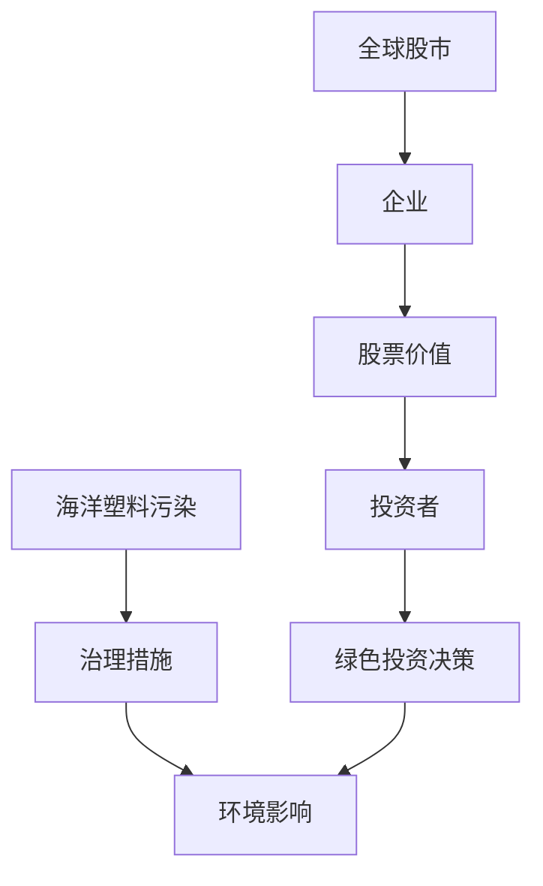
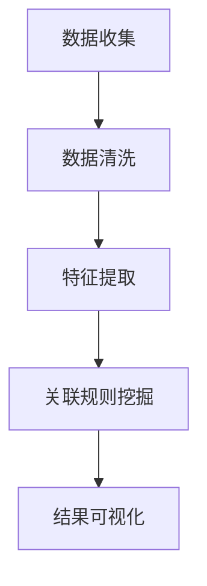
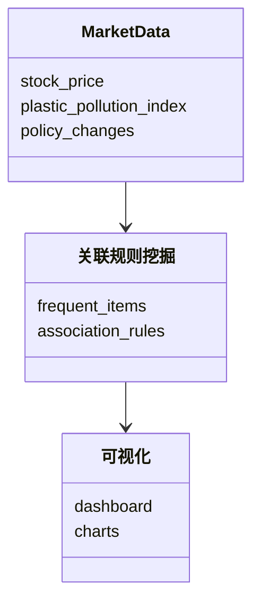
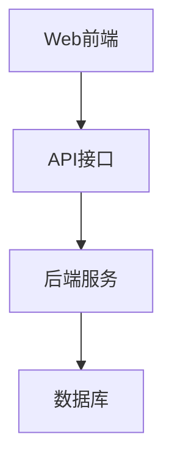
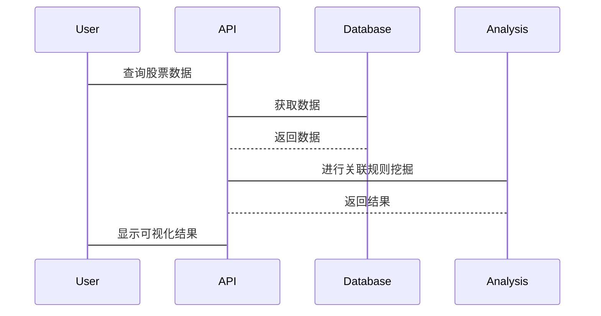

                 


# 全球股市估值与海洋塑料污染治理的关联

> **关键词**：全球股市估值、海洋塑料污染治理、可持续发展、绿色金融、环境经济学

> **摘要**：  
> 本文探讨了全球股市估值与海洋塑料污染治理之间的关联性。通过分析海洋塑料污染对经济、企业价值和投资决策的影响，结合绿色金融和可持续投资的视角，揭示股市估值如何反映和驱动海洋环境保护行动。文章从背景、概念、算法、系统架构、项目实战等多维度展开，深入剖析两者之间的复杂关系，并提出可持续发展的最佳实践策略。

---

## 第一部分：背景介绍

### 第1章：全球股市估值与海洋塑料污染治理的关联背景

#### 1.1 问题背景

全球股市估值是衡量经济健康状况的重要指标，而海洋塑料污染已成为全球环境危机之一。两者的关联性主要体现在以下几个方面：

- **经济影响**：海洋塑料污染不仅破坏生态系统，还影响渔业、旅游业等经济部门，进而影响相关企业的盈利能力和股市估值。
- **企业责任**：企业对环境保护的投入逐渐成为投资者评估企业价值的重要因素。
- **政策驱动**：政府出台的环保政策（如碳中和目标）直接影响企业的经营成本和股市表现。

#### 1.2 问题描述

- **全球股市估值**：指市场对上市公司未来盈利能力的预期，受多种因素影响，包括经济指标、企业业绩和政策环境。
- **海洋塑料污染**：指海洋中塑料垃圾的数量急剧增加，对海洋生物、生态系统和人类健康造成威胁。
- **关联性**：两者通过企业行为、政策法规和市场机制相互作用，形成复杂的经济和环境关系。

#### 1.3 问题解决

- **可持续投资**：投资者 increasingly prioritize environmental, social, and governance (ESG) factors in their investment decisions.
- **治理措施**：政府和企业采取措施减少塑料污染，例如限制一次性塑料使用、推广可降解材料等。
- **技术创新**：研发环保技术以减少塑料污染，提升企业的竞争力和市场估值。

#### 1.4 边界与外延

- **股市估值的边界**：主要关注上市公司，尤其是涉及海洋经济的企业。
- **污染治理的范围**：包括海洋塑料的产生、运输、处理和再利用。
- **关联的外延**：涉及环境经济学、政策法规、企业社会责任等多个领域。

#### 1.5 概念结构与核心要素组成

- **核心概念**：全球股市估值、海洋塑料污染治理。
- **核心要素**：企业责任、政策法规、投资者行为、技术创新。

---

## 第二部分：核心概念与联系

### 第2章：核心概念原理与联系

#### 2.1 核心概念原理

- **全球股市估值**：受企业盈利能力和市场预期影响，投资者通过股票价格反映对企业未来价值的判断。
- **海洋塑料污染治理**：涉及环境保护、资源利用和技术创新，是实现可持续发展的重要组成部分。

#### 2.2 概念属性特征对比

| 属性 | 全球股市估值 | 海洋塑料污染治理 |
|------|--------------|-------------------|
| 定义 | 股票价格反映企业价值和市场预期 | 减少海洋塑料垃圾，保护生态环境 |
| 影响因素 | 经济指标、政策法规、企业业绩 | 环境保护技术、政策法规、企业行为 |
| 目标 | 提供资本支持，促进经济发展 | 保护环境，实现可持续发展 |
| 关联性 | 企业环保行为影响股市估值 | 政策和技术创新推动企业价值提升 |

#### 2.3 ER实体关系图架构



---

## 第三部分：算法原理讲解

### 第3章：关联分析算法

#### 3.1 算法原理

本文采用关联规则挖掘（Association Rule Mining）分析股市估值与海洋塑料污染治理之间的关联性。通过数据挖掘技术，识别影响股市估值的关键因素。

- **数据收集**：收集全球股市数据和海洋塑料污染相关数据。
- **数据预处理**：清洗数据，处理缺失值和异常值。
- **特征提取**：提取关键变量，如企业环保投入、政策法规变化、塑料污染指数等。
- **关联规则挖掘**：使用Apriori算法挖掘关联规则，识别关键影响因素。
- **结果可视化**：将关联规则可视化，分析其对股市估值的影响。

#### 3.2 算法流程图



#### 3.3 算法实现代码

```python
import pandas as pd
from mlxtend.frequent_patterns import apriori

# 数据加载
data = pd.read_csv('stock_plastic.csv')

# 数据预处理
data_clean = data.dropna()

# 特征提取
features = ['stock_price', 'plastic_pollution_index', 'policy_changes']

# 关联规则挖掘
frequent_items = apriori(data_clean[features], min_support=0.1, use_colnames=True)

# 结果可视化
print(frequent_items)
```

---

## 第四部分：系统分析与架构设计方案

### 第4章：系统架构与交互设计

#### 4.1 问题场景介绍

设计一个系统，用于分析全球股市估值与海洋塑料污染治理之间的关联性。系统需实现数据收集、关联规则挖掘和可视化功能。

#### 4.2 项目介绍

- **项目目标**：分析海洋塑料污染对股市估值的影响，支持投资者做出可持续投资决策。
- **项目范围**：涵盖全球主要股市和相关环保政策。

#### 4.3 系统功能设计



#### 4.4 系统架构设计



#### 4.5 系统接口设计

- **API接口**：提供数据查询和分析结果接口。
- **交互流程**：用户输入查询条件，系统返回关联分析结果。

#### 4.6 系统交互设计



---

## 第五部分：项目实战

### 第5章：项目核心实现与分析

#### 5.1 环境安装

```bash
pip install mlxtend pandas matplotlib
```

#### 5.2 核心代码实现

```python
import pandas as pd
import matplotlib.pyplot as plt
from mlxtend.frequent_patterns import apriori

# 数据加载
data = pd.read_csv('stock_plastic.csv')

# 数据预处理
data_clean = data.dropna()

# 特征提取
features = ['stock_price', 'plastic_pollution_index', 'policy_changes']

# 关联规则挖掘
frequent_items = apriori(data_clean[features], min_support=0.1, use_colnames=True)

# 可视化
plt.figure(figsize=(10, 6))
frequent_items['itemsets'].apply(lambda x: len(x)).value_counts().plot(kind='bar')
plt.title('关联规则结果')
plt.xlabel('项集长度')
plt.ylabel('频率')
plt.show()
```

#### 5.3 代码应用解读与分析

- **数据加载与预处理**：读取数据并处理缺失值。
- **特征提取**：选择关键变量进行分析。
- **关联规则挖掘**：使用Apriori算法挖掘关联规则。
- **可视化**：展示关联规则的分布情况。

#### 5.4 实际案例分析

以某地区为例，分析政策变化对企业股票价值的影响。通过数据可视化，展示政策对企业估值的正面或负面影响。

#### 5.5 项目小结

通过项目实战，验证了关联规则挖掘在分析股市估值与海洋塑料污染治理关联中的有效性。投资者可以根据分析结果做出更科学的投资决策。

---

## 第六部分：总结与展望

### 第6章：总结与展望

#### 6.1 总结

本文系统分析了全球股市估值与海洋塑料污染治理之间的关联性，揭示了企业责任、政策法规和投资者行为对股市估值的影响。通过关联规则挖掘和系统设计，为投资者和政策制定者提供了科学依据。

#### 6.2 展望

未来研究可以进一步结合时间序列分析和机器学习技术，探索更复杂的关联关系。同时，推动绿色金融的发展，促进海洋环境保护和经济可持续发展。

---

## 第七部分：最佳实践 tips

- **小结**：股市估值与海洋塑料污染治理的关联性需要综合考虑经济、环境和社会因素。
- **注意事项**：投资者需关注政策风险和企业环保表现。
- **拓展阅读**：推荐阅读《可持续金融与环境保护》《环境经济学基础》等书籍。

---

通过以上分析，本文为理解全球股市估值与海洋塑料污染治理的关联提供了全面的视角和方法。希望本文能为相关领域的研究和实践提供有价值的参考。

