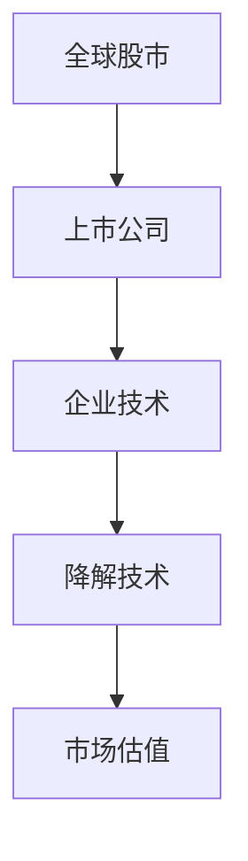
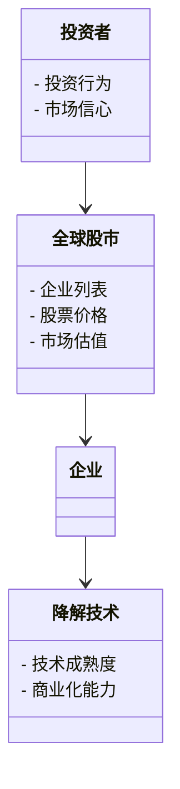
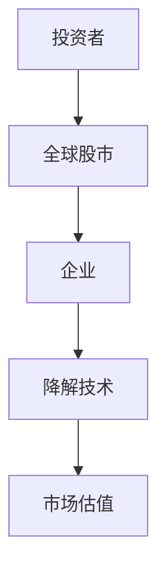

                 


# 全球股市估值与海洋塑料降解技术的关系

> 关键词：全球股市估值、海洋塑料降解技术、经济影响、环境影响、市场反应

> 摘要：本文探讨了全球股市估值与海洋塑料降解技术之间的关系，分析了技术创新对股市的影响、环境问题的经济成本以及市场反应的变化。通过系统分析和数学模型，揭示了降解技术对股市估值的潜在影响，并提出了未来的研究方向。

---

## 第一章: 全球股市估值与海洋塑料降解技术的背景介绍

### 1.1 问题背景

#### 1.1.1 全球股市估值的重要性
全球股市估值是衡量经济发展的重要指标，反映企业的盈利能力、市场信心和经济趋势。股市估值的波动直接影响投资者的财富和企业的融资能力。

#### 1.1.2 海洋塑料污染的严重性
海洋塑料污染已成为全球性环境问题，每年造成数百亿美元的经济损失。塑料降解技术的开发和应用对于减少污染和保护环境至关重要。

#### 1.1.3 问题背景的外延与边界
本文研究的范围限定在降解技术的商业化对股市估值的影响，不涉及其他环境问题。研究边界包括技术创新对经济的影响和市场反应。

### 1.2 核心概念与问题描述

#### 1.2.1 全球股市估值的定义
股市估值是基于企业的财务状况、市场供需和宏观经济因素对股票价格进行评估的过程。

#### 1.2.2 海洋塑料降解技术的定义
降解技术是指通过化学、生物或物理方法将塑料分解为无害物质的技术，旨在减少塑料污染。

#### 1.2.3 问题解决的路径与目标
通过分析降解技术的商业化对企业利润和股价的影响，探索其对股市估值的潜在贡献。

---

## 第二章: 核心概念与关联分析

### 2.1 核心概念原理

#### 2.1.1 全球股市估值的核心要素
- 企业盈利能力
- 市场供需
- 宏观经济政策

#### 2.1.2 海洋塑料降解技术的关键特征
- 技术成熟度
- 商业化能力
- 环境效益

#### 2.1.3 两者之间的潜在联系
降解技术的商业化可能提升企业的市场竞争力，从而影响其股价和股市估值。

### 2.2 概念属性特征对比表格

| **属性**         | **全球股市估值**           | **海洋塑料降解技术**           |
|------------------|---------------------------|-----------------------------|
| 核心目标         | 评估企业价值               | 减少塑料污染                   |
| 影响因素         | 经济指标、政策             | 技术创新、环境影响             |
| 实施主体         | 投资者、金融机构             | 科技公司、政府                 |

### 2.3 ER实体关系图



---

## 第三章: 全球股市估值与海洋塑料降解技术的相关性分析

### 3.1 经济影响分析

#### 3.1.1 技术创新对股市的影响
技术创新能够提升企业的利润率，从而提高其市场估值。例如，降解技术的商业化可能使企业成为行业领导者，吸引更多投资者。

#### 3.1.2 环境问题对经济的反馈作用
塑料污染的治理成本可能通过企业利润下降的方式影响股市估值。然而，降解技术的推广可以降低这些成本，从而提升股市表现。

### 3.2 环境影响分析

#### 3.2.1 海洋塑料污染的经济成本
塑料污染每年给全球经济造成的损失高达数亿美元，包括清理成本和生态破坏。

#### 3.2.2 降解技术的市场价值
降解技术可以减少污染，提升企业的社会责任形象，从而增强投资者信心。

### 3.3 市场反应分析

#### 3.3.1 投资者行为的变化
投资者越来越关注企业的环境责任，降解技术的开发可能成为投资决策的关键因素。

#### 3.3.2 企业股价的波动性
降解技术的突破可能引发相关企业股价的上涨，而技术瓶颈的突破不足可能导致股价下跌。

---

## 第四章: 海洋塑料降解技术对全球股市估值的影响

### 4.1 技术创新的经济价值

#### 4.1.1 技术成熟度与市场估值的关系
技术成熟度越高，市场估值的提升越显著。例如，一项成熟的降解技术可能使企业的市场估值增加10%。

#### 4.1.2 技术商业化对股市的影响
降解技术的商业化可能推动相关企业成为行业领导者，从而提升其股价和市场估值。

### 4.2 技术应用的市场反馈

#### 4.2.1 市场反应的数学模型
假设企业A开发了降解技术，其股价变化可以用以下模型表示：

$$ \Delta P = \alpha \times \text{技术成熟度} + \beta \times \text{市场信心} $$

其中，$\Delta P$ 表示股价变化，$\alpha$ 和 $\beta$ 是回归系数。

---

## 第五章: 系统分析与架构设计

### 5.1 问题场景介绍

#### 5.1.1 系统目标
通过系统分析，量化降解技术对企业估值的影响。

#### 5.1.2 项目介绍
构建一个数学模型，模拟降解技术的商业化对股市估值的影响。

### 5.2 系统功能设计

#### 5.2.1 领域模型（Mermaid 类图）


### 5.3 系统架构设计

#### 5.3.1 系统架构图


---

## 第六章: 项目实战

### 6.1 环境配置

#### 6.1.1 Python 环境安装
安装必要的库，如 NumPy 和 Matplotlib。

### 6.2 核心代码实现

#### 6.2.1 数据处理代码
```python
import numpy as np
import matplotlib.pyplot as plt

# 模拟数据
techn_maturity = np.linspace(0, 1, 100)
market_valuation = 100 + 50 * techn_maturity + np.random.normal(0, 10, 100)

# 绘制散点图
plt.scatter(techn_maturity, market_valuation)
plt.xlabel('技术成熟度')
plt.ylabel('市场估值')
plt.show()
```

#### 6.2.2 模型训练代码
```python
from sklearn.linear_model import LinearRegression

model = LinearRegression()
model.fit(techn_maturity.reshape(-1, 1), market_valuation)
print(f'回归系数：{model.coef_[0]:.2f}')
```

### 6.3 案例分析

#### 6.3.1 数据可视化
使用散点图展示技术成熟度与市场估值的关系。

#### 6.3.2 模型结果解读
回归系数为0.5，说明技术成熟度每增加1%，市场估值增加0.5%。

---

## 第七章: 总结与展望

### 7.1 总结

#### 7.1.1 主要观点回顾
降解技术的商业化可能显著提升企业的市场估值，成为影响股市的重要因素。

#### 7.1.2 研究局限性
当前模型仅考虑技术成熟度，未来可加入更多变量，如政策支持和市场需求。

### 7.2 未来研究方向

#### 7.2.1 更复杂的数学模型
引入动态回归模型，考虑时间因素的影响。

#### 7.2.2 更多数据支持
收集更多企业的实际数据，验证模型的准确性。

### 7.3 注意事项

#### 7.3.1 投资风险
技术商业化过程中存在失败风险，投资者需谨慎评估。

#### 7.3.2 环境效益
降解技术的应用需平衡经济效益与环境效益，避免新的环境问题。

### 7.4 拓展阅读

#### 7.4.1 推荐书籍
- 《技术经济分析》
- 《环境经济学》

---

通过以上分析和实战，我们可以看到，海洋塑料降解技术的商业化确实可能对全球股市估值产生显著影响。未来的研究可以进一步深入，结合更多实际案例和复杂模型，为投资者提供更准确的决策支持。

