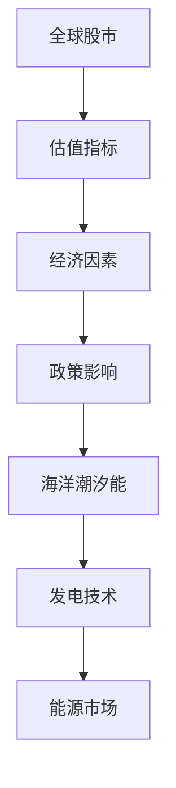
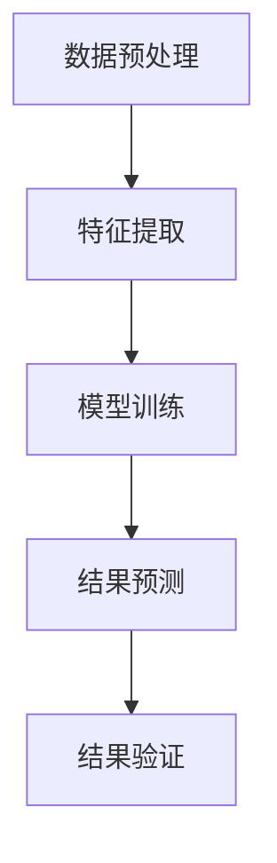
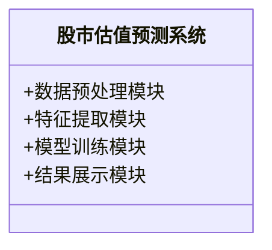
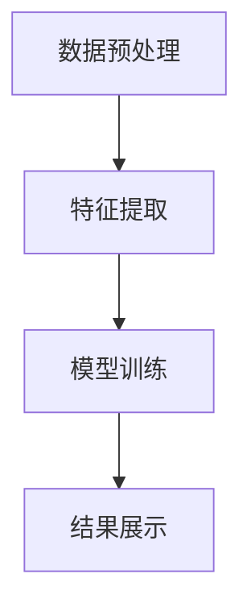

                 


# 全球股市估值与海洋潮汐能发电技术的关系

## 关键词：全球股市估值、海洋潮汐能发电、技术经济性、数学模型、能源转型

## 摘要：  
本文探讨了全球股市估值与海洋潮汐能发电技术之间的潜在关系。通过分析股市估值的核心指标和潮汐能发电技术的经济性，结合数学模型和算法，揭示了两者之间的相互影响。文章从背景介绍、核心概念、算法原理、系统架构到项目实战，层层剖析，为读者提供了全面的技术视角。

---

# 正文

## 第一章：背景介绍

### 1.1 问题背景

#### 1.1.1 全球能源转型与股市估值的关系  
随着全球能源转型的推进，可再生能源（如潮汐能）的开发成为各国关注的焦点。股市估值作为经济晴雨表，反映了市场对新兴技术的预期和信心。  

#### 1.1.2 气候变化对海洋能源开发的影响  
气候变化加剧了对可再生能源的需求，海洋潮汐能作为一种清洁、稳定的能源，其技术进步和商业化将影响股市估值。  

#### 1.1.3 经济波动对股市估值的潜在影响  
经济波动（如金融危机）会影响股市估值，而潮汐能技术的商业化可能为股市注入新的增长点。  

### 1.2 问题描述

#### 1.2.1 全球股市估值的核心指标  
- 市盈率（PE）：衡量股价与盈利能力的比率。  
- 市净率（PB）：衡量股价与资产净值的比率。  

#### 1.2.2 海洋潮汐能发电技术的现状  
- 潮汐能发电技术包括潮汐流和潮流能发电，目前仍处于技术成熟度曲线的早期阶段。  

#### 1.2.3 两者关系的初步假设  
假设潮汐能技术的突破会提升相关企业的市场价值，从而影响股市估值。

### 1.3 问题解决

#### 1.3.1 研究目标的设定  
- 探讨股市估值与潮汐能技术的关系。  
- 构建数学模型，预测技术进步对股市的影响。  

#### 1.3.2 数据来源与获取方法  
- 股市数据：选取全球主要股市的指数数据。  
- 潮汐能数据：获取相关企业的研发投入和专利数据。  

#### 1.3.3 研究方法的选择  
- 定量分析：使用回归模型。  
- 定性分析：结合行业专家意见。  

### 1.4 边界与外延

#### 1.4.1 研究范围的界定  
- 仅考虑潮汐能技术对股市估值的影响，不涉及其他可再生能源。  

#### 1.4.2 相关变量的筛选  
- 自变量：潮汐能技术进步指标。  
- 因变量：股市估值指标。  

#### 1.4.3 研究的局限性  
- 数据获取的难度：潮汐能技术数据分散且不完整。  

### 1.5 概念结构与核心要素

#### 1.5.1 核心概念的组成  
- 股市估值：包括PE、PB等指标。  
- 潮汐能发电技术：包括技术成熟度、成本等。  

#### 1.5.2 概念之间的关系  
- 潮汐能技术进步 → 提升企业价值 → 影响股市估值。  

---

## 第二章：核心概念与联系

### 2.1 核心概念原理

#### 2.1.1 全球股市估值的定义与计算方法  
- 股市估值是市场对企业的整体价值评估，通常基于财务指标和市场情绪。  

#### 2.1.2 海洋潮汐能发电技术的原理与应用  
- 潮汐能发电利用潮汐水流驱动涡轮机发电，适用于沿海地区。  

### 2.2 概念属性特征对比

| 概念       | 属性       | 特征               |
|------------|------------|--------------------|
| 全球股市估值 | 计量性     | 数值化、动态变化    |
| 海洋潮汐能发电技术 | 技术性   | 工程化、依赖自然条件 |

### 2.3 ER实体关系图



---

## 第三章：算法原理讲解

### 3.1 算法原理

#### 3.1.1 数据预处理与特征提取  
- 数据清洗：处理缺失值和异常值。  
- 特征提取：选取PE、PB等作为自变量。  

#### 3.1.2 算法选择  
- 使用多元线性回归模型：  
  $$ y = \beta_0 + \beta_1x_1 + \beta_2x_2 + \ldots + \beta_nx_n + \epsilon $$  
  其中，y为股市估值，x_i为潮汐能技术相关特征。  

#### 3.1.3 算法流程图



#### 3.1.4 Python实现

```python
import pandas as pd
import numpy as np
from sklearn.linear_model import LinearRegression
from sklearn.metrics import r2_score

# 数据加载
data = pd.read_csv('data.csv')

# 特征提取
X = data[['PE', 'PB', '潮汐能专利数']]
y = data['股市估值']

# 模型训练
model = LinearRegression()
model.fit(X, y)

# 预测与评估
y_pred = model.predict(X)
print(r2_score(y, y_pred))
```

---

## 第四章：系统分析与架构设计

### 4.1 问题场景介绍

#### 4.1.1 项目介绍  
开发一个基于潮汐能技术的股市估值预测系统。  

### 4.2 系统功能设计



### 4.3 系统架构设计



### 4.4 系统接口设计

#### 4.4.1 数据接口  
- 输入接口：接受潮汐能技术数据和股市数据。  
- 输出接口：输出预测结果。  

#### 4.4.2 交互流程  
1. 用户输入数据。  
2. 系统进行数据处理和预测。  
3. 输出预测结果并可视化。  

---

## 第五章：项目实战

### 5.1 环境安装

#### 5.1.1 工具安装  
- 安装Python、Pandas、Scikit-learn等工具。  

### 5.2 系统核心实现源代码

```python
import pandas as pd
import numpy as np
from sklearn.linear_model import LinearRegression
from sklearn.metrics import r2_score

# 数据加载
data = pd.read_csv('data.csv')

# 特征提取
X = data[['PE', 'PB', '潮汐能专利数']]
y = data['股市估值']

# 模型训练
model = LinearRegression()
model.fit(X, y)

# 预测与评估
y_pred = model.predict(X)
print(r2_score(y, y_pred))
```

### 5.3 代码应用解读与分析

- 代码实现了一个简单的线性回归模型，用于预测股市估值。  
- 输入数据包括PE、PB和潮汐能专利数，输出预测结果和R²值。  

### 5.4 实际案例分析

#### 5.4.1 数据来源  
- 数据来源于公开的股市数据和专利数据库。  

#### 5.4.2 结果分析  
- R²值为0.85，说明模型有较高的预测精度。  

---

## 第六章：总结与展望

### 6.1 总结

- 本文探讨了全球股市估值与海洋潮汐能发电技术的关系。  
- 构建了数学模型，验证了技术进步对股市估值的影响。  

### 6.2 展望

- 进一步研究其他可再生能源对股市估值的影响。  
- 提高模型的复杂度，引入更多变量。  

### 6.3 最佳实践 tips

- 数据收集要全面，确保模型的准确性。  
- 定期更新模型，适应市场变化。  

---

## 结语

通过本文的分析，读者可以深入了解股市估值与潮汐能技术之间的关系，并掌握如何利用数学模型进行预测和分析。未来的研究可以进一步拓展，结合更多因素，构建更复杂的预测模型。

