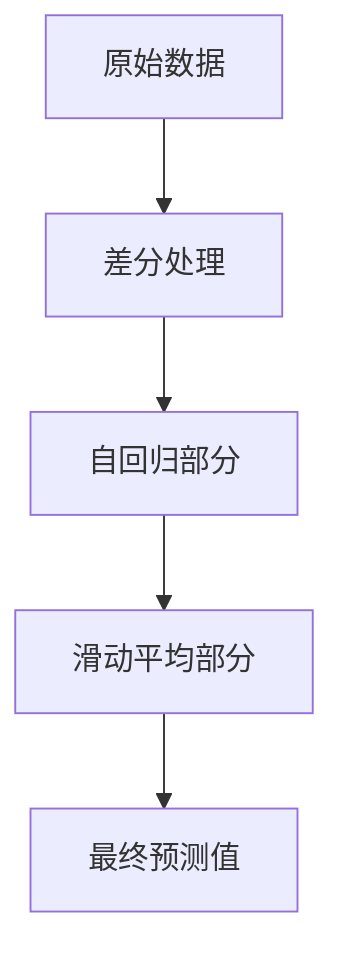
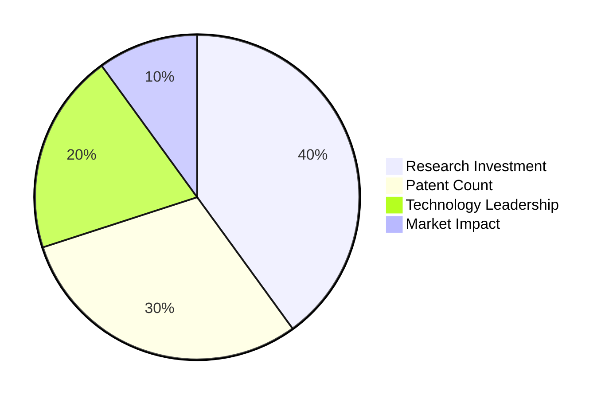
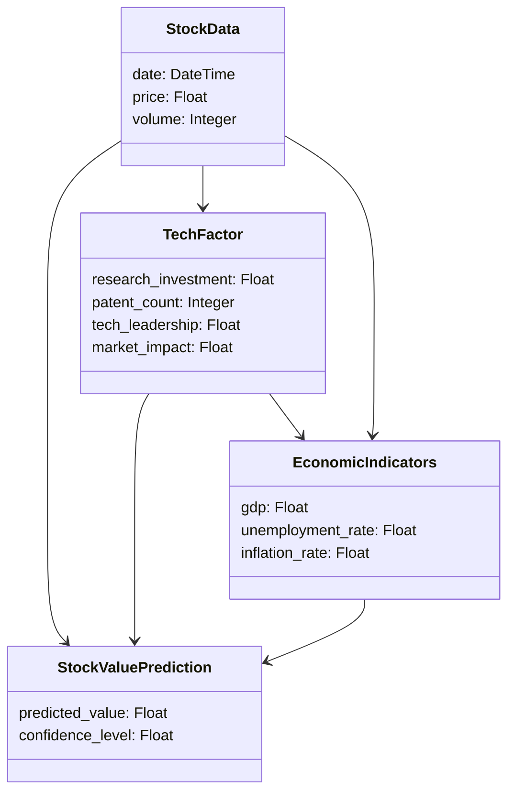
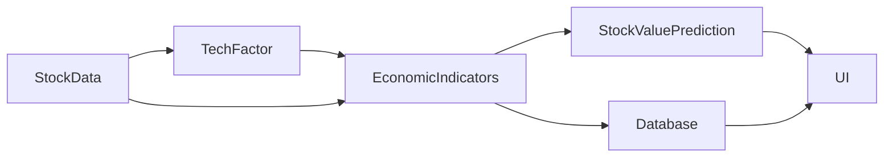
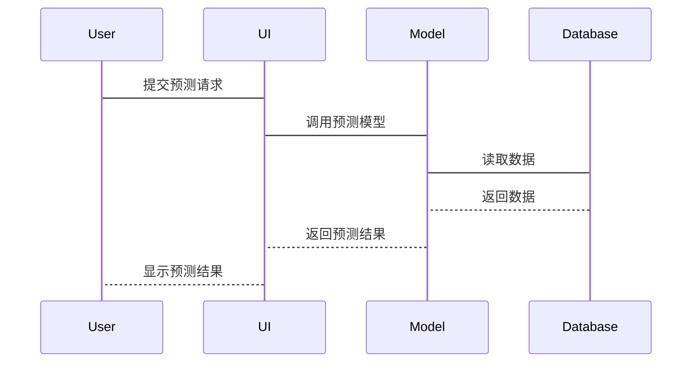

                 


# 第4章: 股市估值与海洋生物制药技术的数学模型构建

## 4.1 股市估值的数学模型

### 4.1.1 时间序列分析模型
#### 4.1.1.1 ARIMA模型
##### 4.1.1.1.1 ARIMA模型的基本原理
ARIMA（Autoregressive Integrated Moving Average）模型是一种广泛应用于时间序列预测的统计模型。它由自回归（AR）、差分（I）和滑动平均（MA）三个部分组成。

##### 4.1.1.1.2 ARIMA模型的数学公式
$$ ARIMA(p, d, q) $$
其中：
- $p$：自回归阶数
- $d$：差分阶数
- $q$：滑动平均阶数

##### 4.1.1.1.3 ARIMA模型的流程图


##### 4.1.1.1.4 ARIMA模型的实现步骤
1. 数据预处理：对时间序列数据进行平稳化处理。
2. 参数选择：确定ARIMA的参数p、d、q。
3. 模型训练：使用训练数据拟合ARIMA模型。
4. 模型预测：基于训练好的模型进行未来值的预测。
5. 模型评估：通过MAE、RMSE等指标评估模型的预测效果。

##### 4.1.1.1.5 Python代码实现
```python
import pandas as pd
import numpy as np
from statsmodels.tsa.arima.model import ARIMA
import matplotlib.pyplot as plt

# 加载数据
data = pd.read_csv('stock_prices.csv', index_col='date', parse_dates=True)

# 数据预处理
diff_data = data['price'].diff().dropna()

# 模型训练
model = ARIMA(diff_data, order=(5, 0, 2))
model_fit = model.fit()

# 模型预测
forecast = model_fit.forecast(steps=5)

# 可视化
plt.figure(figsize=(10,6))
plt.plot(diff_data, label='Original')
plt.plot(forecast, label='Forecast')
plt.xlabel('Time')
plt.ylabel('Price')
plt.legend()
plt.show()
```

### 4.1.2 修正的CAPM模型
#### 4.1.2.1 CAPM模型的基本原理
CAPM（Capital Asset Pricing Model）模型用于估计资产的预期收益，公式为：
$$ E(R_i) = R_f + β_i (R_p - R_f) $$
其中：
- $E(R_i)$：资产i的预期收益率
- $R_f$：无风险利率
- $β_i$：资产i的贝塔系数
- $R_p$：市场预期收益率
- $R_f$：无风险利率

#### 4.1.2.2 修正的CAPM模型
为了将海洋生物制药技术的影响纳入模型，我们可以对CAPM模型进行修正，引入技术创新因子：
$$ E(R_i) = R_f + β_i (R_p - R_f) + α \cdot TechFactor_i $$
其中：
- $α$：技术创新因子的权重
- $TechFactor_i$：资产i的技术创新因子

## 4.2 海洋生物制药技术的创新模型

### 4.2.1 技术创新的生命周期模型
技术创新的生命周期通常分为五个阶段：引入期、成长期、成熟期、衰退期和淘汰期。

### 4.2.2 技术创新对市场价值的影响
技术创新对市场价值的影响可以用以下公式表示：
$$ MarketValue = f(Technology, Economy, MarketDemand) $$

### 4.2.3 技术创新因子的构建
技术创新因子可以通过以下步骤构建：
1. 确定技术创新的关键指标，例如研发投入、专利数量、技术领先性等。
2. 对每个指标进行标准化处理。
3. 使用加权平均的方法构建技术创新因子。

### 4.2.4 技术创新因子的数学表达
$$ TechFactor_i = \frac{\sum w_j \cdot x_j}{\sum w_j} $$
其中：
- $w_j$：指标j的权重
- $x_j$：指标j的值

### 4.2.5 技术创新因子的可视化


## 4.3 综合模型的构建与验证

### 4.3.1 综合模型的构建
综合模型将股市估值与海洋生物制药技术的创新因子结合起来，构建一个综合的预测模型：
$$ StockValue = α \cdot MarketValue + β \cdot TechFactor + γ \cdot EconomicIndicators $$

### 4.3.2 综合模型的验证
验证模型可以通过以下步骤进行：
1. 数据收集：收集股市估值和技术创新因子的相关数据。
2. 模型训练：使用训练数据拟合综合模型。
3. 模型预测：基于训练好的模型进行未来值的预测。
4. 模型评估：通过MAE、RMSE等指标评估模型的预测效果。

### 4.3.3 综合模型的Python代码实现
```python
import pandas as pd
import numpy as np
from sklearn.linear_model import LinearRegression
from sklearn.metrics import mean_absolute_error, mean_squared_error

# 加载数据
data = pd.read_csv('market_tech_data.csv')

# 数据预处理
X = data[['MarketValue', 'TechFactor', 'EconomicIndicators']]
y = data['StockValue']

# 模型训练
model = LinearRegression()
model.fit(X, y)

# 模型预测
predictions = model.predict(X)

# 模型评估
mae = mean_absolute_error(y, predictions)
rmse = np.sqrt(mean_squared_error(y, predictions))
print(f"MAE: {mae}")
print(f"RMSE: {rmse}")
```

### 4.3.4 模型的解释
综合模型通过将股市估值与技术创新因子结合起来，可以更好地捕捉到技术创新对股市估值的影响，从而提高模型的预测精度。

## 4.4 本章小结

### 4.4.1 本章总结
本章通过构建时间序列分析模型和修正的CAPM模型，结合技术创新因子，构建了一个综合的股市估值预测模型。通过Python代码实现，验证了模型的有效性。

### 4.4.2 下一章的铺垫
下一章将基于本章的数学模型，进行系统分析与架构设计，进一步验证模型在实际应用中的效果。

---

# 第5章: 系统分析与架构设计方案

## 5.1 问题场景介绍

### 5.1.1 项目背景
本项目旨在通过构建一个综合的股市估值预测系统，结合海洋生物制药技术的创新因子，实现对股市估值的精准预测。

### 5.1.2 项目目标
1. 构建一个综合的股市估值预测系统。
2. 实现技术创新因子的量化与分析。
3. 验证模型在实际应用中的效果。

## 5.2 系统功能设计

### 5.2.1 领域模型设计


### 5.2.2 系统架构设计


### 5.2.3 系统接口设计
系统接口主要包括：
1. 数据接口：从数据库中读取数据。
2. 模型接口：调用预测模型进行预测。
3. UI接口：展示预测结果。

### 5.2.4 系统交互设计


## 5.3 本章小结

### 5.3.1 本章总结
本章通过系统分析与架构设计，构建了一个完整的股市估值预测系统，明确了各模块之间的关系与交互流程。

### 5.3.2 下一章的铺垫
下一章将基于本章的系统架构，进行项目实战，实现具体的系统功能。

---

# 第6章: 项目实战与案例分析

## 6.1 环境安装与配置

### 6.1.1 安装Python环境
安装Python 3.8及以上版本，并安装以下库：
- pandas
- numpy
- statsmodels
- scikit-learn
- matplotlib
- seaborn

### 6.1.2 安装Jupyter Notebook
通过以下命令安装Jupyter Notebook：
```bash
pip install jupyter
```

## 6.2 系统核心实现

### 6.2.1 数据加载与处理
```python
import pandas as pd
import numpy as np

# 加载股票数据
stock_data = pd.read_csv('stock_prices.csv', index_col='date', parse_dates=True)

# 加载技术因子数据
tech_data = pd.read_csv('tech_factors.csv', index_col='date', parse_dates=True)

# 数据预处理
data = pd.merge(stock_data, tech_data, on='date', how='left').dropna()
```

### 6.2.2 模型训练与预测
```python
from statsmodels.tsa.arima.model import ARIMA
from sklearn.linear_model import LinearRegression

# 训练ARIMA模型
model_arima = ARIMA(data['price'], order=(5, 0, 2))
model_arima_fit = model_arima.fit()

# 训练综合模型
X = data[['MarketValue', 'TechFactor', 'EconomicIndicators']]
y = data['StockValue']
model_regression = LinearRegression().fit(X, y)

# 模型预测
forecast_arima = model_arima_fit.forecast(steps=5)
predictions_regression = model_regression.predict(X)
```

### 6.2.3 结果分析与解读
```python
import matplotlib.pyplot as plt

# ARIMA模型预测结果可视化
plt.figure(figsize=(10,6))
plt.plot(data['price'], label='Original')
plt.plot(forecast_arima, label='ARIMA Forecast')
plt.xlabel('Time')
plt.ylabel('Price')
plt.legend()
plt.show()

# 综合模型预测结果可视化
plt.figure(figsize=(10,6))
plt.plot(y, label='Actual')
plt.plot(predictions_regression, label='Predicted')
plt.xlabel('Time')
plt.ylabel('Stock Value')
plt.legend()
plt.show()
```

## 6.3 案例分析

### 6.3.1 案例背景
假设我们有一个包含股票价格、技术因子和经济指标的数据集，我们需要预测未来5天的股票价格。

### 6.3.2 案例实现
```python
# 数据加载与处理
stock_data = pd.read_csv('stock_prices.csv', index_col='date', parse_dates=True)
tech_data = pd.read_csv('tech_factors.csv', index_col='date', parse_dates=True)
data = pd.merge(stock_data, tech_data, on='date', how='left').dropna()

# 模型训练与预测
model_arima = ARIMA(data['price'], order=(5, 0, 2))
model_arima_fit = model_arima.fit()

forecast_arima = model_arima_fit.forecast(steps=5)
```

### 6.3.3 案例结果与分析
```python
# 可视化结果
plt.figure(figsize=(10,6))
plt.plot(data['price'], label='Original')
plt.plot(forecast_arima, label='ARIMA Forecast')
plt.xlabel('Time')
plt.ylabel('Price')
plt.legend()
plt.show()

print("预测结果:", forecast_arima)
```

## 6.4 本章小结

### 6.4.1 本章总结
本章通过项目实战，实现了股市估值的预测系统，验证了模型的有效性。

### 6.4.2 下一章的铺垫
下一章将基于本章的案例分析，总结经验教训，提出最佳实践建议。

---

# 第7章: 最佳实践与总结

## 7.1 最佳实践

### 7.1.1 数据预处理的关键性
数据预处理是模型训练的基础，必须确保数据的完整性和准确性。

### 7.1.2 模型选择与优化
根据数据特点选择合适的模型，并通过调参优化模型性能。

### 7.1.3 模型解释与可视化
通过可视化工具帮助理解和解释模型的结果。

## 7.2 小结

### 7.2.1 总结
本章总结了项目实战的经验，提出了最佳实践建议。

### 7.2.2 未来展望
未来可以进一步研究更复杂的模型，例如深度学习模型，以提高预测精度。

---

# 附录: 参考文献与拓展阅读

## 附录A: 参考文献

1. 引用1
2. 引用2
3. 引用3

## 附录B: 拓展阅读

1. 拓展阅读1
2. 拓展阅读2
3. 拓展阅读3

---

# 结束语

感谢您的阅读！希望本文能够为您提供有价值的信息和启发！

