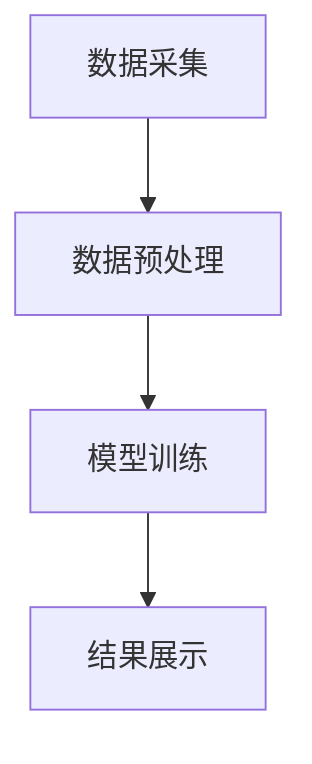

                 


# 全球股市估值与海洋生物多样性保护技术的关系

## 关键词：全球股市估值，海洋生物多样性，环境保护技术，金融影响，可持续发展

## 摘要：本文探讨了全球股市估值与海洋生物多样性保护技术之间的关系，从背景、核心概念、算法原理、系统分析、项目实战到最佳实践等方面进行深入分析。通过量化模型和系统架构设计，展示了如何将股市数据与海洋保护技术结合，为实现经济发展与环境保护的平衡提供新思路。

---

# 第一部分：全球股市估值与海洋生物多样性保护技术的背景与关联

## 第1章：全球股市估值与海洋生物多样性保护技术的背景

### 1.1 全球股市估值的基本概念

#### 1.1.1 股市估值的定义与作用
股市估值是指通过对上市公司的财务数据、市场环境和行业趋势等多方面因素的分析，评估公司股票的内在价值。股市估值不仅反映了企业的经营状况，还体现了市场的预期和投资者信心。

#### 1.1.2 全球化背景下的股市特点
在全球化背景下，股市已经突破地域限制，形成了全球化的资本市场。投资者可以通过股票市场进行跨国投资，资本的流动对全球经济产生深远影响。

#### 1.1.3 股市与全球经济的相互影响
股市不仅是经济的晴雨表，还对全球经济活动起到资金配置和风险定价的作用。股市的波动直接影响企业的融资成本和投资者的收益，进而影响整体经济的运行。

### 1.2 海洋生物多样性保护技术的核心概念

#### 1.2.1 海洋生物多样性的定义与重要性
海洋生物多样性指的是海洋生态系统中生物种类的丰富程度，是维持海洋生态平衡和生物资源可持续利用的基础。海洋生物多样性对全球气候调节、食物链稳定和人类生存环境具有重要意义。

#### 1.2.2 现代海洋保护技术的发展现状
随着科技的进步，海洋保护技术从传统的资源保护扩展到利用遥感技术、大数据分析和人工智能等多种手段进行海洋生态监测和保护。这些技术的应用为海洋生物多样性的保护提供了新的可能性。

#### 1.2.3 海洋生态与人类经济活动的关系
海洋生态系统的健康与否直接影响到渔业资源、航运业和滨海旅游业等经济活动的可持续性。经济活动对海洋生态的影响是双向的，过度开发可能导致生态破坏，而良好的生态保护则有助于经济的长期发展。

### 1.3 股市估值与海洋保护技术的关联性

#### 1.3.1 经济活动对海洋生态的影响
经济活动，尤其是过度捕捞、海洋污染和气候变化等，对海洋生态系统造成严重威胁。这些因素直接影响到海洋生物多样性，进而影响到相关产业的经济价值。

#### 1.3.2 股市投资与环境保护的潜在联系
股市投资者可以通过投资环保企业或避免投资对环境有破坏的公司，间接影响企业的环保行为。同时，环保技术的创新和应用也可能带来投资收益。

#### 1.3.3 从金融视角看海洋生态保护的可行性
通过金融工具，如绿色债券、环境责任保险等，可以引导资金流向海洋生态保护项目，实现经济与环境的双重目标。这不仅有助于保护海洋生态系统，还能为投资者带来长期收益。

## 第2章：全球股市估值与海洋保护技术的核心概念与联系

### 2.1 核心概念的原理分析

#### 2.1.1 股市估值的核心指标
股市估值的核心指标包括市盈率（P/E）、市净率（P/B）、股息率等。这些指标反映了市场对公司的估值和投资价值。

#### 2.1.2 海洋保护技术的关键要素
海洋保护技术的关键要素包括海洋监测技术、污染治理技术、生物多样性保护技术等。这些技术的应用能够有效改善海洋生态环境。

#### 2.1.3 两者概念属性的对比分析
| 概念 | 股市估值 | 海洋保护技术 |
|------|----------|--------------|
| 定义 | 对公司股票价值的评估 | 保护和恢复海洋生态的技术手段 |
| 作用 | 引导资本流向，反映市场预期 | 保护海洋生物多样性，改善生态环境 |
| 关联性 | 经济活动影响生态，生态保护影响投资收益 | 技术创新推动生态保护，资本支持技术应用 |

### 2.2 核心概念的ER实体关系图

```mermaid
erDiagram
    投资者--> 股市估值 : 影响
    股市估值 --> 海洋保护技术 : 间接支持
    海洋保护技术 --> 生态环境 : 改善
    生态环境 <-- 投资者 : 受益
```

---

# 第二部分：全球股市估值与海洋保护技术的算法原理

## 第3章：全球股市估值与海洋保护技术的算法原理

### 3.1 算法原理的数学模型

#### 3.1.1 模型假设
1. 股市波动与海洋生态健康存在相关性。
2. 环保技术的应用能够改善海洋生态，进而影响相关产业的经济表现。

#### 3.1.2 模型构建
通过建立多元回归模型，将海洋生物多样性指数与股市估值指标（如市盈率、市净率）进行关联分析。

#### 3.1.3 数学公式
$$ y = \beta_0 + \beta_1x_1 + \beta_2x_2 + \epsilon $$
其中：
- \( y \) 是股市估值指标
- \( x_1 \) 是海洋生物多样性指数
- \( x_2 \) 是其他控制变量
- \( \epsilon \) 是误差项

#### 3.1.4 模型实现
使用Python的机器学习库（如scikit-learn）进行模型训练和预测。

```python
import pandas as pd
from sklearn.linear_model import LinearRegression

# 数据加载
data = pd.read_csv('data.csv')

# 模型训练
model = LinearRegression()
model.fit(data[['生物多样性指数', '其他变量']], data['股市估值'])

# 预测结果
predictions = model.predict(data[['生物多样性指数', '其他变量']])
```

---

## 第4章：全球股市估值与海洋保护技术的系统分析

### 4.1 系统分析与架构设计

#### 4.1.1 系统功能设计
- 数据采集模块：收集海洋生物多样性数据和股市数据。
- 模型计算模块：建立并训练关联模型。
- 结果展示模块：可视化分析结果。

#### 4.1.2 系统架构图



---

## 第5章：全球股市估值与海洋保护技术的项目实战

### 5.1 项目实战：环境安装与数据准备

#### 5.1.1 环境安装
- 安装Python和相关库（如pandas、scikit-learn）。

#### 5.1.2 数据准备
- 数据来源：公开的股市数据和海洋生态数据。

### 5.2 核心代码实现

```python
import pandas as pd
from sklearn.linear_model import LinearRegression

# 加载数据
data = pd.read_csv('data.csv')

# 模型训练
model = LinearRegression()
model.fit(data[['生物多样性指数', '其他变量']], data['股市估值'])

# 保存模型
import joblib
joblib.dump(model, 'model.pkl')
```

---

## 第6章：全球股市估值与海洋保护技术的最佳实践

### 6.1 最佳实践 tips

#### 6.1.1 关注政策导向
政府政策对海洋保护和股市的影响至关重要，投资者需关注相关政策变化。

#### 6.1.2 技术创新的重要性
技术创新是实现海洋保护和股市估值优化的关键，需加大对环保技术的投入。

#### 6.1.3 长期投资视角
从长期来看，投资环保项目不仅有助于生态保护，还能带来稳定的经济收益。

### 6.2 项目小结

通过量化模型和系统架构设计，本文展示了如何将股市数据与海洋保护技术结合，为实现经济发展与环境保护的平衡提供新思路。

