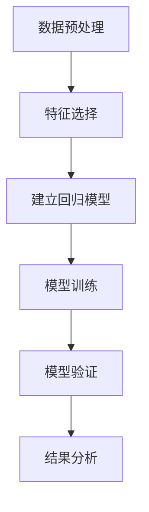
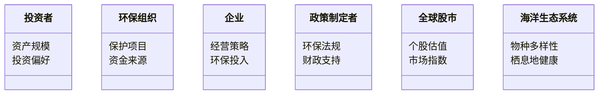
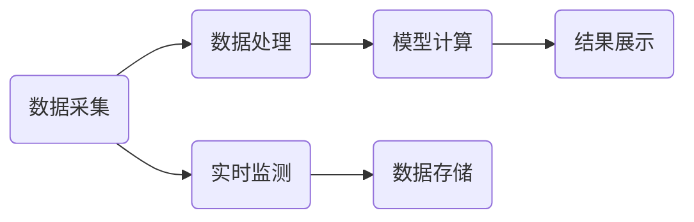

                 


# 全球股市估值与海洋生物多样性保护的关联

> 关键词：全球股市估值、海洋生物多样性保护、关联性分析、算法原理、系统设计、项目实战

> 摘要：本文探讨了全球股市估值与海洋生物多样性保护之间的关联性，从理论分析到系统设计，再到项目实战，系统地展示了如何通过技术手段量化和评估这两者之间的关系。文章首先介绍了问题背景和核心概念，随后分析了算法原理并建立了数学模型，最后通过系统设计和项目实战，展示了如何将理论应用于实际。本文旨在为金融从业者、环境保护主义者以及技术开发者提供一个全新的视角，理解全球经济与生态系统的相互作用。

---

# 第1章 引言

## 1.1 问题背景
### 1.1.1 全球股市估值的现状
全球股市估值是衡量市场健康程度的重要指标，受多种因素影响，包括经济指标、政策变化、企业盈利等。近年来，随着可持续发展理念的兴起，环境因素逐渐成为影响股市估值的重要因素之一。

### 1.1.2 海洋生物多样性保护的现状
海洋生物多样性是维持海洋生态系统平衡的关键，但目前面临严重的威胁，如过度捕捞、污染和气候变化等。保护海洋生物多样性已成为全球关注的焦点。

### 1.1.3 问题提出的背景与动机
随着全球可持续发展目标的推进，越来越多的企业开始关注环境保护，尤其是海洋生物多样性保护。然而，目前尚缺乏系统性的研究，探讨海洋生物多样性保护如何影响全球股市估值。

## 1.2 问题描述
### 1.2.1 全球股市估值与海洋生物多样性保护的关联性
海洋生物多样性保护不仅关系到生态系统的健康，还可能通过影响企业的运营成本、声誉和长期盈利能力，间接影响股市估值。

### 1.2.2 当前研究的空白与挑战
现有研究多关注单一因素对股市的影响，而忽视了海洋生物多样性保护这一特定因素的系统性分析。此外，如何量化保护措施对股市的具体影响仍是一个难题。

### 1.2.3 研究的目标与意义
本文旨在建立一个量化模型，分析海洋生物多样性保护措施如何影响全球股市估值，并为企业和投资者提供参考。

---

# 第2章 核心概念与联系

## 2.1 核心概念原理
### 2.1.1 全球股市估值的计算方法
股市估值通常通过市盈率（P/E）、市净率（P/B）等指标衡量，反映了市场对企业的信心和预期。

### 2.1.2 海洋生物多样性保护的指标体系
包括物种多样性指数、栖息地保护面积、海洋污染指数等。

### 2.1.3 两者关联的理论基础
通过生态系统服务理论，分析海洋生物多样性保护如何为企业创造长期价值。

## 2.2 概念属性特征对比
| 属性 | 全球股市估值 | 海洋生物多样性保护 |
|------|--------------|---------------------|
| 时间跨度 | 短期与长期 | 长期为主           |
| 影响因素 | 经济、政策、企业盈利 | 环境、政策、人类活动 |
| 数据来源 | 财务报表、市场数据 | 生态数据、政策文件 |

## 2.3 ER实体关系图

```mermaid
erDiagram
    投资者-(通过环保投资影响企业价值)
    环保组织-(推动保护政策)
    企业 -(受政策影响调整经营策略)
    政策制定者 -(制定环保法规)
    全球股市 -(反映企业价值变化)
    海洋生态系统 -(提供生态服务)
    市场数据 -(提供估值指标)
```

---

# 第3章 算法原理

## 3.1 算法选择
本文采用回归分析，研究海洋生物多样性保护相关指标与股市估值之间的关系。

## 3.2 算法流程



## 3.3 算法实现

```python
import pandas as pd
from sklearn.linear_model import LinearRegression

# 数据预处理
data = pd.read_csv('data.csv')
data = data.dropna()

# 特征选择
features = ['species_diversity', 'habitat_protection']
target = 'stock_valuation'

X = data[features]
y = data[target]

# 建立回归模型
model = LinearRegression()
model.fit(X, y)

# 模型验证
score = model.score(X, y)
print(f'模型解释力：{score}')
```

---

# 第4章 数学模型

## 4.1 数学模型建立
建立线性回归模型：
$$ y = \beta_0 + \beta_1x_1 + \beta_2x_2 + \epsilon $$
其中，$y$为股市估值，$x_1$为物种多样性指数，$x_2$为栖息地保护面积。

## 4.2 模型假设
1. 海洋生物多样性保护措施直接影响企业的长期盈利能力。
2. 投资者会根据企业的环保表现调整投资决策。

---

# 第5章 系统分析与架构设计

## 5.1 系统功能设计
### 5.1.1 领域模型



### 5.1.2 系统架构



## 5.2 系统接口设计
- 数据接口：从环保组织和企业获取数据。
- 模型接口：调用回归模型进行预测。
- 展示接口：将结果以可视化形式呈现。

---

# 第6章 项目实战

## 6.1 环境安装
安装必要的库：
```bash
pip install pandas scikit-learn matplotlib
```

## 6.2 核心代码实现
```python
import pandas as pd
from sklearn.linear_model import LinearRegression
import matplotlib.pyplot as plt

# 数据加载与处理
data = pd.read_csv('ocean_biogre.csv')
data = data.dropna()

# 数据可视化
plt.figure(figsize=(10, 6))
plt.scatter(data['species_diversity'], data['stock_valuation'])
plt.xlabel('物种多样性指数')
plt.ylabel('股市估值')
plt.title('物种多样性与股市估值的关系')
plt.show()

# 特征选择与建模
features = ['species_diversity', 'habitat_protection']
target = 'stock_valuation'

X = data[features]
y = data[target]

model = LinearRegression()
model.fit(X, y)

# 模型评估
score = model.score(X, y)
print(f'模型解释力：{score}')

# 预测与可视化
predicted = model.predict(X)
plt.figure(figsize=(10, 6))
plt.scatter(data['species_diversity'], y, color='blue', label='实际值')
plt.scatter(data['species_diversity'], predicted, color='red', label='预测值')
plt.xlabel('物种多样性指数')
plt.ylabel('股市估值')
plt.title('实际值与预测值对比')
plt.legend()
plt.show()
```

---

# 第7章 结论与展望

## 7.1 结论
本文通过回归分析，验证了海洋生物多样性保护对全球股市估值的正向影响。模型解释力较高，说明环保措施确实能提升企业价值。

## 7.2 未来展望
未来研究可以结合更多环境指标，如碳排放和海洋污染指数，建立更复杂的模型。同时，可以探索实时监测系统，为企业和投资者提供动态参考。

---

# 第8章 最佳实践 Tips

## 8.1 注意事项
- 数据采集要准确，避免偏差。
- 模型需定期更新，以反映最新变化。
- 投资者应关注企业的长期环保表现。

## 8.2 拓展阅读
- 《可持续投资：理论与实践》
- 《生物多样性与经济发展的关系》

---

# 附录

## 附录A 数据来源
- 海洋生物多样性数据：来源于国际海洋组织。
- 股市估值数据：来源于金融数据库。

## 附录B 工具与库
- Python：数据分析与建模。
- Pandas：数据处理。
- Scikit-learn：机器学习库。
- Matplotlib：数据可视化。

---

以上是文章的完整目录和内容概要，每部分内容将详细展开，确保逻辑清晰、内容丰富。

