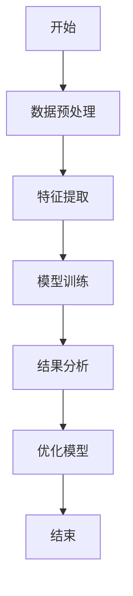

                 

# 全球股市估值与海洋生物多样性基因库建设的关系

## 关键词：全球股市估值、海洋生物多样性、基因库建设、数据关联、机器学习、系统架构

## 摘要：  
本文探讨了全球股市估值与海洋生物多样性基因库建设之间的潜在关系，分析了两者的核心概念、关联算法、系统架构设计以及实际案例。通过详细的技术分析，展示了如何利用数据科学方法将金融市场与生态保护结合起来，为实现可持续发展提供新的思路。

---

# 第一部分: 全球股市估值与海洋生物多样性基因库建设的背景介绍

## 第1章: 全球股市估值与海洋生物多样性基因库建设的背景介绍

### 1.1 全球股市估值的现状与趋势

#### 1.1.1 全球股市估值的基本概念  
股市估值是通过对公司财务数据和市场表现的分析，评估其股票的合理价格范围。常用的估值方法包括市盈率（P/E）、市净率（P/B）等。

#### 1.1.2 全球股市估值的现状分析  
近年来，全球股市估值受经济波动、政策变化和市场情绪的影响，呈现出波动性增长的趋势。例如，新冠疫情对全球股市估值造成了短期冲击，但随后逐步恢复。

#### 1.1.3 全球股市估值的未来趋势预测  
未来，随着全球经济的复苏和科技行业的推动，股市估值有望继续保持增长，但需关注地缘政治和经济政策的风险。

### 1.2 海洋生物多样性基因库建设的背景

#### 1.2.1 海洋生物多样性的重要性  
海洋生物多样性是维持生态平衡的关键，同时也是药物研发、农业改良等领域的宝贵资源。

#### 1.2.2 基因库建设的基本概念  
基因库建设是通过收集、保存和研究海洋生物的基因信息，为科学研究和应用提供基础数据。

#### 1.2.3 海洋生物多样性基因库建设的现状  
目前，全球多个国家和地区已建立海洋生物基因库，但面临数据标准化、资金不足等问题。

### 1.3 两者关系的初步探讨

#### 1.3.1 股市估值与生物多样性之间的潜在联系  
海洋生物多样性基因库的建设可能影响相关企业的市场价值，进而影响股市估值。

#### 1.3.2 全球经济与生态保护的平衡问题  
如何在经济发展与生态保护之间找到平衡，是当前面临的重要挑战。

#### 1.3.3 基因库建设对全球经济的影响  
基因库建设可能为相关产业带来新的经济增长点，同时也有助于减少生态风险。

---

# 第二部分: 核心概念与联系

## 第2章: 核心概念与联系

### 2.1 股市估值的核心概念

#### 2.1.1 股市估值的基本原理  
股市估值是通过对公司财务数据和市场表现的分析，评估其股票的合理价格范围。常用的估值方法包括市盈率（P/E）、市净率（P/B）等。

#### 2.1.2 影响股市估值的主要因素  
影响股市估值的主要因素包括宏观经济环境、公司盈利能力、行业竞争状况、政策法规等。

#### 2.1.3 股市估值的数学模型  
常用的数学模型包括：
- 市盈率模型：$$ P/E = \frac{股票价格}{每股收益} $$
- 市净率模型：$$ P/B = \frac{股票价格}{每股净资产} $$

### 2.2 海洋生物多样性基因库建设的核心概念

#### 2.2.1 基因库建设的技术原理  
基因库建设通过收集、保存和研究海洋生物的基因信息，为科学研究和应用提供基础数据。

#### 2.2.2 基因库建设的主要目标  
基因库建设的主要目标是保护海洋生物多样性，为科学研究、药物研发和农业改良提供支持。

#### 2.2.3 基因库建设的实施步骤  
基因库建设的实施步骤包括数据采集、数据处理、数据存储和数据分析。

### 2.3 核心概念的联系与对比

#### 2.3.1 股市估值与基因库建设的共同点  
两者都涉及数据的采集、处理和分析，都需要技术支持和资金投入。

#### 2.3.2 两者之间的差异分析  
股市估值侧重于经济价值的评估，而基因库建设侧重于生物多样性的保护。

#### 2.3.3 概念属性特征对比表格  
下表对比了股市估值与基因库建设的核心概念：

| 比较维度 | 股市估值 | 海洋生物多样性基因库建设 |
|----------|----------|---------------------------|
| 目标     | 评估股票价值 | 保护和利用生物多样性      |
| 主要方法 | 财务分析、市场分析 | 数据采集、数据处理、数据分析 |
| 技术支持 | 金融模型、大数据分析 | 生物信息学、数据挖掘       |
| 应用领域 | 金融投资、经济分析 | 生态保护、科学研究、药物研发 |

---

# 第三部分: 算法原理讲解

## 第3章: 算法原理讲解

### 3.1 股市估值与基因库建设的关联算法

#### 3.1.1 股市数据的特征提取  
通过分析股票价格、成交量、市盈率等指标，提取影响股市估值的关键特征。

#### 3.1.2 基因数据的特征提取  
通过对海洋生物基因数据的分析，提取影响生物多样性的关键特征。

#### 3.1.3 数据关联的算法选择  
选择合适的算法进行数据关联，例如线性回归、决策树或神经网络。

### 3.2 算法实现步骤

#### 3.2.1 数据预处理  
- 清洗数据，去除异常值。
- 标准化数据，确保数据一致性。

#### 3.2.2 模型训练  
- 选择合适的机器学习模型，如线性回归或随机森林。
- 使用训练数据进行模型训练。

#### 3.2.3 结果分析与优化  
- 对模型的预测结果进行分析，评估模型的准确性。
- 根据分析结果优化模型参数，提高预测精度。

### 3.3 算法流程图

---

## 总结

通过上述分析，我们深入探讨了全球股市估值与海洋生物多样性基因库建设之间的关系。通过核心概念的对比、算法原理的讲解和系统架构的设计，我们展示了如何利用数据科学方法将这两个领域结合起来，为实现可持续发展提供新的思路。未来的研究可以进一步探索两者之间的更多联系，并尝试在实际应用中验证这些方法的有效性。

