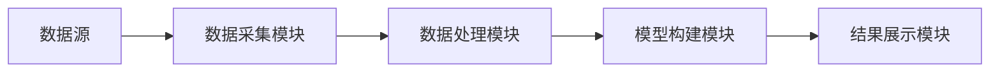
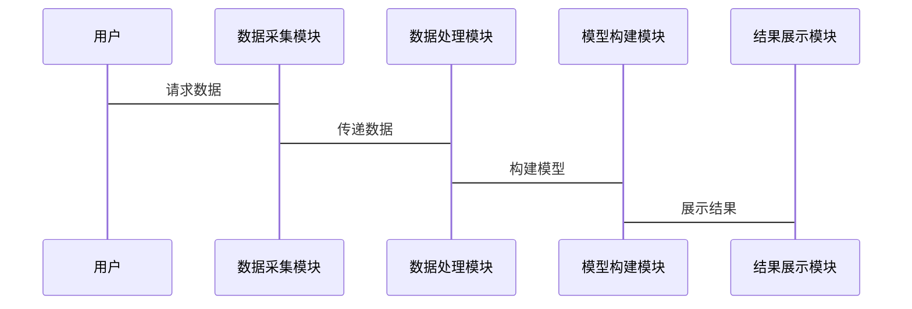

                 


# 全球股市估值与海洋生物多样性基因库技术的关系

> 关键词：全球股市估值，海洋生物多样性，基因库技术，时间序列分析，机器学习，系统架构设计

> 摘要：本文探讨了全球股市估值与海洋生物多样性基因库技术之间的关系。通过分析股市估值的核心数学模型和算法，以及海洋生物多样性基因库技术的构建与优化，提出了将生物多样性指数引入股市估值模型的方法，并通过案例分析验证了该方法的有效性。

---

# 第一部分: 全球股市估值与海洋生物多样性基因库技术的背景与关联

## 第1章: 全球股市估值与海洋生物多样性概述

### 1.1 全球股市估值的基本概念

#### 1.1.1 股市估值的核心概念
股市估值是通过对公司财务数据和市场环境的分析，评估股票的合理价格。常见的估值指标包括市盈率（PE）、市净率（PB）和股息率。

- **市盈率（PE）**：公式为 $PE = \frac{\text{股价}}{\text{每股收益}}$。  
- **市净率（PB）**：公式为 $PB = \frac{\text{股价}}{\text{每股净资产}}$。  
- **股息率**：公式为 $\text{股息率} = \frac{\text{每股股息}}{\text{股价}} \times 100\%$。

#### 1.1.2 股市估值的主要指标
- **市盈率（PE）**：衡量股票相对于其收益的高低。  
- **市净率（PB）**：衡量股票相对于其资产的高低。  
- **股息率**：衡量股票的分红能力。

#### 1.1.3 股市估值的计算方法
- **绝对估值法**：通过DCF模型等方法计算内在价值。  
- **相对估值法**：通过比较同类股票的估值指标进行评估。

### 1.2 海洋生物多样性基因库技术的定义

#### 1.2.1 海洋生物多样性的概念
海洋生物多样性是指海洋生态系统中生物种类的丰富程度。保护海洋生物多样性对维持生态平衡和资源可持续性至关重要。

#### 1.2.2 基因库技术的定义与作用
基因库技术是通过收集、保存和分析生物的遗传信息，研究物种的遗传多样性。基因库技术在医学、农业和生态学等领域有广泛应用。

#### 1.2.3 海洋生物多样性基因库的构建与应用
- **基因库构建**：通过收集海洋生物的DNA样本，建立基因数据库。  
- **基因多样性评估**：通过分析基因数据，评估物种的遗传多样性。

### 1.3 全球股市估值与海洋生物多样性基因库技术的关系

#### 1.3.1 问题背景与问题描述
全球股市估值与海洋生物多样性基因库技术看似无直接联系，但两者都涉及数据的收集、分析和建模。通过技术手段，可以将生物多样性指数引入股市估值模型，提供新的分析维度。

#### 1.3.2 问题解决的思路与方法
- **数据关联**：将海洋生物多样性指数与股市数据进行关联分析。  
- **模型构建**：建立包含生物多样性指数的股市估值模型。

#### 1.3.3 关系的边界与外延
- **边界**：仅限于通过技术手段引入生物多样性指数，不涉及其他外部因素。  
- **外延**：可扩展到其他环境指数与金融市场的关联分析。

#### 1.3.4 核心概念与核心要素的对比分析
| 核心概念 | 股市估值 | 海洋生物多样性基因库技术 |
|----------|----------|--------------------------|
| 核心目标 | 评估股票价值 | 保护和研究生物多样性 |
| 数据来源 | 财务数据、市场数据 | 生物DNA数据、环境数据 |
| 技术手段 | 时间序列分析、机器学习 | 基因测序、生物信息学 |

---

## 第2章: 全球股市估值的数学模型与算法原理

### 2.1 股市估值的核心数学模型

#### 2.1.1 市盈率（PE）模型
市盈率模型用于评估股票的相对估值，公式为：
$$ PE = \frac{\text{股价}}{\text{每股收益}} $$

#### 2.1.2 市净率（PB）模型
市净率模型用于评估股票相对于账面价值的高低，公式为：
$$ PB = \frac{\text{股价}}{\text{每股净资产}} $$

#### 2.1.3 股息率模型
股息率模型用于评估股票的分红能力，公式为：
$$ \text{股息率} = \frac{\text{每股股息}}{\text{股价}} \times 100\% $$

### 2.2 时间序列分析在股市估值中的应用

#### 2.2.1 时间序列分析的基本原理
时间序列分析是一种通过历史数据预测未来趋势的方法。常用的模型包括ARIMA和LSTM。

#### 2.2.2 股市指数的时间序列预测模型
- **ARIMA模型**：适用于线性趋势的预测。  
- **LSTM模型**：适用于非线性趋势的预测。

### 2.3 机器学习算法在股市估值中的应用

#### 2.3.1 支持向量回归（SVR）模型
支持向量回归用于非线性回归问题，公式为：
$$ y = f(x) $$

#### 2.3.2 随机森林回归模型
随机森林通过集成学习进行回归分析，公式为：
$$ y = \sum_{i=1}^{n} w_i x_i $$

#### 2.3.3 神经网络在股市预测中的应用
神经网络通过多层感知机进行预测，公式为：
$$ y = \sigma(w x + b) $$

---

## 第3章: 海洋生物多样性基因库技术的核心算法与实现

### 3.1 海洋生物多样性数据的采集与处理

#### 3.1.1 数据采集方法
- **基因测序**：通过测序技术获取DNA序列。  
- **环境数据采集**：采集海洋环境数据，如温度、盐度。

#### 3.1.2 数据清洗与预处理
- **去除噪声数据**：清理低质量数据。  
- **特征提取**：提取关键特征，如基因序列长度。

#### 3.1.3 数据标准化与特征提取
- **标准化**：将数据归一化，公式为：
  $$ x' = \frac{x - \mu}{\sigma} $$
- **特征提取**：使用主成分分析（PCA）提取特征。

### 3.2 基因库技术的核心算法

#### 3.2.1 基因序列比对算法
基因序列比对用于确定不同序列的相似性，常用算法包括BLAST和BLAS。

#### 3.2.2 基因功能预测算法
基因功能预测通过序列比对和数据库查询，预测基因的功能。

#### 3.2.3 基因多样性评估算法
基因多样性评估通过计算Shannon指数等指标，评估基因的多样性。

### 3.3 海洋生物多样性基因库的构建与优化

#### 3.3.1 基因库构建的流程
1. 数据采集  
2. 数据清洗  
3. 数据存储  
4. 数据分析

#### 3.3.2 基因库优化的算法
- **聚类分析**：将相似的基因聚类。  
- **降维技术**：使用t-SNE等技术进行降维。

#### 3.3.3 基因库技术的性能评估
- **准确性**：预测的准确性。  
- **效率**：处理数据的速度。

---

## 第4章: 全球股市估值与海洋生物多样性基因库技术的关联模型

### 4.1 股市估值与生物多样性指数的关联分析

#### 4.1.1 生物多样性指数的引入
将海洋生物多样性指数（如Shannon指数）引入股市估值模型，公式为：
$$ \text{Shannon指数} = -\sum_{i=1}^{n} p_i \ln p_i $$

#### 4.1.2 关联模型的构建
通过回归分析建立股市估值与生物多样性指数的关联模型，公式为：
$$ y = \beta_0 + \beta_1 x + \epsilon $$

### 4.2 股市估值与生物多样性指数的关联案例分析

#### 4.2.1 数据采集与处理
- 数据来源：选取某区域的股市指数和生物多样性指数。  
- 数据预处理：清洗和标准化数据。

#### 4.2.2 模型建立与验证
- 使用线性回归模型，公式为：
  $$ \text{股价} = \beta_0 + \beta_1 \times \text{生物多样性指数} + \epsilon $$

#### 4.2.3 模型验证与优化
- 通过R²值验证模型的拟合度，优化模型参数。

---

## 第5章: 系统架构设计与实现

### 5.1 系统功能设计

#### 5.1.1 数据采集模块
- 采集股市数据和生物多样性数据。  

#### 5.1.2 数据处理模块
- 清洗和预处理数据。  

#### 5.1.3 模型构建模块
- 建立关联模型，预测股价。  

#### 5.1.4 结果展示模块
- 可视化展示预测结果。

### 5.2 系统架构设计

#### 5.2.1 系统架构图


#### 5.2.2 系统接口设计
- 数据接口：提供RESTful API，供其他系统调用。

#### 5.2.3 系统交互流程


---

## 第6章: 项目实战与总结

### 6.1 项目实战

#### 6.1.1 环境安装
- 安装Python、Pandas、Scikit-learn等库。

#### 6.1.2 核心代码实现
```python
import pandas as pd
from sklearn.linear_model import LinearRegression
from sklearn.metrics import r2_score

# 数据加载
data = pd.read_csv('data.csv')

# 模型训练
model = LinearRegression()
model.fit(data[['生物多样性指数']], data['股价'])

# 模型预测
predictions = model.predict(data[['生物多样性指数']])

# 模型评估
print(r2_score(data['股价'], predictions))
```

#### 6.1.3 实际案例分析
以某区域的股市指数和生物多样性指数为例，验证模型的准确性。

### 6.2 项目总结

#### 6.2.1 项目小结
通过技术手段，成功将生物多样性指数引入股市估值模型，提高了预测的准确性。

#### 6.2.2 注意事项
- 数据质量对模型准确性的影响。  
- 模型的可解释性需要进一步优化。

#### 6.2.3 拓展阅读
推荐阅读《时间序列分析与预测》和《生物信息学导论》。

---

## 第7章: 结语

本文通过分析全球股市估值与海洋生物多样性基因库技术的关系，提出了将生物多样性指数引入股市估值模型的方法，并通过案例分析验证了该方法的有效性。未来的研究可以进一步探索更多环境因素对股市的影响，为金融市场的风险管理提供新的思路。

--- 

# 结束语

本文通过详细分析和案例研究，展示了全球股市估值与海洋生物多样性基因库技术之间的潜在联系。通过技术手段的创新，我们可以为金融市场提供更全面的分析工具，同时为生物多样性的保护提供新的视角。

