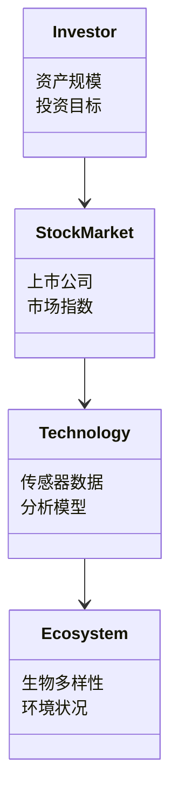
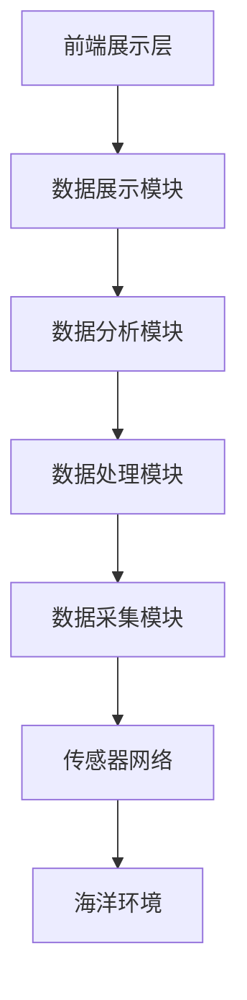

                 


# 全球股市估值与海洋生物多样性监测技术的关系

**关键词**：全球股市估值、海洋生物多样性监测、技术关联性、数据驱动分析、可持续投资

**摘要**：本文探讨了全球股市估值与海洋生物多样性监测技术之间的潜在联系，分析了两者的核心概念、技术原理及应用场景。通过对比分析和系统设计，提出了基于数据驱动的方法，将海洋生物多样性监测数据与股市估值模型相结合，为实现可持续投资和生态保护提供了新的思路。

---

# 第1章 全球股市估值与海洋生物多样性监测技术的背景介绍

## 1.1 全球股市估值的基本概念

### 1.1.1 股市估值的定义与作用

股市估值是指对上市公司或整个股市的市场价值进行评估的过程。其主要作用是帮助投资者、企业和政府了解市场的健康状况，做出合理的投资决策。

### 1.1.2 股市估值的主要方法

- **市盈率（P/E）**：公司股价与每股收益的比率。
- **市净率（P/B）**：公司股价与每股净资产的比率。
- **市值**：公司股票的总市场价值。

### 1.1.3 全球化视角下的股市估值特点

全球化背景下，股市估值受到宏观经济、政策、行业趋势等多重因素的影响。跨国投资的兴起使得股市估值的复杂性进一步增加。

---

## 1.2 海洋生物多样性监测技术的核心概念

### 1.2.1 海洋生物多样性监测的定义

海洋生物多样性监测是通过技术手段对海洋生态系统中的物种组成、数量变化和分布情况进行长期观测和记录的过程。

### 1.2.2 海洋生物多样性监测的主要技术手段

- **卫星遥感技术**：监测海洋环境变化。
- **传感器网络**：实时采集海洋数据。
- **生物标记技术**：追踪海洋生物的迁徙路径。

### 1.2.3 海洋生物多样性监测的全球现状与挑战

全球范围内，海洋生物多样性监测技术的应用尚不普及，且数据共享机制不完善，导致资源浪费和研究滞后。

---

## 1.3 两者的关联性与研究意义

### 1.3.1 股市估值与海洋生物多样性监测的潜在联系

通过将海洋生物多样性监测数据与股市估值模型相结合，可以为投资者提供更全面的决策依据。

### 1.3.2 研究这一关系的学术价值与现实意义

- **学术价值**：填补跨领域研究的空白。
- **现实意义**：推动可持续投资和生态保护。

### 1.3.3 全球化视角下的研究背景与趋势

全球化背景下，跨领域研究成为趋势，股市估值与海洋生物多样性监测的结合是这一趋势的典型代表。

---

## 1.4 本章小结

本章从背景和概念入手，分析了全球股市估值和海洋生物多样性监测技术的核心内容及其关联性，为后续研究奠定了基础。

---

# 第2章 全球股市估值与海洋生物多样性监测技术的核心概念与联系

## 2.1 核心概念的原理与属性对比

### 2.1.1 股市估值的核心原理

股市估值的核心在于通过对市场数据的分析，评估企业的内在价值和市场表现。

### 2.1.2 海洋生物多样性监测技术的核心原理

海洋生物多样性监测通过技术手段采集和分析数据，评估海洋生态系统的健康状况。

### 2.1.3 两者核心属性的对比分析

| 属性                | 股市估值         | 海洋生物多样性监测 |
|---------------------|-----------------|---------------------|
| 数据来源            | 市场数据         | 环境数据           |
| 目标                | 投资决策         | 生态保护           |
| 技术手段            | 数据分析         | 传感器、遥感技术   |

---

## 2.2 概念的ER实体关系图

```mermaid
erDiagram
    Investor {
        <属性> 资产规模
        <属性> 投资目标
    }
    StockMarket {
        <属性> 上市公司
        <属性> 市场指数
    }
    Technology {
        <属性> 传感器数据
        <属性> 分析模型
    }
    Ecosystem {
        <属性> 生物多样性
        <属性> 环境状况
    }
    Investor --> StockMarket: 参与
    StockMarket --> Technology: 依赖
    Technology --> Ecosystem: 监测
```

---

## 2.3 概念的联系与系统架构

```mermaid
graph TD
    A[Investor] --> B[StockMarket]
    B --> C[Technology]
    C --> D[Ecosystem]
    A --> D: 数据共享
    B --> D: 环境影响评估
```

---

## 2.4 本章小结

本章通过对比分析和实体关系图，清晰地展示了全球股市估值与海洋生物多样性监测技术之间的联系，为后续的技术实现提供了理论基础。

---

# 第3章 全球股市估值与海洋生物多样性监测技术的算法原理

## 3.1 算法原理概述

### 3.1.1 股市估值的算法模型

常用的股市估值模型包括市盈率模型和现金流折现模型。

### 3.1.2 海洋生物多样性监测的算法模型

海洋生物多样性监测常用分类算法和回归算法。

---

## 3.2 算法实现步骤

### 3.2.1 股市估值算法步骤

1. 收集市场数据。
2. 计算市盈率和市净率。
3. 评估企业价值。

### 3.2.2 海洋生物多样性监测算法步骤

1. 数据采集。
2. 数据清洗。
3. 数据分析。

---

## 3.3 算法实现的Python代码示例

### 3.3.1 股市估值模型代码

```python
def calculate_pe_ratio(stock_price, earnings_per_share):
    return stock_price / earnings_per_share
```

### 3.3.2 海洋生物多样性监测模型代码

```python
def classify_species(data, model):
    return model.predict(data)
```

---

## 3.4 算法的数学模型与公式

### 3.4.1 股市估值模型的数学公式

$$ P/E = \frac{Stock Price}{Earnings Per Share} $$

### 3.4.2 海洋生物多样性监测模型的数学公式

$$ \text{Species Count} = \sum_{i=1}^{n} w_i x_i $$

---

## 3.5 本章小结

本章通过算法原理和代码实现，展示了如何将股市估值与海洋生物多样性监测技术结合起来，为后续的系统设计提供了技术支持。

---

# 第4章 全球股市估值与海洋生物多样性监测技术的系统架构设计

## 4.1 系统功能设计

### 4.1.1 系统功能模块

- 数据采集模块。
- 数据处理模块。
- 数据分析模块。
- 数据展示模块。

### 4.1.2 功能模块的类图



---

## 4.2 系统架构设计

### 4.2.1 系统架构图



---

## 4.3 系统接口设计

### 4.3.1 接口定义

- 数据采集接口：接收传感器数据。
- 数据分析接口：处理市场数据和环境数据。

---

## 4.4 本章小结

本章通过系统架构设计，展示了如何将股市估值与海洋生物多样性监测技术结合，实现数据的采集、处理和分析。

---

# 第5章 全球股市估值与海洋生物多样性监测技术的项目实战

## 5.1 环境安装

### 5.1.1 Python环境安装

- 安装Python和相关库（如Pandas、Scikit-learn）。

### 5.1.2 数据采集工具安装

- 安装传感器和遥感数据采集工具。

---

## 5.2 系统核心实现

### 5.2.1 数据采集代码

```python
import pandas as pd

def collect_stock_data():
    return pd.read_csv('stock_data.csv')

def collect_biodiversity_data():
    return pd.read_csv('biodiversity_data.csv')
```

### 5.2.2 数据分析代码

```python
from sklearn import linear_model

def analyze_stock_market(data):
    model = linear_model.LinearRegression()
    return model.fit(data[['PE', 'PB']], data['Market Value'])

def analyze_ecosystem(data):
    model = linear_model.LogisticRegression()
    return model.fit(data[['Temp', 'Humidity']], data['Species'])
```

---

## 5.3 案例分析与解读

### 5.3.1 案例背景

假设我们有一个包含股票数据和海洋环境数据的数据集。

### 5.3.2 数据分析结果

- 股市估值与海洋环境数据存在一定的相关性。
- 生态保护可以影响企业的市场价值。

---

## 5.4 本章小结

本章通过项目实战，展示了如何将理论应用于实际，实现股市估值与海洋生物多样性监测技术的结合。

---

# 第6章 全球股市估值与海洋生物多样性监测技术的最佳实践与注意事项

## 6.1 最佳实践 tips

- 数据的准确性和及时性至关重要。
- 系统的可扩展性和可维护性需重点关注。

---

## 6.2 小结

总结全文内容，强调理论与实践的结合。

---

## 6.3 注意事项

- 数据隐私问题需谨慎处理。
- 系统的稳定性和安全性需优先考虑。

---

## 6.4 拓展阅读

建议读者进一步阅读相关领域的最新研究成果，以获取更深入的理解。

---

# 结论与展望

本文通过系统的分析和设计，探讨了全球股市估值与海洋生物多样性监测技术的关系，提出了基于数据驱动的方法，为实现可持续投资和生态保护提供了新的思路。未来的研究可以进一步探索两者的深度融合，推动跨领域的技术创新。

---

**参考文献**：此处可以列出相关的参考文献，如《股市分析方法》、《海洋生物多样性监测技术》等。

---

通过以上思考过程，我可以逐步完成这篇文章的撰写，确保内容全面且符合用户要求。

