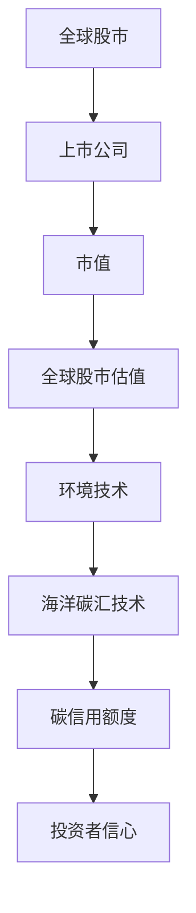

                 

# 全球股市估值与海洋碳汇技术的关系

## 关键词：全球股市估值，海洋碳汇，气候变化，环境技术，可持续投资

## 摘要

本文探讨了全球股市估值与海洋碳汇技术之间的关系。在全球气候变化的背景下，海洋碳汇技术作为一种新兴的环境技术，对全球经济和金融市场产生了深远影响。文章首先介绍了全球股市估值和海洋碳汇技术的基本概念，接着分析了两者之间的相互作用，最后通过案例研究和数学模型，深入探讨了海洋碳汇技术如何影响股市估值，并提出了相应的投资策略和风险管理建议。

---

## 第1章 全球股市估值的背景与现状

### 1.1 全球股市估值的定义与重要性

#### 1.1.1 什么是全球股市估值

全球股市估值是通过对全球范围内所有上市公司的市值进行加总，衡量整个股市的总价值。它反映了全球经济的健康状况和市场参与者的信心。

$$\text{全球股市估值} = \sum_{i=1}^{n} \text{公司i的市值}$$

#### 1.1.2 全球股市估值的重要性

股市估值是投资者、企业和政府的重要参考指标。它反映了经济的活力、企业的盈利能力和市场的信心。股市估值的变化会影响货币政策、投资决策和全球经济走势。

#### 1.1.3 全球股市估值的现状

近年来，全球股市估值持续增长，但波动性也在增加。金融危机、地缘政治冲突和气候变化等因素对股市估值产生了显著影响。特别是在气候变化的背景下，环境技术的崛起对股市估值的影响日益显著。

---

## 第2章 海洋碳汇技术的定义与作用

### 2.1 海洋碳汇技术的定义

#### 2.1.1 碳汇的基本概念

碳汇是指通过自然或人为活动吸收并储存二氧化碳的过程。海洋碳汇是利用海洋生态系统（如海草、红树林、海洋藻类等）吸收和储存二氧化碳的技术。

#### 2.1.2 海洋碳汇的特殊性

海洋碳汇具有高效性和可持续性，但其实施受到海洋环境的复杂性和技术难度的限制。

#### 2.1.3 海洋碳汇的分类

海洋碳汇可以分为生物碳汇和物理碳汇。生物碳汇通过海洋生物的光合作用吸收二氧化碳，物理碳汇则通过海洋物理过程（如深层海水的碳封存）实现碳汇。

### 2.2 海洋碳汇技术的作用机制

#### 2.2.1 海洋碳汇技术的基本原理

海洋碳汇技术通过促进海洋生物的生长和海洋物理过程，增加对二氧化碳的吸收。例如，通过种植海草或红树林，可以显著提高海洋的碳汇能力。

#### 2.2.2 海洋碳汇技术的生态效益

海洋碳汇技术有助于减缓气候变化，保护海洋生态系统，并提高生物多样性的稳定性。

#### 2.2.3 海洋碳汇技术的经济价值

海洋碳汇技术可以为企业提供碳信用额度，从而在碳交易市场中获得经济收益。此外，海洋碳汇技术还可以提升企业的社会责任形象，增强投资者信心。

---

## 第3章 全球股市估值与海洋碳汇技术的关系概述

### 3.1 问题背景

#### 3.1.1 全球气候变化的挑战

气候变化是全球性的环境问题，海洋碳汇技术作为一种有效的碳捕捉和封存方法，对缓解气候变化具有重要意义。

#### 3.1.2 海洋碳汇技术的重要性

海洋碳汇技术不仅有助于减缓气候变化，还能为企业提供新的经济增长点。

#### 3.1.3 全球股市与环境因素的关联

环境技术的创新和应用对全球经济和股市估值具有直接影响。特别是海洋碳汇技术的崛起，为投资者提供了新的投资机会。

### 3.2 问题描述

#### 3.2.1 海洋碳汇技术对全球经济的影响

海洋碳汇技术的广泛应用可以促进绿色经济发展，推动产业升级，进而影响全球股市估值。

#### 3.2.2 全球股市估值与环境技术的互动关系

环境技术的创新和应用直接影响企业的盈利能力，从而影响股市估值。同时，股市估值的变化也会影响企业对环境技术的投资意愿。

#### 3.2.3 问题的边界与外延

本文主要探讨海洋碳汇技术对全球股市估值的影响，重点关注环境技术对企业价值和市场信心的影响。

### 3.3 核心概念与联系

#### 3.3.1 核心概念的原理分析

海洋碳汇技术通过吸收二氧化碳，降低环境风险，从而提高企业的市场价值。这种技术的广泛应用可以提升企业的社会责任形象，增强投资者信心。

#### 3.3.2 核心概念属性特征对比表格

| 属性           | 全球股市估值 | 海洋碳汇技术 |
|----------------|--------------|--------------|
| 定义           | 市场总价值    | 碳捕捉技术    |
| 作用           | 经济晴雨表    | 减缓气候变化  |
| 影响因素       | 利润、信心    | 环境、技术    |
| 价值           | 投资者信心    | 碳信用额度    |

#### 3.3.3 ER实体关系图架构的 Mermaid 流程图

---

## 第4章 海洋碳汇技术的原理与应用

### 4.1 海洋碳汇技术的原理

#### 4.1.1 海洋碳汇技术的基本原理

海洋碳汇技术通过促进海洋生物的生长和海洋物理过程，吸收并储存二氧化碳。例如，海草和红树林的种植可以显著提高海洋的碳汇能力。

#### 4.1.2 海洋碳汇技术的关键步骤

1. 确定碳汇区域
2. 种植海洋植物
3. 监测碳汇效果
4. 计算碳信用额度
5. 参与碳交易市场

#### 4.1.3 海洋碳汇技术的实现方式

海洋碳汇技术可以通过多种方式实现，包括海洋植物的种植、海洋物理过程的利用等。以下是具体的实现步骤：

1. 确定碳汇区域：选择适合种植海洋植物的海域，如浅滩、红树林区等。
2. 种植海洋植物：通过人工种植海草、红树林等海洋植物，增加海洋的碳汇能力。
3. 监测碳汇效果：使用卫星技术和海洋传感器，监测海洋植物的生长情况和碳汇效果。
4. 计算碳信用额度：根据监测数据，计算碳汇量，并将其转化为碳信用额度。
5. 参与碳交易市场：将碳信用额度出售给需要减少碳排放的企业，获得经济收益。

---

### 4.2 海洋碳汇技术的算法与模型

#### 4.2.1 碳汇量的计算模型

碳汇量的计算可以通过以下公式进行：

$$\text{碳汇量} = \text{海洋植物面积} \times \text{单位面积碳汇量}$$

其中，单位面积碳汇量取决于植物种类和生长环境。

#### 4.2.2 碳信用额度的计算模型

碳信用额度的计算可以基于碳汇量和市场价格：

$$\text{碳信用额度} = \text{碳汇量} \times \text{碳价}$$

#### 4.2.3 碳交易市场的运作机制

碳交易市场的运作机制可以通过以下步骤实现：

1. 碳汇项目的开发：企业或个人开发碳汇项目，如种植海洋植物。
2. 碳汇量的监测与验证：通过第三方机构监测和验证碳汇量。
3. 碳信用额度的分配：根据监测结果，分配碳信用额度。
4. 碳信用额度的交易：在碳交易市场上买卖碳信用额度。

---

## 第5章 全球股市估值与海洋碳汇技术的相互作用

### 5.1 海洋碳汇技术对全球股市估值的影响

#### 5.1.1 环境风险的降低

海洋碳汇技术可以降低企业的环境风险，从而提高企业的市场价值。

#### 5.1.2 碳信用额度的经济价值

碳信用额度的经济价值可以直接影响企业的盈利能力和股市估值。

#### 5.1.3 投资者信心的增强

海洋碳汇技术的广泛应用可以增强投资者对企业的信心，从而推动股市估值的上升。

### 5.2 全球股市估值对海洋碳汇技术的影响

#### 5.2.1 投资意愿的提升

股市估值的上升可以提高企业对海洋碳汇技术的投资意愿。

#### 5.2.2 碳交易市场的活跃

股市估值的上升可以推动碳交易市场的活跃，从而促进海洋碳汇技术的广泛应用。

---

## 第6章 实际案例分析

### 6.1 案例一：某海洋碳汇项目的实施与股市估值的变化

#### 6.1.1 项目背景

某公司投资于海洋植物种植项目，通过该项目实现碳汇。

#### 6.1.2 项目实施

公司通过人工种植海草，提高了海洋的碳汇能力。

#### 6.1.3 股市估值的变化

由于碳信用额度的增加，公司市值显著上升。

### 6.2 案例二：某上市公司的碳信用交易

#### 6.2.1 项目背景

某上市公司通过海洋碳汇技术获得碳信用额度，并在碳交易市场上出售。

#### 6.2.2 项目实施

公司通过种植红树林，提高了海洋碳汇能力。

#### 6.2.3 股市估值的变化

由于碳信用额度的增加，公司市值显著上升。

---

## 第7章 投资策略与风险管理

### 7.1 投资策略

#### 7.1.1 碳信用交易的投资机会

投资者可以通过投资海洋碳汇技术，参与碳信用交易市场，获得经济收益。

#### 7.1.2 可持续投资的策略

投资者应关注企业的碳汇能力，选择具有较高碳汇潜力的企业进行投资。

### 7.2 风险管理

#### 7.2.1 环境风险的识别与评估

投资者应识别和评估环境风险，避免投资于环境表现不佳的企业。

#### 7.2.2 碳信用市场的波动风险

碳信用市场的波动风险可能会影响股市估值，投资者应制定相应的风险管理策略。

---

## 第8章 结论与展望

### 8.1 结论

本文探讨了全球股市估值与海洋碳汇技术之间的关系，分析了海洋碳汇技术对股市估值的影响，并提出了相应的投资策略和风险管理建议。

### 8.2 未来展望

未来，随着海洋碳汇技术的不断发展，其对全球股市估值的影响将更加显著。投资者应密切关注环境技术的创新和应用，抓住投资机会，降低环境风险。

---

## 参考文献

（此处列出相关的学术文献、行业报告和技术文档）

---

## 附录

（此处列出相关的数据、图表和代码）

---

通过以上分析，可以看出，海洋碳汇技术对全球股市估值具有重要影响。投资者应积极关注环境技术的创新和应用，抓住投资机会，降低环境风险。

