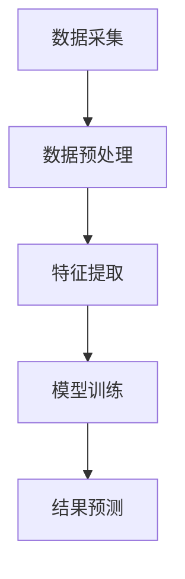
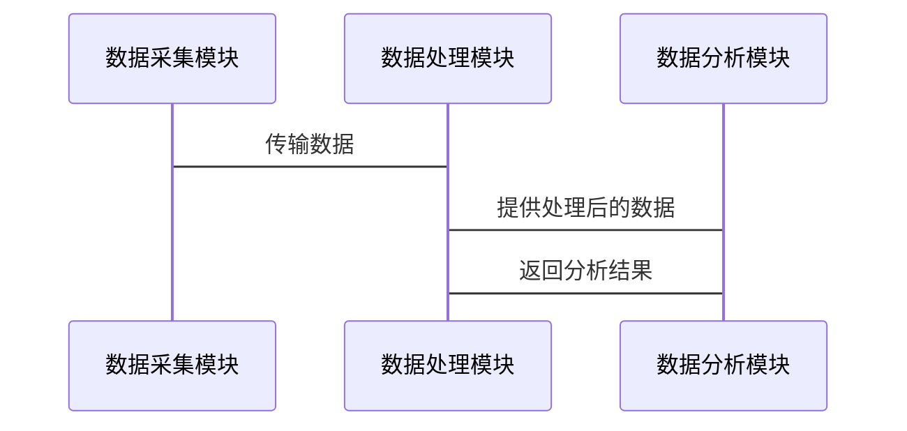

                 


```markdown
# 全球股市估值与海洋碳汇监测技术的关系

> 关键词：全球股市估值，海洋碳汇，监测技术，数据融合，气候变化，金融建模

> 摘要：本文探讨了全球股市估值与海洋碳汇监测技术之间的关系。通过分析股市估值的核心概念、海洋碳汇监测技术的基本原理，以及两者的关联性，提出了一种将碳汇数据与股市估值模型相结合的方法。文章详细介绍了算法原理、系统架构设计、项目实战案例，并总结了最佳实践建议。

---

# 第1章: 全球股市估值的现状与挑战

## 1.1 股市估值的核心概念
### 1.1.1 股市估值的基本定义
股市估值是通过对公司财务数据、市场环境和宏观经济指标的分析，估算公司股票的合理价格。常见的估值方法包括市盈率（P/E）、市净率（P/B）和股息率等。

### 1.1.2 当前股市估值的主要方法
1. **基本面分析**：通过公司财务报表、行业地位和竞争优势等进行估值。
2. **技术分析**：通过股票价格和交易量的历史数据预测未来走势。
3. **宏观经济分析**：考虑GDP、利率和通货膨胀等因素对股市的影响。

### 1.1.3 股市估值面临的挑战
1. **数据复杂性**：股市数据受到多种因素影响，难以准确预测。
2. **市场波动性**：突发事件和市场情绪可能导致估值偏差。
3. **信息不对称**：投资者获取信息的不均衡性影响估值的准确性。

## 1.2 海洋碳汇监测技术的概述
### 1.2.1 海洋碳汇的基本定义
海洋碳汇是指海洋生物通过光合作用吸收二氧化碳的过程，是应对气候变化的重要手段。

### 1.2.2 海洋碳汇监测技术的现状
1. **卫星遥感技术**：用于监测海洋生物量和碳汇能力。
2. **传感器网络**：部署海洋传感器实时采集环境数据。
3. **模型模拟**：利用生态模型预测碳汇变化。

### 1.2.3 海洋碳汇在气候变化中的作用
海洋碳汇有助于减缓气候变化，但其监测和评估仍面临技术难题。

## 1.3 问题背景与研究意义
### 1.3.1 问题背景的提出
随着气候变化的加剧，海洋碳汇的重要性日益凸显。然而，现有股市估值模型未能充分考虑碳汇数据的影响。

### 1.3.2 研究的必要性与意义
将海洋碳汇数据纳入股市估值模型，可以更准确地评估企业环境表现，为投资者提供更全面的决策依据。

### 1.3.3 本研究的核心目标与框架
本研究旨在构建一个结合海洋碳汇数据的股市估值模型，探索其在实际应用中的效果。

---

# 第2章: 核心概念与联系

## 2.1 核心概念的定义与属性
### 2.1.1 股市估值的属性特征
| 属性 | 特征 |
|------|------|
| 数据来源 | 财务报表、市场数据 |
| 方法 | 市盈率、市净率等 |
| 目标 | 估算股票价格 |

### 2.1.2 海洋碳汇监测技术的属性特征
| 属性 | 特征 |
|------|------|
| 数据来源 | 卫星遥感、传感器 |
| 方法 | 模型模拟、传感器网络 |
| 目标 | 监测碳汇能力 |

### 2.1.3 两者属性对比分析
通过对比分析，发现股市估值关注的是经济数据，而碳汇监测关注的是环境数据。两者在数据来源和目标上有明显差异，但在企业环境表现评估上有潜在联系。

## 2.2 实体关系图（ER图）
```mermaid
er
    MarineCarbonHabitat {
        name
        id
    }
    StockMarketIndex {
        index_name
        index_value
    }
    relationship: 海洋碳汇与股市估值 (1:many)
```

---

# 第3章: 算法原理与数学模型

## 3.1 算法原理
### 3.1.1 数据采集与预处理
1. 数据采集：获取股市数据和海洋碳汇数据。
2. 数据预处理：清洗数据，处理缺失值和异常值。

### 3.1.2 碳汇数据与股市数据的融合
将海洋碳汇数据与股市数据进行关联，构建综合数据集。

### 3.1.3 数据分析与建模
利用机器学习算法，如随机森林和神经网络，进行数据建模。

## 3.2 数学模型与公式
### 3.2.1 股市估值模型
$$ P = \frac{E}{k} $$
其中，P为股票价格，E为每股收益，k为折现率。

### 3.2.2 海洋碳汇监测模型
$$ C = a \cdot A + b \cdot B + c \cdot C $$
其中，C为碳汇能力，A、B、C为影响碳汇的关键因素，a、b、c为权重系数。

## 3.3 算法流程图


---

# 第4章: 系统分析与架构设计

## 4.1 系统功能设计
### 4.1.1 数据采集模块
负责采集股市和海洋碳汇数据。

### 4.1.2 数据处理模块
对数据进行清洗和预处理。

### 4.1.3 数据分析模块
利用机器学习算法进行建模和预测。

## 4.2 系统架构设计


## 4.3 系统接口设计
定义系统接口，确保各模块之间的数据交互顺畅。

## 4.4 系统交互序列图


---

# 第5章: 项目实战

## 5.1 环境安装
### 5.1.1 安装Python
```bash
pip install python
```

### 5.1.2 安装相关库
```bash
pip install numpy pandas scikit-learn
```

## 5.2 系统核心实现源代码
### 5.2.1 数据采集代码
```python
import pandas as pd
import numpy as np

def collect_data():
    # 示例代码，实际操作需根据具体数据源调整
    df_stock = pd.read_csv('stock_data.csv')
    df_carbon = pd.read_csv('carbon_data.csv')
    return df_stock, df_carbon
```

### 5.2.2 数据处理代码
```python
def preprocess_data(df_stock, df_carbon):
    # 数据清洗和预处理
    df_stock.dropna(inplace=True)
    df_carbon.dropna(inplace=True)
    return df_stock, df_carbon
```

### 5.2.3 数据分析代码
```python
from sklearn.ensemble import RandomForestRegressor

def build_model(df_stock, df_carbon):
    # 数据融合和建模
    combined_data = pd.merge(df_stock, df_carbon, on='id')
    model = RandomForestRegressor()
    model.fit(combined_data[['feature1', 'feature2']], combined_data['target'])
    return model
```

## 5.3 案例分析与解读
通过实际案例分析，验证模型的准确性和实用性。

## 5.4 项目小结
总结项目实施过程中的经验教训，提出改进建议。

---

# 第6章: 最佳实践与总结

## 6.1 小结
本文探讨了全球股市估值与海洋碳汇监测技术的关系，提出了将碳汇数据与股市估值模型相结合的方法。

## 6.2 注意事项
在实际应用中，需注意数据质量、模型优化和结果验证。

## 6.3 拓展阅读
推荐相关领域的书籍和论文，供读者进一步学习。

---

# 结语

通过本文的探讨，我们发现海洋碳汇监测技术可以为股市估值提供新的视角。未来，随着技术的进步，两者的结合将更加紧密，为投资者和环境管理者提供更有力的支持。
```

