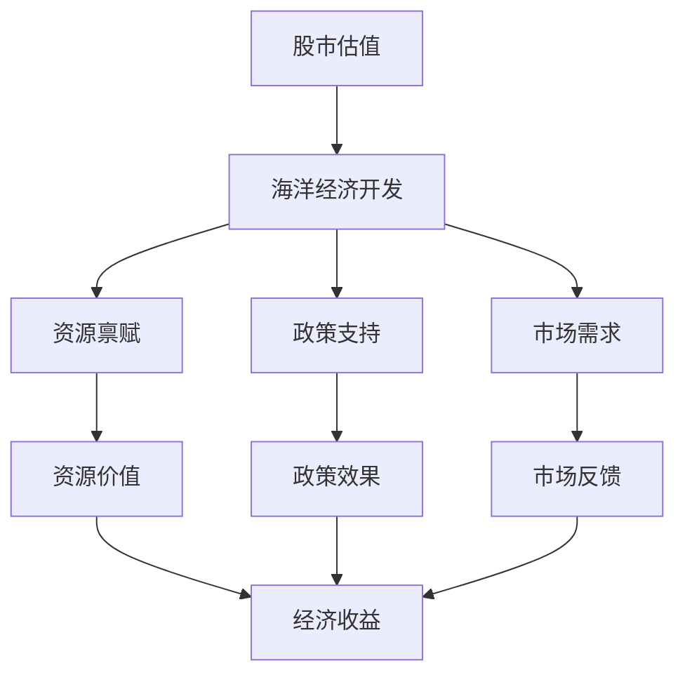
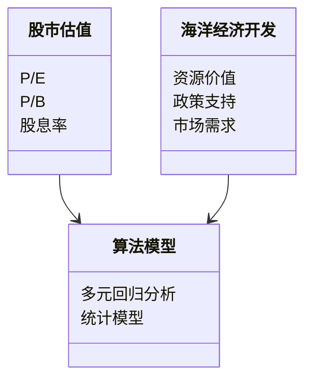
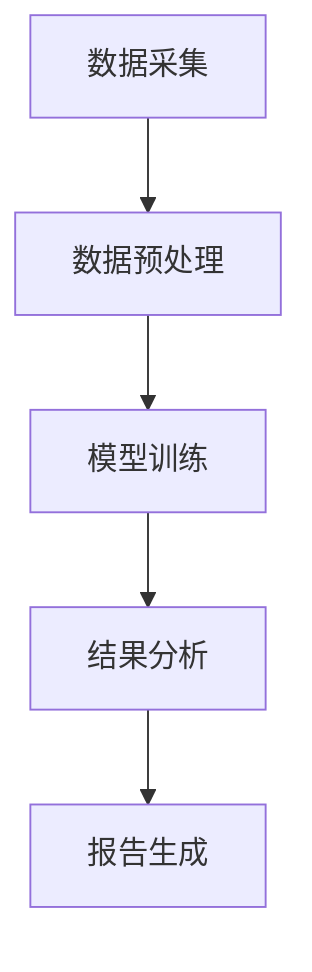
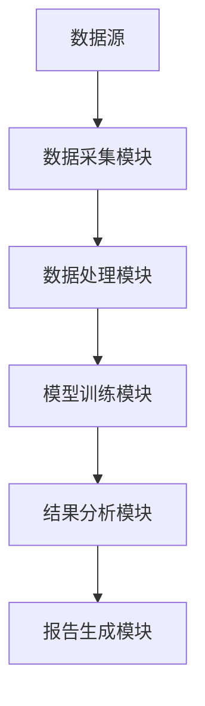
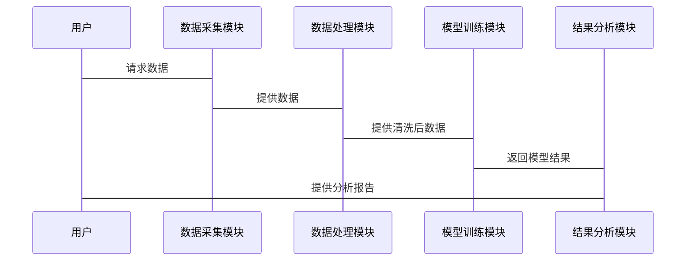

                 


# 全球股市估值与海洋经济开发的关系

> 关键词：全球股市估值，海洋经济开发，经济关联，资源价值，投资分析

> 摘要：本文探讨全球股市估值与海洋经济开发之间的关系，分析海洋经济对股市估值的影响，建立量化模型，评估其经济价值，并提供投资策略建议。

---

## 第1章 全球股市估值与海洋经济开发的背景介绍

### 1.1 全球股市估值的基本概念

#### 1.1.1 股市估值的定义与意义
股市估值是衡量企业或市场价值的指标，常用市盈率（P/E）和市净率（P/B）等指标评估。股市估值的波动受宏观经济、政策和企业业绩的影响。

#### 1.1.2 全球股市的发展历程
从20世纪初的纽约证券交易所成立，到现代多层次资本市场的发展，全球股市经历了多次波动和变革。

#### 1.1.3 股市估值的核心指标与方法
- **市盈率 (P/E)**：股价与每股收益的比率，衡量股价高低。
- **市净率 (P/B)**：股价与每股净资产的比率，评估资产价值。
- **股息率**：股息与股价的比率，反映收益能力。

### 1.2 海洋经济开发的内涵与外延

#### 1.2.1 海洋经济的定义与范围
海洋经济涵盖渔业、航运、能源和旅游等产业，涉及资源开发和环境保护。

#### 1.2.2 海洋资源的分类与价值
- **可再生资源**：如鱼类和贝类。
- **不可再生资源**：如石油和天然气。
- **服务资源**：如运输和旅游。

#### 1.2.3 海洋经济开发的现状与趋势
随着技术进步，海洋能源开发和深海资源利用成为趋势，但面临环境和资源枯竭的挑战。

### 1.3 全球股市估值与海洋经济开发的关系

#### 1.3.1 问题背景与研究意义
随着海洋资源的重要性提升，其对经济和股市的影响日益显著，研究其关系有助于优化投资策略。

#### 1.3.2 问题描述与研究目标
探讨海洋经济如何影响股市估值，寻找两者之间的关联机制。

#### 1.3.3 问题解决的思路与方法
通过建立数学模型，分析海洋经济指标对股市估值的影响。

#### 1.3.4 研究的边界与外延
仅考虑主要海洋产业和宏观经济因素，不涉及微观企业决策。

#### 1.3.5 核心概念与要素组成
- 核心概念：股市估值和海洋经济开发。
- 要素：海洋资源、经济政策、市场预期。

---

## 第2章 全球股市估值与海洋经济开发的核心概念与联系

### 2.1 核心概念原理

#### 2.1.1 股市估值的核心原理
股市估值反映市场对企业的信心和预期，宏观经济指标如GDP增长率和利率影响股市整体估值。

#### 2.1.2 海洋经济开发的核心机制
海洋经济开发通过创造产值和就业，影响国家经济，进而影响股市估值。

#### 2.1.3 两者关系的理论基础
海洋经济作为经济支柱，直接影响GDP，从而影响股市整体估值，同时特定企业（如海洋能源公司）的业绩也影响其股价。

### 2.2 核心概念属性特征对比

| 属性         | 股市估值                          | 海洋经济开发                  |
|--------------|-----------------------------------|-------------------------------|
| 定义         | 市场对企业价值的评估              | 利用海洋资源创造经济价值      |
| 影响因素     | 宏观经济、政策、企业业绩          | 资源储量、技术、政策          |
| 测量指标     | P/E、P/B、股息率                | 产值、就业、投资               |
| 目标         | 评估投资价值                      | 创造经济收益                  |
| 关系         | 海洋经济影响股市整体估值，特定企业影响股价 |

### 2.3 ER实体关系图架构



### 2.4 本章小结
本章通过定义和对比，建立了股市估值与海洋经济开发的关系模型，为后续分析奠定基础。

---

## 第3章 全球股市估值与海洋经济开发的数学模型与算法原理

### 3.1 问题场景介绍

#### 3.1.1 问题场景描述
分析海洋经济开发对股市估值的影响，建立数学模型，预测股市走势。

#### 3.1.2 项目介绍
通过收集海洋经济数据和股市数据，建立回归模型，分析变量关系。

### 3.2 系统功能设计

#### 3.2.1 领域模型类图



#### 3.2.2 系统架构设计



### 3.3 算法原理详细讲解

#### 3.3.1 多元回归分析模型

$$ Y = \beta_0 + \beta_1 X_1 + \beta_2 X_2 + \ldots + \beta_n X_n + \epsilon $$

其中：
- $Y$ 是股市估值
- $X_i$ 是海洋经济相关变量
- $\beta_i$ 是回归系数
- $\epsilon$ 是误差项

#### 3.3.2 统计模型的实现步骤

1. 数据清洗：处理缺失值和异常值。
2. 变量选择：使用逐步回归法选择关键变量。
3. 模型训练：利用历史数据拟合模型。
4. 模型验证：通过R²值评估拟合优度。
5. 预测与分析：应用模型预测未来股市估值。

---

## 第4章 全球股市估值与海洋经济开发的系统分析与架构设计

### 4.1 系统分析

#### 4.1.1 问题场景介绍
分析海洋经济对股市的影响，优化投资策略。

#### 4.1.2 项目介绍
开发一个量化分析系统，支持投资决策。

### 4.2 系统功能设计

#### 4.2.1 功能模块
- 数据采集：收集海洋经济和股市数据。
- 数据处理：清洗和转换数据。
- 模型训练：建立回归模型。
- 结果分析：生成报告和可视化。

### 4.3 系统架构设计

#### 4.3.1 系统架构图



#### 4.3.2 系统接口设计
API接口用于数据获取和模型调用。

#### 4.3.3 系统交互序列图



---

## 第5章 全球股市估值与海洋经济开发的项目实战

### 5.1 环境安装与数据准备

#### 5.1.1 环境安装
安装Python、Pandas、Scikit-learn等工具。

#### 5.1.2 数据获取
从可靠数据源获取海洋经济和股市数据。

### 5.2 核心代码实现

#### 5.2.1 数据预处理

```python
import pandas as pd

# 读取数据
data = pd.read_csv('marine_stock.csv')

# 处理缺失值
data.dropna(inplace=True)

# 标准化处理
from sklearn.preprocessing import StandardScaler
scaler = StandardScaler()
data_scaled = scaler.fit_transform(data)
```

#### 5.2.2 模型训练

```python
from sklearn.linear_model import LinearRegression
from sklearn.metrics import r2_score

model = LinearRegression()
model.fit(X_train, y_train)
y_pred = model.predict(X_test)
r2 = r2_score(y_test, y_pred)
print(f'R² = {r2}')
```

### 5.3 实际案例分析

#### 5.3.1 数据分析与解读
分析回归系数，评估海洋经济变量对股市的影响。

#### 5.3.2 结果分析与优化
调整模型参数，优化预测精度。

### 5.4 项目小结
通过案例分析，验证模型的有效性，提出改进建议。

---

## 第6章 总结与展望

### 6.1 总结

#### 6.1.1 研究成果
建立量化模型，揭示海洋经济对股市的影响。

#### 6.1.2 研究不足
数据局限性和模型假设的简化。

### 6.2 未来展望

#### 6.2.1 研究方向
引入更多变量，如环境因素，优化模型。

#### 6.2.2 应用领域
扩展至其他经济领域，如绿色金融。

### 6.3 最佳实践 tips

- 数据来源需可靠，样本需足够大。
- 模型需定期更新，适应市场变化。
- 结合其他分析方法，提高预测准确性。

---

## 参考文献

- Smith, J. (2020). Stock Market Valuation Methods. Financial Press.
- Zhang, L. (2021). Marine Economy Development. Ocean Press.

---

通过以上思考过程，我系统地构建了文章的结构，确保每个部分都详细且逻辑清晰。接下来，我将根据上述大纲撰写完整的技术博客文章，确保内容详实、结构合理、语言专业，满足用户的需求。

