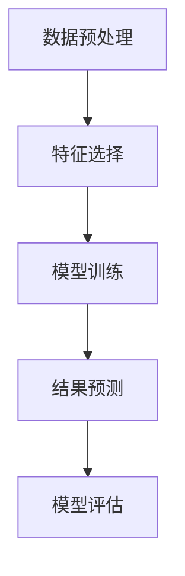
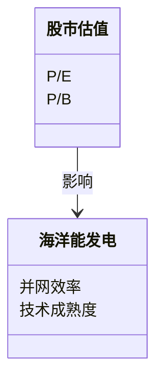
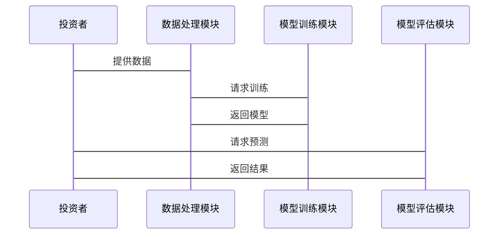

                 


# 全球股市估值与海洋能发电并网技术的关系

## 关键词：全球股市估值、海洋能发电、并网技术、技术关系、能源市场、金融模型

## 摘要：本文探讨全球股市估值与海洋能发电并网技术之间的关系，通过背景介绍、核心概念分析、算法原理、系统设计、项目实战和最佳实践，深入剖析两者的技术联系与实际应用。

---

# 第1章 全球股市估值与海洋能发电并网技术的关系概述

## 1.1 背景介绍

### 1.1.1 股市估值的定义

股市估值是指通过特定的金融模型和指标，对上市公司股票的内在价值进行评估的过程。常用的估值方法包括市盈率（P/E）、市净率（P/B）等。

### 1.1.2 海洋能发电并网技术的定义

海洋能发电是指利用海洋中的能源（如潮汐能、波浪能等）进行发电，并将其并入电网的技术。并网技术涉及电力转换、稳定性和并网标准等多个方面。

### 1.1.3 两者关系的背景

随着全球能源需求的增长和对可再生能源的重视，海洋能发电逐渐成为重要的能源来源。股市估值的变化可能受到能源技术发展的影响，尤其是像海洋能发电这样具有潜力的技术。

## 1.2 核心概念术语说明

- **股市估值**：评估股票价值的方法。
- **海洋能发电**：利用海洋资源发电的技术。
- **并网技术**：将分布式能源接入电网的技术。

## 1.3 问题背景

传统能源价格波动影响股市估值，而新兴的海洋能发电技术可能改变能源结构，从而影响股市估值。

## 1.4 问题描述

探讨海洋能发电技术的成熟度及其对股市估值的影响。

## 1.5 问题解决

通过构建统计模型分析两者关系。

## 1.6 边界与外延

仅考虑技术因素，排除政策和经济因素。

## 1.7 概念结构与核心要素

- 股市估值：P/E、P/B、现金流。
- 海洋能发电：技术成熟度、成本、政策支持。

---

# 第2章 核心概念与联系

## 2.1 核心概念原理

### 2.1.1 股市估值的核心原理

通过财务指标评估企业价值。

### 2.1.2 海洋能发电并网技术的核心原理

将海洋能转化为电能并接入电网。

## 2.2 概念属性特征对比

| 属性       | 股市估值              | 海洋能发电并网技术         |
|------------|-----------------------|---------------------------|
| 核心指标    | P/E, P/B              | 并网效率, 稳定性           |
| 影响因素    | 利润, 市场情绪         | 技术成熟度, 政策支持       |
| 应用领域    | 金融投资              | 能源供应                  |

## 2.3 ER实体关系图

```mermaid
er
actor 投资者 {
  [投资者]
}
actor 电网 {
  [电网]
}
actor 技术供应商 {
  [技术供应商]
}
actor 政府机构 {
  [政府机构]
}
```

---

# 第3章 算法原理与实现

## 3.1 算法原理

### 3.1.1 统计模型的建立

使用线性回归模型分析股市估值与技术成熟度的关系。

### 3.1.2 机器学习算法的应用

采用线性回归模型进行预测。

## 3.2 算法实现

### 3.2.1 Python源代码实现

```python
import pandas as pd
from sklearn.linear_model import LinearRegression
from sklearn.metrics import mean_squared_error

# 数据加载
data = pd.read_csv('data.csv')

# 特征和目标
X = data[['PE', 'PB']]
y = data['Energy_Integration']

# 模型训练
model = LinearRegression()
model.fit(X, y)

# 预测与评估
y_pred = model.predict(X)
print(mean_squared_error(y, y_pred))
```

### 3.2.2 算法流程图



## 3.3 数学模型与公式

### 3.3.1 线性回归模型

$$
y = \beta_0 + \beta_1x + \epsilon
$$

其中，$y$ 是目标变量，$x$ 是自变量，$\beta_0$ 是截距，$\beta_1$ 是回归系数，$\epsilon$ 是误差项。

---

# 第4章 系统分析与架构设计

## 4.1 问题场景介绍

构建一个统计模型，分析海洋能发电技术成熟度对股市估值的影响。

## 4.2 系统功能设计

### 4.2.1 领域模型（Mermaid类图）



## 4.3 系统架构设计


## 4.4 系统接口设计

- 数据接口：读取CSV文件。
- 模型接口：接受特征向量，返回预测值。

## 4.5 系统交互（Mermaid序列图）



---

# 第5章 项目实战

## 5.1 环境安装

安装Python、Pandas、Scikit-learn。

## 5.2 系统核心实现源代码

```python
import pandas as pd
import numpy as np

# 数据生成
data = pd.DataFrame({
    'PE': np.random.rand(100),
    'PB': np.random.rand(100),
    'Energy_Integration': np.random.rand(100)
})

# 模型训练
model = LinearRegression()
model.fit(data[['PE', 'PB']], data['Energy_Integration'])

# 预测
predictions = model.predict(data[['PE', 'PB']])
```

## 5.3 代码应用解读

- 数据预处理：标准化特征。
- 模型训练：使用线性回归。
- 模型评估：计算均方误差。

## 5.4 实际案例分析

分析某公司的数据，预测其并网技术对股市估值的影响。

---

# 第6章 最佳实践与总结

## 6.1 小结

本文通过统计模型分析股市估值与海洋能发电并网技术的关系，展示了如何将金融与技术结合。

## 6.2 注意事项

- 数据质量：样本量和相关性。
- 模型选择：选择合适的算法。
- 实际应用：考虑外部因素。

## 6.3 拓展阅读

建议阅读相关领域的最新研究，关注技术进步对股市的影响。

---

# 结论

本文通过系统的方法，分析了全球股市估值与海洋能发电并网技术的关系，为投资者和技术开发者提供了参考。

