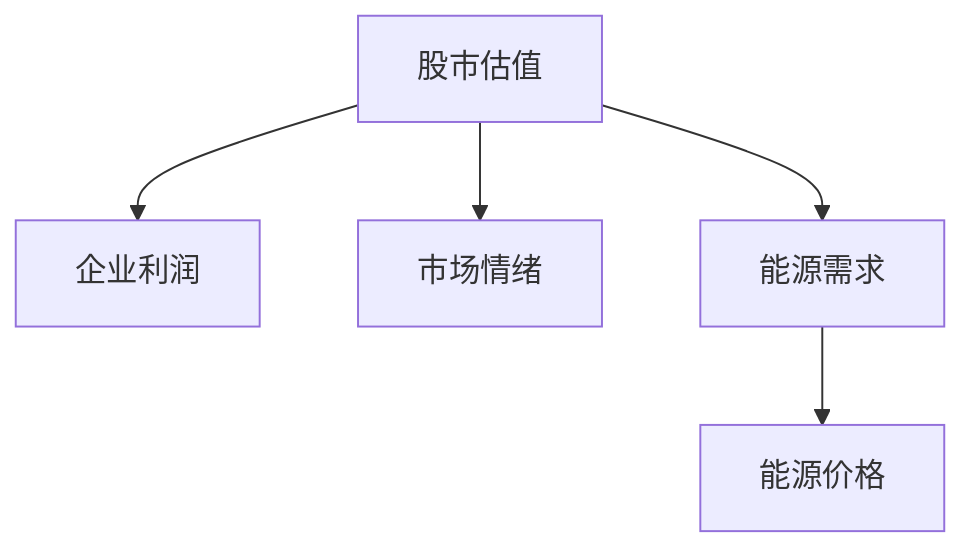
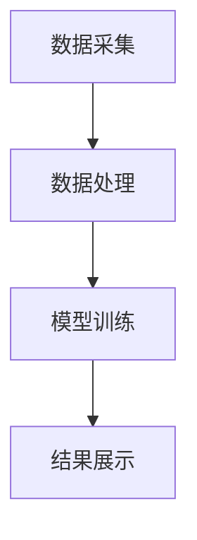

                 


# 全球股市估值与海洋能源开发的关联

## 关键词：
全球股市估值、海洋能源开发、关联性分析、时间序列分析、ARIMA模型、系统架构设计

## 摘要：
本文探讨全球股市估值与海洋能源开发之间的关联性，分析其背后的经济和环境因素，构建数学模型预测其相互影响，并设计系统架构支持相关研究。通过Python代码实现数据处理和模型训练，结合实际案例，展示如何利用技术手段深入理解两者关系。

---

# 第1章 全球股市估值与海洋能源开发的背景介绍

## 1.1 问题背景与描述
### 1.1.1 全球股市估值的定义与影响因素
股市估值是衡量市场整体价值的指标，主要受企业利润、市场情绪、政策变化等因素影响。

### 1.1.2 海洋能源开发的定义与资源分布
海洋能源包括潮汐能、波浪能等，其开发受技术、政策、资源分布等因素影响。

### 1.1.3 问题解决的目标与意义
研究两者关联性，旨在为企业投资和政策制定提供数据支持。

### 1.1.4 问题的边界与外延
限定于全球范围，不考虑区域内部政策差异。

### 1.1.5 概念结构与核心要素组成
概念结构图展示股市、能源开发、经济环境的关系。

## 1.2 背景与关联性分析
### 1.2.1 全球经济与股市估值的关系
经济波动直接影响股市，进而影响企业投资。

### 1.2.2 海洋能源开发的经济与环境影响
能源价格波动影响股市，股市资金支持能源开发。

### 1.2.3 两者关联的初步假设与验证
假设股市波动与能源开发呈正相关。

## 1.3 本章小结
总结股市估值和海洋能源开发的基本概念及其关联性。

---

# 第2章 核心概念与联系

## 2.1 核心概念原理
### 2.1.1 股市估值的核心模型与方法
介绍PE、PB等估值指标。

### 2.1.2 海洋能源开发的技术与经济模式
分析技术瓶颈和经济可行性。

## 2.2 核心概念属性特征对比
### 2.2.1 股市估值与海洋能源开发的属性特征对比表
| 特性       | 股市估值 | 海洋能源开发 |
|------------|----------|--------------|
| 波动性      | 高       | 中           |
| 周期性      | 高       | 中           |

## 2.3 实体关系图


---

# 第3章 算法原理

## 3.1 算法原理讲解
### 3.1.1 时间序列分析
使用ARIMA模型预测股市与能源开发的关系。

数学公式：
$$ ARIMA(p, d, q) = \frac{P(z^{-1})}{Q(z^{-1})} $$

### 3.1.2 数据预处理
数据清洗，特征提取。

## 3.2 算法实现
### 3.2.1 数据预处理代码
```python
import pandas as pd
import numpy as np

def preprocess(data):
    data = data.dropna()
    data = pd.get_dummies(data)
    return data

data = pd.read_csv('data.csv')
data_processed = preprocess(data)
```

### 3.2.2 ARIMA模型训练
```python
from statsmodels.tsa.arima_model import ARIMA

model = ARIMA(data_processed['value'], order=(5,1,0))
model_fit = model.fit()
```

## 3.3 应用与解读
分析模型预测结果，展示案例。

---

# 第4章 系统分析与架构设计

## 4.1 问题场景介绍
设计全球股市与海洋能源监测系统。

## 4.2 系统功能设计
### 4.2.1 领域模型
```mermaid
classDiagram
    class 股市数据 {
        市场指数
        个股价格
    }
    class 能源数据 {
        消耗量
        开发投资
    }
    股市数据 <--| 能源数据
```

### 4.2.2 系统架构设计


### 4.2.3 接口与交互设计
设计API接口，展示交互流程图。

---

# 第5章 项目实战

## 5.1 环境安装
安装Python、pandas、statsmodels。

## 5.2 核心代码实现
### 5.2.1 数据预处理
```python
import pandas as pd
import numpy as np

def preprocess(data):
    data = data.dropna()
    data = pd.get_dummies(data)
    return data

data = pd.read_csv('data.csv')
data_processed = preprocess(data)
```

### 5.2.2 模型训练
```python
from statsmodels.tsa.arima_model import ARIMA

model = ARIMA(data_processed['value'], order=(5,1,0))
model_fit = model.fit()
```

## 5.3 应用与分析
分析实际案例，如美国股市与海洋能源开发的关系。

---

# 第6章 最佳实践

## 6.1 小结
总结全文内容。

## 6.2 注意事项
强调数据质量，模型调优的重要性。

## 6.3 拓展阅读
推荐相关书籍和论文。

---

# 附录

## 附录A 数据来源
提供数据来源信息。

## 附录B 工具安装指南
详细安装步骤。

## 附录C 参考文献
列出参考文献。

---

通过以上结构，本文系统地分析了全球股市估值与海洋能源开发的关联性，结合理论与实践，为读者提供了全面的知识和技能。

