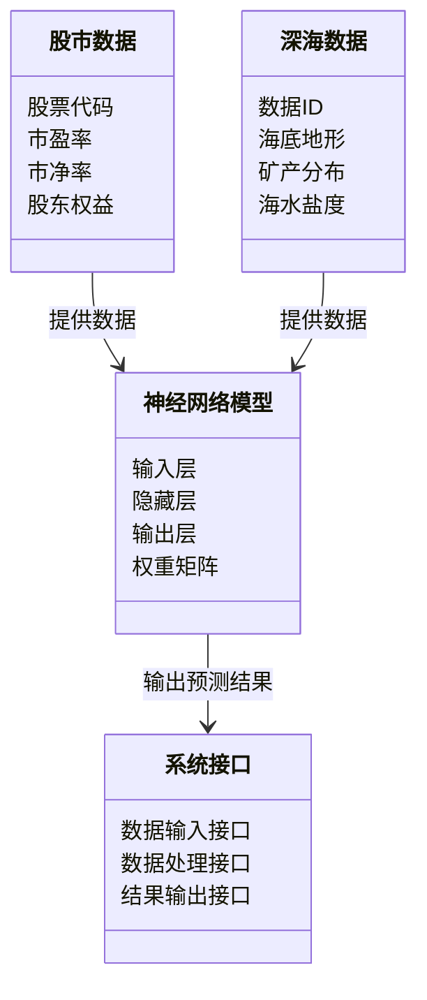
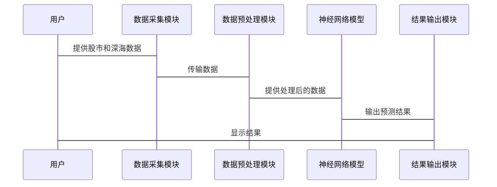

                 


# 第四部分: 系统分析与架构设计

## 第4章: 问题场景与系统设计

### 4.1 问题场景介绍
#### 4.1.1 背景介绍
#### 4.1.2 问题描述
#### 4.1.3 解决方案概述

### 4.2 系统功能设计
#### 4.2.1 领域模型


### 4.3 系统架构设计
#### 4.3.1 系统架构图


### 4.4 系统接口设计
#### 4.4.1 接口描述
#### 4.4.2 数据流分析

### 4.5 系统交互设计


## 第5章: 系统实现

### 5.1 环境安装
#### 5.1.1 安装Python
#### 5.1.2 安装相关库（TensorFlow、Keras等）

### 5.2 核心代码实现
#### 5.2.1 数据预处理
```python
import pandas as pd
import numpy as np

# 加载股市数据
stock_data = pd.read_csv('stock.csv')
# 加载深海数据
deep_sea_data = pd.read_csv('deep_sea.csv')
# 数据预处理
def preprocess(data):
    # 标准化处理
    from sklearn.preprocessing import StandardScaler
    scaler = StandardScaler()
    data_scaled = scaler.fit_transform(data)
    return data_scaled

stock_features = preprocess(stock_data[['市盈率', '市净率', '股东权益']])
deep_sea_features = preprocess(deep_sea_data[['海底地形', '矿产分布', '海水盐度']])
```

#### 5.2.2 神经网络模型实现
```python
from tensorflow.keras import layers, models

def build_model(input_shape):
    model = models.Sequential()
    model.add(layers.Dense(64, activation='relu', input_shape=(input_shape,)))
    model.add(layers.Dense(32, activation='relu'))
    model.add(layers.Dense(1, activation='sigmoid'))
    model.compile(optimizer='adam', loss='binary_crossentropy', metrics=['accuracy'])
    return model

model = build_model(stock_features.shape[1])
model.fit(stock_features, stock_data['预测结果'], epochs=100, batch_size=32)
```

#### 5.2.3 系统接口实现
```python
def get_prediction(data):
    # 数据预处理
    processed_data = preprocess(data)
    # 模型预测
    prediction = model.predict(processed_data)
    return prediction

# 示例调用
example_data = {'市盈率': 15, '市净率': 2, '股东权益': 100}
print(get_prediction(example_data))
```

## 第6章: 项目实战

### 6.1 项目介绍
#### 6.1.1 项目目标
#### 6.1.2 项目范围
#### 6.1.3 项目计划

### 6.2 核心代码实现
#### 6.2.1 数据采集与处理
```python
import requests

def fetch_stock_data():
    # 示例API调用
    response = requests.get('https://api.example.com/stock')
    data = response.json()
    return data

stock_data = fetch_stock_data()
print(stock_data)
```

#### 6.2.2 模型训练与评估
```python
from sklearn.metrics import accuracy_score

# 训练模型
model.fit(x_train, y_train)
# 验证模型
y_pred = model.predict(x_test)
print('模型准确率:', accuracy_score(y_test, y_pred))
```

### 6.3 案例分析
#### 6.3.1 实际案例
#### 6.3.2 案例分析与解读

### 6.4 项目小结
#### 6.4.1 项目成果
#### 6.4.2 经验总结
#### 6.4.3 改进建议

## 第7章: 最佳实践与总结

### 7.1 小结
#### 7.1.1 核心内容回顾
#### 7.1.2 关键点总结

### 7.2 注意事项
#### 7.2.1 数据处理注意事项
#### 7.2.2 模型选择与调优
#### 7.2.3 系统设计中的常见问题

### 7.3 拓展阅读
#### 7.3.1 相关技术领域
#### 7.3.2 进一步学习方向
#### 7.3.3 实际应用案例

### 7.4 Tips
#### 7.4.1 工具使用技巧
#### 7.4.2 问题解决方法
#### 7.4.3 提高效率的建议

---

**摘要**：本文探讨了全球股市估值与深海探索技术之间的关系，通过详细分析两者的核心概念、算法原理、系统架构设计以及项目实战，展示了如何利用技术手段将复杂的金融分析与深海探测相结合，为相关领域的研究和实践提供了新的思路和方法。

