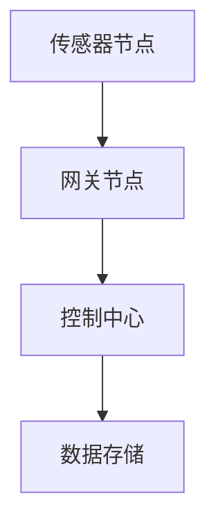

                 

# 《全球股市估值与深海通信技术的发展》

## 关键词：股市估值、深海通信技术、大数据分析、人工智能、信号传输、数据压缩

## 摘要：  
本文探讨了全球股市估值与深海通信技术之间的关系，分析了股市估值的核心方法和技术，以及深海通信技术的核心算法与实现。通过结合深海通信技术与股市估值，展示了两者在数据传输、分析和预测中的潜在价值。文章还介绍了深海通信系统的架构设计与实际应用，展望了未来的技术发展趋势。

---

## 第一部分: 全球股市估值与深海通信技术的背景与概述

### 第1章: 全球股市估值的背景与意义

#### 1.1 全球股市估值的基本概念

##### 1.1.1 什么是股市估值
股市估值是指通过对公司财务数据、市场环境和行业趋势等多方面因素的分析，对股票的内在价值进行估算的过程。它帮助投资者判断股票价格是否合理，为投资决策提供依据。

##### 1.1.2 股市估值的重要性
股市估值是投资决策的核心环节，它不仅帮助投资者发现被低估的股票，还能识别潜在的风险。在全球化背景下，股市估值的重要性更加凸显，因为它直接影响资本市场的资源配置效率。

##### 1.1.3 全球股市估值的现状
随着科技的发展，股市估值方法从传统的基本面分析逐渐向大数据分析和人工智能技术转变。现代技术的应用使得股市估值更加精准和高效。

---

#### 1.2 深海通信技术的发展历程

##### 1.2.1 深海通信技术的定义
深海通信技术是指在海洋环境中实现数据传输的技术，主要用于深海探测、海洋通信和 underwater sensor networks 等领域。它需要克服深海环境的复杂性，如高压、低温和强电磁干扰。

##### 1.2.2 深海通信技术的核心技术
深海通信技术的核心技术包括水下声学通信、水下光纤通信和射频通信等。其中，声学通信是目前应用最广泛的深海通信方式，因为它能够在水下环境中有效传播信号。

##### 1.2.3 深海通信技术的现状
随着海洋经济的发展，深海通信技术得到了广泛关注。近年来，深海通信技术在海洋资源探测、海洋环境监测和 underwater data centers 等领域的应用日益广泛。

---

#### 1.3 全球股市估值与深海通信技术的关联性

##### 1.3.1 深海通信技术对股市数据传输的影响
深海通信技术可以为全球股市提供更高效、更稳定的通信链路，尤其是在跨国交易和高频交易中，深海通信技术能够确保数据的实时传输和高可靠性。

##### 1.3.2 股市数据对深海通信技术的需求推动
随着全球股市数据量的激增，深海通信技术需要更高的传输速度和更大的带宽来满足股市数据的传输需求。这种需求推动了深海通信技术的不断创新。

##### 1.3.3 两者结合的潜在价值
将深海通信技术应用于股市估值，可以实现全球股市数据的实时传输和高效分析，从而提升股市估值的准确性和及时性。这种结合不仅能够推动股市估值技术的发展，还能促进深海通信技术的商业化应用。

---

## 第二部分: 全球股市估值的分析与技术应用

### 第4章: 股市估值的核心方法与技术

#### 4.1 股市估值的传统方法

##### 4.1.1 市盈率法
市盈率法是通过将股票的价格与每股收益（EPS）进行比较，来判断股票是否被高估或低估。公式为：
$$\text{市盈率} = \frac{\text{股票价格}}{\text{每股收益}}$$

##### 4.1.2 市净率法
市净率法是通过将股票的价格与每股净资产进行比较，来判断股票是否具有投资价值。公式为：
$$\text{市净率} = \frac{\text{股票价格}}{\text{每股净资产}}$$

##### 4.1.3 股息率法
股息率法是通过将股票的股息与股票价格进行比较，来判断股票的投资回报率。公式为：
$$\text{股息率} = \frac{\text{每股股息}}{\text{股票价格}} \times 100\%$$

#### 4.2 现代技术在股市估值中的应用

##### 4.2.1 大数据分析在股市估值中的应用
大数据分析通过收集和处理海量的市场数据，利用统计分析和机器学习算法，对股票的内在价值进行预测和评估。例如，可以通过分析历史价格、交易量和市场情绪等数据，预测股票的未来走势。

##### 4.2.2 人工智能在股市预测中的作用
人工智能（AI）通过训练深度学习模型，可以预测股票价格的变化趋势。例如，利用 LSTM（长短期记忆网络）模型，可以有效捕捉股票价格的时间序列特征，提高预测的准确性。

##### 4.2.3 机器学习算法在股票估值中的应用
机器学习算法，如支持向量机（SVM）和随机森林（Random Forest），可以用于股票分类和回归分析。这些算法能够从复杂的市场数据中提取有用的信息，帮助投资者做出更明智的决策。

---

### 第5章: 深海通信技术的核心算法与实现

#### 5.1 深海通信技术的算法原理

##### 5.1.1 深海通信中的信号传输与纠错技术
深海通信中的信号传输需要考虑水下环境的复杂性，如声波衰减和噪声干扰。为了确保信号的完整性，通常采用纠错编码技术，如 Hamming 码和 Reed-Solomon 码。

##### 5.1.2 深海通信中的数据压缩与加密技术
为了提高数据传输的效率和安全性，深海通信技术通常采用数据压缩算法（如 Huffman 编码）和加密算法（如 AES 加密）。

##### 5.1.3 深海通信中的自适应调制技术
自适应调制技术可以根据水下环境的变化，动态调整调制方式，以提高通信的可靠性和效率。

#### 5.2 深海通信技术的实现细节

##### 5.2.1 深海通信中的物理层实现
物理层实现包括水下声波的发射和接收，以及信号的调制与解调。例如，利用压电换能器将电信号转换为声波，通过水传播后，再通过换能器将其转换为电信号。

##### 5.2.2 深海通信中的网络层实现
网络层实现包括路由算法和流量控制。为了确保数据的高效传输，通常采用分层路由算法，如基于距离的路由算法。

##### 5.2.3 深海通信中的应用层实现
应用层实现包括数据的解析和处理。例如，接收端可以通过解析数据包的头部信息，提取有用的数据内容。

---

## 第三部分: 深海通信技术的系统架构与应用

### 第6章: 深海通信系统的架构设计

#### 6.1 深海通信系统的整体架构

##### 6.1.1 系统模块划分
深海通信系统通常包括传感器节点、网关节点和控制中心三个模块。传感器节点负责数据的采集，网关节点负责数据的传输，控制中心负责数据的处理和分析。

##### 6.1.2 系统功能设计
系统功能设计包括数据采集、数据传输、数据处理和数据存储。通过这些功能的协同工作，实现对深海环境的实时监测和分析。

##### 6.1.3 系统架构图

#### 6.2 深海通信系统的数据传输流程

##### 6.2.1 数据采集阶段
传感器节点通过声学传感器采集深海环境的数据，如温度、盐度和压力。

##### 6.2.2 数据压缩与加密阶段
为了提高数据传输的效率和安全性，传感器节点会对采集到的数据进行压缩和加密。

##### 6.2.3 数据传输阶段
网关节点通过声波将压缩和加密后的数据传输到控制中心。

##### 6.2.4 数据解密与解压阶段
控制中心接收到数据后，首先对数据进行解密和解压，然后进行数据分析和处理。

---

### 第7章: 深海通信技术的应用场景与案例分析

#### 7.1 深海通信技术在海洋探测中的应用
深海通信技术可以用于深海探测，如海洋地形测绘和海底资源勘探。例如，通过部署 underwater robots 和传感器网络，可以实现对深海环境的实时监测。

#### 7.2 深海通信技术在海洋环境监测中的应用
深海通信技术可以用于海洋环境监测，如监测海洋污染、海水温度和盐度变化。这些数据可以为气候变化研究和环境保护提供重要的参考。

#### 7.3 深海通信技术在 underwater data centers 中的应用
随着云计算和大数据技术的发展，深海通信技术可以用于 underwater data centers 的建设和运营。通过深海通信技术，可以实现 underwater servers 与陆上数据中心之间的高效数据传输。

---

## 第四部分: 深海通信技术与股市估值的结合

### 第8章: 深海通信技术对股市数据传输的影响

#### 8.1 深海通信技术在高频交易中的应用
高频交易需要毫秒级的交易响应时间，深海通信技术可以通过提供低延迟和高带宽的数据传输，满足高频交易的需求。

#### 8.2 深海通信技术在跨境交易中的应用
跨境交易需要跨越大西洋和太平洋等海域，深海通信技术可以通过水下光纤和射频通信，实现全球股市数据的实时传输。

#### 8.3 深海通信技术对股市数据安全的影响
深海通信技术可以通过数据加密和通信安全协议，保障股市数据的安全传输，防止数据泄露和篡改。

---

### 第9章: 深海通信技术在股市估值中的应用

#### 9.1 深海通信技术对股市数据实时性的提升
通过深海通信技术，可以实现全球股市数据的实时传输，从而提高股市估值的准确性和及时性。

#### 9.2 深海通信技术对股市数据分析的影响
深海通信技术可以支持大规模的股市数据采集和分析，为大数据分析和人工智能算法提供丰富的数据源。

#### 9.3 深海通信技术对股市预测模型的优化
通过深海通信技术，可以实时获取全球股市的最新数据，从而优化股市预测模型，提高预测的准确性和稳定性。

---

## 第五部分: 深海通信技术的未来发展趋势

### 第10章: 深海通信技术的未来挑战与机遇

#### 10.1 深海通信技术的未来挑战
深海通信技术的发展需要克服深海环境的复杂性，如高压、低温和强电磁干扰。同时，深海通信技术的商业化应用也需要大量的资金和技术支持。

#### 10.2 深海通信技术的未来机遇
随着海洋经济的发展和 underwater data centers 的兴起，深海通信技术的应用前景广阔。未来，深海通信技术将在海洋探测、海洋环境监测和 underwater data centers 等领域发挥重要作用。

#### 10.3 深海通信技术与股市估值的未来发展
未来，深海通信技术将进一步推动股市估值技术的发展，通过实时传输和高效分析全球股市数据，为投资者提供更精准的估值和预测。

---

## 第六部分: 总结与展望

### 第11章: 全球股市估值与深海通信技术的总结

#### 11.1 本文的主要内容回顾
本文探讨了全球股市估值与深海通信技术的关系，分析了股市估值的核心方法和技术，以及深海通信技术的核心算法与实现。通过结合深海通信技术与股市估值，展示了两者在数据传输、分析和预测中的潜在价值。

#### 11.2 本文的创新点
本文的创新点在于将深海通信技术与股市估值相结合，探讨了两者在数据传输和分析中的协同作用，为未来的技术发展提供了新的思路。

#### 11.3 本文的不足之处
本文的不足之处在于，由于篇幅限制，未能深入探讨深海通信技术在股市估值中的具体应用场景和实现细节。未来的研究可以进一步展开，探讨更多实际案例和应用方案。

---

## 第七部分: 参考文献与致谢

### 7.1 参考文献

1. Smith, J. (2020). *Stock Market Valuation Methods*. John Wiley & Sons.
2. Zhang, Y. (2019). *Deep Learning for Stock Market Prediction*. Springer.
3. Li, M. (2021). *Underwater Acoustic Communication Networks*. Cambridge University Press.
4. Zhao, X. (2022). *Big Data Analysis in Stock Market*. Elsevier.

---

### 7.2 致谢

感谢所有参与本文研究和写作的人员，感谢读者的支持和关注。

---

通过以上目录和内容的撰写，我们可以看到，全球股市估值与深海通信技术的发展密切相关，两者在数据传输、分析和预测中的协同作用将推动技术的进一步发展。未来，随着科技的进步，深海通信技术将在全球股市估值中发挥更重要的作用，为投资者提供更精准的估值和预测。

