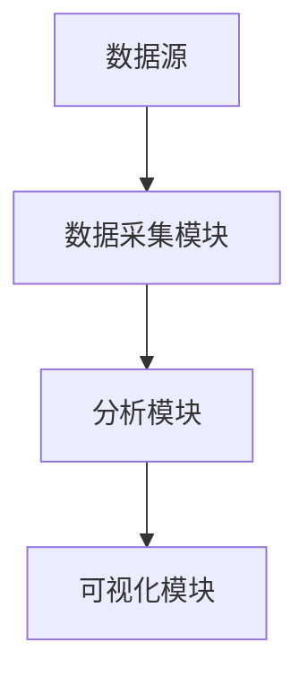

                 


# 全球股市估值与深海采矿环境影响评估技术的发展

> 关键词：全球股市估值，深海采矿，环境影响评估，算法原理，系统架构

> 摘要：本文探讨了全球股市估值与深海采矿环境影响评估技术的发展，分析了股市估值的核心算法与环境影响评估的技术关联，详细讲解了两者在数学模型、系统架构和项目实战中的应用，为读者提供全面的技术视角。

---

## 第1章：背景介绍

### 1.1 全球股市估值的基本概念

股市估值是评估企业价值的重要方法，主要通过分析财务数据、市场趋势和宏观经济指标来确定股票的合理价格。常见的估值方法包括市盈率（P/E）和市净率（P/B），其中市盈率 = 股票价格 / 每股收益，市净率 = 股票价格 / 每股净资产。

### 1.2 深海采矿的背景与发展

深海采矿是指在海底提取矿产资源的活动，主要目标矿物包括多金属结核和多金属硫化物。深海采矿技术的发展受到海底地形、矿物分布和环境保护的挑战。

### 1.3 两者关联

深海采矿企业的股市估值受到环境影响评估结果的影响，环境风险可能影响企业股价。因此，准确的环境影响评估对股市估值至关重要。

---

## 第2章：核心概念与联系

### 2.1 核心概念对比

| 概念 | 股市估值 | 环境影响评估 |
|------|----------|---------------|
| 定义 | 评估企业价值 | 评估环境影响 |
| 方法 | 市盈率、市净率 | 生态模型、风险评估 |
| 输入 | 财务数据 | 环境数据 |

### 2.2 ER实体关系图

```mermaid
erd
  root
    StockValuation(svaluation_id, company_id, valuation_date, value)
    EnvironmentalImpact(evaluation_id, company_id, impact_score)
    Company(company_id, name, industry)
```

---

## 第3章：算法原理讲解

### 3.1 股市估值算法

#### 3.1.1 市盈率模型

公式：$$\text{市盈率} = \frac{\text{股票价格}}{\text{每股收益}}$$

代码示例：

```python
def calculate_pe(stock_price, earnings_per_share):
    return stock_price / earnings_per_share

# 示例
stock_price = 100
earnings_per_share = 2.5
print(calculate_pe(stock_price, earnings_per_share))  # 输出：40
```

---

## 第4章：数学模型

### 4.1 股市估值模型

$$\text{股票价值} = \text{现金流折现} + \text{资产重估}$$

### 4.2 环境影响评估模型

$$\text{环境风险} = \sum_{i=1}^{n} w_i \cdot e_i$$

其中，$w_i$ 是影响因素权重，$e_i$ 是环境影响因子。

---

## 第5章：系统分析与架构设计

### 5.1 功能模块设计

- 数据采集模块：收集财务数据和环境数据。
- 分析模块：执行估值和环境评估。
- 可视化模块：展示结果。

### 5.2 系统架构图



---

## 第6章：项目实战

### 6.1 实战案例

#### 6.1.1 股市估值案例

使用市盈率模型评估某公司的股票价值。

#### 6.1.2 环境影响评估案例

评估深海采矿对海底生态的影响。

---

## 第7章：最佳实践与总结

### 7.1 经验总结

- 数据质量是关键。
- 算法选择需结合实际情况。
- 系统架构需灵活扩展。

### 7.2 注意事项

- 定期更新数据和模型。
- 考虑环境法规变化。

### 7.3 拓展阅读

推荐书籍和资源，帮助深入学习。

---

## 总结

本文详细探讨了全球股市估值与深海采矿环境影响评估技术的发展，通过理论分析、算法讲解和项目实战，为读者提供了全面的技术视角。希望本文能为相关领域的研究和实践提供有价值的参考。

