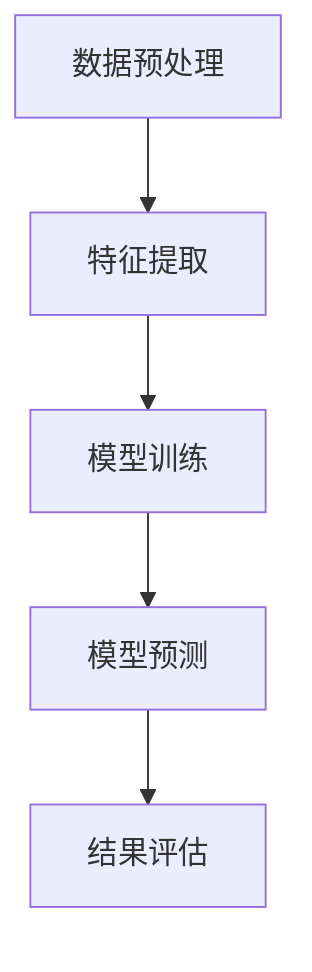

                 


# 全球股市估值与生物塑料在医疗领域的应用

> **关键词**：股市估值、生物塑料、医疗应用、数学模型、算法实现、系统架构

> **摘要**：本文探讨了全球股市估值与生物塑料在医疗领域的应用，分析了股市估值的数学模型和算法实现，同时详细介绍了生物塑料在医疗领域的应用背景、技术优势及未来趋势。文章通过背景介绍、核心概念、算法原理、系统架构和项目实战等多方面，深入剖析了这两个领域的技术细节和应用场景，为读者提供了全面的技术视角。

---

## 目录大纲

### 第一部分: 全球股市估值与生物塑料在医疗领域的应用概述

#### 第1章: 全球股市估值的背景与概念
- 1.1 股市估值的基本概念
  - 1.1.1 股市估值的定义
  - 1.1.2 股市估值的核心要素
  - 1.1.3 股市估值的分类与特点
- 1.2 全球股市估值的背景
  - 1.2.1 全球化经济与股市估值的关系
  - 1.2.2 数字化与智能化对股市估值的影响
  - 1.2.3 全球经济波动对股市估值的挑战

#### 第2章: 生物塑料在医疗领域的应用背景
- 2.1 生物塑料的基本概念
  - 2.1.1 生物塑料的定义与分类
  - 2.1.2 生物塑料的生产过程
  - 2.1.3 生物塑料的环境优势
- 2.2 医疗领域对生物塑料的需求
  - 2.2.1 医疗领域对材料的特殊要求
  - 2.2.2 生物塑料在医疗领域的应用现状
  - 2.2.3 生物塑料在医疗领域的未来趋势

### 第二部分: 全球股市估值的数学模型与算法

#### 第3章: 股市估值的数学模型
- 3.1 常用的股市估值指标
  - 3.1.1 市盈率（P/E）的计算与应用
  - 3.1.2 市净率（P/B）的计算与应用
  - 3.1.3 市销率（P/S）的计算与应用
- 3.2 股市估值的回归分析模型
  - 3.2.1 线性回归模型的构建
  - 3.2.2 回归系数的计算与解释
  - 3.2.3 模型的优缺点与适用场景

#### 第4章: 股市估值的算法实现
- 4.1 基于机器学习的股市估值算法
  - 4.1.1 算法流程图（使用 Mermaid）
  - 4.1.2 算法实现代码示例
  - 4.1.3 算法原理的数学模型和公式

### 第三部分: 生物塑料在医疗领域的技术与应用

#### 第5章: 生物塑料在医疗领域的技术优势
- 5.1 生物塑料的材料科学原理
  - 5.1.1 生物塑料的合成方法
  - 5.1.2 生物塑料的性能优化
  - 5.1.3 生物塑料的降解技术

#### 第6章: 生物塑料在医疗领域的临床应用
- 6.1 生物塑料在医疗设备中的应用
  - 6.1.1 医疗耗材的生物塑料化
  - 6.1.2 医疗器械的材料改进
- 6.2 生物塑料在药物载体中的应用
  - 6.2.1 药物缓释技术
  - 6.2.2 生物相容性研究
- 6.3 生物塑料在再生医学中的应用
  - 6.3.1 组织工程支架
  - 6.3.2 生物修复材料

### 第四部分: 综合分析与小结

#### 第7章: 全球股市估值与生物塑料应用的综合分析
- 7.1 技术协同与创新发展
- 7.2 投资机会与风险评估
- 7.3 未来趋势与技术挑战

#### 第8章: 小结与注意事项
- 8.1 核心内容回顾
- 8.2 实践中的注意事项
- 8.3 未来研究方向

---

**接下来，我将根据以上目录大纲，逐步撰写每个章节的具体内容，确保每个部分都详尽、逻辑清晰，并涵盖技术细节和实际应用案例。**

---

## 第1章: 全球股市估值的背景与概念

### 1.1 股市估值的基本概念

#### 1.1.1 股市估值的定义
股市估值是指对上市公司股票的内在价值进行评估的过程，旨在确定其合理的市场价格。通过分析公司的财务状况、行业地位、盈利能力等多方面因素，投资者可以做出更明智的投资决策。

#### 1.1.2 股市估值的核心要素
- **公司基本面**：包括收入、利润、资产负债表等财务数据。
- **行业环境**：行业的竞争状况、发展趋势和政策影响。
- **宏观经济**：GDP增长率、利率、通货膨胀等因素。
- **市场情绪**：投资者情绪和市场波动对股价的影响。

#### 1.1.3 股市估值的分类与特点
股市估值主要分为相对估值和绝对估值两大类：
- **相对估值**：通过比较同类公司的估值指标（如市盈率、市净率）来确定目标公司的合理价格。
- **绝对估值**：基于公司未来现金流的折现模型（如DCF模型）来估算公司价值。

---

### 1.2 全球股市估值的背景

#### 1.2.1 全球化经济与股市估值的关系
随着全球经济一体化，跨国公司和国际资本流动不断增加，股市估值需要考虑全球市场的波动和经济趋势。

#### 1.2.2 数字化与智能化对股市估值的影响
人工智能和大数据技术的应用，使得股市估值更加精准和高效。算法交易和量化投资逐渐成为主流。

#### 1.2.3 全球经济波动对股市估值的挑战
全球经济不确定性（如地缘政治风险、疫情冲击）对股市估值提出了更高的要求，需要投资者具备更强的应对策略。

---

## 第2章: 生物塑料在医疗领域的应用背景

### 2.1 生物塑料的基本概念

#### 2.1.1 生物塑料的定义与分类
生物塑料是指以可再生资源（如植物淀粉、纤维素）为原料，通过生物或化学方法制备的塑料。根据降解特性，生物塑料可分为可生物降解塑料和不可生物降解塑料。

#### 2.1.2 生物塑料的生产过程
- **原料选择**：使用玉米、甘蔗等农作物提取可再生资源。
- **聚合反应**：通过生物或化学方法将单体聚合形成塑料。
- **改性处理**：对塑料进行性能优化，如增强韧性和降解性。

#### 2.1.3 生物塑料的环境优势
- **可降解性**：减少白色污染。
- **资源可持续性**：利用可再生资源，降低对石油的依赖。
- **环境友好性**：生产过程和产品对环境的影响较小。

---

### 2.2 医疗领域对生物塑料的需求

#### 2.2.1 医疗领域对材料的特殊要求
- **生物相容性**：材料需与人体组织相容，无毒无害。
- **可降解性**：在体内或环境中能够自然降解，减少长期副作用。
- **力学性能**：满足医疗设备的强度和柔韧性要求。

#### 2.2.2 生物塑料在医疗领域的应用现状
- **医疗耗材**：如注射器、绷带等。
- **医疗器械**：如可降解植入材料。
- **药物载体**：用于缓释药物的生物塑料。

#### 2.2.3 生物塑料在医疗领域的未来趋势
随着技术进步，生物塑料在医疗领域的应用将更加广泛，特别是在再生医学和精准医疗方面具有巨大潜力。

---

## 第3章: 股市估值的数学模型

### 3.1 常用的股市估值指标

#### 3.1.1 市盈率（P/E）的计算与应用
- **公式**：P/E = 股价 / 每股净利润
- **应用**：衡量股票是否被高估或低估，尤其适用于盈利稳定的公司。

#### 3.1.2 市净率（P/B）的计算与应用
- **公式**：P/B = 股价 / 每股净资产
- **应用**：适用于净资产较高的公司，如银行和房地产企业。

#### 3.1.3 市销率（P/S）的计算与应用
- **公式**：P/S = 股价 / 每股收入
- **应用**：适用于收入驱动型公司，如互联网企业。

---

### 3.2 股市估值的回归分析模型

#### 3.2.1 线性回归模型的构建
- **目标**：建立股票价格与影响因素（如市盈率、市净率）之间的回归关系。
- **公式**：$$ y = \beta_0 + \beta_1x_1 + \beta_2x_2 + \epsilon $$

#### 3.2.2 回归系数的计算与解释
- **回归系数**：表示自变量对因变量的影响程度。
- **解释**：例如，市盈率每增加1，股价可能增加0.5。

#### 3.2.3 模型的优缺点与适用场景
- **优点**：简单易懂，适合初步分析。
- **缺点**：假设线性关系，可能忽略复杂因素。

---

## 第4章: 股市估值的算法实现

### 4.1 基于机器学习的股市估值算法

#### 4.1.1 算法流程图（使用 Mermaid）



#### 4.1.2 算法实现代码示例

```python
import pandas as pd
from sklearn.linear_model import LinearRegression

# 数据预处理
data = pd.read_csv('stock_data.csv')
X = data[['PE', 'PB', 'PS']]  # 自变量
y = data['Price']  # 因变量

# 模型训练
model = LinearRegression()
model.fit(X, y)

# 模型预测
predictions = model.predict(X)
```

#### 4.1.3 算法原理的数学模型和公式
- **线性回归模型**：$$ y = \beta_0 + \beta_1x_1 + \beta_2x_2 + \epsilon $$
- **损失函数**：最小二乘法。
- **优化目标**：最小化预测值与实际值的平方差之和。

---

## 总结

通过以上分析，我们可以看到，全球股市估值和生物塑料在医疗领域的应用都涉及复杂的技术和实际应用。股市估值需要结合数学模型和算法实现，而生物塑料的应用则需要材料科学和医疗技术的结合。未来，随着技术的不断进步，这两个领域将继续发展，并在更多领域展现出巨大的潜力。

