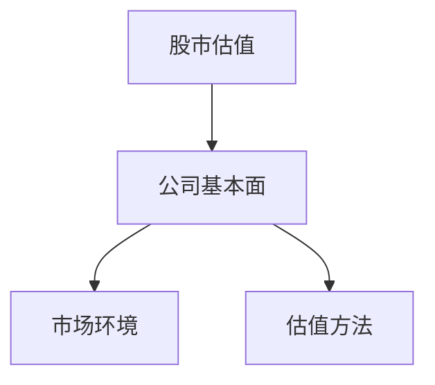
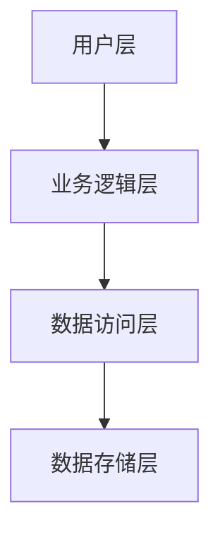

                 


# 全球股市估值与生物塑料在航空航天中的应用

> **关键词**：股市估值、生物塑料、航空航天、系统架构、数学模型

> **摘要**：本文系统探讨了全球股市估值与生物塑料在航空航天中的应用。首先，介绍了股市估值的核心概念和生物塑料的分类及其在航空航天中的潜在应用。接着，详细讲解了股市估值的主要算法和生物塑料性能评估的数学模型，并通过mermaid流程图和LaTeX公式进行了深入分析。随后，分析了生物塑料在航空航天中的应用优势与挑战，设计了系统的架构方案，并通过实战案例展示了生物塑料的实际应用和股市估值算法的实现。最后，总结了全文内容，并展望了未来的研究方向。

---

## 第1章: 全球股市估值与生物塑料应用的背景介绍

### 1.1 股市估值的核心概念

#### 1.1.1 股市估值的定义与核心要素

股市估值是通过对公司财务数据、市场环境和行业趋势等多方面因素的分析，确定股票的内在价值的过程。核心要素包括：

1. **公司基本面**：收入、利润、资产等。
2. **市场环境**：宏观经济指标、行业趋势。
3. **估值方法**：市盈率、市净率、现金流折现模型等。



#### 1.1.2 股市估值的常见方法

1. **市盈率（P/E）模型**：通过公司的市盈率与行业平均水平的比较，评估股票的估值。
2. **市净率（P/B）模型**：通过公司的市净率与行业平均水平的比较，评估股票的估值。
3. **现金流折现模型（DCF）**：通过预测未来现金流并折现，计算股票的内在价值。

#### 1.1.3 股市估值的边界与外延

股市估值不仅关注公司财务数据，还需考虑市场情绪、政策变化等外部因素。外延包括风险管理、投资组合优化等。

---

### 1.2 生物塑料在航空航天中的应用背景

#### 1.2.1 生物塑料的定义与分类

生物塑料是以可再生资源为原料，通过生物或化学方法制备的塑料。主要分类：

1. **生物基塑料**：完全或部分由生物基材料制成。
2. **可降解塑料**：在自然环境中可分解的塑料。

#### 1.2.2 生物塑料在航空航天中的潜在应用

1. **内饰材料**：用于飞机内饰，减少重量和成本。
2. **结构材料**：用于飞机部件，提高强度和耐久性。
3. **功能材料**：用于特殊功能，如隔热、防震等。

#### 1.2.3 生物塑料与传统塑料的对比分析

| 属性      | 生物塑料          | 传统塑料          |
|-----------|-------------------|-------------------|
| 材料来源    | 可再生资源        | 石油等不可再生资源 |
| 环保性      | 可降解，环境友好    | 不可降解，污染环境  |
| 成本        | 初期成本较高       | 成本较低           |
| 应用范围    | 有限              | 广泛              |

---

## 第2章: 全球股市估值的核心算法与数学模型

### 2.1 股市估值的主要算法

#### 2.1.1 市盈率（P/E）模型

市盈率模型通过公司的股价与每股收益的比率，评估股票的估值。

$$ P = \frac{E}{\epsilon} $$

其中：
- \( P \) 为股价
- \( E \) 为每股收益
- \( \epsilon \) 为市盈率

#### 2.1.2 市净率（P/B）模型

市净率模型通过公司的股价与每股净资产的比率，评估股票的估值。

$$ P = \frac{B}{\beta} $$

其中：
- \( P \) 为股价
- \( B \) 为每股净资产
- \( \beta \) 为市净率

#### 2.1.3 现金流折现模型（DCF）

现金流折现模型通过预测公司未来现金流，计算其现值以确定股票的内在价值。

$$ V = \sum_{t=1}^{n} \frac{CF_t}{(1 + r)^t} $$

其中：
- \( V \) 为股票的内在价值
- \( CF_t \) 为第 \( t \) 年的现金流
- \( r \) 为折现率

---

### 2.2 生物塑料性能评估的数学模型

#### 2.2.1 生物塑料材料强度模型

材料强度是生物塑料应用于航空航天的关键性能指标。通过以下公式评估材料的强度：

$$ S = \frac{F}{A} $$

其中：
- \( S \) 为应力
- \( F \) 为外力
- \( A \) 为受力面积

---

## 第3章: 生物塑料在航空航天中的应用分析

### 3.1 生物塑料在航空航天中的应用领域

#### 3.1.1 航空器内饰材料

生物塑料用于飞机内饰，如座椅、扶手等，减少重量和成本。

#### 3.1.2 航空器结构材料

生物塑料用于飞机结构部件，如机翼、机身等，提高强度和耐久性。

#### 3.1.3 航空器功能材料

生物塑料用于特殊功能，如隔热、防震等。

---

### 3.2 生物塑料在航空航天中的性能优势

#### 3.2.1 轻量化优势

生物塑料密度较低，可有效降低飞机重量，节省燃料。

#### 3.2.2 环保优势

生物塑料可降解，减少环境污染。

#### 3.2.3 成本优势

生物塑料生产成本逐渐降低，具有一定的价格优势。

---

### 3.3 生物塑料在航空航天中的应用挑战

#### 3.3.1 材料强度限制

生物塑料的强度和耐久性尚未完全达到航空航天的要求。

#### 3.3.2 生产成本问题

生物塑料的生产成本较高，限制了其广泛应用。

#### 3.3.3 技术成熟度问题

生物塑料在航空航天中的应用技术尚未完全成熟。

---

## 第4章: 全球股市估值与生物塑料应用的系统架构设计

### 4.1 系统功能设计

#### 4.1.1 股市估值模块

- 数据采集：获取公司财务数据和市场数据。
- 模型计算：应用市盈率、市净率等模型进行估值。

#### 4.1.2 生物塑料性能评估模块

- 数据采集：获取生物塑料的性能数据。
- 模型计算：评估材料强度、成本等性能。

#### 4.1.3 数据分析与决策支持模块

- 数据分析：整合股市估值和生物塑料性能数据。
- 决策支持：提供投资建议和应用方案。

---

### 4.2 系统架构设计

#### 4.2.1 分层架构设计



---

## 第5章: 项目实战与案例分析

### 5.1 股市估值项目实战

#### 5.1.1 项目环境安装

安装Python和相关库（如pandas、numpy、scipy）。

#### 5.1.2 核心算法实现

实现市盈率模型：

```python
import pandas as pd

# 输入数据
data = {'Company': ['A', 'B', 'C'], 
        'Earnings_per_share': [1.2, 1.5, 0.8],
        'Price': [20, 30, 10]}
df = pd.DataFrame(data)

# 计算市盈率
df['P/E'] = df['Price'] / df['Earnings_per_share']

print(df)
```

#### 5.1.3 项目结果分析

分析市盈率结果，判断股票是否被低估或高估。

---

### 5.2 生物塑料应用案例分析

#### 5.2.1 案例背景介绍

某航空公司计划用生物塑料替换部分内饰材料，降低成本和重量。

#### 5.2.2 案例分析

评估生物塑料的成本和性能，计算替换后的经济效益。

---

## 第6章: 总结与展望

### 6.1 总结

本文系统探讨了全球股市估值与生物塑料在航空航天中的应用，分析了股市估值的核心算法和生物塑料的性能评估模型，并通过案例展示了其实际应用。

### 6.2 展望

未来，随着技术进步和成本降低，生物塑料在航空航天中的应用将更加广泛。同时，股市估值方法也将不断优化，提供更精准的投资决策支持。

---

## 总结

通过以上分析，我们可以看到，股市估值和生物塑料在航空航天中的应用具有重要的现实意义。随着技术的发展，两者将更加紧密地结合，为社会经济发展带来更大的价值。

