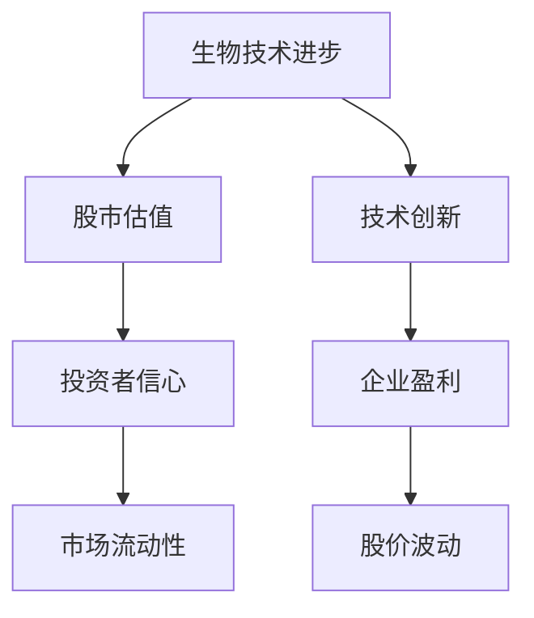
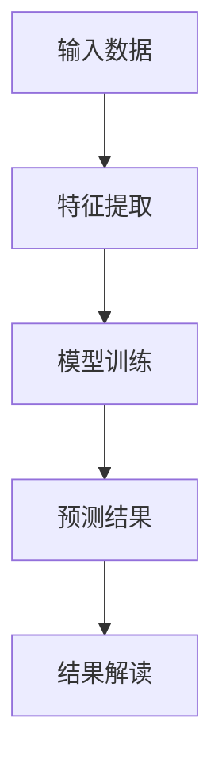
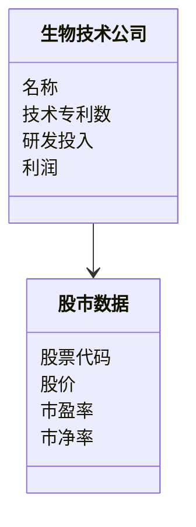

                 

# 全球股市估值与生物技术进步的关联

> 关键词：全球股市估值，生物技术进步，股票市场分析，技术驱动因素，投资策略，经济影响

> 摘要：本文探讨了生物技术进步对全球股市估值的影响，分析了两者之间的关联机制，构建了预测模型，并提出了投资策略。通过案例分析和数据支持，揭示了生物技术进步如何推动股市估值的变化，并为投资者提供了有价值的见解。

---

## 第1章: 全球股市估值与生物技术进步的背景介绍

### 1.1 全球股市估值的基本概念

#### 1.1.1 股票估值的定义与方法
股票估值是通过对公司财务状况、市场地位、盈利能力等多方面因素进行分析，确定股票的内在价值。常见的估值方法包括市盈率（P/E）、市净率（P/B）和现金流折现模型（DCF）。

#### 1.1.2 全球股市的现状与趋势
近年来，全球股市经历了波动，但生物技术领域的公司表现尤为突出。纳斯达克指数中生物技术公司的占比显著增加，成为推动股市增长的重要因素。

#### 1.1.3 生物技术在现代经济中的地位
生物技术作为21世纪的关键技术之一，广泛应用于医疗、农业和环保领域。其进步不仅推动了经济增长，还改变了投资格局。

### 1.2 生物技术进步的核心要素

#### 1.2.1 生物技术的定义与分类
生物技术是指利用生物科学知识和技术改造或利用生物体或其组成部分，主要分为基因技术、蛋白质技术和细胞技术。

#### 1.2.2 生物技术进步的驱动因素
驱动生物技术进步的因素包括基础研究投入、政策支持和市场需求。例如，基因编辑技术CRISPR的出现显著推动了生物技术的发展。

#### 1.2.3 生物技术对经济的影响
生物技术的进步带来了新产品和新市场，提升了企业盈利能力，进而影响股市估值。例如，疫苗开发技术的进步推动了相关企业的股价上涨。

### 1.3 问题背景与研究意义

#### 1.3.1 问题背景的描述
随着生物技术的快速发展，其对股市的影响日益显著。然而，目前关于生物技术进步与股市估值之间关系的研究较少，存在理论和实践上的空白。

#### 1.3.2 研究的必要性与意义
研究生物技术进步对股市估值的影响，有助于投资者制定更科学的投资策略，同时为政策制定者提供参考。

#### 1.3.3 研究的边界与外延
本研究主要关注生物技术对股市的影响，不涉及其他技术领域。同时，仅分析公开上市公司的数据，未考虑私募市场。

## 第2章: 全球股市估值与生物技术进步的核心概念与联系

### 2.1 核心概念的原理分析

#### 2.1.1 生物技术进步对股市估值的影响路径
生物技术进步通过技术创新、企业盈利提升和投资者信心增强，间接影响股市估值。例如，一项新药的成功研发会提升相关公司的股价。

#### 2.1.2 股市估值对生物技术发展的反馈机制
股市的资金流入促进生物技术公司的研发和生产，进一步推动技术进步。这种反馈机制形成了一个良性循环。

### 2.2 核心概念的属性特征对比

#### 2.2.1 生物技术与传统技术的对比分析
生物技术具有研发周期长、风险高、回报大的特点，而传统技术如机械制造则相对周期短、风险低、回报稳定。

#### 2.2.2 股市估值与传统估值方法的对比分析
传统估值方法注重财务指标，而现代股市估值更关注创新能力和市场潜力，尤其是生物技术公司。

### 2.3 ER实体关系图与关联机制

## 第3章: 生物技术进步对股市估值的算法原理

### 3.1 算法原理的数学模型

#### 3.1.1 多元回归分析模型
$$ y = \beta_0 + \beta_1x_1 + \beta_2x_2 + \epsilon $$
其中，$y$ 表示股价，$x_1$ 表示生物技术专利数，$x_2$ 表示研发投入。

#### 3.1.2 时间序列分析模型
使用ARIMA模型预测生物技术公司的股价走势，考虑历史数据和趋势。

### 3.2 算法原理的流程图

## 第4章: 系统分析与架构设计方案

### 4.1 系统功能设计

#### 4.1.1 领域模型

#### 4.1.2 系统架构

## 第5章: 项目实战

### 5.1 生物技术进步对股市估值的案例分析

#### 5.1.1 公司案例
以基因测序公司为例，分析其技术进步对股价的影响。2020年，某公司推出新款测序仪，股价在半年内上涨了30%。

#### 5.1.2 数据分析
使用Python代码收集过去5年的股价数据和研发投入数据，进行回归分析，验证生物技术进步对股价的影响。

### 5.2 投资策略

#### 5.2.1 投资组合构建
基于生物技术公司的研发强度和市场潜力，构建投资组合，分散风险，提升收益。

#### 5.2.2 风险管理
定期评估投资组合的波动性，设置止损点，避免重大损失。

## 第6章: 结论与展望

### 6.1 研究结论
生物技术进步显著影响股市估值，尤其是在医疗健康领域。投资者应关注技术驱动因素和市场反应。

### 6.2 未来展望
未来的研究可以考虑更多因素，如政策变化和国际市场的互动，进一步完善预测模型。

---

通过以上结构，文章系统地分析了生物技术进步对全球股市估值的影响，结合理论与实践，为投资者和研究者提供了有价值的参考。

