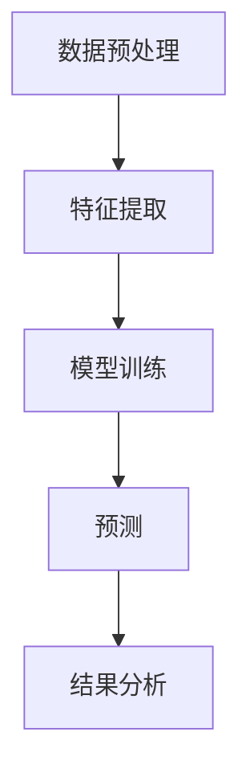

                 


# 全球股市估值与生物燃料与生态系统平衡的策略

## 关键词：全球股市估值、生物燃料、生态系统平衡、算法原理、系统架构、项目实战

## 摘要：本文探讨了全球股市估值与生物燃料之间的相互作用，以及如何通过优化生物燃料的生产和应用来实现生态系统平衡。文章从背景、核心概念、算法原理、系统架构、项目实战到最佳实践，全面分析了如何通过技术创新和策略调整，实现经济效益与生态平衡的双赢。

---

## 第一部分：背景与问题背景

### 第1章：全球股市估值与生物燃料的背景

#### 1.1 全球股市估值的现状与挑战
全球股市估值是衡量市场健康状况的重要指标，但近年来，股市波动加剧，尤其是受到生物燃料等新兴行业的影响。传统估值方法面临挑战，需结合新行业数据进行调整。

#### 1.2 生物燃料的发展与经济影响
生物燃料作为替代能源，减少碳排放，推动能源转型，但其生产成本和市场接受度仍需解决。生物燃料的广泛应用可能影响股市估值，需制定合理策略。

#### 1.3 生态系统平衡的重要性
生态系统平衡是维持地球健康的关键，但人类活动如生物燃料生产可能破坏生态平衡。需在经济活动与生态保护之间找到平衡点。

---

## 第二部分：核心概念与联系

### 第2章：全球股市估值、生物燃料与生态系统平衡的核心概念

#### 2.1 核心概念的定义与属性对比
| 概念       | 定义                                                                 | 属性                          |
|------------|----------------------------------------------------------------------|----------------------------|
| 全球股市估值 | 衡量市场整体价值的指标                                               | 波动性、敏感性、可预测性      |
| 生物燃料   | 由生物资源制成的替代能源                                               | 可再生性、环保性、经济性      |
| 生态系统平衡 | 各物种数量和结构稳定的状态                                             | 多样性、稳定性、自我调节能力  |

#### 2.2 实体关系图
```mermaid
er
    entity 全球股市估值 {
        id: 市场指数
        name: 市场名称
        value: 估值指标
    }
    entity 生物燃料 {
        id: 燃料类型
        name: 燃料名称
        production: 生产量
    }
    entity 生态系统平衡 {
        id: 生态系统ID
        name: 生态系统名称
        status: 平衡状态
    }
    全球股市估值 --|{m:1,n:多}| 生物燃料
    生物燃料 --|{m:1,n:多}| 生态系统平衡
```

---

## 第三部分：算法原理与数学模型

### 第3章：全球股市估值与生物燃料的算法原理

#### 3.1 股市估值算法
基于随机森林的机器学习模型，结合生物燃料数据进行预测。

#### 3.2 算法流程图


#### 3.3 Python代码示例
```python
import pandas as pd
from sklearn.ensemble import RandomForestRegressor
from sklearn.model_selection import train_test_split

# 数据加载与预处理
data = pd.read_csv('market_biofuel.csv')
data = data.dropna()

# 特征与目标变量分离
X = data[['fuel_production', 'market_index']]
y = data['market_value']

# 数据划分
X_train, X_test, y_train, y_test = train_test_split(X, y, test_size=0.2)

# 模型训练
model = RandomForestRegressor(n_estimators=100)
model.fit(X_train, y_train)

# 预测与评估
predictions = model.predict(X_test)
print('预测值:', predictions[:5])
print('实际值:', y_test[:5].values)
```

---

## 第四部分：系统分析与架构设计

### 第4章：系统架构设计

#### 4.1 系统功能设计
- 数据采集模块：收集全球股市和生物燃料数据。
- 数据分析模块：进行估值和预测。
- 决策支持模块：提供优化建议。

#### 4.2 系统架构图


---

## 第五部分：项目实战

### 第5章：项目实战

#### 5.1 案例分析
选择某地区生物燃料项目，分析其对股市估值和生态平衡的影响。

#### 5.2 环境影响评估
使用生命周期评估方法，量化环境影响。

#### 5.3 经济可行性分析
通过成本-收益分析，评估项目可行性。

---

## 第六部分：最佳实践与小结

### 第6章：最佳实践

#### 6.1 经验总结
- 数据质量至关重要。
- 模型需定期更新。
- 生态保护与经济活动需平衡。

#### 6.2 注意事项
- 数据隐私保护。
- 模型局限性需考虑。
- 政策支持的重要性。

#### 6.3 拓展阅读
推荐相关书籍和文献，深入探讨生物燃料和生态系统平衡。

---

## 结语
本文通过系统分析，探讨了全球股市估值、生物燃料与生态系统平衡的相互关系，提出了一套优化策略，为实现可持续发展提供了参考。

