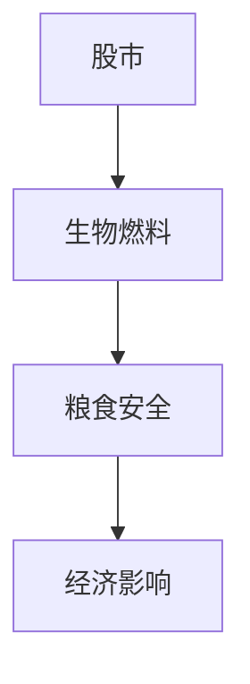
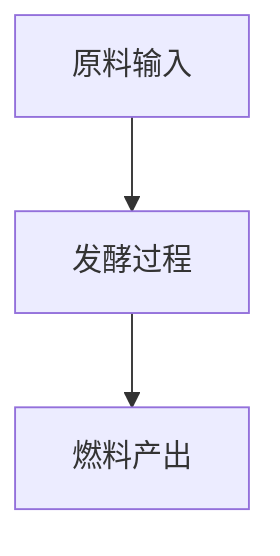
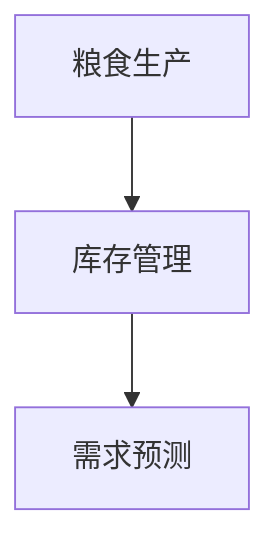

                 


# 全球股市估值与生物燃料与粮食安全的平衡策略

> 关键词：全球股市估值，生物燃料，粮食安全，经济模型，平衡策略

> 摘要：本文系统地分析了全球股市估值、生物燃料生产和粮食安全之间的复杂关系，探讨了在经济波动和资源约束下如何实现三者的平衡。通过数学模型和算法原理的详细阐述，结合实际案例分析，提出了可行的平衡策略。

---

# 第一部分: 全球股市估值与生物燃料与粮食安全的平衡策略概述

## 第1章: 背景介绍

### 1.1 全球股市估值的基本概念
#### 1.1.1 股市估值的定义
股市估值是指通过对公司财务数据、市场环境和经济指标的分析，估算股票的内在价值。常用的估值方法包括市盈率（P/E）、市净率（P/B）等。

#### 1.1.2 股市估值的核心要素
- 公司盈利能力
- 行业竞争状况
- 宏观经济环境
- 市场预期

#### 1.1.3 股市估值与经济发展的关系
股市估值是经济晴雨表，反映整体经济的健康状况和未来预期。

### 1.2 生物燃料的定义与特点
#### 1.2.1 生物燃料的定义
生物燃料是指利用生物资源（如农作物、林业残渣等）加工而成的可再生能源。

#### 1.2.2 生物燃料的主要类型
- 生物柴油
- 生物乙醇
- 生物质颗粒

#### 1.2.3 生物燃料的生产过程
从原料收集到加工处理的完整生产流程。

### 1.3 粮食安全的核心概念
#### 1.3.1 粮食安全的定义
确保所有人在任何时候都能获得足够、安全和营养的粮食。

#### 1.3.2 粮食安全的影响因素
- 气候变化
- 土地资源
- 农业技术

#### 1.3.3 粮食安全与社会稳定的关系
粮食短缺可能导致社会动荡，威胁国家稳定。

### 1.4 问题背景与问题描述
#### 1.4.1 全球经济面临的挑战
全球经济波动、通货膨胀和能源危机。

#### 1.4.2 生物燃料与粮食安全的矛盾
生物燃料生产占用粮食作物，导致粮食价格上涨。

#### 1.4.3 全球股市波动对经济的影响
股市波动加剧经济不确定性，影响投资和消费。

## 第2章: 核心概念与联系

### 2.1 核心概念的原理
#### 2.1.1 股市估值的数学模型
$$ P = \frac{E}{E\_PS} $$
其中，P为股价，E为净利润，E\_PS为每股收益预期。

#### 2.1.2 生物燃料的生产原理
生物燃料通过发酵或化学反应将有机物转化为能源。

#### 2.1.3 粮食安全的系统模型
粮食安全涉及生产、分配和消费等多个环节。

### 2.2 核心概念的对比分析
#### 2.2.1 股市估值与生物燃料的关系
股市波动影响生物燃料企业的投资和生产。

#### 2.2.2 生物燃料与粮食安全的相互作用
生物燃料生产可能导致粮食价格上涨。

#### 2.2.3 粮食安全与股市波动的关联
粮食价格影响股市中的农业板块表现。

### 2.3 ER实体关系图


## 第3章: 核心概念的数学模型与算法原理

### 3.1 股市估值的数学模型
#### 3.1.1 股市估值公式
$$ P = \frac{E}{E\_PS} $$
其中，E为净利润，E\_PS为每股收益预期。

#### 3.1.2 股市波动的随机游走模型


### 3.2 生物燃料的生产算法
#### 3.2.1 生物燃料产量计算
$$ Y = k \times A $$
其中，Y为产量，k为生产效率，A为原料投入。

#### 3.2.2 生物燃料生产流程图


### 3.3 粮食安全的优化算法
#### 3.3.1 粮食需求预测模型
$$ D = a \times P + b \times G $$
其中，D为需求，P为人口，G为经济增长率。

#### 3.3.2 粮食库存优化流程图


## 第4章: 系统分析与架构设计方案

### 4.1 问题场景介绍
#### 4.1.1 全球经济波动
股市波动、能源危机和粮食短缺的交织影响。

### 4.2 项目介绍
通过建立数学模型，分析三者之间的相互作用，提出平衡策略。

### 4.3 系统功能设计
#### 4.3.1 领域模型


### 4.4 系统架构设计


### 4.5 系统接口设计
- 输入接口：接收股市数据、生物燃料产量和粮食需求。
- 输出接口：提供平衡策略和优化建议。

### 4.6 系统交互


## 第5章: 项目实战

### 5.1 环境安装
- 数据分析工具：Python、Pandas、Matplotlib
- 图表工具：Mermaid、PlantUML

### 5.2 核心实现
```python
import pandas as pd
import matplotlib.pyplot as plt

# 示例数据
data = {
    '时间': [1, 2, 3, 4, 5],
    '股价': [100, 105, 98, 110, 108],
    '产量': [50, 55, 53, 58, 60]
}

df = pd.DataFrame(data)
plt.plot(df['时间'], df['股价'], label='股价')
plt.plot(df['时间'], df['产量'], label='产量')
plt.legend()
plt.show()
```

### 5.3 案例分析
- 某国生物燃料生产导致粮食价格上涨，通过模型计算调整生产量，平衡粮食需求。

## 第6章: 最佳实践

### 6.1 小结
通过数学模型和系统设计，可以有效平衡股市估值、生物燃料生产与粮食安全。

### 6.2 注意事项
- 数据准确性
- 模型适用性
- 政策支持

### 6.3 拓展阅读
建议阅读相关领域的最新研究和政策报告。

---

通过以上章节的详细分析和具体案例的讨论，我们可以更好地理解如何在全球经济波动中实现股市估值、生物燃料和粮食安全的平衡，为经济可持续发展提供有力支持。

