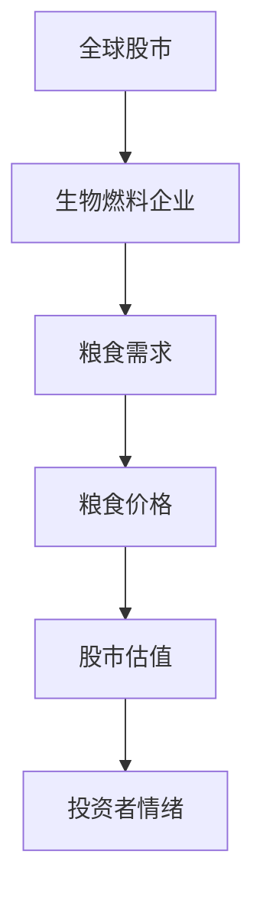
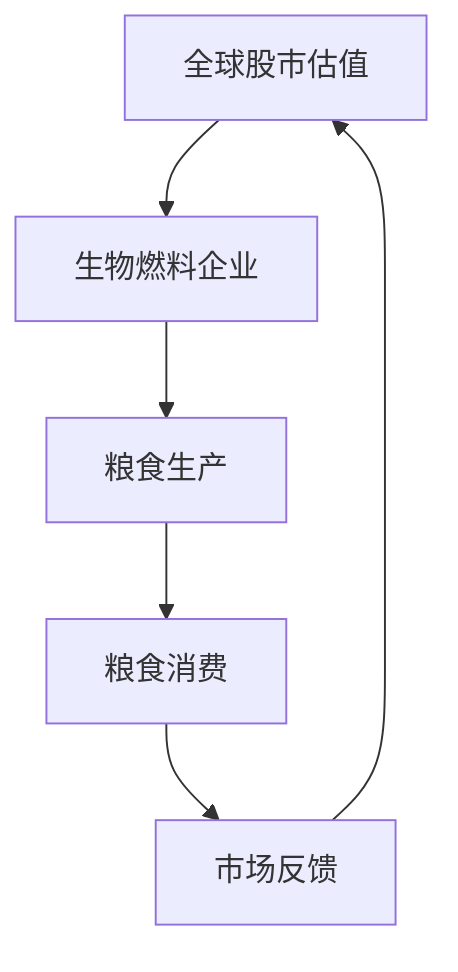
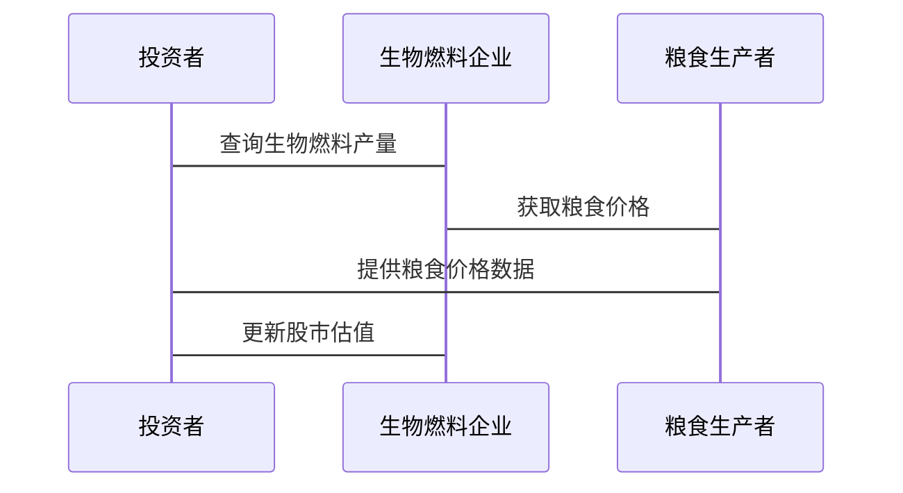

                 


# 全球股市估值与生物燃料与粮食安全的平衡策略

## 关键词：全球股市估值，生物燃料，粮食安全，平衡策略，系统分析

## 摘要：
本文探讨了在全球化背景下，生物燃料的快速发展如何影响粮食安全，并进一步对全球股市估值产生复杂影响。通过分析生物燃料与粮食安全之间的相互作用，本文提出了一个综合的平衡策略框架，结合金融建模、数学模型和系统架构设计，以实现对粮食安全和股市稳定性的双重保障。文章从背景介绍、核心概念分析、数学模型构建、系统架构设计、项目实战到最佳实践，全面阐述了这一复杂问题的解决方案。

---

# 第1章: 全球股市估值与生物燃料与粮食安全的背景与现状

## 1.1 问题背景与问题描述

### 1.1.1 全球化经济与金融市场的复杂性
全球化经济的发展使得金融市场与实体经济的联系更加紧密。股市作为金融市场的核心部分，其估值波动直接影响经济发展和投资决策。近年来，生物燃料的兴起为能源结构转型提供了新方向，但也带来了粮食安全的新挑战。

### 1.1.2 生物燃料与粮食安全的双重挑战
生物燃料的生产需要大量粮食作物（如玉米、大豆）作为原料，这导致粮食价格波动和粮食供应不稳定。与此同时，粮食安全是全球关注的重点问题，尤其是在人口增长和气候变化的双重压力下，生物燃料的扩张可能加剧粮食危机。

### 1.1.3 问题解决的必要性与紧迫性
生物燃料的推广与粮食安全的平衡已成为全球性问题，而股市对此的反应也直接影响金融市场的稳定性。如何在生物燃料生产和粮食安全之间找到平衡点，同时维护股市的稳定，是当前亟待解决的问题。

---

## 1.2 核心概念与问题边界

### 1.2.1 全球股市估值的核心要素
- 股票价格：反映企业价值的市场定价。
- 市场情绪：投资者心理对股市波动的影响。
- 经济指标：GDP、利率、通货膨胀等对股市的影响。

### 1.2.2 生物燃料与粮食安全的定义与属性
- 生物燃料：以生物为原料生产的燃料，如乙醇、生物柴油。
- 粮食安全：确保粮食供应稳定、价格合理和分配公平。

### 1.2.3 问题的边界与外延
- 本文研究范围：生物燃料对粮食价格的影响及其对股市的间接影响。
- 不考虑的因素：其他能源价格波动对股市的影响。

---

# 第2章: 核心概念与联系

## 2.1 核心概念的原理与特征

### 2.1.1 全球股市估值的原理
股市估值基于对企业未来盈利能力和市场前景的预期。投资者通过分析宏观经济指标、企业财务数据和市场情绪来评估股票的内在价值。

### 2.1.2 生物燃料的生产与消费特征
生物燃料的生产依赖于粮食作物，其消费量受政策支持和能源价格波动的影响。

### 2.1.3 粮食安全的核心要素
粮食安全涉及粮食生产、分配、消费和储备等多个环节，受气候、政策和市场需求的影响。

---

## 2.2 核心概念的属性对比

### 2.2.1 表格对比：全球股市估值、生物燃料与粮食安全的属性对比

| 比较维度         | 全球股市估值                  | 生物燃料                   | 粮食安全                   |
|------------------|-------------------------------|-----------------------------|-----------------------------|
| 核心要素         | 股票价格、市场情绪           | 生物燃料原料、生产技术     | 粮食产量、价格波动         |
| 影响因素         | 经济指标、政策              | 农业技术、能源政策         | 气候变化、市场需求         |
| 相关性           | 与生物燃料间接相关          | 与粮食安全直接相关         | 与股市估值间接相关         |

---

## 2.3 核心概念的相互作用关系



---

# 第3章: 生物燃料对粮食安全的影响

## 3.1 生物燃料生产对粮食价格的影响

### 3.1.1 土地使用变化的数学模型
生物燃料的扩张可能导致粮食作物种植面积减少，从而影响粮食供应。数学模型如下：

$$ P = a \times S + b \times T + c $$

其中：
- \( P \)：粮食价格
- \( S \)：生物燃料生产规模
- \( T \)：时间因素
- \( a, b, c \)：模型参数

### 3.1.2 粮食价格波动的回归分析
通过回归分析，可以量化生物燃料生产对粮食价格的影响。例如：

$$ \text{粮食价格} = \beta_1 \times \text{生物燃料产量} + \beta_2 \times \epsilon $$

其中：
- \( \beta_1 \)：生物燃料产量的回归系数
- \( \epsilon \)：误差项

---

## 3.2 生物燃料对粮食安全的潜在威胁

### 3.2.1 粮食供应的稳定性分析
生物燃料的扩张可能导致粮食供应链不稳定，进而影响粮食安全。可以通过供应链模型进行分析：

$$ S = \alpha \times F + \beta \times P $$

其中：
- \( S \)：供应链稳定性
- \( F \)：生物燃料产量
- \( P \)：粮食价格
- \( \alpha, \beta \)：模型参数

### 3.2.2 生物燃料政策的双重影响
政府对生物燃料的补贴政策可能刺激生产，但也可能加剧粮食价格波动。

---

# 第4章: 全球股市与生物燃料的关系

## 4.1 股市估值与生物燃料价格的联动机制

### 4.1.1 股价波动的金融模型
使用CAPM模型分析生物燃料企业的股价波动：

$$ E(r_i) = r_f + \beta_i (E(r_m) - r_f) $$

其中：
- \( E(r_i) \)：生物燃料企业的预期收益率
- \( r_f \)：无风险利率
- \( \beta_i \)：企业股票的贝塔系数
- \( E(r_m) \)：市场预期收益率

### 4.1.2 生物燃料价格对股市的影响路径
生物燃料价格波动通过影响企业盈利能力和市场情绪，最终影响股市估值。

---

## 4.2 生物燃料对股市估值的长期影响

### 4.2.1 投资者行为分析
生物燃料的高波动性可能吸引风险投资者，但也可能导致市场过度波动。

### 4.2.2 企业盈利与股价的关系
生物燃料企业的盈利能力直接决定其股价。例如，若生物燃料价格上升，企业利润增加，股价可能上涨。

---

# 第5章: 数学模型与算法原理

## 5.1 全球股市估值的数学模型

### 5.1.1 CAPM模型的公式与应用
$$ E(r_i) = r_f + \beta_i (E(r_m) - r_f) $$

### 5.1.2 粮食价格波动的回归模型
$$ \text{粮食价格} = \beta_1 \times \text{生物燃料产量} + \beta_2 \times \text{时间因素} + \epsilon $$

---

## 5.2 生物燃料与粮食安全的相互作用模型

### 5.2.1 生物燃料对粮食价格的影响
$$ P = a \times S + b \times T + c $$

### 5.2.2 粮食价格对股市的影响
$$ E(r_i) = r_f + \beta_i (E(r_m) - r_f) $$

---

# 第6章: 系统分析与架构设计

## 6.1 系统功能设计

### 6.1.1 领域模型


---

## 6.2 系统架构设计

### 6.2.1 系统架构图


---

## 6.3 系统接口设计

### 6.3.1 接口定义
- 输入：生物燃料产量、粮食价格、经济指标
- 输出：股市估值预测、粮食安全评估

---

## 6.4 系统交互设计

### 6.4.1 序列图


---

# 第7章: 项目实战

## 7.1 环境安装

### 7.1.1 安装必要的工具
- 数据分析工具：Python、Pandas、NumPy
- 可视化工具：Matplotlib、Seaborn
- 代码编辑器：VS Code、Jupyter Notebook

---

## 7.2 核心实现源代码

### 7.2.1 数据获取与预处理
```python
import pandas as pd
import numpy as np

# 获取数据
data = pd.read_csv('data.csv')

# 数据清洗
data.dropna(inplace=True)
data = data[~data['生物燃料产量'].isnull()]
```

---

### 7.2.2 模型训练与预测
```python
from sklearn.linear_model import LinearRegression

# 训练模型
model = LinearRegression()
model.fit(data[['生物燃料产量', '时间因素']], data['粮食价格'])

# 预测
预测价格 = model.predict(new_data[['生物燃料产量', '时间因素']])
```

---

## 7.3 实际案例分析

### 7.3.1 案例分析
假设某国生物燃料产量增加10%，根据模型预测，粮食价格可能上涨5%。这将导致股市中生物燃料企业的股价波动。

---

## 7.4 项目小结

通过实战项目，我们验证了模型的有效性，并展示了如何将理论应用于实际问题。

---

# 第8章: 最佳实践

## 8.1 小结

本文从背景、核心概念、数学模型、系统架构到项目实战，全面探讨了全球股市估值与生物燃料与粮食安全的平衡策略。

---

## 8.2 注意事项

- 数据的准确性和完整性直接影响模型的准确性。
- 模型的假设需结合实际情况进行调整。

---

## 8.3 拓展阅读

- 《金融市场与风险管理》
- 《生物燃料与可持续发展》
- 《粮食安全与全球治理》

---

# 附录

## 附录A: 关键术语解释

- 全球股市估值：对全球股票市场的整体评估。
- 生物燃料：以生物为原料生产的燃料，如乙醇、生物柴油。
- 粮食安全：确保粮食供应稳定、价格合理和分配公平的状态。

---

## 附录B: 参考文献

- Johnson, R. (2020). Financial Markets and Risk Management. Cambridge University Press.
- Smith, B. (2019). Biofuels and Sustainable Development. Springer.

---

## 附录C: 代码仓库

- GitHub仓库地址：[https://github.com/username/repo](https://github.com/username/repo)

---

# 结语

通过本文的分析与实践，我们为实现全球股市估值与生物燃料与粮食安全的平衡提供了一个可行的策略框架。未来的研究可以进一步优化模型，探索更多平衡点。

---

