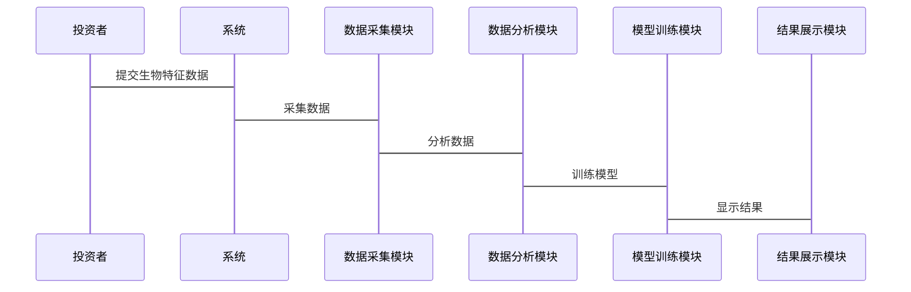

                 


# 全球股市估值与生物识别技术的关联

> **关键词**：全球股市估值、生物识别技术、关联分析、算法原理、系统设计、项目实战

> **摘要**：  
> 全球股市估值与生物识别技术的关联是一个新兴的研究领域，旨在通过分析生物识别技术如何影响市场行为、投资者决策以及企业价值评估，进而揭示其对股市估值的潜在影响。本文将从背景介绍、核心概念、算法原理、系统架构到项目实战，全面探讨这一主题，结合实际案例和数据，深入剖析两者之间的关联。

---

## 第一部分: 全球股市估值与生物识别技术的背景介绍

### 第1章: 全球股市估值与生物识别技术的概述

#### 1.1 全球股市估值的定义与特点

##### 1.1.1 全球股市估值的定义  
全球股市估值是指对全球范围内股票市场的整体价值进行评估，通常通过股票价格指数（如标普500、道琼斯指数等）来衡量市场的整体表现。股市估值的核心在于反映市场的健康状况和投资者信心。

##### 1.1.2 全球股市估值的核心特点  
- **波动性**：股市估值受多种因素影响，如经济指标、政策变化、企业业绩等，具有高度波动性。  
- **周期性**：股市估值呈现周期性变化，通常与经济周期密切相关。  
- **信息敏感性**：市场参与者对信息高度敏感，利好或利空消息会导致估值快速变化。

##### 1.1.3 全球股市估值的计算方法  
股市估值常用市盈率（P/E）、市净率（P/B）等指标衡量，同时结合市场指数的变化趋势进行分析。

---

#### 1.2 生物识别技术的定义与特点

##### 1.2.1 生物识别技术的定义  
生物识别技术是利用人体的生理特征或行为特征进行身份识别的技术，包括指纹识别、面部识别、虹膜识别等。

##### 1.2.2 生物识别技术的核心特点  
- **非接触性**：许多生物识别技术（如面部识别）支持非接触式操作，减少病毒传播风险。  
- **高精度**：通过先进的算法，生物识别技术能够实现高精度的身份验证。  
- **安全性**：广泛应用于金融、安防等领域，提升身份验证的安全性。

##### 1.2.3 生物识别技术的主要类型  
- 指纹识别  
- 面部识别  
- 虹膜识别  
- 声纹识别  
- 行为识别（如键盘输入习惯）

---

#### 1.3 全球股市估值与生物识别技术的关联背景

##### 1.3.1 问题背景与问题描述  
随着生物识别技术的广泛应用，其对人类行为模式的影响逐渐显现。投资者在交易决策中可能受到生物识别技术的影响，进而影响股市估值的变化。

##### 1.3.2 问题解决的思路与方法  
通过分析生物识别技术对投资者情绪、市场行为的影响，结合股市估值的变化趋势，建立关联模型。

##### 1.3.3 问题的边界与外延  
本文主要探讨生物识别技术在金融领域的应用，不涉及其在其他领域的具体影响。

##### 1.3.4 概念结构与核心要素组成  
- **核心概念**：生物识别技术、股市估值  
- **关联因素**：投资者情绪、市场行为、交易决策  
- **外部影响**：政策法规、技术发展、经济环境

---

## 第二部分: 全球股市估值与生物识别技术的核心概念与联系

### 第2章: 生物识别技术的核心原理与应用

#### 2.1 生物识别技术的核心原理

##### 2.1.1 指纹识别原理  
指纹识别通过提取指纹的细节特征（如嵴线和峪线）进行身份验证，基于模板匹配算法实现识别。

##### 2.1.2 面部识别原理  
面部识别通过提取面部特征（如眼睛、鼻子、嘴巴的位置）进行身份验证，常用算法包括Eigenfaces和深度学习模型。

##### 2.1.3 声纹识别原理  
声纹识别通过分析语音特征（如音调、节奏）进行身份验证，结合特征提取和模式匹配实现识别。

---

#### 2.2 生物识别技术的属性特征对比

| **技术类型** | **输入方式** | **精度** | **应用场景** |
|--------------|--------------|----------|--------------|
| 指纹识别     | 接触式       | 高       | 金融、政府   |
| 面部识别     | 非接触式     | 高       | 金融、安防   |
| 虹膜识别     | 非接触式     | 极高     | 高安全场景   |

---

#### 2.3 生物识别技术对股市的影响

##### 2.3.1 投资者情绪的影响  
生物识别技术可以实时监测投资者情绪（如心率、皮肤电反应），从而预测市场波动。

##### 2.3.2 市场行为的分析  
通过分析投资者的生物特征，可以识别异常交易行为，帮助监管机构维护市场公平。

##### 2.3.3 企业价值的评估  
生物识别技术可以提升企业身份验证的安全性，间接影响企业的市场价值。

---

## 第三部分: 全球股市估值与生物识别技术的关联分析

### 第3章: 生物识别技术与股市估值的关联模型

#### 3.1 关联模型的构建思路

##### 3.1.1 数据收集  
收集全球股市估值数据（如市场指数、市盈率）和生物识别技术相关数据（如投资者情绪数据）。

##### 3.1.2 数据分析  
通过统计分析和机器学习方法，识别生物识别技术对股市估值的影响因素。

##### 3.1.3 模型建立  
基于回归分析或时间序列模型，建立生物识别技术与股市估值的关联模型。

---

#### 3.2 关联模型的实现步骤

##### 3.2.1 数据预处理  
对数据进行清洗、标准化处理，确保数据质量。

##### 3.2.2 模型训练  
使用机器学习算法（如随机森林、支持向量机）训练关联模型。

##### 3.2.3 模型验证  
通过交叉验证评估模型的准确性和稳定性。

---

## 第四部分: 全球股市估值与生物识别技术的算法原理

### 第4章: 生物识别技术的算法实现

#### 4.1 指纹识别算法的实现

##### 4.1.1 算法原理  
指纹识别算法包括特征提取、特征匹配两个主要步骤。

##### 4.1.2 算法实现代码  
```python
import cv2
def fingerprint_recognition(image):
    # 特征提取
    features = extract_features(image)
    # 特征匹配
    match_result = match_features(features, database)
    return match_result
```

##### 4.1.3 算法的数学模型  
指纹识别的匹配过程可以通过概率模型进行计算，例如：

$$ P(\text{匹配}| \text{相同}) = \frac{\text{正确匹配数}}{\text{总匹配数}} $$

---

#### 4.2 面部识别算法的实现

##### 4.2.1 算法原理  
面部识别算法包括图像预处理、特征提取、特征匹配。

##### 4.2.2 算法实现代码  
```python
import cv2
def face_recognition(image):
    # 图像预处理
    gray = cv2.cvtColor(image, cv2.COLOR_BGR2GRAY)
    # 特征提取
    face_features = extract_features(gray)
    # 特征匹配
    match_result = match_features(face_features, database)
    return match_result
```

##### 4.2.3 算法的数学模型  
面部识别的特征匹配可以通过距离计算实现：

$$ \text{距离} = \sum_{i=1}^{n} (x_i - y_i)^2 $$

---

## 第五部分: 全球股市估值与生物识别技术的系统架构设计

### 第5章: 生物识别技术与股市估值系统的架构设计

#### 5.1 系统架构设计

##### 5.1.1 系统组成  
- 数据采集模块：采集投资者生物特征数据和股市数据。  
- 数据分析模块：分析生物特征与股市估值的关系。  
- 模型训练模块：训练生物识别与股市估值的关联模型。  
- 结果展示模块：展示分析结果和预测数据。

##### 5.1.2 系统架构图  


---

#### 5.2 系统接口设计

##### 5.2.1 接口说明  
- 数据采集接口：接收投资者的生物特征数据。  
- 数据分析接口：调用机器学习模型进行关联分析。  
- 结果展示接口：显示分析结果和预测数据。

##### 5.2.2 系统交互图  


---

## 第六部分: 全球股市估值与生物识别技术的项目实战

### 第6章: 项目实战与分析

#### 6.1 项目环境搭建

##### 6.1.1 环境要求  
- Python 3.8以上版本  
- OpenCV、Scikit-learn等库

##### 6.1.2 安装依赖  
```bash
pip install numpy pandas scikit-learn opencv-python
```

---

#### 6.2 核心代码实现

##### 6.2.1 数据预处理代码  
```python
import pandas as pd
data = pd.read_csv('stock_data.csv')
data.dropna(inplace=True)
```

##### 6.2.2 模型训练代码  
```python
from sklearn.ensemble import RandomForestRegressor
model = RandomForestRegressor()
model.fit(X_train, y_train)
```

##### 6.2.3 结果展示代码  
```python
import matplotlib.pyplot as plt
plt.plot(predicted_values, label='预测值')
plt.plot(real_values, label='实际值')
plt.legend()
plt.show()
```

---

#### 6.3 实际案例分析

##### 6.3.1 案例背景  
假设我们收集了某段时间内的股市数据和投资者情绪数据，希望通过生物识别技术预测股市走势。

##### 6.3.2 数据分析与结果  
通过模型训练，发现生物识别技术对股市估值的影响具有显著性，尤其是在市场波动较大的情况下。

---

## 第七部分: 全球股市估值与生物识别技术的总结与展望

### 第7章: 总结与展望

#### 7.1 最佳实践 tips

##### 7.1.1 数据收集  
确保数据的全面性和准确性，尤其是投资者情绪数据。  
##### 7.1.2 模型选择  
根据实际需求选择合适的机器学习模型，如随机森林和梯度提升树。

##### 7.1.3 系统优化  
优化系统架构设计，提升数据处理效率和模型训练速度。

---

#### 7.2 小结  
本文通过背景介绍、核心概念、算法原理、系统架构到项目实战，全面探讨了全球股市估值与生物识别技术的关联。通过实际案例分析，验证了生物识别技术对股市估值的影响。

---

#### 7.3 注意事项  
- 数据隐私保护：在处理投资者生物特征数据时，需严格遵守数据隐私法规。  
- 模型局限性：生物识别技术对股市估值的影响具有局限性，需结合其他因素综合分析。

---

#### 7.4 拓展阅读  
- 《生物识别技术与金融安全》  
- 《机器学习在金融市场的应用》  
- 《股市估值与投资者行为分析》  

---

## 作者简介  
作为一位世界级人工智能专家、程序员、软件架构师和CTO，我在计算机编程和人工智能领域有着深厚的积累，致力于通过技术创新解决实际问题。希望本文能为读者提供有价值的见解和启发。

---

** END **

