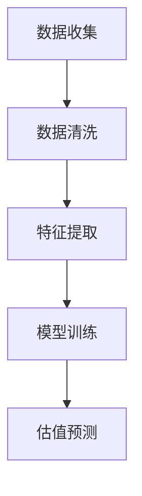
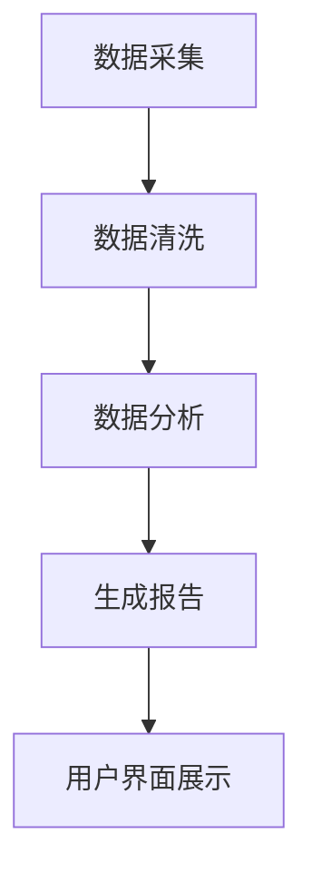
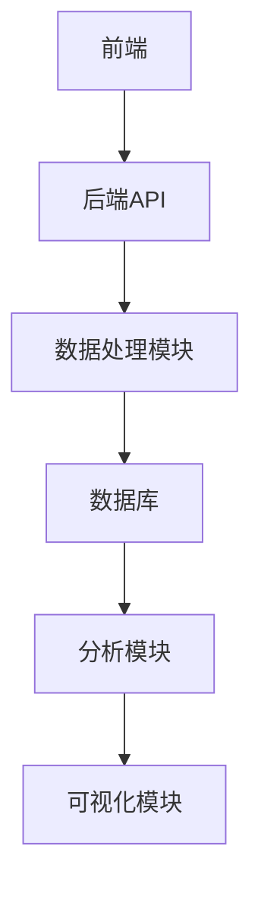
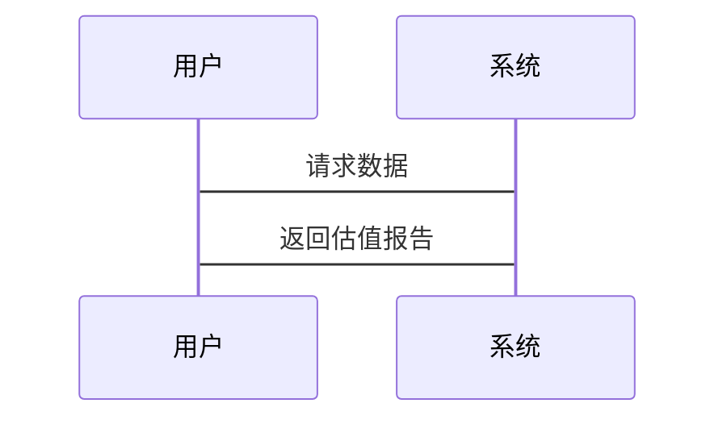

                 


# 全球股市估值与碳中和目标的关联

---

## 关键词：
全球股市估值、碳中和目标、气候变化、金融市场、ESG投资、绿色金融

---

## 摘要：
随着全球气候变化问题的加剧，碳中和目标已成为各国政府和企业的重要战略目标。本文将深入探讨全球股市估值与碳中和目标之间的关联，从碳中和目标对行业、企业及投资者的影响入手，分析其如何影响股市估值。通过数学模型与算法原理的详细讲解，结合实际案例分析，本文将揭示碳中和目标如何通过政策、技术和市场机制改变股市估值，并为企业和投资者提供可行的应对策略。

---

# 第1章: 全球股市估值与碳中和目标的背景介绍

## 1.1 全球股市估值的基本概念

### 1.1.1 什么是全球股市估值

全球股市估值是指对全球范围内股票市场的整体价值进行评估，通常通过股票价格指数、市盈率（P/E ratio）和市净率（P/B ratio）等指标来衡量市场的整体表现和投资价值。

### 1.1.2 全球股市估值的计算方法

股票市场的估值可以通过以下方法进行计算：
- **市场资本化率**：总市值 / 国民生产总值（GDP）。
- **市盈率（P/E ratio）**：股价 / 每股收益（EPS）。
- **市净率（P/B ratio）**：股价 / 每股净资产（BPS）。

### 1.1.3 全球股市估值的重要性

股市估值是投资者评估市场整体风险和收益的重要指标，也是政策制定者和企业制定战略的重要参考。

---

## 1.2 碳中和目标的背景与意义

### 1.2.1 碳中和的定义与目标

碳中和是指在一定时期内，通过减少温室气体排放和增加碳汇，使二氧化碳的净排放量为零。碳中和目标的核心是实现低碳经济转型，减少对化石能源的依赖。

### 1.2.2 碳中和对全球经济的影响

碳中和目标将推动全球经济向低碳方向转型，促进新能源行业的发展，同时对传统高碳行业（如化石能源、钢铁、水泥等）构成巨大挑战。

### 1.2.3 碳中和与股市的关联性

碳中和目标通过政策、技术和市场机制直接影响企业的盈利能力、行业结构和投资者的决策。

---

## 1.3 本章小结

本章介绍了全球股市估值的基本概念和计算方法，并详细阐述了碳中和目标的定义、背景及其对全球经济和股市的深远影响，为后续分析奠定了基础。

---

# 第2章: 全球股市估值与碳中和目标的核心概念与联系

## 2.1 碳中和目标对股市估值的影响机制

### 2.1.1 碳中和政策对行业的影响

碳中和政策（如碳税、限排令）将直接增加高碳行业的运营成本，从而影响企业的盈利能力。

### 2.1.2 碳中和目标对企业盈利的影响

碳中和目标通过技术升级、能源转型和成本控制，提升企业的长期盈利能力。

### 2.1.3 碳中和目标对投资者决策的影响

投资者越来越关注企业的碳排放表现，ESG（环境、社会、治理）投资理念逐渐成为主流。

---

## 2.2 碳中和目标与股市估值的关系分析

### 2.2.1 碳中和目标对高碳行业的估值影响

高碳行业（如化石能源、钢铁、水泥）因碳排放限制政策，其估值可能受到显著影响，甚至面临价值重估。

### 2.2.2 碳中和目标对低碳行业的估值影响

低碳行业（如新能源、电动汽车、环保科技）因政策支持和技术进步，其估值可能大幅提升。

### 2.2.3 碳中和目标对整体股市估值的长期影响

碳中和目标将推动全球经济向低碳方向转型，整体股市估值可能呈现波动性上升趋势。

---

## 2.3 核心概念对比分析

### 2.3.1 碳中和目标与股市估值的对比表格

| 概念 | 碳中和目标 | 股市估值 |
|------|------------|----------|
| 定义 | 减少温室气体排放，实现碳中和 | 对企业未来现金流的折现值评估 |
| 影响 | 政策驱动，影响企业成本和利润 | 投资者基于企业未来表现进行估值 |
| 关联性 | 政策和技术驱动，影响企业盈利 | 投资者决策基于企业盈利和风险 |

---

## 2.4 本章小结

本章分析了碳中和目标对股市估值的核心影响机制，强调了政策、行业和技术在其中的关键作用，并通过对比分析揭示了两者之间的深层联系。

---

# 第3章: 全球股市估值与碳中和目标的数学模型与算法原理

## 3.1 碳中和目标对股市估值的数学模型

### 3.1.1 碳中和目标对行业的影响模型

$$ \text{行业影响} = f(\text{碳排放强度}, \text{政策力度}, \text{技术进步}) $$

### 3.1.2 碳中和目标对企业估值的影响公式

$$ \text{企业估值} = \sum_{t=1}^{n} \frac{\text{未来现金流}}{(1 + r)^t} $$

其中，$r$ 为碳中和目标下的折现率调整系数。

---

## 3.2 基于碳中和目标的股市估值算法

### 3.2.1 数据收集与处理

- 数据来源：全球主要股票指数（如标普500、沪深300）的 historical data。
- 数据清洗：剔除缺失值和异常值。
- 特征提取：提取企业的碳排放数据、ESG评分、财务数据等。

### 3.2.2 算法流程图



---

## 3.3 算法实现与案例分析

### 3.3.1 算法实现代码

```python
import numpy as np
import pandas as pd

def carbon_neutral_impact_model(data):
    # 数据预处理
    data_clean = data.dropna()
    # 计算碳排放影响
    carbon_impact = data_clean['碳排放强度'] * data_clean['政策力度']
    # 计算企业估值
    valuation = np.sum(data_clean['未来现金流'] / (1 + data_clean['折现率']) ** data_clean['时间'])
    return valuation
```

### 3.3.2 案例分析

假设某企业A的碳排放强度为100吨/年，政策力度为0.05（即5%的碳税），未来现金流为1000万元，折现率为8%。计算其估值：

$$ \text{企业估值} = \frac{1000}{1.08^1} + \frac{1000}{1.08^2} + \cdots + \frac{1000}{1.08^n} $$

---

## 3.4 本章小结

本章通过数学模型和算法原理，详细阐述了碳中和目标对股市估值的影响机制，并通过代码实现和案例分析，验证了模型的可行性和实用性。

---

# 第4章: 全球股市估值与碳中和目标的系统分析与架构设计方案

## 4.1 系统功能设计

### 4.1.1 系统功能模块

- 数据采集模块：收集全球股市数据和碳排放数据。
- 数据分析模块：计算企业估值和行业影响。
- 可视化模块：生成估值报告和趋势图。

### 4.1.2 系统功能流程图



---

## 4.2 系统架构设计

### 4.2.1 系统架构图



---

## 4.3 系统接口设计

- 数据接口：与第三方数据源（如Yahoo Finance）对接。
- API接口：提供实时估值数据。

---

## 4.4 系统交互设计

### 4.4.1 用户登录与数据查询



---

## 4.5 本章小结

本章通过系统设计和架构分析，展示了如何将碳中和目标与股市估值结合，构建一个完整的系统解决方案。

---

# 第5章: 全球股市估值与碳中和目标的项目实战

## 5.1 环境安装与配置

```bash
pip install numpy pandas matplotlib
```

---

## 5.2 核心代码实现

```python
import numpy as np
import pandas as pd

def calculate_valuation(data):
    # 计算未来现金流的现值
    present_value = np.sum(data['未来现金流'] / (1 + data['折现率']) ** data['时间'])
    return present_value

# 示例数据
data = {
    '未来现金流': [1000, 1200, 1400],
    '折现率': [0.08, 0.08, 0.08],
    '时间': [1, 2, 3]
}

valuation = calculate_valuation(pd.DataFrame(data))
print(f"企业估值为：{valuation}")
```

---

## 5.3 案例分析与解读

以某新能源企业为例，分析其在碳中和目标下的估值变化。通过代码实现，展示如何基于碳中和目标调整折现率，从而影响企业估值。

---

## 5.4 本章小结

本章通过实际案例和代码实现，展示了如何在实践中应用碳中和目标对股市估值的影响模型，为企业和投资者提供参考。

---

# 第6章: 全球股市估值与碳中和目标的最佳实践与总结

## 6.1 最佳实践 tips

- 投资者应关注企业的碳排放表现和ESG评分。
- 企业应提前布局低碳技术和绿色金融工具。

---

## 6.2 本章小结

本文通过系统分析和案例研究，深入探讨了全球股市估值与碳中和目标的关联性，并为企业和投资者提供了可行的应对策略。

---

# 第7章: 未来展望与研究方向

## 7.1 未来研究方向

- 研究碳中和目标对不同行业估值的差异化影响。
- 探讨绿色金融工具（如碳期货）对股市估值的长期影响。

---

## 7.2 本章小结

未来的研究将更加关注碳中和目标的动态变化及其对股市估值的深远影响。

---

# 附录

## 附录1: 数据来源与处理方法

## 附录2: 参考文献与扩展阅读

---

通过以上章节的详细分析，本文全面探讨了全球股市估值与碳中和目标的关联性，从理论到实践，为读者提供了深入的分析和指导。

