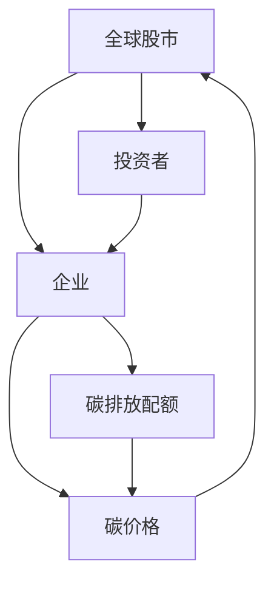

                 


# 全球股市估值与碳交易市场发展的关系

## 关键词：全球股市估值、碳交易市场、气候变化、碳定价模型、可持续投资

## 摘要：  
本文探讨了全球股市估值与碳交易市场之间的关系，分析了碳交易市场如何影响企业碳排放成本，并进一步影响股市估值。通过建立碳定价模型和系统架构，本文揭示了碳交易市场对股市估值的具体影响机制，并通过实际案例分析展示了如何将碳交易数据应用于股市估值预测。文章最后提出了最佳实践和未来研究方向，为投资者和企业提供了有价值的参考。

---

## 第一部分：背景介绍

### 第1章：全球气候变化与碳交易市场背景

#### 1.1 全球气候变化的背景

- **1.1.1 气候变化的现状与挑战**  
  全球气候变化是当前人类面临的最严峻挑战之一。根据联合国政府间气候变化专门委员会（IPCC）的报告，全球气温上升速度远超预期，极端天气事件频发，海平面上升，生态系统破坏等问题日益严重。气候变化不仅威胁到自然环境，还对全球经济、社会和金融市场产生了深远影响。

- **1.1.2 全球碳排放的现状分析**  
  根据国际能源署（IEA）的数据，2022年全球二氧化碳排放量约为36.6亿吨，主要来自化石燃料的使用、工业生产和交通运输等领域。中国、美国、印度等主要经济体的碳排放量占据了全球总量的绝大部分。

- **1.1.3 碳中和目标的全球共识**  
  2015年《巴黎协定》设定了将全球气温上升控制在1.5°C以内的目标。为了实现这一目标，全球各国纷纷提出了碳中和目标，例如欧盟计划在2050年实现碳中和，中国则计划在2060年实现碳中和。

#### 1.2 碳交易市场的起源与发展

- **1.2.1 碳交易市场的定义与基本原理**  
  碳交易市场是通过市场机制减少温室气体排放的工具。其核心是将碳排放权作为一种可交易的资源，企业可以购买碳配额或碳信用（如通过碳汇项目获得的碳抵消信用）来满足减排目标。

- **1.2.2 碳交易市场的历史发展与现状**  
  碳交易市场的起源可以追溯到《京都议定书》（1997年），该议定书建立了国际排放贸易机制。2005年，欧盟碳排放交易系统（EU ETS）正式上线，成为全球最大的碳交易市场。目前，全球有多个碳交易市场，包括欧盟、北美、澳大利亚和亚洲的部分地区。

- **1.2.3 碳交易市场的国际框架与规则**  
  碳交易市场的主要规则包括配额分配、监测报告与核查（MRV）、交易机制和监管框架等。例如，欧盟碳交易市场采用“总量控制与交易”（ cap-and-trade）模式，企业需要在配额限制内排放二氧化碳。

#### 1.3 全球股市估值的变化趋势

- **1.3.1 股市估值的基本概念与影响因素**  
  股市估值是基于企业的财务表现、市场前景、行业竞争状况等因素进行的。传统估值方法包括市盈率（P/E）、市净率（P/B）、股息率等。

- **1.3.2 全球股市估值的变化趋势分析**  
  近年来，全球股市估值波动较大，尤其是2020年新冠疫情爆发后，股市经历了剧烈震荡。与此同时，投资者对ESG（环境、社会、治理）投资的关注度显著提高，绿色金融和可持续投资成为市场热点。

- **1.3.3 碳交易市场对股市估值的影响**  
  碳交易市场通过影响企业的碳排放成本，进而影响企业的盈利能力和估值。例如，高碳排放企业可能面临更高的碳配额成本，从而影响其股价表现。

---

## 第二部分：核心概念与联系

### 第2章：全球股市估值与碳交易市场的核心概念

#### 2.1 核心概念的定义与特征

- **2.1.1 全球股市估值的核心概念**  
  股市估值是衡量企业价值的重要指标，反映了市场对企业的信心和预期。在碳交易市场的影响下，企业的碳排放成本成为影响估值的重要因素。

- **2.1.2 碳交易市场的核心概念**  
  碳交易市场通过市场化手段分配碳排放配额， incentivize企业减少碳排放。碳配额的价格直接影响企业的碳成本。

- **2.1.3 两者的核心概念对比分析**  
  | **概念**       | **股市估值**                | **碳交易市场**             |
  |------------------|-----------------------------|-----------------------------|
  | 核心目标         | 反映企业价值               | 减少温室气体排放           |
  | 主要影响因素     | 财务表现、行业前景          | 碳配额分配、碳价格         |
  | 参与主体         | 投资者、企业                | 企业、政府、金融机构        |

#### 2.2 核心概念的属性特征对比

- **2.2.1 全球股市估值的属性特征**  
  - 时变性：股市估值随市场波动而变化。
  - 主观性：估值基于市场参与者对未来收益的预期。
  - 可测性：可以通过多种指标量化。

- **2.2.2 碳交易市场的属性特征**  
  - 法律性：依赖于政府监管和政策支持。
  - 市场性：通过市场机制分配资源。
  - 可量化：碳排放量和碳价格可量化。

- **2.2.3 核心概念的外延与边界**  
  碳交易市场通过影响企业成本和收益，进而影响股市估值。然而，股市估值还受到其他因素（如经济政策、国际贸易等）的影响，因此需要综合考虑多方面因素。

#### 2.3 实体关系图与概念结构



---

## 第三部分：算法原理与数学模型

### 第3章：碳交易市场对股市估值影响的算法原理

#### 3.1 碳定价模型的原理与流程

- **3.1.1 碳定价模型的基本原理**  
  碳定价模型用于预测碳配额的价格，从而帮助企业制定减排策略。模型通常基于市场供需关系、政策法规和企业行为。

- **3.1.2 碳定价模型的输入与输出**  
  - **输入**：历史碳价格数据、政策目标、企业减排承诺。
  - **输出**：未来碳配额价格预测。

- **3.1.3 碳定价模型的算法流程**  
  ```mermaid
  graph TD
      Start --> Input[输入数据]
      Input --> Model[碳定价模型]
      Model --> Output[输出碳价格预测]
      Output --> End
  ```

#### 3.2 碳排放成本计算的数学模型

- **3.2.1 碳排放成本计算的公式推导**  
  碳排放成本=碳配额价格×碳排放量。

- **3.2.2 碳排放成本对股市估值的影响模型**  
  企业估值=传统估值指标 - 碳排放成本。

- **3.2.3 示例计算与结果分析**  
  假设某企业碳排放量为100万吨，碳配额价格为每吨50欧元，则碳排放成本为5000万欧元。如果该企业市值为10亿欧元，碳排放成本对其估值的影响约为5%。

---

## 第四部分：系统分析与架构设计

### 第4章：系统分析与架构设计方案

#### 4.1 问题场景介绍

- **问题场景**：企业需要通过碳交易市场优化碳排放成本，从而提升股市估值。

#### 4.2 项目介绍

- **项目目标**：开发一个基于碳交易数据的企业估值优化系统。

#### 4.3 系统功能设计

- **4.3.1 领域模型**  
  ```mermaid
  classDiagram
      class 企业 {
          属性: 碳排放量, 传统估值指标
          方法: 计算碳排放成本, 更新企业估值
      }
      class 碳交易市场 {
          属性: 碳配额价格
          方法: 获取碳价格
      }
      企业 --> 碳交易市场: 查询碳价格
  ```

- **4.3.2 系统架构设计**  
  ```mermaid
  architecture
      客户端 --> 企业模块
      企业模块 --> 碳交易市场模块
      碳交易市场模块 --> 数据库
  ```

---

## 第五部分：项目实战

### 第5章：项目实战

#### 5.1 环境安装

- **安装Python**：Python 3.8或更高版本。
- **安装数据获取工具**：Pandas、Matplotlib、Scikit-learn。

#### 5.2 系统核心实现源代码

```python
import pandas as pd
import matplotlib.pyplot as plt

# 示例数据：碳配额价格
carbon_prices = pd.DataFrame({
    '日期': ['2023-01-01', '2023-01-02', '2023-01-03'],
    '碳配额价格(欧元/吨)': [40, 45, 50]
})

# 可视化碳配额价格趋势
carbon_prices.plot(x='日期', y='碳配额价格(欧元/吨)', kind='line')
plt.title('碳配额价格趋势')
plt.show()
```

#### 5.3 代码应用解读与分析

- 该代码展示了如何获取碳配额价格数据，并通过可视化工具展示价格趋势，帮助企业预测碳成本。

---

## 第六部分：最佳实践与小结

### 第6章：最佳实践和小结

#### 6.1 项目小结

- 本文通过建立碳定价模型和系统架构，揭示了碳交易市场对股市估值的影响机制。

#### 6.2 注意事项

- 数据准确性：碳交易数据来源需要可靠。
- 模型局限性：碳定价模型假设市场完全竞争，实际情况可能复杂。

#### 6.3 拓展阅读

- 推荐书籍：《碳交易：驱动全球绿色转型的市场力量》。
- 推荐资源：欧盟碳交易市场报告、国际能源署（IEA）碳排放数据。

---

## 附录

### 附录A：数据来源

- 碳交易数据：欧盟碳交易市场公开数据。
- 股市估值数据：全球主要股票交易所的历史数据。

### 附录B：工具安装说明

- Python安装：https://www.python.org/
- 数据分析工具：Pandas、Matplotlib。

### 附录C：参考文献

- IPCC气候变化报告。
- 《京都议定书》。
- 欧盟碳交易市场规则。

---

以上是《全球股市估值与碳交易市场发展的关系》的完整目录大纲和内容框架。通过系统分析和实际案例，本文为投资者和企业提供了碳交易市场与股市估值关系的深刻洞察。

