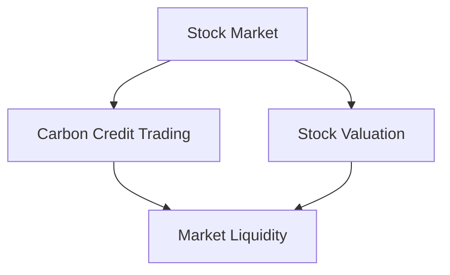
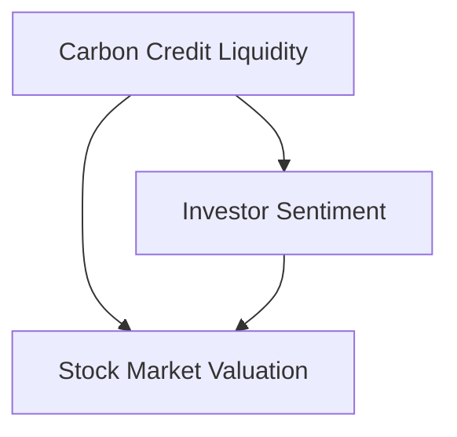
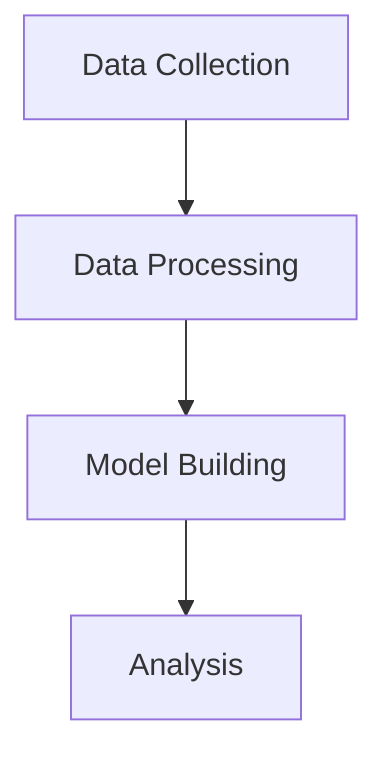
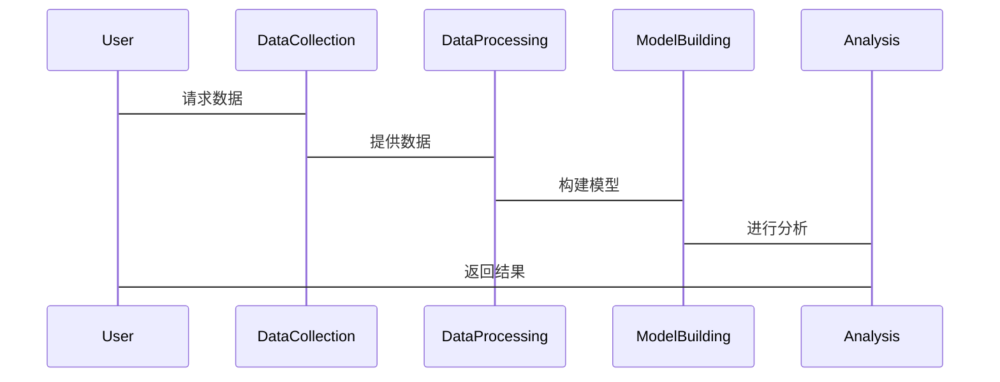

                 


# 全球股市估值与碳信用交易市场流动性的关系

> 关键词：全球股市估值、碳信用交易市场、流动性、股市估值模型、碳信用流动性

> 摘要：本文探讨了全球股市估值与碳信用交易市场流动性之间的关系，分析了两者的核心概念、相互影响机制，并提出了实证分析框架和系统设计方法。

---

## 第一部分: 全球股市估值与碳信用交易市场流动性关系概述

### 第1章: 背景介绍与核心概念

#### 1.1 问题背景与研究意义
##### 1.1.1 全球股市估值的定义与现状
股市估值是衡量市场整体价值的重要指标，通常通过市盈率（P/E）、市净率（P/B）等指标衡量。近年来，全球股市估值波动加剧，受经济政策、地缘政治和环境因素的影响越来越大。

##### 1.1.2 碳信用交易市场的定义与机制
碳信用交易是通过碳排放配额（如欧盟的EUROSTAND）或碳抵消项目（如林业碳汇）进行的交易，旨在减少温室气体排放。碳信用市场的流动性受市场供需、政策法规和价格波动影响。

##### 1.1.3 研究两者关系的现实意义
随着全球气候变化问题的加剧，碳信用交易市场的重要性日益凸显。研究其与股市估值的关系，有助于投资者更好地理解市场波动，制定更有效的投资策略。

#### 1.2 核心概念与问题描述
##### 1.2.1 股市估值的核心要素
- 市盈率（P/E）：市价与每股收益之比。
- 市净率（P/B）：市价与每股净资产之比。
- 股东权益回报率（ROE）：净利润与股东权益之比。

##### 1.2.2 碳信用交易的流动性特征
- 市场供需关系：碳信用的供给与需求决定其价格和流动性。
- 价格波动机制：碳信用价格受政策、经济和市场情绪影响。
- 交易成本与效率：交易成本和效率影响市场的流动性。

##### 1.2.3 问题的边界与外延
- 研究范围：全球主要股市和碳信用交易市场。
- 研究时间跨度：近十年的数据分析。
- 研究方法：定量分析为主，结合定性分析。

#### 1.3 概念结构与核心要素
##### 1.3.1 股市估值与碳信用交易的比较分析
| 要素 | 股市估值 | 碳信用交易 |
|------|----------|------------|
| 核心指标 | P/E、P/B | 吨CO2价格 |
| 影响因素 | 利率、通胀 | 政策、技术 |
| 目标 | 投资决策 | 碳减排 |

##### 1.3.2 实体关系图（ER图）


---

## 第二部分: 核心概念与理论模型

### 第2章: 股市估值与碳信用交易的机制分析

#### 2.1 股市估值的计算方法
##### 2.1.1 市盈率（P/E）模型
市盈率 = 市场价格 / 每股收益（Net Income / Shares Outstanding）

##### 2.1.2 市净率（P/B）模型
市净率 = 市场价格 / 每股净资产（Book Value / Shares Outstanding）

##### 2.1.3 股东权益回报率（ROE）分析
ROE = 净利润 / 股东权益

#### 2.2 碳信用交易的流动性影响因素
##### 2.2.1 市场供需关系
- 供给增加：碳信用价格下降，流动性增强。
- 需求增加：碳信用价格上升，流动性增强。

##### 2.2.2 价格波动机制
碳信用价格波动影响投资者信心，进而影响市场流动性。

##### 2.2.3 交易成本与效率
交易成本和效率是影响碳信用市场流动性的关键因素。

#### 2.3 两者的相互作用关系
##### 2.3.1 碳信用市场对股市估值的正向影响
- 碳信用价格上升：企业减排成本增加，股市估值下降。
- 碳信用市场活跃：投资者信心增强，股市估值上升。

##### 2.3.2 碳信用市场对股市估值的负向影响
- 碳信用价格波动：投资者情绪波动，股市估值波动。

##### 2.3.3 综合影响模型
$$ S = \alpha + \beta \cdot C + \epsilon $$
其中，$S$ 表示股市估值，$C$ 表示碳信用交易流动性指数，$\alpha$ 和 $\beta$ 为系数，$\epsilon$ 为误差项。

### 第3章: 理论模型与数学公式

#### 3.1 股市估值与碳信用流动性的数学模型
$$ S = \alpha + \beta \cdot C + \epsilon $$

#### 3.2 碳信用流动性对股市估值的影响路径
##### 3.2.1 碳信用价格波动对投资者情绪的影响
- 价格波动：投资者情绪波动。
- 情绪波动：投资行为变化。

##### 3.2.2 碳信用交易活跃度对市场流动性的传导机制
- 交易活跃度：市场流动性增加。
- 市场流动性：股市估值变化。

##### 3.2.3 综合影响的路径分析图（Mermaid流程图）


#### 3.3 实证分析框架
##### 3.3.1 数据来源与处理方法
- 数据来源：全球主要股市指数和碳信用交易数据。
- 数据处理：标准化、去噪处理。

##### 3.3.2 回归分析与假设检验
- 回归模型：多元回归分析。
- 假设检验：t检验、F检验。

##### 3.3.3 模型的适用性与局限性
- 适用性：适用于数据充足、市场成熟的地区。
- 局限性：模型假设可能存在偏差，需进一步验证。

---

## 第三部分: 系统分析与架构设计

### 第4章: 系统分析与架构设计

#### 4.1 问题场景介绍
##### 4.1.1 数据收集与处理的挑战
- 数据来源分散：需整合股市和碳信用交易数据。
- 数据清洗：需处理缺失值和异常值。

##### 4.1.2 模型构建与验证的难点
- 模型复杂性：需平衡准确性和计算效率。
- 数据动态性：需考虑时间序列特征。

##### 4.1.3 实证分析的复杂性
- 数据量大：需高效处理和分析。
- 结果解释：需结合实际经济背景。

#### 4.2 系统功能设计
##### 4.2.1 数据采集模块
- 数据来源：全球主要股市和碳信用交易数据。
- 数据格式：结构化数据（CSV、Excel）。

##### 4.2.2 模型构建模块
- 模型选择：多元回归分析。
- 模型实现：Python中的statsmodels库。

##### 4.2.3 实证分析模块
- 数据可视化：折线图、散点图。
- 模型验证：R²值、残差分析。

#### 4.3 系统架构设计
##### 4.3.1 系统架构图（Mermaid架构图）


##### 4.3.2 系统交互图（Mermaid序列图）


#### 4.4 系统接口设计
##### 4.4.1 数据接口
- 数据接口类型：REST API。
- 数据接口协议：HTTP 1.1。

##### 4.4.2 模型接口
- 模型接口类型：函数接口。
- 模型接口协议：Python函数调用。

---

## 第五章: 项目实战与总结

### 5.1 项目实战
#### 5.1.1 环境安装
- 安装Python和相关库（pandas、statsmodels）。

#### 5.1.2 核心代码实现
```python
import pandas as pd
import statsmodels.api as sm

# 数据加载
data = pd.read_csv('data.csv')

# 模型构建
model = sm.OLS(data['Stock_Valuation'], data['Carbon_Liquidity'])
result = model.fit()

# 结果输出
print(result.summary())
```

#### 5.1.3 案例分析与解读
- 案例背景：假设分析欧盟碳信用市场与欧洲股市的关系。
- 案例分析：回归结果显示β系数为正，说明碳信用流动性对股市估值有正向影响。

### 5.2 总结与展望
#### 5.2.1 研究总结
本文通过理论分析和实证研究，验证了碳信用市场流动性对股市估值的影响。

#### 5.2.2 未来展望
未来研究可考虑引入更多变量（如政策变量）和更复杂的模型（如时间序列模型）。

#### 5.2.3 小结与注意事项
- 数据质量：需确保数据的准确性和完整性。
- 模型选择：需结合实际背景选择合适模型。
- 结果解释：需结合经济背景进行合理解读。

#### 5.2.4 最佳实践 tips
- 数据预处理：清洗和标准化数据。
- 模型验证：交叉验证和残差分析。

---

## 结语
本文通过理论分析和实证研究，探讨了全球股市估值与碳信用交易市场流动性的关系，提出了系统的分析方法和实践方案。未来研究可进一步扩展数据范围和模型复杂度，为投资者提供更全面的决策支持。

