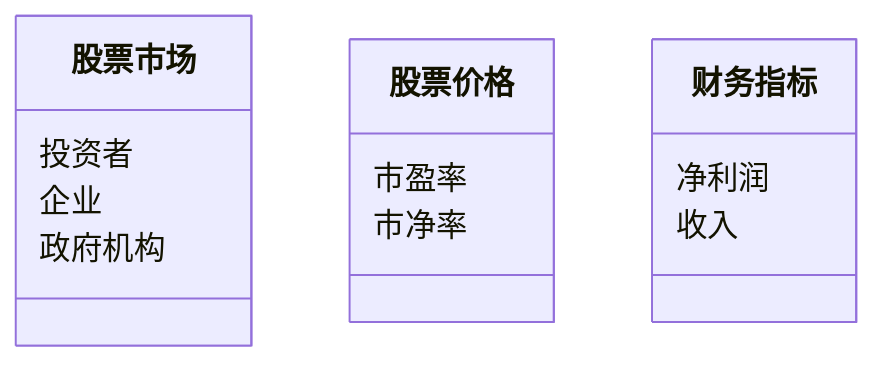
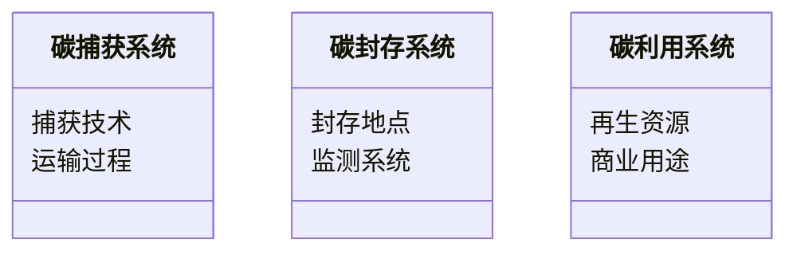

                 


# 全球股市估值与碳捕获利用与封存技术的经济效益

> 关键词：全球股市估值，碳捕获利用与封存技术，经济效益，股市投资，碳技术分析

> 摘要：本文探讨了全球股市估值与碳捕获利用与封存技术（CCUS）之间的关系，分析了两者对经济发展和环境保护的双重影响。通过系统的分析和数学建模，揭示了CCUS技术如何通过降低碳排放成本来提升企业价值，进而影响股市估值。本文还提供了实战案例和最佳实践建议，为投资者和企业提供了科学的决策参考。

---

## 第一部分：全球股市估值与碳捕获利用与封存技术概述

### 第1章：背景与核心概念

#### 1.1 全球股市估值的背景与现状
股票市场作为经济的晴雨表，其估值直接反映了企业的经营状况和市场对未来的预期。全球股市估值的核心在于对企业未来盈利能力的评估，而这一评估受到宏观经济环境、行业趋势和企业基本面的共同影响。

- **1.1.1 股市估值的基本概念与定义**
  股市估值是通过对企业财务指标（如净利润、收入增长率）和市场指标（如市盈率、市净率）的分析，判断股票价格是否合理的过程。它是投资者决策的重要依据。

- **1.1.2 全球股市估值的现状与趋势**
  当前，全球股市估值受通货膨胀、利率政策和地缘政治等因素的影响，波动性显著增加。同时，随着ESG（环境、社会、治理）投资理念的兴起，环保因素逐渐成为影响股市估值的重要因素。

- **1.1.3 股市估值的核心要素与影响因素**
  影响股市估值的主要因素包括宏观经济指标（GDP增长率、利率）、企业基本面（利润、负债）、行业竞争格局和市场情绪等。

#### 1.2 碳捕获利用与封存技术（CCUS）的基本概念
CCUS技术是应对气候变化的重要手段，通过捕获工业过程中产生的二氧化碳，将其再利用或封存在地下，从而减少大气中的碳含量。

- **1.2.1 碳捕获利用与封存技术的定义**
  CCUS技术是一种从工业过程或能源生产中分离和捕获二氧化碳，随后将其用于商业化用途或安全封存的技术。

- **1.2.2 CCUS技术的核心流程与关键环节**
  CCUS技术的核心流程包括二氧化碳的捕获、运输、利用或封存。其中，捕获是关键环节，主要采用化学吸收法、物理吸附法和膜分离法。

- **1.2.3 CCUS技术的分类与应用场景**
  CCUS技术可以分为三个类别：点源碳捕获、工业过程中的碳利用和封存。其应用场景广泛，包括电力行业、化工行业和水泥生产等。

### 第2章：股市估值与CCUS技术的联系

#### 2.1 股市估值与CCUS技术的相互影响
CCUS技术的广泛应用将显著降低企业的碳排放成本，从而提升企业的盈利能力，进而影响其股票估值。同时，股市的资金流动也为CCUS技术的研发和应用提供了资金支持。

- **2.1.1 CCUS技术对股市估值的影响**
  CCUS技术的推广将降低企业的碳排放成本，提升企业的净利润率，从而提高股票的内在价值。此外，CCUS技术的应用还可能带来新的收入来源，如碳交易收入。

- **2.1.2 股市估值对CCUS技术发展的促进作用**
  高估值的股票为企业提供了更多的融资机会，推动了CCUS技术的研发和应用。同时，投资者对CCUS技术的关注也促使企业更加重视碳减排，从而形成良性循环。

#### 2.2 股市估值与CCUS技术的核心概念对比
通过对比分析，可以更好地理解两者之间的关系。

- **2.2.1 股市估值的核心概念属性对比表**

| 指标       | 股市估值 | CCUS技术 |
|------------|----------|----------|
| 核心目标   | 判断股票价格合理性 | 减少碳排放 |
| 主要影响因素 | 宏观经济、企业基本面 | 捕获技术、利用方式 |
| 应用领域   | 投资决策 | 环境保护与经济发展 |

- **2.2.2 CCUS技术的实体关系图（ER图）**

```mermaid
erDiagram
    actor 投资者 {
        <name>
    }
    actor 企业 {
        <name>
    }
    actor 碳交易市场 {
        <name>
    }
    actor 政府机构 {
        <name>
    }
    enterprise 经济系统 {
        <description>
    }
    boundary 股票市场 {
        <description>
    }
    boundary 碳捕获系统 {
        <description>
    }
    boundary 碳封存系统 {
        <description>
    }
    boundary 碳利用系统 {
        <description>
    }
```

### 第3章：股市估值与CCUS技术的数学模型与公式

#### 3.1 股市估值的数学模型
股市估值常用的指标包括市盈率和市净率。

- **3.1.1 市盈率（P/E）公式**
  $$P/E = \frac{Stock Price}{Earnings Per Share}$$

- **3.1.2 市净率（P/B）公式**
  $$P/B = \frac{Stock Price}{Book Value Per Share}$$

#### 3.2 CCUS技术的经济效益模型
CCUS技术的经济效益可以通过成本与收益的对比来评估。

- **3.2.1 CCUS技术成本与收益对比公式**
  $$Net Benefit = Revenue - Cost$$

- **3.2.2 CCUS技术碳减排的经济价值公式**
  $$Carbon Value = CO2 Reduction \times Carbon Price$$

### 第4章：股市估值与CCUS技术的系统分析

#### 4.1 股市估值系统分析
股市估值系统可以通过领域模型图和架构图来展示。

- **4.1.1 股市估值系统功能设计（领域模型图）**



- **4.1.2 股市估值系统架构设计（Mermaid架构图）**


#### 4.2 CCUS技术系统分析
CCUS技术的系统分析同样可以通过领域模型图和架构图来展示。

- **4.2.1 CCUS技术系统功能设计（领域模型图）**



- **4.2.2 CCUS技术系统架构设计（Mermaid架构图）**


### 第5章：股市估值与CCUS技术的项目实战

#### 5.1 股市估值实战
通过Python代码实现股市估值的核心计算。

- **5.1.1 环境安装与数据准备**
  需要安装Python和相关数据处理库（如Pandas、NumPy）。

- **5.1.2 股市估值核心代码实现（Python）**

```python
import pandas as pd

# 假设df是包含股票数据的DataFrame
# 计算市盈率
df['P/E'] = df['Stock Price'] / df['Earnings Per Share']

# 计算市净率
df['P/B'] = df['Stock Price'] / df['Book Value Per Share']

# 输出结果
print(df[['Stock Name', 'P/E', 'P/B']])
```

- **5.1.3 代码应用解读与分析**
  通过代码计算出各股票的市盈率和市净率，投资者可以根据这些指标判断股票的估值是否合理。

#### 5.2 CCUS技术实战
通过Python代码实现CCUS技术的经济效益分析。

- **5.2.1 环境安装与数据准备**
  需要安装Python和相关数据处理库（如Pandas、NumPy）。

- **5.2.2 CCUS技术核心代码实现（Python）**

```python
import pandas as pd

# 假设df是包含碳捕获数据的DataFrame
# 计算净收益
df['Net Benefit'] = df['Revenue'] - df['Cost']

# 计算碳价值
df['Carbon Value'] = df['CO2 Reduction'] * df['Carbon Price']

# 输出结果
print(df[['Project Name', 'Net Benefit', 'Carbon Value']])
```

- **5.2.3 代码应用解读与分析**
  通过代码计算出各CCUS项目的净收益和碳价值，帮助企业评估项目的经济效益。

### 第6章：股市估值与CCUS技术的最佳实践与小结

#### 6.1 最佳实践Tips
- **股市估值**：投资者应关注宏观经济指标和企业基本面，合理评估股票的价值。
- **CCUS技术**：企业应积极采用CCUS技术，降低碳排放成本，提升盈利能力。

#### 6.2 小结
本文详细分析了全球股市估值与碳捕获利用与封存技术之间的关系，揭示了CCUS技术对企业价值和股市估值的积极影响。通过数学建模和系统分析，为投资者和企业提供了科学的决策参考。

#### 6.3 注意事项
- 股市估值受多种因素影响，需综合考虑。
- CCUS技术的应用需考虑成本和技术可行性。

#### 6.4 拓展阅读
- 推荐阅读《投资学基础》和《碳捕获技术与应用》等书籍，以进一步深入了解相关知识。

---

通过以上分析，我们可以看到，股市估值与CCUS技术的结合不仅有助于实现环境保护，还能为企业创造经济价值。希望本文能为投资者和企业提供有益的参考和启示。

