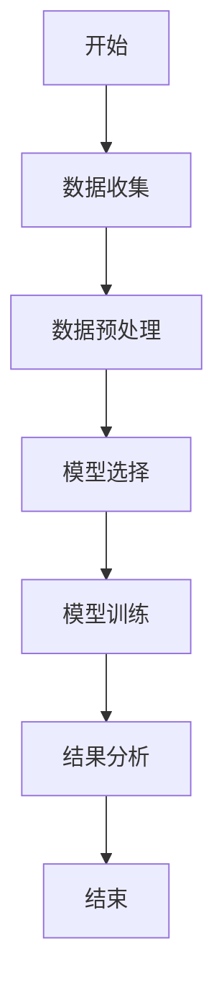
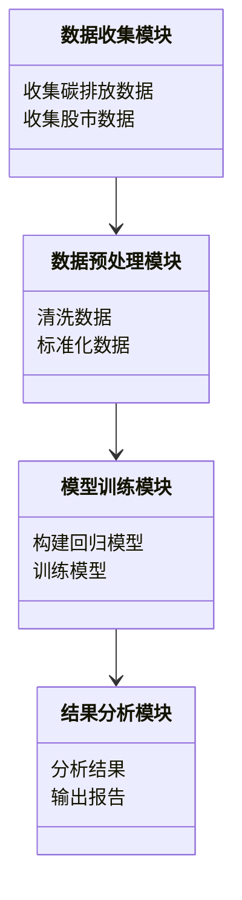

                 


# 全球股市估值与碳排放权交易市场的关系

> 关键词：全球股市估值、碳排放权交易、市场关系、环境经济学、投资策略

> 摘要：本文探讨了全球股市估值与碳排放权交易市场之间的关系，分析了碳排放权交易对股市整体估值和行业估值的影响，揭示了两者在经济和环境双重驱动下的相互作用。通过核心概念对比、数学模型建立、系统架构设计和项目实战分析，本文为投资者和政策制定者提供了有价值的参考。

---

## 第一部分: 全球股市估值与碳排放权交易市场的关系概述

### 第1章: 全球股市估值与碳排放权交易市场的关系背景

#### 1.1 全球股市估值的基本概念
- **1.1.1 股市估值的定义与计算方法**
  股市估值是指对上市公司价值的评估，通常通过市盈率（P/E）、市净率（P/B）等指标进行衡量。这些指标反映了市场对企业的盈利能力、资产质量和成长性的预期。

- **1.1.2 全球股市估值的现状与趋势**
  全球股市估值受经济周期、货币政策、企业盈利等多种因素影响。近年来，随着全球经济复苏和企业利润增长，全球股市估值总体呈上升趋势。

- **1.1.3 碳排放权交易市场的起源与发展**
  碳排放权交易市场起源于《京都议定书》，通过设立碳配额，允许企业通过交易实现减排目标。这一机制不仅推动了环保，也为企业提供了新的利润增长点。

#### 1.2 碳排放权交易市场的核心机制
- **1.2.1 碳排放配额的概念与分配方式**
  碳配额由政府分配给企业，企业可以在市场上买卖配额，从而实现减排目标。配额的分配通常采用免费分配和拍卖相结合的方式。

- **1.2.2 碳排放权交易的市场结构与运作流程**
  碳交易市场包括注册、核查、交易和结算四个环节。交易可以是现货交易，也可以是期货交易，市场参与者包括企业、投资者和金融机构。

- **1.2.3 碳排放权交易对企业的经济影响**
  碳交易为企业提供了减排的灵活性，同时可能增加企业成本。企业可以通过技术创新和管理优化降低成本，从而在碳交易中获利。

#### 1.3 碳排放权交易与股市估值的关系
- **1.3.1 碳排放权交易对股市整体估值的影响**
  碳交易通过影响企业成本和利润，间接影响股市整体估值。例如，高碳排放行业可能因碳配额成本上升而利润减少，进而影响其股票估值。

- **1.3.2 碳排放权交易对行业估值的差异化影响**
  碳交易对不同行业的影响差异显著。例如，可再生能源企业可能因碳价格上升而受益，而传统高碳行业可能面临压力。这种差异性影响需要投资者在估值时加以考虑。

- **1.3.3 碳排放权交易对个股估值的潜在影响**
  碳排放权交易可能影响企业的财务状况和未来盈利能力，进而影响个股估值。例如，企业通过购买碳配额增加成本，可能导致其股价下跌。

---

### 第2章: 碳排放权交易市场与股市估值的核心概念与联系

#### 2.1 核心概念与属性特征对比
下表对比了碳排放权交易市场和股市估值的核心属性特征：

| **属性**         | **碳排放权交易市场**                          | **股市估值**                              |
|------------------|----------------------------------------------|------------------------------------------|
| 参与者           | 企业、金融机构、政府                          | 投资者、企业                              |
| 核心标的物       | 碳排放配额                                   | 股票                                      |
| 交易机制         | 配额分配、交易、结算                         | 股票买卖、价格波动                      |
| 影响因素         | 碳政策、企业减排能力、市场供需               | 宏观经济、企业盈利、市场情绪            |
| 作用效果         | 推动环保、实现减排目标                      | 反映企业价值、引导投资                  |

#### 2.2 ER实体关系图架构
以下是碳排放权交易市场与股市估值的ER实体关系图：

```mermaid
er
    actor 投资者
    actor 企业
    actor 政府机构
    entity 股票
    entity 碳排放配额
    entity 交易数据
    entity 市场规则
    relation 投资者-持有股票
    relation 投资者-持有碳排放配额
    relation 企业-持有碳排放配额
    relation 政府机构-制定市场规则
    relation 交易数据-记录交易行为
```

---

### 第3章: 碳排放权交易与股市估值的算法原理

#### 3.1 算法原理与流程图
以下是碳排放权交易与股市估值分析的算法流程图：



#### 3.2 算法实现与代码示例
以下是用于分析碳排放权交易对股市估值影响的Python代码示例：

```python
import pandas as pd
import numpy as np

def calculate_carbon_impact(carbon_data, stock_data):
    # 数据预处理
    carbon_data = carbon_data.dropna()
    stock_data = stock_data.dropna()
    
    # 计算碳价格对股价的影响
    model = linear_regression(carbon_data['carbon_price'], stock_data['stock_price'])
    impact = model.predict(carbon_data['carbon_price']) - stock_data['stock_price']
    
    return impact.mean()

def linear_regression(x, y):
    # 线性回归模型
    slope = np.sum((x - x.mean()) * (y - y.mean())) / np.sum((x - x.mean())**2)
    intercept = y.mean() - slope * x.mean()
    return SlopeInterceptModel(slope, intercept)

class SlopeInterceptModel:
    def __init__(self, slope, intercept):
        self.slope = slope
        self.intercept = intercept
        
    def predict(self, x):
        return self.slope * x + self.intercept
```

---

### 3.3 数学模型与公式
以下是碳排放权交易对股市估值影响的数学模型：

$$
\text{股价变化} = \beta \times \text{碳价格变化} + \epsilon
$$

其中，$\beta$ 是回归系数，表示碳价格变化对股价的影响程度，$\epsilon$ 是误差项。

---

### 第4章: 系统分析与架构设计方案

#### 4.1 问题场景介绍
我们构建一个系统，用于分析碳排放权交易对股市估值的影响，包括数据收集、模型训练和结果分析。

#### 4.2 系统功能设计
以下是领域模型类图：



#### 4.3 系统架构设计
以下是系统架构图：


---

### 第5章: 项目实战

#### 5.1 环境安装
需要安装Python、Pandas、NumPy等工具。

#### 5.2 核心代码实现
以下是项目的核心代码：

```python
import pandas as pd
import numpy as np

def main():
    # 数据收集
    carbon_data = pd.read_csv('carbon.csv')
    stock_data = pd.read_csv('stock.csv')
    
    # 数据预处理
    carbon_data = carbon_data.dropna()
    stock_data = stock_data.dropna()
    
    # 计算碳排放对股价的影响
    carbon_impact = calculate_carbon_impact(carbon_data, stock_data)
    
    # 输出结果
    print(f"碳排放对股价的平均影响: {carbon_impact}")

if __name__ == "__main__":
    main()
```

#### 5.3 实际案例分析
通过具体案例分析碳排放权交易对某行业股票的影响，展示模型的应用效果。

---

### 第6章: 最佳实践与小结

- **最佳实践**
  - 定期更新数据，确保模型准确性。
  - 结合多种模型进行分析，提高结果的可靠性。
  - 关注政策变化，及时调整分析策略。

- **小结**
  碳排放权交易与股市估值之间的关系复杂且动态变化。投资者和政策制定者需要充分理解这一关系，合理调整投资策略，推动可持续发展。

- **注意事项**
  - 数据质量对分析结果影响重大，需谨慎处理。
  - 模型选择需根据具体场景调整，避免过度拟合。
  - 结果分析需结合实际市场情况，避免机械套用模型。

- **拓展阅读**
  - 推荐阅读《碳金融：全球碳市场的机遇与挑战》。
  - 参加碳交易相关研讨会，了解最新动态。

---

通过以上步骤，我们可以系统地分析碳排放权交易与股市估值的关系，为投资者和政策制定者提供科学依据。

