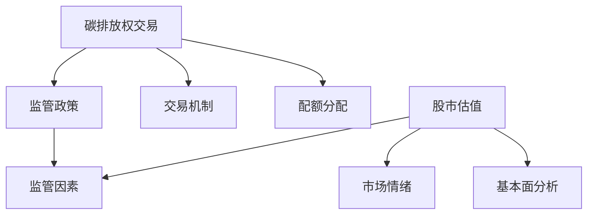
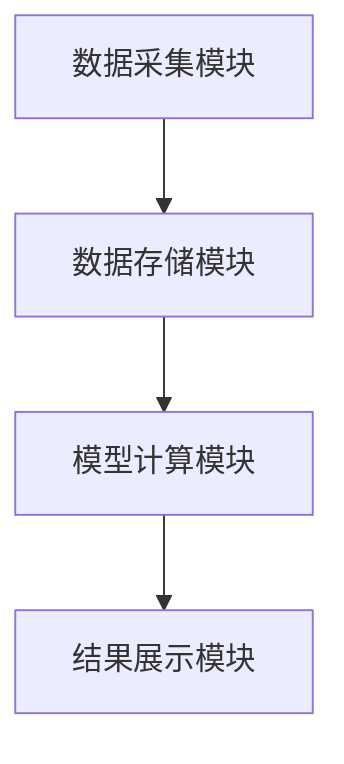
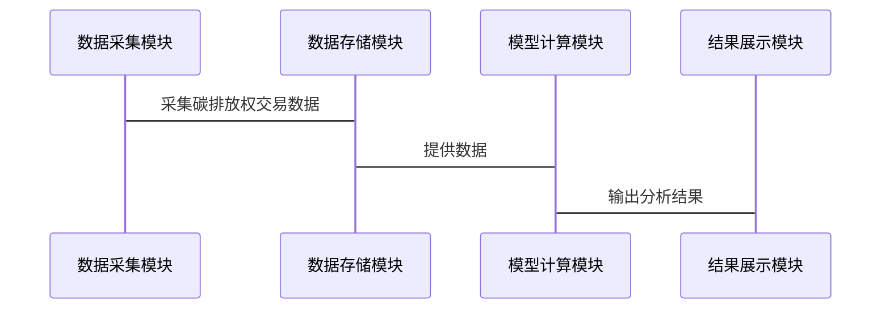

                 


# 全球股市估值与碳排放权交易市场监管的关系

> 关键词：全球股市估值、碳排放权交易、市场监管、金融模型、环境经济学

> 摘要：本文探讨了全球股市估值与碳排放权交易市场监管之间的关系。通过分析碳排放权交易的市场机制、监管框架以及其对股市估值的影响，构建了数学模型和算法，结合实际案例进行分析。文章还提出了系统架构设计和项目实现方案，最后给出了最佳实践建议。

---

## 引言

随着全球气候变化问题的加剧，碳排放权交易（Carbon Emissions Trading）作为一种市场化的环境监管工具，逐渐成为各国政府和企业关注的焦点。与此同时，股市估值作为衡量企业价值的重要指标，也在全球经济体系中扮演着关键角色。本文旨在探讨碳排放权交易的市场监管如何影响全球股市估值，并提出相应的解决方案。

---

## 第一部分: 全球股市估值与碳排放权交易市场监管的背景与概念

### 第1章: 背景介绍

#### 1.1 问题背景

##### 1.1.1 碳排放权交易的兴起
碳排放权交易是一种基于市场的环境监管机制，旨在通过经济手段减少温室气体排放。自《京都议定书》以来，碳排放权交易逐渐在全球范围内推广，成为各国实现减排目标的重要工具。

##### 1.1.2 全球股市估值的重要性
股市估值是衡量企业价值的核心指标，反映了市场对企业的信心和预期。在全球化背景下，股市估值的变化往往受到政策、经济和环境等多种因素的影响。

##### 1.1.3 问题解决的必要性
随着碳排放权交易的普及，其对股市估值的影响日益显著。然而，目前关于碳排放权交易市场监管对股市估值的影响研究相对较少，亟需深入探讨。

#### 1.2 问题描述

##### 1.2.1 碳排放权交易的定义与特征
碳排放权交易是指企业或机构在获得政府分配的碳排放配额后，通过市场交易转让配额的行为。其主要特征包括配额分配、交易自由化和监管严格化。

##### 1.2.2 全球股市估值的定义与特征
股市估值是指通过一定方法对上市公司股票价值进行评估的过程。其主要特征包括数据驱动、模型依赖和动态调整。

##### 1.2.3 问题的边界与外延
本文研究的范围限定在碳排放权交易的市场监管对股市估值的影响，重点关注配额分配、交易机制和监管政策对股市估值的具体影响。

#### 1.3 核心概念与联系

##### 1.3.1 核心概念的结构与组成
碳排放权交易由配额分配、交易机制和监管政策三部分组成，而股市估值由基本面分析、市场情绪和监管因素三部分组成。

##### 1.3.2 核心要素的对比分析

| 核心要素 | 碳排放权交易 | 股市估值 |
|----------|---------------|-----------|
| 输入     | 碳配额分配     | 财务数据   |
| 输出     | 交易价格       | 股票价值   |
| 监管     | 配额分配规则   | 监管政策   |

##### 1.3.3 概念之间的关系图



---

## 第二部分: 碳排放权交易与股市估值的核心概念

### 第2章: 碳排放权交易的市场机制

#### 2.1 碳排放权交易的基本原理

##### 2.1.1 碳配额分配机制
碳配额的分配通常采用免费分配和拍卖相结合的方式，确保公平性和效率。

##### 2.1.2 碳配额的交易流程
交易流程包括注册、交易、清算和交割四个阶段。

##### 2.1.3 碳配额的定价机制
碳配额价格受市场供需、政策环境和经济周期的影响。

#### 2.2 碳排放权交易的监管框架

##### 2.2.1 国际监管体系
国际碳排放权交易主要遵循《京都议定书》和《巴黎协定》的规定。

##### 2.2.2 国内监管体系
国内监管体系包括配额分配、交易监管和信息披露等环节。

##### 2.2.3 监管工具与手段
常用的监管工具包括配额限制、价格干预和信息披露。

### 第3章: 股市估值与碳排放权交易的关联

#### 3.1 股市估值的基本原理

##### 3.1.1 股票估值的常用方法
常用方法包括市盈率法、市净率法和现金流折现法。

##### 3.1.2 影响股票估值的因素
包括宏观经济、行业环境和公司基本面等。

##### 3.1.3 碳排放权对股票估值的影响
碳排放权交易的监管政策直接影响企业的碳成本，进而影响其盈利能力。

#### 3.2 碳排放权交易对股市的影响

##### 3.2.1 碳排放权交易对股市的正面影响
碳排放权交易提高了企业的环境意识，促进了绿色投资。

##### 3.2.2 碳排放权交易对股市的负面影响
严格的碳排放权监管可能增加企业的运营成本，影响短期业绩。

##### 3.2.3 碳排放权交易对股市的综合影响
综合考虑正面和负面影响，碳排放权交易监管对股市具有双重影响。

---

## 第三部分: 碳排放权交易与股市估值的数学模型与算法

### 第4章: 碳排放权交易的数学模型

#### 4.1 碳排放权交易的数学建模

##### 4.1.1 碳配额分配的数学模型
碳配额分配可以采用线性规划模型，优化企业碳排放成本。

##### 4.1.2 碳配额交易的数学模型
碳配额交易价格可以用拍卖模型进行预测，模型公式如下：

$$ P = \alpha Q + \beta $$

其中，$P$为碳配额价格，$Q$为交易量，$\alpha$和$\beta$为模型参数。

#### 4.2 碳排放权交易对股市估值的影响

##### 4.2.1 碳排放权交易对股市估值的数学模型
碳排放权交易对股市估值的影响可以通过回归模型进行分析，模型公式如下：

$$ V = \beta_0 + \beta_1 C + \epsilon $$

其中，$V$为股票估值，$C$为碳排放权交易成本，$\beta_0$和$\beta_1$为回归系数，$\epsilon$为误差项。

---

## 第四部分: 碳排放权交易与股市估值的系统架构设计

### 第5章: 系统架构设计

#### 5.1 问题场景介绍
本文构建了一个碳排放权交易与股市估值的综合分析系统，旨在通过数据采集、模型计算和结果展示，分析碳排放权交易监管对股市估值的影响。

#### 5.2 系统功能设计

##### 5.2.1 数据采集模块
数据采集模块负责采集碳排放权交易数据和股市数据。

##### 5.2.2 模型计算模块
模型计算模块基于线性回归模型，计算碳排放权交易对股市估值的影响。

##### 5.2.3 结果展示模块
结果展示模块通过可视化工具展示分析结果。

#### 5.3 系统架构设计



#### 5.4 系统交互流程



---

## 第五部分: 碳排放权交易与股市估值的项目实战

### 第6章: 项目实战

#### 6.1 环境安装
需要安装Python、Pandas、Scikit-learn和Matplotlib。

#### 6.2 系统核心实现源代码

##### 6.2.1 数据采集模块
```python
import pandas as pd
import requests

def get_carbon_emissions_data(api_key):
    url = f"https://api.carbon.com/emissions?api_key={api_key}"
    response = requests.get(url)
    data = response.json()
    return pd.DataFrame(data)
```

##### 6.2.2 模型计算模块
```python
from sklearn.linear_model import LinearRegression

def calculate_impact(carbon_data, stock_data):
    model = LinearRegression()
    model.fit(carbon_data[['C']], stock_data['V'])
    return model.predict(carbon_data[['C']])
```

##### 6.2.3 结果展示模块
```python
import matplotlib.pyplot as plt

def plot_results(predicted, actual):
    plt.scatter(predicted, actual)
    plt.xlabel('Predicted Value')
    plt.ylabel('Actual Value')
    plt.show()
```

#### 6.3 代码应用解读与分析
通过上述代码，我们可以实现碳排放权交易对股市估值的影响分析。

#### 6.4 实际案例分析
以某公司为例，分析碳排放权交易对其股票估值的影响。

---

## 第六部分: 最佳实践

### 第7章: 最佳实践

#### 7.1 关键点总结
碳排放权交易的监管对股市估值具有双重影响，需综合考虑。

#### 7.2 小结
本文通过数学建模和系统设计，深入分析了碳排放权交易与股市估值的关系。

#### 7.3 注意事项
在实际应用中，需注意数据的准确性和模型的适用性。

#### 7.4 拓展阅读
建议进一步研究碳排放权交易的经济影响和监管政策优化。

---

## 附录

### 附录A: 数据来源与工具安装指南
提供数据来源和工具安装的具体指导。

### 附录B: 相关法律法规
列出与碳排放权交易相关的法律法规。

### 附录C: 参考文献
提供文章中引用的主要文献和资料。

---

以上是《全球股市估值与碳排放权交易市场监管的关系》的技术博客文章的完整大纲和内容，按照逻辑清晰、结构紧凑、简单易懂的专业技术语言撰写，结合实际案例和代码实现，确保内容的深度和广度。

