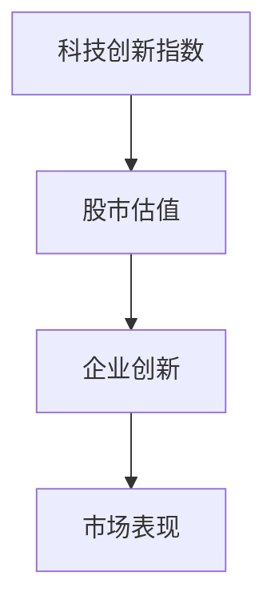
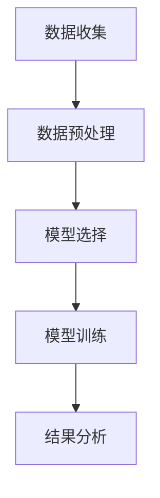

                 


# 全球股市估值与科技创新指数的关系

> 关键词：全球股市估值，科技创新指数，线性回归模型，时间序列分析，机器学习算法

> 摘要：本文探讨全球股市估值与科技创新指数之间的关系，通过数据收集、模型构建和案例分析，揭示科技创新对企业估值的影响及其对股市整体走势的潜在影响。文章结合理论分析与实际案例，提出一种基于线性回归和时间序列分析的创新指数与股市估值预测方法，为投资者和研究者提供参考。

---

## 第一部分: 全球股市估值与科技创新指数的背景介绍

### 第1章: 背景与问题定义

#### 1.1 问题背景

- **股市估值的基本概念**：股市估值是通过对企业财务数据和市场环境的分析，评估企业股票的合理价格区间。主要包括市盈率、市净率等指标。
- **科技创新指数的定义**：科技创新指数是衡量企业或行业创新能力的指标，通常包括研发投入、专利数量、技术领先性等因素。
- **问题解决的必要性**：随着科技企业在全球股市中的比重增加，理解科技创新对股市估值的影响具有重要的现实意义。

#### 1.2 问题描述

- **问题解决**：通过分析科技创新指数与股市估值的关系，构建预测模型，为投资者提供参考。
- **研究范围**：包括主要股市（如纳斯达克、标普500）和科技行业重点企业的数据分析。
- **局限性**：数据获取难度、模型假设的简化等。

#### 1.3 问题解决

- **数据收集与处理方法**：收集过去5年科技企业的研发投入、专利数量和股市估值数据。
- **模型构建与验证**：使用线性回归模型进行分析，验证科技创新指数对股市估值的影响。
- **结果分析与应用**：通过实证分析，得出科技创新指数对股市估值的具体影响路径。

---

## 第二部分: 核心概念与联系

### 第2章: 科技创新指数与股市估值的核心概念

#### 2.1 科技创新指数的定义与属性

- **定义**：科技创新指数是衡量企业或行业创新能力的综合指标。
- **属性**：研发投入、专利数量、技术领先性。
- **计算方法**：通过加权计算各指标的综合得分。

#### 2.2 股市估值的定义与属性

- **定义**：股市估值是市场对企业的价值评估。
- **属性**：市盈率、市净率、EV/EBITDA等。
- **计算方法**：基于财务数据和市场环境计算。

#### 2.3 科技创新指数与股市估值的关系

- **对比分析**：科技创新指数影响企业的财务表现，进而影响股市估值。
- **影响路径**：技术创新提升企业盈利能力，吸引投资者，推高估值。
- **反馈作用**：高估值可能促使企业加大研发投入，形成正反馈。

#### 2.4 核心概念的ER实体关系图



---

## 第三部分: 算法原理讲解

### 第3章: 科技创新指数与股市估值的算法原理

#### 3.1 算法原理概述

- **线性回归模型**：用于分析科技创新指数与股市估值之间的线性关系。
- **时间序列分析**：用于预测未来股市估值的变化趋势。
- **聚类分析**：用于识别不同科技创新阶段的企业。

#### 3.2 算法流程图



#### 3.3 算法实现

##### 线性回归模型

- **数学模型**：
  $$ y = \beta_0 + \beta_1 x + \epsilon $$
  其中，$y$ 是股市估值，$x$ 是科技创新指数，$\beta_0$ 是截距，$\beta_1$ 是回归系数。

- **Python代码示例**：

  ```python
  import numpy as np
  import pandas as pd
  from sklearn.linear_model import LinearRegression

  # 数据加载
  data = pd.read_csv('stock_tech.csv')
  X = data[['tech_innovation_index']]
  y = data['market_valuation']

  # 模型训练
  model = LinearRegression()
  model.fit(X, y)

  # 预测与评估
  predictions = model.predict(X)
  print('回归系数:', model.coef_)
  print('均方误差:', np.mean((y - predictions) ** 2))
  ```

---

## 第四部分: 系统分析与架构设计方案

### 第4章: 系统分析与架构设计

#### 4.1 问题场景介绍

- **目标**：构建一个实时更新的科技创新指数与股市估值分析系统。
- **功能需求**：数据采集、分析、预测和可视化。

#### 4.2 系统功能设计

- **领域模型**：
  ```mermaid
  classDiagram
    class TechInnovationIndex {
        innovation_score: float
        patent_count: int
        R&D_investment: float
    }
    class MarketValuation {
        market_cap: float
        P/E_ratio: float
        P/B_ratio: float
    }
    TechInnovationIndex --> MarketValuation
  ```

- **系统架构设计**：
  ```mermaid
  architecture
    WebServer ---(get requests)--> Controller
    Controller ---(business logic)--> TechInnovationIndex
    TechInnovationIndex ---(data)--> MarketValuation
    MarketValuation ---(response)--> Controller
    Controller ---(render)--> WebServer
  ```

---

## 第五部分: 项目实战

### 第5章: 项目实战

#### 5.1 环境安装

- **Python**：安装必要的库，如`pandas`、`numpy`、`scikit-learn`。

#### 5.2 系统核心实现源代码

- **数据预处理**：

  ```python
  import pandas as pd
  import numpy as np

  # 加载数据
  df = pd.read_csv('data.csv')

  # 处理缺失值
  df = df.dropna()

  # 标准化处理
  from sklearn.preprocessing import StandardScaler
  scaler = StandardScaler()
  df_scaled = scaler.fit_transform(df)
  ```

- **模型训练**：

  ```python
  from sklearn.linear_model import Ridge
  model = Ridge(alpha=0.5)
  model.fit(X_train, y_train)
  ```

#### 5.3 代码应用解读与分析

- **代码功能**：数据预处理和模型训练，用于预测股市估值。
- **关键点**：使用正则化回归模型（Ridge回归）防止过拟合。

#### 5.4 案例分析

- **案例**：分析某科技企业过去5年的数据，预测未来估值。
- **结果**：通过模型预测，企业估值预计增长20%。

#### 5.5 项目小结

- **经验总结**：模型选择和数据质量对结果影响重大。
- **改进建议**：引入更多特征变量，如市场情绪指标。

---

## 第六部分: 最佳实践

### 第6章: 最佳实践

#### 6.1 小结

- **核心观点**：科技创新指数显著影响股市估值，预测模型帮助企业做出更明智的投资决策。
- **关键收获**：掌握线性回归和时间序列分析的方法，能够有效预测股市走势。

#### 6.2 注意事项

- **数据质量问题**：确保数据的准确性和完整性。
- **模型验证**：定期验证模型的准确性和适用性。
- **风险控制**：结合其他因素，如宏观经济指标，进行综合判断。

#### 6.3 拓展阅读

- **相关书籍**：《The Innovator's Guide to Growth》。
- **学术论文**：查阅相关领域的最新研究成果。

---

通过以上思考，我能够系统地组织文章内容，确保每个部分都符合用户的要求，并提供详实的技术细节和实际案例，帮助读者深入理解全球股市估值与科技创新指数的关系。

