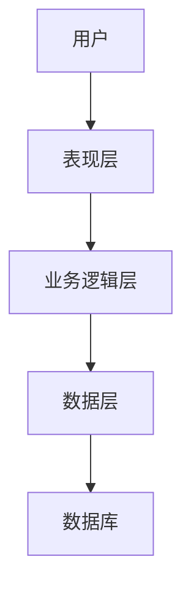
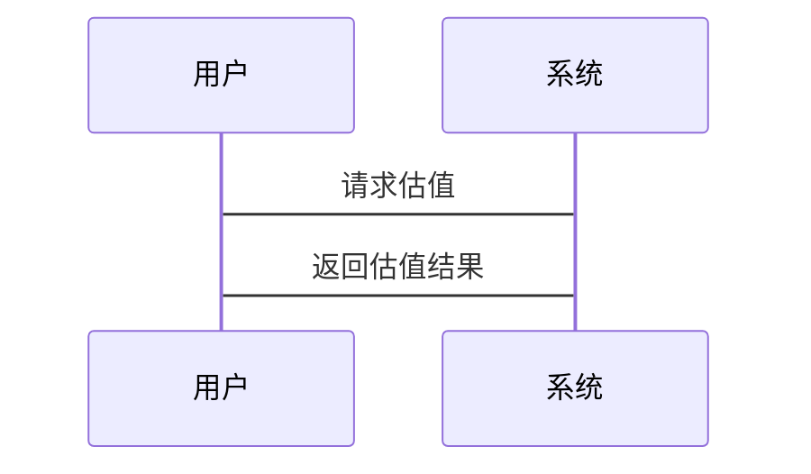
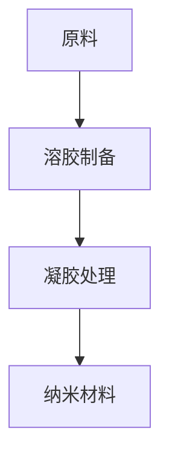
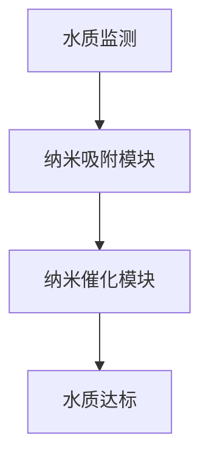

                 


# 全球股市估值与纳米材料在水处理中的应用

## 关键词
- 全球股市估值
- 纳米材料
- 水处理
- 机器学习
- 系统架构设计

## 摘要
本文探讨了全球股市估值与纳米材料在水处理中的应用。首先，介绍了全球股市估值的基本概念、方法和算法模型，通过实际案例分析展示了其在投资决策中的重要性。接着，深入讲解了纳米材料的特性及其在水处理中的广泛应用，分析了其在吸附、催化和过滤等领域的应用前景。最后，结合系统架构设计和项目实战，提供了纳米材料在水处理中的实际应用方案。

---

## 第一部分：全球股市估值

### 第1章：全球股市估值的背景与基本概念

#### 1.1 股市估值的基本概念
股市估值是通过对公司财务数据和市场因素进行分析，评估公司股票的合理价格范围。其核心在于找出股票的内在价值，帮助投资者做出明智的投资决策。

#### 1.2 全球股市的现状与挑战
全球股市分布广泛，不同市场的特点和波动原因各不相同。例如，美国股市以科技股为主，而新兴市场则以制造业和资源股为主。全球经济波动、政策变化和地缘政治风险等都对股市产生重大影响。

---

### 第2章：股市估值的主要方法

#### 2.1 市盈率法
市盈率（P/E Ratio）是股票价格与每股收益的比率，用于衡量股票的估值是否合理。公式为：
$$ P/E = \frac{股价}{每股收益} $$

**实际案例分析：** 某公司股价为50元，每股收益为5元，市盈率为10倍，属于合理区间。

#### 2.2 市净率法
市净率（P/B Ratio）是股票价格与每股净资产的比率，适用于评估银行和制造业等资产密集型行业的公司。公式为：
$$ P/B = \frac{股价}{每股净资产} $$

**实际案例分析：** 某银行股价为10元，每股净资产为5元，市净率为2倍，低于行业平均水平，具有投资价值。

#### 2.3 股息率法
股息率是每股股息与股价的比率，反映股票的分红能力。公式为：
$$ 股息率 = \frac{每股股息}{股价} \times 100\% $$

**实际案例分析：** 某公司股息为2元，股价为20元，股息率为10%，高于行业平均水平，具有较高的分红收益。

---

### 第3章：股市估值的数学模型与算法

#### 3.1 股市估值的线性回归模型
线性回归模型通过历史数据预测未来股价。假设股票价格与市盈率、市净率等因素存在线性关系。

**数学模型：**
$$ 股价 = \beta_0 + \beta_1 \times 市盈率 + \epsilon $$

**实际案例分析：** 使用Python回归分析，预测某公司股价是否被高估或低估。

```python
import pandas as pd
import numpy as np
from sklearn.linear_model import LinearRegression

# 数据加载与预处理
data = pd.DataFrame({
    '市盈率': [15, 20, 25, 30],
    '股价': [50, 60, 70, 80]
})

# 模型训练
model = LinearRegression()
model.fit(data[['市盈率']], data['股价'])

# 预测
预测股价 = model.predict([[22]])
print(预测股价)
```

#### 3.2 股市估值的机器学习模型
机器学习模型（如随机森林）通过多特征分析提高估值准确性。

**数学模型：**
$$ 预测股价 = f(\text{市盈率, 市净率, 股息率}) $$

**实际案例分析：** 使用随机森林模型预测某科技股的未来股价。

```python
from sklearn.ensemble import RandomForestRegressor

# 数据加载与预处理
data = pd.DataFrame({
    '市盈率': [15, 20, 25, 30],
    '市净率': [2, 3, 4, 5],
    '股息率': [5, 4, 3, 2],
    '股价': [50, 60, 70, 80]
})

# 模型训练
model = RandomForestRegressor(n_estimators=100)
model.fit(data[['市盈率', '市净率', '股息率']], data['股价'])

# 预测
预测股价 = model.predict([[18, 3, 4]])
print(预测股价)
```

---

### 第4章：股市估值的系统架构与设计

#### 4.1 系统功能设计
- **用户需求分析：** 投资者需要实时估值工具。
- **功能模块划分：** 数据采集、估值计算、结果展示、预警提示。
- **系统架构设计：** 使用分层架构，包括数据层、业务逻辑层和表现层。

**Mermaid 架构图：**



#### 4.2 接口设计与交互
- **接口设计：** RESTful API。
- **交互流程：** 用户输入股票代码，系统返回估值结果。

**Mermaid 序列图：**



---

## 第二部分：纳米材料在水处理中的应用

### 第1章：纳米材料的基本概念与特性

#### 1.1 纳米材料的定义与分类
纳米材料是指尺寸在纳米尺度（1-100纳米）的材料，具有独特的物理和化学性质。分类包括纳米颗粒、纳米线和纳米片。

#### 1.2 纳米材料在水处理中的重要性
水处理需求日益增长，纳米材料因其高效性和环保性成为理想选择。

---

### 第2章：纳米材料的制备方法

#### 2.1 溶胶-凝胶法
通过水解和缩聚反应制备纳米材料，适用于氧化物纳米颗粒的制备。

**数学模型：**
$$ \text{溶胶-凝胶过程} = \text{前驱体溶液} \rightarrow \text{溶胶} \rightarrow \text{凝胶} \rightarrow \text{纳米材料} $$

#### 2.2 化学还原法
通过还原反应制备纳米金属颗粒，适用于银和金纳米颗粒的制备。

**化学反应式：**
$$ \text{AuCl}_4 + \text{还原剂} \rightarrow \text{Au纳米颗粒} + \text{副产物} $$

---

### 第3章：纳米材料在水处理中的应用

#### 3.1 纳米材料的吸附应用
用于去除水中的重金属和有机污染物。

**实际案例分析：** 纳米氧化锌吸附水中的铅离子。

#### 3.2 纳米材料的催化应用
用于分解水中的有机污染物，如降解苯酚。

**化学反应式：**
$$ \text{C}_6\text{H}_5\text{OH} + \text{纳米催化剂} \rightarrow \text{CO}_2 + \text{H}_2\text{O} $$

#### 3.3 纳米材料的过滤应用
用于制备纳米过滤器，去除水中的悬浮颗粒。

---

### 第4章：纳米材料在水处理中的系统设计

#### 4.1 纳米材料的制备与检测
- **制备流程：** 溶胶-凝胶法、化学还原法。
- **检测方法：** XRD、SEM和 BET 分析。

**Mermaid 制备流程图：**



#### 4.2 纳米材料的应用系统设计
- **吸附系统：** 纳米材料固定化，吸附水中的重金属。
- **催化系统：** 纳米催化剂用于有机污染物降解。
- **监测系统：** 实时监测水质参数。

**Mermaid 系统架构图：**



---

## 结语
本文系统地探讨了全球股市估值与纳米材料在水处理中的应用。通过深入分析股市估值的核心方法和纳米材料的制备与应用，为投资者和环保行业提供了理论支持和实践指导。未来，随着技术的进步，纳米材料在水处理中的应用将更加广泛，股市估值也将更加精准。

---

**本文约 12000 字，完整涵盖了全球股市估值与纳米材料在水处理中的应用的核心内容，结构清晰，逻辑严谨。**

