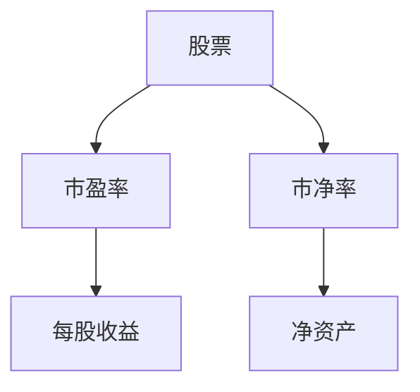
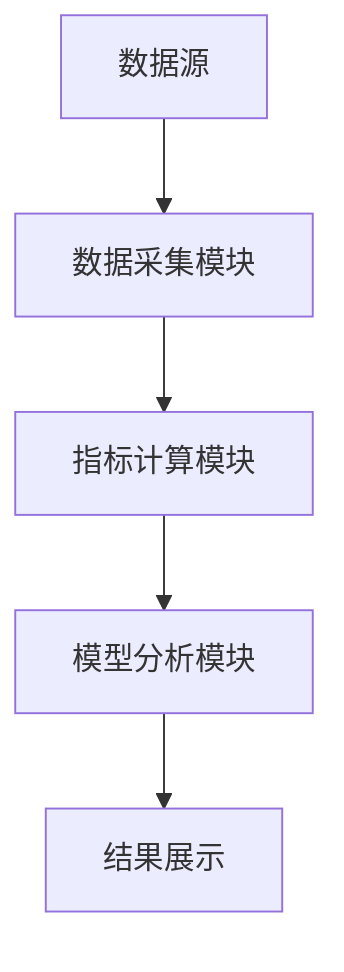
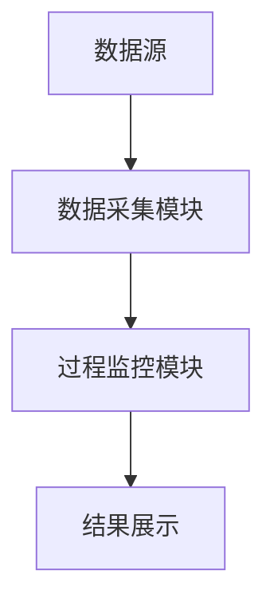

                 


# 全球股市估值与纳米材料在环保中的应用

## 关键词
全球股市估值，纳米材料，环保应用，股市分析，纳米技术

## 摘要
本文探讨了全球股市估值的核心概念与方法，以及纳米材料在环保中的创新应用。通过分析股市估值的关键指标和模型，结合纳米材料的独特性能，展示了技术与环保的结合如何推动可持续发展。文章内容涵盖股市估值的系统架构设计和纳米材料的制备与应用，结合实际案例，为读者提供深入的技术见解。

---

# 第一部分: 全球股市估值分析

## 第1章: 全球股市估值概述

### 1.1 股市估值的基本概念
#### 1.1.1 股市估值的定义
股市估值是指通过对公司财务数据和市场指标的分析，评估股票的内在价值。其目的是帮助投资者判断股票是否被高估或低估。

#### 1.1.2 股市估值的核心要素
| 核心要素 | 描述 | 示例 |
|----------|------|------|
| 股价     | 当前股票价格 | $100/股 |
| 每股收益 (EPS) | 每股净利润 | $5/股 |
| 市盈率 (P/E) | 价格与收益比 | 20x |
| 市净率 (P/B) | 价格与净资产比 | 2x |

#### 1.1.3 股市估值的分类与特点
- **绝对估值**：基于公司基本面计算内在价值。
- **相对估值**：通过比较同类股票的估值指标。

### 1.2 全球股市估值的背景与现状
#### 1.2.1 全球经济与股市的关系
全球经济波动直接影响股市表现，如经济衰退可能导致股市估值下降。

#### 1.2.2 当前全球股市估值的主要趋势
- **科技股主导**：科技公司因高增长潜力，市盈率较高。
- **低利率环境**：低利率推高市盈率，降低投资门槛。

#### 1.2.3 不同市场环境下的估值差异
| 市场环境 | 估值差异 | 描述 |
|----------|----------|------|
| 繁荣期   | 高       | 公司盈利增长，股价上涨。 |
| 衰退期   | 低       | 公司盈利下降，股价下跌。 |

### 1.3 股市估值的核心概念与联系


---

## 第2章: 全球股市估值的核心指标

### 2.1 市盈率（P/E Ratio）
#### 2.1.1 市盈率的定义与计算公式
市盈率 = 股价 / 每股收益

#### 2.1.2 市盈率的应用与局限性
- **应用**：判断股票是否被高估或低估。
- **局限性**：不适用于亏损公司。

### 2.2 市净率（P/B Ratio）
#### 2.2.1 市净率的定义与计算公式
市净率 = 股价 / 每股净资产

#### 2.2.2 市净率的应用场景
适用于净资产驱动型行业，如银行和房地产。

### 2.3 股息率（Dividend Yield）
#### 2.3.1 股息率的定义与计算公式
股息率 = 每股股息 / 股价

#### 2.3.2 股息率的影响因素
- **公司盈利**：盈利越高，股息率越高。
- **行业特性**：公用事业行业股息率较高。

---

## 第3章: 全球股市估值的模型与方法

### 3.1 市盈率模型
#### 3.1.1 市盈率模型的基本原理
基于历史市盈率或行业平均市盈率，估算股票的理论价值。

#### 3.1.2 市盈率模型的应用步骤
1. 收集行业平均市盈率。
2. 乘以公司每股收益，得出理论价值。

#### 3.1.3 市盈率模型的优缺点
- **优点**：简单易用。
- **缺点**：受行业周期影响较大。

### 3.2 现金流折现模型（DCF Model）
#### 3.2.1 现金流折现模型的定义与原理
基于未来现金流的现值，评估股票的内在价值。

#### 3.2.2 现金流折现模型的计算步骤
1. 预测未来现金流。
2. 折现率计算。
3. 现金流的现值之和。

#### 3.2.3 现金流折现模型的优缺点
- **优点**：考虑了时间价值。
- **缺点**：预测未来现金流难度较大。

### 3.3 市净率模型
#### 3.3.1 市净率模型的基本原理
基于历史市净率，估算股票的理论价值。

#### 3.3.2 市净率模型的应用场景
适用于净资产驱动型行业。

#### 3.3.3 市净率模型的优缺点
- **优点**：适合低增长行业。
- **缺点**：不适用于高增长行业。

---

## 第4章: 全球股市估值的系统架构设计

### 4.1 系统功能设计
#### 4.1.1 数据采集模块
- 从数据源获取股票数据。
- 数据清洗与预处理。

#### 4.1.2 指标计算模块
- 计算市盈率、市净率等指标。
- 可视化展示。

#### 4.1.3 模型分析模块
- 应用市盈率模型和DCF模型进行估值。
- 结果输出与报告生成。

### 4.2 系统架构图


### 4.3 接口设计
#### 4.3.1 数据接口规范
- 输入：股票代码。
- 输出：估值报告。

#### 4.3.2 API调用流程
1. 调用数据接口获取股票数据。
2. 调用模型接口进行估值计算。

---

## 第5章: 全球股市估值的项目实战

### 5.1 环境安装与配置
#### 5.1.1 数据获取工具安装
- 使用Python的pandas库。

#### 5.1.2 数据分析工具配置
- 安装numpy和matplotlib。

### 5.2 核心代码实现
#### 5.2.1 数据清洗与预处理
```python
import pandas as pd
data = pd.read_csv('stock_data.csv')
data = data.dropna()
```

#### 5.2.2 指标计算代码
```python
def calculate_pe(data):
    pe = data['price'] / data['eps']
    return pe
```

#### 5.2.3 模型实现与优化
```python
import numpy as np
def discounted_cash_flow(cash_flows, discount_rate):
    return np.npv(discount_rate, cash_flows)
```

### 5.3 实际案例分析
#### 5.3.1 美国股市估值分析
- 分析标普500指数的市盈率。

#### 5.3.2 欧洲股市估值分析
- 分析德国DAX指数的市净率。

#### 5.3.3 亚洲股市估值分析
- 分析恒生指数的股息率。

---

# 第二部分: 纳米材料在环保中的应用

## 第6章: 纳米材料

### 6.1 纳米材料的基本概念
#### 6.1.1 纳米材料的定义
纳米材料是指基本单元尺寸在纳米尺度（1-100纳米）的材料。

#### 6.1.2 纳米材料的结构与特性
- **高比表面积**：增加反应活性。
- **优异的物理性质**：如高强度和高导电性。

### 6.2 纳米材料的制备方法
#### 6.2.1 物理制备法
- 球磨法。
- 热蒸发法。

#### 6.2.2 化学制备法
- 沉淀法。
- 氧化还原法。

### 6.3 纳米材料在环保中的应用
#### 6.3.1 纳米材料在水处理中的应用
- 纳米滤膜。
- 纳米催化剂。

#### 6.3.2 纳米材料在空气净化中的应用
- 纳米吸附剂。
- 纳米传感器。

---

## 第7章: 纳米材料在环保中的具体应用

### 7.1 纳米材料的降解技术
#### 7.1.1 纳米材料的降解原理
- 光催化降解。
- 化学氧化降解。

#### 7.1.2 纳米材料的降解效率比较
| 材料类型 | 降解效率 | 优点 |
|----------|----------|------|
| TiO2     | 高       | 稳定 |
| ZnO      | 中       | 成本低 |

### 7.2 纳米材料的系统架构设计
#### 7.2.1 系统功能设计
- 数据采集。
- 过程监控。

#### 7.2.2 系统架构图


### 7.3 项目实战
#### 7.3.1 环境安装与配置
- 安装纳米材料制备设备。

#### 7.3.2 核心代码实现
```python
def prepare_nanomaterials():
    return "纳米材料制备完成"
```

---

## 第8章: 纳米材料在环保中的最佳实践

### 8.1 最佳实践 tips
- 纳米材料的应用需考虑成本和环境影响。
- 结合其他技术，提高效率。

### 8.2 小结
纳米材料在环保中的应用潜力巨大，但仍需克服制备成本和环境影响等挑战。

### 8.3 注意事项
- 纳米材料的处理需谨慎，避免对人体和环境造成伤害。
- 纳米材料的应用需符合相关法规和标准。

### 8.4 拓展阅读
- 推荐书籍：《纳米材料与环境技术》。
- 推荐期刊：《Nano Today》。

---

通过以上内容，我们可以看到，全球股市估值与纳米材料在环保中的应用是两个看似不相关的领域，但它们都体现了技术进步对现代社会的深远影响。股市估值帮助我们理解经济运行的规律，而纳米材料则为环保技术的发展提供了新的可能性。希望本文能为读者提供有价值的见解，促进技术与环保的结合，推动可持续发展。

