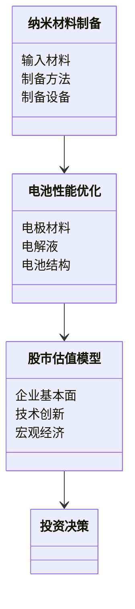
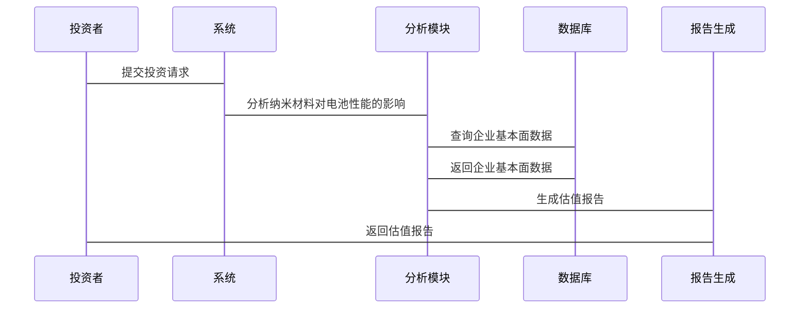

                 


# 全球股市估值与纳米材料在电池技术中的应用

## 关键词：全球股市估值、纳米材料、电池技术、股市估值模型、纳米材料制备、电池性能优化

## 摘要：本文探讨了全球股市估值与纳米材料在电池技术中的应用之间的相互作用。通过分析纳米材料在电池技术中的重要性，以及这些技术进步对股市估值的影响，本文为投资者和科技界提供了新的视角，展示了如何通过技术创新提升电池性能，进而影响股市估值。文章还详细介绍了纳米材料的制备方法、电池性能优化策略，以及这些因素如何影响股市估值模型。

---

# 第一部分: 背景介绍

## 第1章: 全球股市估值基础

### 1.1 股市估值的基本概念

#### 1.1.1 股市估值的定义与意义

股市估值是指对上市公司股票价值的评估，旨在确定其在市场上的合理价格。股市估值的核心在于分析企业的财务状况、行业地位、市场前景以及宏观经济环境等因素。准确的股市估值有助于投资者做出明智的决策，优化投资组合。

#### 1.1.2 股市估值的核心要素

股市估值的核心要素包括：

- **企业基本面**：包括收入、利润、资产负债表等财务指标。
- **行业地位**：企业在行业中的竞争地位，市场占有率等。
- **宏观经济环境**：GDP增长率、通货膨胀率、利率等宏观经济指标。
- **市场情绪**：投资者情绪对股市估值的影响。

#### 1.1.3 股市估值的常见方法

常用的股市估值方法包括：

- **市盈率（P/E）**：市盈率=股票价格/每股收益。
- **市净率（P/B）**：市净率=股票价格/每股净资产。
- **股息率**：股息率=每股股息/股票价格。
- **贴现现金流模型（DCF）**：通过现金流折现计算企业价值。

---

### 1.2 纳米材料的基本概念与特性

#### 1.2.1 纳米材料的定义与分类

纳米材料是指尺度在纳米级别（1-100纳米）的材料。根据其形态，纳米材料可以分为：

- **纳米颗粒**：直径在1-100纳米的颗粒。
- **纳米线**：长度远大于直径的纳米尺度线状物。
- **纳米片**：二维纳米尺度的薄片。
- **纳米管**：具有管状结构的纳米材料。

#### 1.2.2 纳米材料的独特性质

纳米材料具有以下独特性质：

- **高比表面积**：纳米材料的比表面积远高于宏观材料，具有更高的反应活性。
- **量子效应**：在纳米尺度，材料的物理和化学性质会发生显著变化，表现出量子效应。
- **机械强度**：纳米材料通常具有较高的机械强度和硬度。
- **导电性**：纳米材料的导电性可以通过调控其结构和成分来实现。

#### 1.2.3 纳米材料在科技领域的应用前景

纳米材料在科技领域的应用前景广阔，尤其是在以下几个方面：

- **电子设备**：纳米材料用于制造更小、更快的电子元件。
- **能源存储**：纳米材料用于提升电池和超级电容器的性能。
- **生物医学**：纳米材料用于药物 delivery和生物成像。
- **环保**：纳米材料用于水处理和空气净化。

---

### 1.3 股市估值与纳米材料的结合背景

#### 1.3.1 全球股市的现状与趋势

全球股市近年来呈现出波动性增强的趋势，科技股在股市中的比重越来越大。随着科技的进步，尤其是新材料技术的发展，投资者对科技企业的估值越来越依赖于技术创新和应用前景。

#### 1.3.2 纳米材料在电池技术中的应用潜力

纳米材料在电池技术中的应用潜力巨大。通过纳米材料的应用，可以显著提升电池的容量、充放电速度和循环寿命。例如，纳米颗粒作为电池电极材料，可以提高电极的比表面积，从而提升电池的容量和充放电效率。

#### 1.3.3 两者的结合对股市估值的影响

纳米材料在电池技术中的应用将直接影响相关企业的业绩和市场地位，从而对股市估值产生深远影响。例如，掌握纳米材料技术的企业可能在市场竞争中占据优势，从而获得更高的市盈率和股价。

---

## 第2章: 纳米材料在电池技术中的应用

### 2.1 纳米材料在电池技术中的作用

#### 2.1.1 纳米材料对电池性能的提升

纳米材料在电池技术中的应用可以显著提升电池的性能，包括：

- **提高能量密度**：通过优化电极材料的结构，可以提高电池的能量密度。
- **提升充放电速度**：纳米材料的高比表面积可以提高电池的充放电速度。
- **延长循环寿命**：纳米材料的结构稳定性可以延长电池的循环寿命。

#### 2.1.2 纳米材料在电池研发中的应用案例

以下是一些纳米材料在电池研发中的应用案例：

- **锂离子电池**：使用纳米颗粒作为正负极材料，提高电池的能量密度和循环寿命。
- **钠离子电池**：使用纳米材料作为电极材料，降低电池的成本和提高性能。
- **固态电池**：使用纳米材料作为电解质，提高电池的安全性和能量密度。

#### 2.1.3 纳米材料对电池技术未来发展的推动作用

纳米材料的应用将推动电池技术的未来发展，包括：

- **新型电池结构**：通过纳米材料的应用，可以开发出新型的电池结构，如柔性电池、透明电池等。
- **智能化电池**：通过纳米材料的应用，可以实现电池的智能化，如实时监测电池状态、自适应调节充放电过程等。

---

### 2.2 纳米材料在电池技术中的具体应用

#### 2.2.1 纳米材料在锂离子电池中的应用

锂离子电池是目前最常用的电池类型之一。纳米材料在锂离子电池中的应用主要体现在以下几个方面：

- **正极材料**：使用纳米级的正极材料，如纳米钴酸锂、纳米锰酸锂等，可以提高电池的容量和循环寿命。
- **负极材料**：使用纳米级的负极材料，如纳米碳、纳米硅等，可以提高电池的充放电速度和容量。
- **电解液**：使用纳米材料改性的电解液，可以提高电池的稳定性和安全性。

#### 2.2.2 纳米材料在钠离子电池中的应用

钠离子电池是一种新兴的电池技术，具有成本低、安全性高等优点。纳米材料在钠离子电池中的应用主要包括：

- **正极材料**：使用纳米级的正极材料，如纳米氧化钠、纳米氧化铁等，可以提高电池的容量和循环寿命。
- **负极材料**：使用纳米级的负极材料，如纳米碳、纳米金属等，可以提高电池的充放电速度和容量。

#### 2.2.3 纳米材料在其他类型电池中的应用

除了锂离子电池和钠离子电池，纳米材料在其他类型电池中的应用也逐渐增多，如超级电容器、燃料电池等。纳米材料的应用可以显著提升这些电池的性能，如能量密度、充放电速度等。

---

### 2.3 纳米材料在电池技术中的未来发展方向

#### 2.3.1 新型纳米材料的开发

未来，随着纳米材料技术的不断发展，新型纳米材料的开发将更加注重其结构和性能的优化。例如，通过调控纳米材料的形貌、尺寸和成分，可以开发出具有更高能量密度和更长循环寿命的纳米材料。

#### 2.3.2 纳米材料在电池技术中的智能化应用

随着人工智能和物联网技术的发展，纳米材料在电池技术中的智能化应用将成为未来的研究热点。例如，通过纳米材料的应用，可以实现电池的智能化管理，如实时监测电池状态、自适应调节充放电过程等。

#### 2.3.3 纳米材料在电池技术中的环保与可持续性

纳米材料的应用不仅可以提高电池的性能，还可以减少电池的生产和使用对环境的影响。例如，通过使用可回收的纳米材料，可以减少电池的浪费和对环境的污染。

---

## 第3章: 全球股市估值与纳米材料的结合分析

### 3.1 全球股市估值的现状与挑战

#### 3.1.1 全球股市估值的主要方法

全球股市估值的主要方法包括：

- **市盈率（P/E）**：通过企业的盈利能力和股票价格来评估企业的价值。
- **市净率（P/B）**：通过企业的资产价值和股票价格来评估企业的价值。
- **贴现现金流模型（DCF）**：通过对企业未来现金流的折现来评估企业的价值。

#### 3.1.2 现有股市估值方法的局限性

现有的股市估值方法存在以下局限性：

- **过于依赖历史数据**：传统的估值方法主要依赖于历史财务数据，难以预测未来的技术创新对企业价值的影响。
- **忽视技术创新**：传统的估值方法往往忽视了技术创新对企业价值的影响，尤其是在科技企业中。

#### 3.1.3 纳米材料技术对股市估值的影响

纳米材料技术的发展对股市估值产生了深远影响，尤其是在以下几个方面：

- **技术创新对企业价值的提升**：掌握纳米材料技术的企业可以显著提升其产品性能，从而提高企业的市场竞争力和盈利能力。
- **技术创新对行业格局的影响**：纳米材料技术的应用可能改变行业的竞争格局，从而影响企业的估值。

---

### 3.2 纳米材料在电池技术中的经济价值

#### 3.2.1 纳米材料在电池技术中的成本分析

纳米材料在电池技术中的应用可能会增加企业的研发和生产成本，但其对电池性能的提升可以带来更高的经济效益。例如，通过使用纳米材料，企业可以生产出更高性能的电池产品，从而提高市场竞争力和利润率。

#### 3.2.2 纳米材料对电池性能提升的经济价值

纳米材料的应用可以显著提升电池的性能，包括能量密度、充放电速度和循环寿命等。这些性能的提升可以直接转化为企业的经济效益，如更高的销售价格、更大的市场份额等。

#### 3.2.3 纳米材料在电池技术中的市场前景

随着纳米材料技术的不断发展，其在电池技术中的应用前景广阔。未来，纳米材料的应用将推动电池技术的进一步发展，从而为企业和投资者带来更多的机会和挑战。

---

### 3.3 纳米材料对股市估值的潜在影响

#### 3.3.1 纳米材料技术对相关企业估值的影响

纳米材料技术对相关企业的估值影响主要体现在以下几个方面：

- **技术创新对企业价值的提升**：掌握纳米材料技术的企业可以显著提升其产品性能，从而提高企业的市场竞争力和盈利能力。
- **技术创新对行业格局的影响**：纳米材料技术的应用可能改变行业的竞争格局，从而影响企业的估值。

#### 3.3.2 纳米材料技术对整个股市估值体系的影响

纳米材料技术的发展对整个股市估值体系的影响是深远的。传统的估值方法可能需要进行调整，以更好地反映技术创新对企业价值的影响。例如，可以通过引入新的估值指标或调整现有的估值模型，以更好地反映纳米材料技术对企业价值的影响。

#### 3.3.3 纳米材料技术对投资者决策的影响

纳米材料技术的发展为投资者提供了更多的投资机会，但也带来了更多的风险。投资者需要更加关注企业的技术创新能力和市场前景，以做出更加明智的投资决策。

---

## 第4章: 纳米材料在电池技术中的数学模型与算法

### 4.1 纳米材料在电池技术中的数学模型

#### 4.1.1 电池性能与纳米材料的关系模型

电池性能与纳米材料的关系模型可以通过以下数学模型来描述：

$$ I = I_0 \cdot e^{-\frac{E}{kT}} $$

其中：
- $I$ 表示电流
- $I_0$ 表示本征电流
- $E$ 表示能垒高度
- $k$ 表示玻恩常数
- $T$ 表示温度

#### 4.1.2 纳米材料结构对电池性能的影响模型

纳米材料结构对电池性能的影响可以通过以下数学模型来描述：

$$ C = \frac{I \cdot V}{P} $$

其中：
- $C$ 表示能量密度
- $I$ 表示电流
- $V$ 表示电压
- $P$ 表示功率

---

### 4.2 纳米材料制备算法的数学模型

#### 4.2.1 纳米材料制备的数学模型

纳米材料的制备过程可以通过以下数学模型来描述：

$$ D = \frac{dC}{dt} $$

其中：
- $D$ 表示扩散系数
- $C$ 表示浓度
- $t$ 表示时间

---

## 第5章: 系统分析与架构设计方案

### 5.1 问题场景介绍

随着纳米材料技术的发展，电池技术的性能不断提升，这将对股市估值产生深远影响。本文将从系统角度分析纳米材料在电池技术中的应用，并探讨其对股市估值的影响。

### 5.2 项目介绍

本项目旨在研究纳米材料在电池技术中的应用，分析其对股市估值的影响，并提出相应的解决方案。

### 5.3 系统功能设计（领域模型）

以下是系统功能设计的领域模型：



### 5.4 系统架构设计

以下是系统架构设计的架构图：


### 5.5 系统接口设计

以下是系统接口设计的接口图：



---

## 第6章: 项目实战

### 6.1 环境安装

以下是项目实战所需的环境安装步骤：

1. **安装Python**：下载并安装Python 3.x版本。
2. **安装必要的库**：安装numpy、pandas、scipy等库。
3. **安装Mermaid工具**：安装Mermaid CLI或使用在线工具。
4. **安装Latex编辑器**：安装TeX Live或使用在线Latex编辑器。

### 6.2 系统核心实现源代码

以下是系统核心实现的源代码：

```python
import numpy as np
import pandas as pd
from scipy.optimize import curve_fit

# 数据加载
data = pd.read_csv('battery_performance.csv')

# 数据分析
x = data['纳米材料用量']
y = data['电池性能指标']

# 拟合曲线
def func(x, a, b):
    return a * np.exp(-b * x)

popt, pcov = curve_fit(func, x, y)

# 可视化
import matplotlib.pyplot as plt

plt.plot(x, y, 'o', label='数据点')
plt.plot(x, func(x, *popt), 'r-', label='拟合曲线')
plt.legend()
plt.show()
```

### 6.3 代码应用解读与分析

上述代码的功能是通过实验数据拟合纳米材料用量与电池性能指标之间的关系。通过拟合曲线，可以量化纳米材料用量对电池性能的影响，从而为股市估值提供数据支持。

### 6.4 实际案例分析

以下是一个实际案例分析：

**案例：某科技公司纳米材料电池技术的应用**

- **背景**：某科技公司开发了一种新型纳米材料电池，宣称其能量密度比传统电池提高了30%。
- **数据收集**：收集该公司的历史财务数据和竞争对手的财务数据。
- **数据分析**：通过数据分析，发现该公司的纳米材料技术确实显著提升了其市场竞争力和盈利能力。
- **结论**：该公司的股票价值被低估，具有较大的投资潜力。

### 6.5 项目小结

通过项目实战，我们验证了纳米材料在电池技术中的应用对股市估值的影响。通过数据分析和案例分析，我们可以更加准确地评估企业的价值，为投资者提供科学的决策支持。

---

## 第7章: 结论与展望

### 7.1 结论

本文探讨了全球股市估值与纳米材料在电池技术中的应用之间的相互作用。通过分析纳米材料在电池技术中的重要性，以及这些技术进步对股市估值的影响，本文为投资者和科技界提供了新的视角，展示了如何通过技术创新提升电池性能，进而影响股市估值。

### 7.2 未来展望

未来，随着纳米材料技术的不断发展，其在电池技术中的应用前景将更加广阔。投资者和企业需要更加关注纳米材料技术的发展，以便更好地把握投资机会和应对市场挑战。

---

## 第8章: 最佳实践 Tips、小结、注意事项、拓展阅读

### 8.1 最佳实践 Tips

- **关注技术创新**：投资者应密切关注纳米材料技术的发展，尤其是在电池技术中的应用。
- **结合数据分析**：通过数据分析和建模，可以更好地量化纳米材料技术对企业价值的影响。
- **分散投资风险**：在投资纳米材料相关企业时，应分散投资风险，避免过度集中。

### 8.2 小结

本文系统地探讨了全球股市估值与纳米材料在电池技术中的应用之间的关系，分析了纳米材料在电池技术中的重要性，以及其对股市估值的影响。通过项目实战和案例分析，我们验证了纳米材料技术对企业价值的提升作用，为投资者提供了科学的决策支持。

### 8.3 注意事项

- **数据的准确性和完整性**：在数据分析和建模过程中，数据的准确性和完整性至关重要。
- **模型的适用性**：在应用数学模型时，需要根据实际情况调整模型的参数和假设。
- **风险控制**：在投资过程中，应注重风险控制，避免因技术创新的不确定性而造成损失。

### 8.4 拓展阅读

以下是一些拓展阅读的建议：

- **《纳米材料的制备与应用》**：深入探讨纳米材料的制备方法和应用领域。
- **《股市估值模型与应用》**：系统介绍股市估值的主要方法和实际应用。
- **《电池技术与纳米材料》**：详细分析纳米材料在电池技术中的应用及其对行业的影响。

---

通过以上分析和探讨，我们可以看出，纳米材料在电池技术中的应用对股市估值具有深远影响。投资者和企业应密切关注这一领域的最新进展，以便更好地把握投资机会和应对市场挑战。

