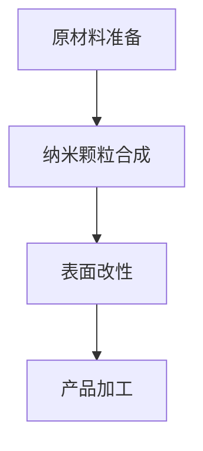

                 

# 全球股市估值与纳米材料在空气净化中的应用

---

## 关键词：全球股市估值、纳米材料、空气净化、股市分析、纳米技术

---

## 摘要：

本文探讨了全球股市估值与纳米材料在空气净化中的应用之间的联系。通过分析股市估值的基本概念、影响因素以及纳米材料在空气净化技术中的应用，本文揭示了纳米技术如何影响股市估值，并进一步分析了纳米材料在空气净化中的潜力及其对股市的长期影响。文章结合实际案例和数学模型，深入解析了这两个领域的相互作用，为投资者和技术爱好者提供了有价值的参考。

---

## 第一部分: 全球股市估值基础

### 第1章: 股市估值的基本概念与方法

#### 1.1 股市估值的定义与背景

股市估值是通过对上市公司股票的内在价值进行评估，以确定其市场价格是否合理的过程。其核心在于分析公司的财务状况、行业地位、盈利能力以及宏观经济环境等因素。股市估值不仅是投资者做出投资决策的重要依据，也是衡量市场健康程度的重要指标。

#### 1.2 股市估值的核心要素

##### 1.2.1 公司基本面分析

公司基本面分析是股市估值的核心，主要关注以下几个方面：

1. **盈利能力**：通过净利润、毛利率等指标评估公司的盈利能力。
2. **财务状况**：通过资产负债表分析公司的偿债能力。
3. **成长能力**：通过收入增长率、净利润增长率等指标评估公司的成长潜力。

##### 1.2.2 宏观经济指标

宏观经济环境对股市估值有着重要影响：

1. **GDP增长率**：GDP增长通常会带动企业盈利增长，从而提升股市估值。
2. **利率水平**：低利率环境通常会推高股市估值，因为投资者会转向风险更高的资产。
3. **通货膨胀率**：高通货膨胀率通常会导致股市估值下降，因为货币购买力下降。

##### 1.2.3 行业发展趋势

行业发展趋势直接影响公司的业绩和股价。例如，科技行业的快速发展可能会推高相关公司的估值，而传统行业的增长放缓可能会导致其估值下降。

#### 1.3 常用的股市估值方法

##### 1.3.1 市盈率（P/E）分析

市盈率是衡量股票估值的重要指标，计算公式为：

$$\text{市盈率} = \frac{\text{股价}}{\text{每股收益}}$$

市盈率反映了市场对公司未来盈利的预期。通常，市盈率越低，股票的估值越低，投资价值越高。

##### 1.3.2 市净率（P/B）分析

市净率是另一个常用的估值指标，计算公式为：

$$\text{市净率} = \frac{\text{股价}}{\text{每股净资产}}$$

市净率适用于评估资产密集型行业（如银行、房地产等）的公司估值。

##### 1.3.3 股息率分析

股息率是衡量股票收益能力的指标，计算公式为：

$$\text{股息率} = \frac{\text{每股股息}}{\text{股价}} \times 100\%$$

股息率高的股票通常被视为低风险投资。

#### 1.4 股市估值的数学模型与公式

##### 1.4.1 市盈率模型

市盈率模型通过预测公司未来的每股收益来估算其股票的合理价格。例如，假设某公司当前每股收益为1元，行业平均市盈率为20倍，则该股票的合理价格为：

$$\text{合理股价} = 1 \times 20 = 20 \text{元}$$

##### 1.4.2 市净率模型

市净率模型适用于资产密集型行业。例如，假设某公司每股净资产为5元，行业平均市净率为2倍，则该股票的合理价格为：

$$\text{合理股价} = 5 \times 2 = 10 \text{元}$$

##### 1.4.3 股息率模型

股息率模型通过预测公司未来股息的现值来估算股票价格。例如，假设某公司当前股息率为5%，无风险利率为3%，则股票的合理价格可以通过贴现模型计算得出。

---

### 第2章: 全球股市估值的现状与趋势

#### 2.1 全球股市估值的现状

当前，全球股市估值呈现出多样化的特点。以下是一些主要市场的估值情况：

1. **美国市场**：以科技股为主的纳斯达克指数市盈率较高，反映了市场的高增长预期。
2. **中国市场**：A股市场的市盈率因行业不同而有所差异，整体估值相对合理。
3. **欧洲市场**：欧洲股市估值受能源价格波动和地缘政治影响较大。

#### 2.2 全球股市估值的未来趋势

随着全球经济的复苏和科技行业的快速发展，未来股市估值可能会呈现以下趋势：

1. **科技行业主导**：科技公司的高市盈率将继续影响整体股市估值。
2. **绿色经济推动**：环保和新能源行业的增长将推动相关股票的估值上升。
3. **全球化与股市估值的联动**：全球经济的相互依存性将增强股市估值的波动性。

---

## 第二部分: 纳米材料在空气净化中的应用

### 第3章: 纳米材料的基本性质与制备技术

#### 3.1 纳米材料的基本性质

纳米材料是指尺寸在1-100纳米范围内的材料。其基本性质包括：

1. **高比表面积**：纳米材料具有较大的表面积，从而提高了其反应活性。
2. **优异的物理性能**：如高强度、高导电性等。
3. **良好的化学稳定性**：纳米材料通常具有较高的化学稳定性。

#### 3.2 纳米材料的制备技术

##### 3.2.1 纳米材料的制备流程

以下是纳米材料制备的基本流程：

1. **原材料准备**：选择适合的原材料（如金属、氧化物等）。
2. **纳米颗粒合成**：通过化学合成方法（如水热法、溶胶-凝胶法等）合成纳米颗粒。
3. **表面改性**：通过化学修饰提高纳米颗粒的分散性和稳定性。
4. **产品加工**：将纳米颗粒应用于目标产品中。

##### 3.2.2 纳米材料的制备流程图

---

### 第4章: 纳米材料在空气净化中的应用

#### 4.1 纳米材料在空气净化中的作用

##### 4.1.1 纳米材料在空气净化中的应用场景

1. **PM2.5过滤**：纳米材料可以用于制作高效的空气过滤器。
2. **有害气体分解**：纳米催化剂可以分解空气中的有害气体（如甲醛、苯等）。
3. **抗菌除臭**：纳米材料具有优异的抗菌性能，可用于空气净化设备。

#### 4.2 纳米材料在空气净化中的技术优势

##### 4.2.1 纳米材料的高效过滤性能

纳米材料的高比表面积和小孔径使其能够有效捕捉和过滤PM2.5等微小颗粒。

##### 4.2.2 纳米材料的催化性能

纳米催化剂可以高效分解空气中的有害气体，如：

$$\text{催化剂表面反应}：2 \text{NO}_2 + 4 \text{CO} \rightarrow 2 \text{N}_2 + 4 \text{CO}_2$$

##### 4.2.3 纳米材料的抗菌性能

纳米材料（如纳米银）具有优异的抗菌性能，可以有效抑制细菌和病毒的生长。

---

### 第5章: 纳米材料在空气净化中的实际应用

#### 5.1 纳米材料在空气净化设备中的应用案例

##### 5.1.1 纳米滤网的应用

纳米滤网是一种高效的空气过滤材料，广泛应用于空气净化器中。例如，某品牌空气净化器采用纳米滤网，其PM2.5过滤效率高达99%。

##### 5.1.2 纳米催化分解技术的应用

纳米催化分解技术可以有效分解空气中的有害气体，如甲醛和苯。例如，某品牌空气净化器采用了纳米催化分解技术，其有害气体去除效率高达80%以上。

---

## 第三部分: 全球股市估值与纳米材料的结合

### 第6章: 纳米材料技术进步对股市估值的影响

#### 6.1 纳米材料技术进步对股市估值的积极影响

##### 6.1.1 提升公司盈利能力

纳米材料技术的进步可以降低生产成本，提高产品附加值，从而提升公司的盈利能力。

##### 6.1.2 提高公司市场竞争力

纳米材料技术的应用可以提高公司在空气净化市场的竞争力，从而提升公司的市场份额。

#### 6.2 纳米材料技术进步对股市估值的潜在风险

##### 6.2.1 技术壁垒高

纳米材料技术的研发和生产需要较高的技术壁垒，可能导致公司的研发投入增加，从而影响短期盈利能力。

##### 6.2.2 市场竞争加剧

随着纳米材料技术的普及，市场竞争可能加剧，导致公司利润率下降。

---

### 第7章: 纳米材料企业对股市估值的影响

#### 7.1 纳米材料企业的市场表现

##### 7.1.1 纳米材料企业的市盈率分析

以某纳米材料企业为例，假设其市盈率为30倍，高于行业平均水平，反映了市场对其高成长性的预期。

##### 7.1.2 纳米材料企业的市净率分析

假设该企业的市净率为2.5倍，低于行业平均水平，反映了市场对其资产质量的认可。

#### 7.2 纳米材料企业的股息率分析

假设该企业的股息率为5%，高于行业平均水平，反映了公司对股东的回报能力。

---

## 结语

本文通过分析全球股市估值与纳米材料在空气净化中的应用，揭示了纳米技术如何影响股市估值，并进一步探讨了纳米材料在空气净化中的潜力及其对股市的长期影响。投资者和技术爱好者可以通过本文获得有价值的专业见解，为未来的投资决策提供参考。

