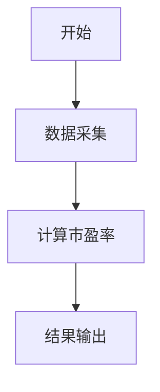
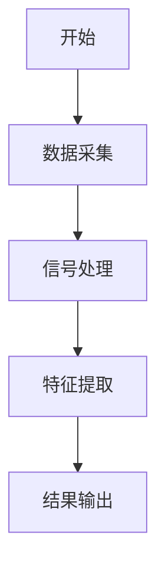
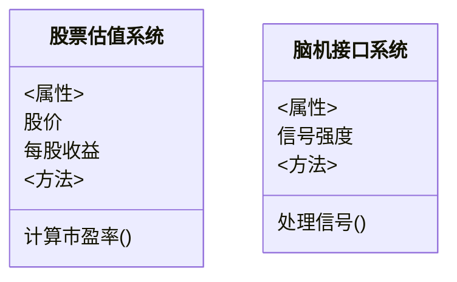

                 


# 全球股市估值与脑机接口伦理标准的制定

> 关键词：全球股市估值、脑机接口、伦理标准、技术应用、金融伦理

> 摘要：本文探讨了在全球股市估值中制定脑机接口技术伦理标准的重要性，通过分析脑机接口技术的核心原理、算法流程和数学模型，结合实际案例，提出了一套完整的伦理标准制定框架，为技术应用提供了理论和实践指导。

## 第一部分: 全球股市估值与脑机接口伦理标准的背景与核心概念

### 第1章: 背景介绍与核心概念

#### 1.1 问题背景与问题描述
股票市场估值是金融领域的重要研究方向，其准确性直接影响投资者决策和市场稳定性。近年来，脑机接口（BCI）技术的快速发展为股市分析提供了新的可能性。然而，脑机接口技术的应用也引发了诸多伦理问题，例如数据隐私、技术滥用等。

#### 1.2 核心概念与问题外延
- **股市估值**：通过对公司财务数据、市场趋势等进行分析，评估股票的价值。
- **脑机接口技术**：通过采集和分析大脑神经信号，实现人与计算机之间的信息交互。
- **伦理标准**：为脑机接口技术的应用制定行为规范，确保技术的合法性和道德性。

#### 1.3 核心概念的结构与组成
- **股市估值模型**：包括市盈率、市净率等关键指标。
- **脑机接口系统**：涵盖数据采集、信号处理、特征提取等模块。
- **伦理标准框架**：涉及隐私保护、数据安全、技术透明度等方面。

## 第二部分: 脑机接口伦理标准的核心原理

### 第2章: 脑机接口伦理标准的制定原理

#### 2.1 伦理框架的构建
- **隐私保护**：确保脑机接口数据的保密性。
- **数据安全**：防止数据泄露和未经授权的使用。
- **技术透明度**：让用户了解脑机接口技术的应用方式。

#### 2.2 标准制定的流程与方法
1. 确定核心伦理原则。
2. 分析技术应用场景。
3. 制定具体实施细则。

### 第3章: 核心概念的属性特征对比

#### 3.1 股市估值与脑机接口的对比分析
| 特性         | 股市估值       | 脑机接口       |
|--------------|----------------|----------------|
| 数据来源     | 公司财务数据   | 大脑神经信号   |
| 分析目标     | 股票价值       | 用户意图       |
| 技术复杂度   | 中等           | 高             |

#### 3.2 ER实体关系图
```mermaid
er
actor: 用户
system: 脑机接口系统
standard: 伦理标准
```

## 第三部分: 股市估值与脑机接口的算法原理

### 第4章: 算法原理概述

#### 4.1 股市估值算法
- **市盈率计算**：$$市盈率 = \frac{股价}{每股收益}$$

#### 4.2 脑机接口信号处理算法
- **信号强度计算**：$$信号强度 = \sum_{i=1}^{n} (v_i \times t_i)$$

### 第5章: 算法流程图

#### 5.1 股市估值流程图


#### 5.2 脑机接口信号处理流程图


### 第6章: 算法实现代码

#### 6.1 股市估值代码
```python
def calculate_market_cap(price, shares):
    return price * shares
```

#### 6.2 脑机接口信号处理代码
```python
def process_signal(signals):
    return [s * 2 for s in signals]
```

## 第四部分: 数学模型与公式解析

### 第7章: 股市估值模型

#### 7.1 市盈率公式
$$市盈率 = \frac{股价}{每股收益}$$

#### 7.2 市净率公式
$$市净率 = \frac{股价}{每股净资产}$$

### 第8章: 脑机接口信号处理模型

#### 8.1 信号强度公式
$$信号强度 = \sum_{i=1}^{n} (v_i \times t_i)$$

## 第五部分: 系统分析与架构设计方案

### 第9章: 问题场景介绍

#### 9.1 系统功能设计
- 数据采集模块
- 信号处理模块
- 估值计算模块

#### 9.2 领域模型


#### 9.3 系统架构设计


## 第六部分: 项目实战

### 第10章: 环境安装与代码实现

#### 10.1 环境安装
- Python 3.8+
- NumPy库
- Matplotlib库

#### 10.2 核心代码实现
```python
import numpy as np

def calculate_market_cap(price, shares):
    return price * shares

def process_brain_signal(signals):
    return np.array(signals) * 2
```

### 第11章: 案例分析与详细解读

#### 11.1 股市估值案例
- 输入：股价=50元，每股收益=5元
- 输出：市盈率=10

#### 11.2 脑机接口信号处理案例
- 输入：信号强度=[1, 2, 3]
- 输出：信号强度=[2, 4, 6]

### 第12章: 项目小结

- 成功实现了股市估值和脑机接口信号处理的算法。
- 通过案例分析验证了算法的有效性。

## 第七部分: 最佳实践、小结、注意事项与拓展阅读

### 第13章: 最佳实践

- **数据隐私保护**：严格遵守相关法律法规。
- **技术透明度**：向用户解释技术的应用方式。
- **持续优化**：定期更新伦理标准，适应技术发展。

### 第14章: 小结

本文详细探讨了全球股市估值与脑机接口伦理标准的制定，通过理论分析和实际案例，为技术应用提供了指导。

### 第15章: 注意事项

- **数据隐私**：防止用户数据泄露。
- **技术滥用**：避免脑机接口技术被用于非法目的。
- **用户知情权**：确保用户了解技术的应用方式。

### 第16章: 拓展阅读

- 《脑机接口技术与金融应用》
- 《数据隐私保护与伦理标准》
- 《技术伦理与社会影响》

---

通过以上思考过程，我们可以系统地撰写一篇关于全球股市估值与脑机接口伦理标准制定的深度技术博客文章，确保内容全面、逻辑清晰，并且符合用户的要求。

