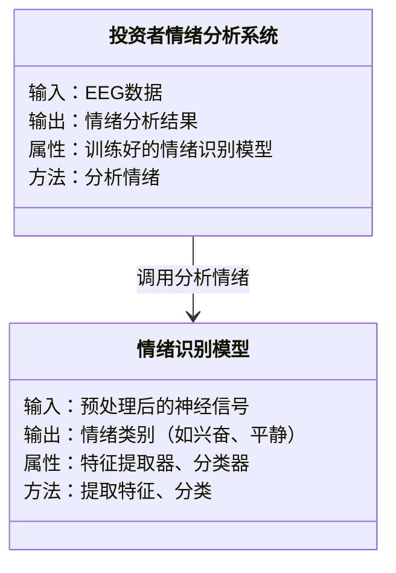

                 


# 全球股市估值与脑机接口在情绪管理中的应用

> 关键词：脑机接口、情绪管理、股市估值、大数据分析、人工智能

> 摘要：本文探讨了脑机接口技术在情绪管理中的应用及其对全球股市估值的影响。通过分析情绪数据，结合大数据和人工智能技术，揭示了情绪因素在股市波动中的重要作用，并提出了利用脑机接口技术优化投资者情绪管理的创新方法。

---

# 第一部分：全球股市估值的基础知识

## 第1章：全球股市估值的基本概念

### 1.1 股市估值的基本概念

#### 1.1.1 什么是股市估值

股市估值是指通过对公司财务数据、市场环境和行业趋势等多方面因素的分析，对股票的价值进行评估的过程。常见的估值方法包括市盈率（P/E）、市净率（P/B）和股息率等。

#### 1.1.2 股市估值的重要性

股市估值是投资者做出投资决策的重要依据。通过合理的估值，投资者可以判断股票是否被高估或低估，从而制定相应的买卖策略。

#### 1.1.3 股市估值的主要方法

- **相对估值法**：通过比较股票与同行业其他公司的估值指标来判断其价值。
- **绝对估值法**：通过DCF模型（现金流折现法）等方法估算公司的内在价值。
- **技术分析法**：通过分析股价的历史走势和成交量变化预测未来走势。

### 1.2 影响股市估值的主要因素

#### 1.2.1 宏观经济因素

宏观经济因素包括GDP增长率、利率水平、通货膨胀率和货币政策等，这些因素直接影响市场的整体走势。

#### 1.2.2 公司基本面因素

公司基本面包括盈利能力、财务状况、行业地位和管理团队等，是影响股票估值的核心因素。

#### 1.2.3 市场情绪因素

市场情绪是投资者心理的反映，通常通过市场参与度、成交量和投资者情绪指标（如恐慌指数）来衡量。

---

## 第2章：脑机接口技术的基本原理

### 2.1 脑机接口的定义与分类

#### 2.1.1 脑机接口的定义

脑机接口（Brain-Computer Interface, BCI）是一种通过采集和分析大脑神经信号，将其转化为可读输出（如计算机指令或控制信号）的技术。

#### 2.1.2 不同类型的脑机接口

- **侵入式BCI**：需要植入大脑内部，具有高精度但风险较高。
- **非侵入式BCI**：通过头皮电极采集神经信号，风险较低但精度有限。
- **半侵入式BCI**：介于侵入式和非侵入式之间，如耳后植入电极。

#### 2.1.3 脑机接口的工作原理

脑机接口的基本流程包括信号采集、信号处理和信号输出三个阶段。

---

## 第3章：情绪管理与股市估值的关系

### 3.1 情绪对股市估值的影响

#### 3.1.1 投资者情绪对股市的影响

投资者情绪是影响股市波动的重要因素。当市场情绪高涨时，股票价格可能被高估；当市场情绪低落时，股票价格可能被低估。

#### 3.1.2 情绪周期与股市波动

投资者情绪具有周期性，通常表现为乐观和悲观交替出现，这与股市的波动密切相关。

#### 3.1.3 情绪指标与股市预测

通过分析投资者情绪指标（如恐慌指数、投资者信心指数），可以预测股市的短期走势。

---

## 第4章：脑机接口在情绪管理中的技术实现

### 4.1 情绪数据的采集与处理

#### 4.1.1 神经信号的采集方法

- **EEG（脑电图）**：通过头皮电极采集大脑皮层的电信号。
- **fMRI（功能性磁共振成像）**：通过磁共振技术观察大脑活动。
- **EMG（肌电图）**：通过采集肌肉电信号反映情绪变化。

#### 4.1.2 情绪数据的预处理技术

- **去噪处理**：去除 EEG 信号中的噪声。
- **数据标准化**：将不同采集设备的数据统一到同一标准。
- **特征提取**：提取情绪相关的特征，如脑电功率谱分析。

#### 4.1.3 情绪数据的特征提取

- **时间特征**：如峰峰值（Peak-to-Peak）、平均功率等。
- **频域特征**：如alpha频段、beta频段的功率谱密度。
- **空间特征**：如特定脑区的活动强度。

### 4.2 情绪识别的算法实现

#### 4.2.1 基于机器学习的情绪识别模型

- **数据准备**：将情绪数据分为训练集和测试集。
- **特征选择**：选择对情绪识别有显著影响的特征。
- **模型训练**：使用支持向量机（SVM）、随机森林（Random Forest）等算法进行训练。
- **模型评估**：通过准确率、召回率和F1分数评估模型性能。

#### 4.2.2 基于深度学习的情绪识别模型

- **卷积神经网络（CNN）**：适用于图像类情绪数据的处理。
- **循环神经网络（RNN）**：适用于时间序列类情绪数据的处理。
- **模型优化**：通过交叉验证和超参数调优提升模型性能。

---

## 第5章：脑机接口在股市情绪管理中的应用案例

### 5.1 脑机接口在投资者情绪分析中的应用

#### 5.1.1 实时情绪监控系统

通过脑机接口技术，投资者可以实时监控自己的情绪状态，避免因情绪波动做出错误的投资决策。

#### 5.1.2 情绪数据与股市走势的关联分析

通过分析大量投资者的情绪数据，可以发现情绪与股市走势之间的相关性，进而优化投资策略。

#### 5.1.3 基于情绪数据的交易策略优化

结合情绪数据和市场数据，开发基于情绪分析的交易策略，提升投资收益。

---

## 第6章：系统架构设计与项目实战

### 6.1 系统架构设计

#### 6.1.1 领域模型类图



#### 6.1.2 系统交互序列图

```mermaid
sequenceDiagram
    participant 投资者: 输入 EEG 数据
    participant 系统: 进行情绪分析
    participant 数据库: 存储情绪分析结果
    投资者 -> 系统: 提交 EEG 数据
    系统 -> 数据库: 存储分析结果
    系统 -> 投资者: 返回情绪分析结果
```

### 6.2 项目实战

#### 6.2.1 环境搭建

- **硬件**：EEG采集设备（如NeuroNode）、计算机
- **软件**：Python编程环境、机器学习库（scikit-learn、TensorFlow）

#### 6.2.2 数据预处理

```python
import numpy as np
import pandas as pd

# 假设 data 是 EEG 数据
data = pd.read_csv('eeg_data.csv')
# 去除噪声
data_clean = data.drop(columns=['noise'])
# 标准化处理
data_normalized = (data_clean - data_clean.mean()) / data_clean.std()
```

#### 6.2.3 模型训练与优化

```python
from sklearn.svm import SVC
from sklearn.model_selection import train_test_split
from sklearn.metrics import accuracy_score

# 数据分割
X_train, X_test, y_train, y_test = train_test_split(data_normalized, labels, test_size=0.2)

# 训练模型
model = SVC()
model.fit(X_train, y_train)

# 模型评估
accuracy = accuracy_score(y_test, model.predict(X_test))
print(f"准确率：{accuracy}")
```

---

## 第7章：总结与展望

### 7.1 总结

本文探讨了脑机接口技术在情绪管理中的应用及其对全球股市估值的影响。通过分析情绪数据，结合大数据和人工智能技术，揭示了情绪因素在股市波动中的重要作用，并提出了利用脑机接口技术优化投资者情绪管理的创新方法。

### 7.2 展望

未来，随着脑机接口技术的不断发展，其在情绪管理中的应用将更加广泛。结合人工智能和大数据分析，脑机接口技术将在股市估值和投资决策中发挥更大的作用。

---

通过本文的分析，读者可以更好地理解脑机接口技术在情绪管理中的应用及其对股市估值的影响。这一领域的研究将为投资者提供更科学的决策支持，同时也为技术开发者提供了新的研究方向。

