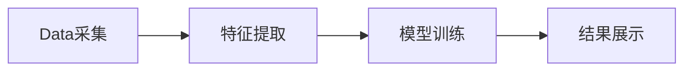

                 

# 全球股市估值与脑机接口在教育中的伦理问题

> 关键词：全球股市估值、脑机接口、教育、伦理问题、机器学习、系统架构

> 摘要：本文探讨了全球股市估值的技术与方法，以及脑机接口技术在教育中的伦理问题。首先，从股市估值的基本概念、技术分析与基本面分析入手，结合机器学习算法，分析其在股市预测中的应用。随后，讨论了脑机接口技术的原理及其在教育中的潜在应用，最后深入探讨了其带来的伦理与法律挑战。

---

## 第一部分：全球股市估值

### 第1章：全球股市估值的背景与概念

#### 1.1 股市估值的基本概念

股市估值是通过对公司财务数据和市场趋势的分析，估算公司股票的合理价格范围。它帮助投资者做出明智的投资决策。全球股市估值涉及多个市场，如纽约证券交易所（NYSE）、纳斯达克（NASDAQ）、伦敦证券交易所（LSE）等。

#### 1.2 股市估值的核心要素

| 要素 | 定义 | 作用 |
|------|------|------|
| 市盈率（P/E） | 每股市价/每股收益 | 评估股票的相对价值 |
| 市净率（P/B） | 每股市价/每股净资产 | 评估股票相对于资产的价值 |
| 股息率 | 每股股息/股票价格 | 评估投资回报率 |

#### 1.3 股市估值的分类与方法

- **技术分析**：通过历史价格数据预测未来走势。
- **基本面分析**：通过公司财务数据评估其内在价值。
- **量化分析**：利用大数据和机器学习模型进行预测。

---

### 第2章：技术分析与基本面分析

#### 2.1 技术分析的基本原理

技术分析主要依赖K线图、移动平均线（MA）和相对强弱指数（RSI）等工具。

##### K线图的构成

#### 2.2 基本面分析的核心指标

基本面分析关注公司的营业收入、利润和财务状况。

##### 营业收入与利润

- 营业收入是公司销售商品或服务的总收入。
- 利润是收入减去成本和费用。

#### 2.3 技术分析与基本面分析的结合

- **技术分析的局限性**：无法预测公司基本面变化。
- **基本面分析的局限性**：忽视市场情绪和趋势。
- **结合应用**：技术分析辅助基本面分析，提升预测准确性。

---

### 第3章：机器学习在股市估值中的应用

#### 3.1 机器学习的基本原理

机器学习通过数据训练模型，预测未来趋势。

##### 监督学习与非监督学习

| 监督学习 | 非监督学习 |
|----------|------------|
| 需要标签数据 | 无标签数据 |
| 用于分类和回归 | 用于聚类和降维 |

#### 3.2 基于机器学习的股市预测模型

##### 线性回归模型

线性回归模型用于预测股票价格的变化趋势。

$$ y = \beta_0 + \beta_1x + \epsilon $$

其中，$y$ 是预测的股票价格，$x$ 是自变量（如历史价格），$\beta_0$ 和 $\beta_1$ 是回归系数，$\epsilon$ 是误差项。

##### 支持向量回归（SVR）

SVR通过构建超平面，实现非线性回归。

##### 随机森林回归

随机森林通过集成多个决策树，提高预测准确性。

#### 3.3 算法实现与优化

##### 数据预处理

- 数据清洗：处理缺失值和异常值。
- 标准化：将数据归一化，便于模型训练。

##### 模型训练与调优

使用交叉验证选择最佳参数。

##### 模型评估与验证

通过均方误差（MSE）和R平方值评估模型性能。

---

### 第4章：系统架构与接口设计

#### 4.1 股市估值系统的整体架构

##### 系统功能模块划分

- 数据采集模块：收集股票数据。
- 特征提取模块：提取技术指标。
- 模型训练模块：训练预测模型。
- 结果展示模块：显示预测结果。

##### 数据流的流向

#### 4.2 系统接口设计

##### 数据接口的设计

- REST API：提供数据接口，方便调用。

##### 用户接口的交互设计

- �界面前端：用户输入参数，系统显示结果。

##### 接口的安全性考虑

- 认证机制：防止未授权访问。
- 加密传输：保护数据安全。

---

## 第二部分：脑机接口在教育中的伦理问题

### 第7章：脑机接口的技术基础

#### 7.1 脑机接口的基本原理

脑机接口（BCI）通过采集和分析脑电信号，实现人与机器的直接交互。

##### 脑电信号的采集

- 电极放置：在头皮上放置电极，采集神经信号。
- 数据处理：通过放大器放大信号，滤波处理噪音。

#### 7.2 脑机接口的分类

| 类型 | 描述 | 应用场景 |
|------|------|----------|
| 非侵入式 | 使用头皮电极 | 教育、娱乐 |
| 侵入式 | 植入大脑 | 医疗康复 |

---

### 第8章：脑机接口在教育中的应用

#### 8.1 教育中的潜在应用

- **辅助学习**：通过BCI监测学生注意力，优化教学内容。
- **个性化学习**：根据大脑活动调整教学节奏。

#### 8.2 应用实例

- **注意力监测**：实时监测学生注意力集中度，提醒教师调整教学方式。
- **情绪识别**：通过分析脑电信号，识别学生的情绪状态，优化教学策略。

---

### 第9章：伦理与法律挑战

#### 9.1 伦理问题

- **隐私问题**：脑电信号可能泄露个人隐私。
- **知情同意**：学生是否充分了解脑机接口的使用目的。

#### 9.2 法律问题

- **数据所有权**：脑电信号数据归谁所有？
- **责任划分**：若因数据泄露引发问题，责任由谁承担？

---

### 第10章：解决方案与未来展望

#### 10.1 解决方案

- **数据加密**：确保数据传输和存储的安全性。
- **隐私保护**：采用差分隐私技术，保护用户隐私。

#### 10.2 未来展望

- **技术进步**：提高脑机接口的准确性和可靠性。
- **伦理规范**：制定统一的伦理指南，规范技术应用。

---

## 结语

全球股市估值与脑机接口在教育中的伦理问题，看似风马牛不相及，实则都涉及技术与伦理的平衡。股市估值需要科学的分析方法和系统的架构设计，而脑机接口的应用则需要在技术创新的同时，注重伦理和法律的规范。未来，随着技术的不断发展，这两者的结合将更加紧密，带来更多机遇与挑战。

