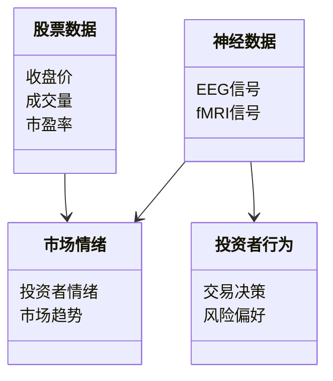
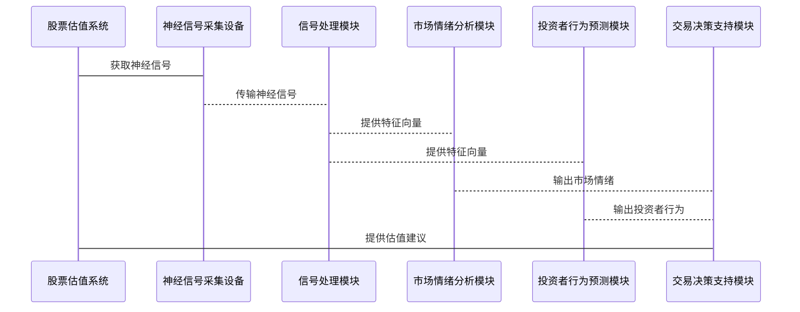

                 


# 全球股市估值与脑机接口技术的伦理考量

## 关键词：全球股市估值、脑机接口技术、伦理考量、金融市场、神经科技

## 摘要：本文探讨了全球股市估值与脑机接口技术的结合及其伦理问题。通过分析脑机接口技术的基本原理、股市估值的核心理论，以及两者在实际应用中的伦理挑战，本文提出了在技术创新与伦理规范之间寻求平衡的必要性，并展望了未来的研究方向。

---

# 第1章：全球股市估值与脑机接口技术的概述

## 1.1 背景介绍

### 1.1.1 问题背景：全球股市估值的重要性

股市估值是金融市场的核心活动，旨在通过分析企业基本面、市场情绪和宏观经济指标来评估股票的合理价格。准确的估值能够帮助投资者做出明智的投资决策，同时影响市场的整体运行效率。近年来，随着人工智能和大数据技术的快速发展，股市估值的精度和效率得到了显著提升，但同时也带来了新的挑战。

### 1.1.2 问题描述：脑机接口技术的现状与挑战

脑机接口（Brain-Computer Interface, BCI）是一种通过采集和解析大脑神经信号来实现人与外部设备直接交互的技术。随着神经科学和人工智能的进步，脑机接口在医疗、教育、娱乐和金融等领域的应用潜力逐渐显现。然而，其在实际应用中也面临诸多技术瓶颈和伦理争议。

### 1.1.3 问题解决：技术与伦理的结合

本文旨在探讨如何将脑机接口技术应用于股市估值，同时兼顾技术的可行性和伦理的合规性。通过分析脑机接口在数据采集、信号处理和决策支持中的作用，本文试图为股市估值提供一种新的技术手段，同时避免可能的伦理风险。

### 1.1.4 边界与外延：相关领域的界定

本文的研究范围限定在脑机接口技术在股市估值中的应用，重点关注其在市场情绪分析和投资者行为预测中的作用。同时，本文还涉及相关领域的界定，包括神经科学、金融工程和伦理学等。

### 1.1.5 概念结构与核心要素组成：核心概念对比表格

| 概念       | 定义与特点                                      | 应用领域                  |
|------------|-----------------------------------------------|--------------------------|
| 股市估值    | 通过分析企业基本面、市场情绪和宏观经济指标来评估股票价格。| 金融市场投资、风险管理 |
| 脑机接口技术 | 通过采集和解析大脑神经信号，实现人与外部设备的直接交互。| 医疗、教育、金融、娱乐 |

---

# 第2章：脑机接口技术的核心概念与原理

## 2.1 脑机接口技术的基本原理

### 2.1.1 信号采集与处理

脑机接口的核心在于采集大脑神经信号，主要包括：

1. **电生理信号**：如EEG（脑电图）、EMG（肌电图）等。
2. **光学信号**：如fMRI（功能性磁共振成像）。
3. **化学信号**：通过检测神经递质浓度变化。

信号采集后，需要进行预处理，包括去噪、滤波和特征提取。

### 2.1.2 信号分析与特征提取

特征提取是脑机接口的关键步骤，常用的特征包括：

1. **时域特征**：如均值、标准差、峰峰值等。
2. **频域特征**：如功率谱密度、小波变换系数。
3. **非线性特征**：如混沌指标、分 fractal 维数。

### 2.1.3 信号分类与输出

信号分类通常采用机器学习算法，如支持向量机（SVM）、随机森林（Random Forest）和深度学习模型（如CNN、RNN）。分类结果通过外部设备进行输出。

---

## 2.2 脑机接口技术的分类

### 2.2.1 非侵入式脑机接口

非侵入式脑机接口通过外部设备（如 EEG 头盔）采集信号，具有无创、成本低的优点，但信号精度较低。

### 2.2.2 侵入式脑机接口

侵入式脑机接口需要将电极植入大脑，信号精度高，但手术风险大，成本高。

### 2.2.3 混合式脑机接口

结合非侵入式和侵入式技术，通过混合信号源提高精度和稳定性。

---

## 2.3 脑机接口技术的核心算法

### 2.3.1 基于机器学习的脑机接口算法

#### 2.3.1.1 算法原理

机器学习算法通过训练模型，将神经信号映射到特定的输出目标（如用户的意图）。常用的算法包括：

1. **线性判别分析（LDA）**：用于分类问题。
2. **支持向量机（SVM）**：适用于小样本数据分类。
3. **随机森林（Random Forest）**：适用于特征较多的情况。

#### 2.3.1.2 算法流程

1. 数据预处理：去除噪声，提取特征。
2. 模型训练：使用训练数据训练分类器。
3. 模型测试：验证模型性能。
4. 实时分类：将新信号输入模型，输出结果。

#### 2.3.1.3 代码实现

```python
from sklearn.svm import SVC
from sklearn.metrics import accuracy_score

# 数据预处理
X_train, y_train, X_test, y_test = preprocess_data()

# 模型训练
model = SVC()
model.fit(X_train, y_train)

# 模型测试
y_pred = model.predict(X_test)
print("Accuracy:", accuracy_score(y_test, y_pred))
```

---

# 第3章：全球股市估值的理论与实践

## 3.1 股市估值的基本理论

### 3.1.1 市盈率与市净率

市盈率（P/E Ratio）= 股价 / 每股净利润。

市净率（P/B Ratio）= 股价 / 每股净资产。

### 3.1.2 股息率与股息增长模型

股息率 = 每股股息 / 股价。

股息增长模型假设股息以固定速率增长，计算股票的内在价值。

### 3.1.3 资产评估与企业价值

企业价值评估通常考虑企业的盈利能力、成长性和风险水平。

---

## 3.2 股市估值的实践方法

### 3.2.1 基于历史数据分析的估值方法

通过分析历史价格、成交量和市场情绪，预测未来股价走势。

### 3.2.2 基于市场情绪分析的估值方法

利用新闻、社交媒体和投资者情绪数据，评估市场情绪对股价的影响。

### 3.2.3 基于机器学习的估值方法

使用回归、聚类和深度学习模型，预测股票价格。

---

# 第4章：脑机接口技术的伦理考量

## 4.1 脑机接口技术的伦理问题

### 4.1.1 隐私与数据安全

脑机接口技术需要采集和处理大量神经数据，存在隐私泄露风险。

### 4.1.2 人类尊严与自主权

脑机接口可能干预人类的自主决策，引发伦理争议。

### 4.1.3 医疗伦理与风险

侵入式脑机接口可能带来健康风险，需严格遵循医疗伦理规范。

---

## 4.2 股市估值中的伦理问题

### 4.2.1 投资者利益与市场公平性

脑机接口技术可能为部分投资者提供不公平的优势，破坏市场公平性。

### 4.2.2 技术滥用与市场操纵

技术滥用可能导致市场操纵，威胁金融市场的稳定性。

### 4.2.3 信息披露与透明度

脑机接口技术的应用需要明确的信息披露机制，以确保透明度和合规性。

---

# 第5章：脑机接口技术与股市估值的结合

## 5.1 脑机接口技术在股市估值中的应用

### 5.1.1 基于脑机接口的市场情绪分析

通过分析投资者的神经信号，评估市场情绪对股价的影响。

### 5.1.2 基于脑机接口的投资者行为预测

预测投资者的决策行为，优化投资策略。

### 5.1.3 基于脑机接口的实时市场反馈

实时捕捉市场参与者的神经信号，提供动态的市场反馈。

---

## 5.2 脑机接口技术与股市估值的伦理挑战

### 5.2.1 技术可行性与伦理合规性

在技术创新的同时，需确保脑机接口技术的伦理合规性。

### 5.2.2 市场公平性与技术普及

脑机接口技术的普及可能加剧市场不平等，需制定相应的监管政策。

### 5.2.3 技术发展与伦理规范的平衡

在推动技术创新的同时，需建立完善的伦理规范体系。

---

# 第6章：系统分析与架构设计方案

## 6.1 问题场景介绍

脑机接口技术应用于股市估值，需解决数据采集、信号处理和决策支持等问题。

## 6.2 系统功能设计

### 6.2.1 领域模型（Mermaid 类图）



---

## 6.3 系统架构设计（Mermaid 架构图）


---

## 6.4 系统接口设计

### 6.4.1 神经信号采集接口

通过 EEG 头盔采集神经信号，格式为 CSV 或 JSON。

### 6.4.2 数据处理接口

提供 API 接口，处理神经信号并输出特征向量。

### 6.4.3 决策支持接口

提供实时市场反馈和交易建议。

---

## 6.5 系统交互设计（Mermaid 序列图）



---

# 第7章：项目实战

## 7.1 环境安装

安装必要的软件和库：

1. Python 3.8+
2. NumPy、Scikit-learn、Matplotlib
3. PyEEG、PyTorch

---

## 7.2 系统核心实现

### 7.2.1 数据预处理

```python
import numpy as np
import pandas as pd

def preprocess_eeg(data):
    # 去噪
    filtered_data = np.apply_along_axis(lambda x: x - np.mean(x[:100]), 0, data)
    return filtered_data
```

### 7.2.2 特征提取

```python
from scipy import signal

def extract_features(data):
    # 小波变换
    wavelet = 'db4'
    coeffs = signal.wavedec(data, wavelet, level=3)
    features = np.concatenate([coeffs[1], coeffs[2], coeffs[3]])
    return features
```

### 7.2.3 模型训练

```python
from sklearn.svm import SVC

def train_model(X_train, y_train):
    model = SVC(kernel='rb

