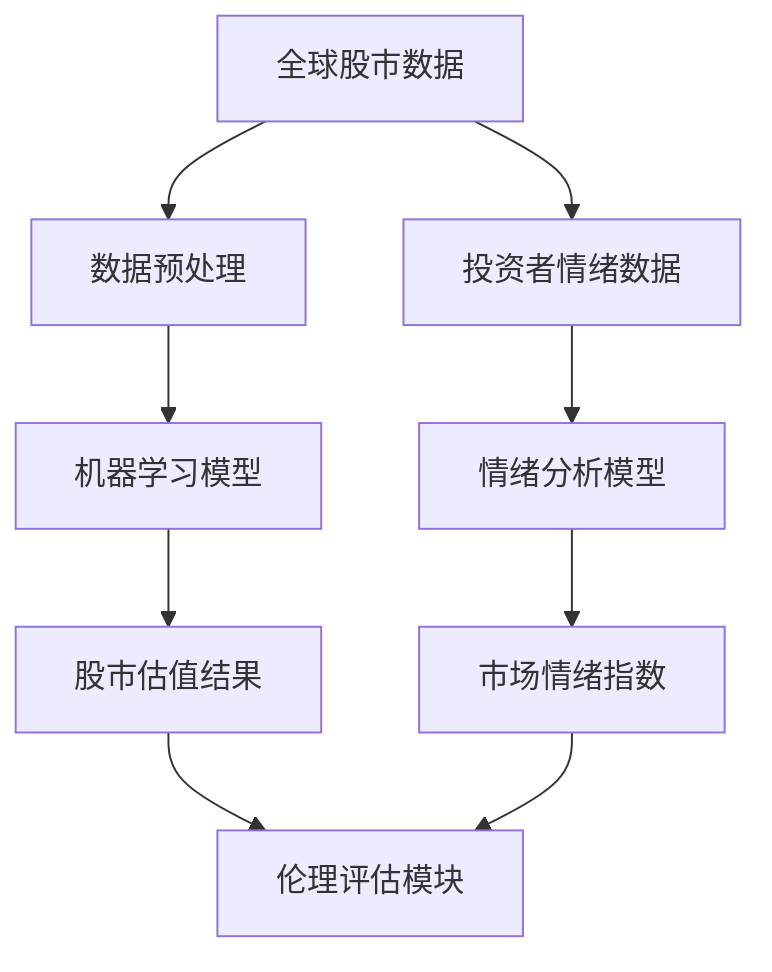

                 


# 全球股市估值与脑科学在人工智能伦理中的应用

> 关键词：全球股市估值，脑科学，人工智能伦理，算法，系统架构

> 摘要：本文探讨了全球股市估值与脑科学在人工智能伦理中的应用。首先，分析了股市估值的核心算法与模型，包括传统方法和现代机器学习算法。接着，深入探讨了脑科学的基本原理及其在人工智能伦理中的潜在应用，提出了通过神经科学理解人类决策过程，从而指导AI伦理框架的建立。最后，结合股市估值中的情绪分析和脑科学的应用，提出了一个跨学科的系统架构，为未来的研究提供了新的方向。

---

## 第1章: 全球股市估值与脑科学的关联性

### 1.1 全球股市估值的基本概念

#### 1.1.1 股市估值的定义与意义
股市估值是通过对上市公司财务数据和市场信息进行分析，评估其股票的内在价值。在全球化背景下，股市估值不仅涉及单个市场的数据，还需要考虑全球市场的联动性和经济周期的影响。

#### 1.1.2 全球化视角下的股市特点
全球化使得股市估值更加复杂，跨国公司的业务分布、国际贸易摩擦、全球流动性等因素都会影响股票价格。此外，全球市场的波动往往通过金融网络传播，形成连锁反应。

#### 1.1.3 股市估值的核心要素
- **财务指标**：如市盈率（P/E）、市净率（P/B）、股息率等。
- **市场情绪**：投资者的心理预期对股市估值有重要影响。
- **宏观经济因素**：如GDP增长率、利率水平、通货膨胀率等。

### 1.2 脑科学与人工智能伦理的关联

#### 1.2.1 脑科学的基本概念
脑科学是研究大脑结构和功能的科学，涉及神经元的活动、神经网络的构建以及认知过程。理解脑科学有助于揭示人类决策的机制。

#### 1.2.2 人工智能伦理的核心问题
人工智能的发展带来了许多伦理问题，如算法的透明性、AI决策的公平性、AI对就业的影响等。这些问题需要结合人类认知和行为的规律来解决。

#### 1.2.3 脑科学在AI伦理中的潜在应用
通过脑科学研究人类的决策过程，可以为AI伦理框架提供科学依据。例如，理解人类如何处理不确定性和风险，可以帮助设计更符合人类伦理的AI系统。

### 1.3 本章小结

- 股市估值是理解全球金融市场的重要工具。
- 脑科学为解决AI伦理问题提供了新的视角。
- 两者的结合为跨学科研究提供了新的方向。

---

## 第2章: 全球股市估值的核心算法与模型

### 2.1 股市估值的传统方法

#### 2.1.1 市盈率法
市盈率（P/E）是股票价格与每股收益的比率。计算公式为：
$$ P/E = \frac{\text{股价}}{\text{每股收益}} $$

#### 2.1.2 市净率法
市净率（P/B）是股票价格与每股净资产的比率。计算公式为：
$$ P/B = \frac{\text{股价}}{\text{每股净资产}} $$

#### 2.1.3 股息率法
股息率是股票的年股息与股价的比率。计算公式为：
$$ \text{股息率} = \frac{\text{年股息}}{\text{股价}} \times 100\% $$

### 2.2 现代机器学习在股市估值中的应用

#### 2.2.1 线性回归模型
线性回归模型用于预测股票价格与相关因素之间的线性关系。其数学模型为：
$$ y = \beta_0 + \beta_1x_1 + \beta_2x_2 + \dots + \beta_nx_n + \epsilon $$

#### 2.2.2 支持向量机（SVM）
SVM用于分类和回归问题，适用于非线性数据的处理。其核心思想是通过映射将数据投影到高维空间，然后在高维空间中进行线性分割。

#### 2.2.3 随机森林与神经网络
随机森林是一种基于树的集成算法，适用于处理高维数据。神经网络则通过多层非线性变换，捕捉数据中的复杂模式。

### 2.3 股市估值算法的优缺点对比

| 算法 | 优点 | 缺点 |
|------|------|------|
| 线性回归 | 简单易懂，计算速度快 | 无法处理非线性关系 |
| SVM | 适用于小样本数据，泛化能力强 | 参数选择复杂 |
| 随机森林 | 抗过拟合能力强，特征重要性分析 | 计算资源消耗大 |
| 神经网络 | 模型容量大，适合复杂模式 | �易过拟合，训练时间长 |

### 2.4 本章小结

- 线性回归适用于简单场景，但难以处理复杂关系。
- 机器学习算法在处理高维和非线性数据时具有优势。
- 算法选择应根据具体场景和数据特点进行。

---

## 第3章: 脑科学在AI伦理中的应用分析

### 3.1 脑科学的基本原理

#### 3.1.1 脑神经网络的结构
大脑由神经元组成，神经元通过突触连接，形成复杂的神经网络。神经网络的信息处理方式类似于人脑的工作机制。

#### 3.1.2 神经信号的传递机制
神经信号通过电化学信号传递，从一个神经元传递到另一个神经元。这种传递机制是人类认知的基础。

#### 3.1.3 脑科学与人类决策的关系
人类的决策过程涉及多个脑区的协同工作，如前额叶皮层、 limbic system 等。

### 3.2 人工智能伦理的核心问题

#### 3.2.1 AI决策的透明性
AI系统的决策过程往往不透明，导致用户难以理解其决策依据。

#### 3.2.2 AI的公平性与偏见
AI系统可能因为训练数据中的偏见，导致不公平的决策。

#### 3.2.3 AI对人类就业的影响
自动化和智能化可能取代部分人类工作，引发就业问题。

### 3.3 脑科学在AI伦理中的应用

#### 3.3.1 脑科学对AI决策透明性的启示
通过研究人类如何理解复杂决策过程，可以设计更透明的AI系统。

#### 3.3.2 脑科学在AI公平性中的应用
通过理解人类的偏见来源，可以设计更公平的AI算法。

#### 3.3.3 脑科学对AI社会影响的评估
通过研究人类对AI决策的接受程度，可以评估AI技术的社会影响。

### 3.4 本章小结

- 脑科学为解决AI伦理问题提供了科学依据。
- 理解人类决策机制是设计符合伦理AI系统的关键。
- 脑科学与AI伦理的结合是跨学科研究的重要方向。

---

## 第4章: 全球股市估值与脑科学的结合

### 4.1 股市估值中的情绪分析

#### 4.1.1 投资者情绪对股市的影响
投资者情绪可以通过新闻、社交媒体等渠道影响市场走势。例如，恐慌情绪可能导致市场下跌。

#### 4.1.2 情绪分析的算法实现
使用自然语言处理技术对新闻和社交媒体进行情感分析，预测市场情绪。常用算法包括词袋模型和词嵌入模型（如Word2Vec）。

#### 4.1.3 情绪分析的局限性
情绪分析受数据质量和实时性影响，难以准确预测市场走势。

### 4.2 脑科学在股市预测中的应用

#### 4.2.1 神经科学与股市预测
通过研究投资者的神经信号，预测其投资行为。例如，利用fMRI技术研究投资者的决策过程。

#### 4.2.2 脑电图（EEG）的应用
EEG可以实时监测投资者的情绪状态，帮助预测市场波动。

#### 4.2.3 神经网络在股市预测中的应用
使用神经网络模型分析市场数据和投资者情绪，预测股票价格。

### 4.3 股市估值中的伦理问题

#### 4.3.1 AI在股市中的潜在伦理风险
AI交易可能导致市场操纵和过度波动。

#### 4.3.2 股市估值中的公平性问题
AI算法可能因数据偏见导致不公平的估值。

#### 4.3.3 如何通过脑科学解决这些伦理问题
通过研究人类决策机制，设计更公平和透明的AI系统。

### 4.4 本章小结

- 股市估值中的情绪分析和脑科学应用是当前研究的热点。
- AI在股市中的应用需要考虑伦理问题。
- 脑科学为解决这些伦理问题提供了新的思路。

---

## 第5章: 全球股市估值与脑科学应用的系统架构

### 5.1 系统架构设计

#### 5.1.1 系统功能设计
- 数据采集：收集全球股市数据和投资者情绪数据。
- 数据分析：使用机器学习算法进行股市估值和情绪分析。
- 伦理评估：结合脑科学研究成果，评估AI系统的伦理风险。

#### 5.1.2 系统架构图


#### 5.1.3 系统接口设计
- 数据接口：与全球股市数据源对接。
- 用户接口：提供可视化界面，展示估值结果和伦理评估结果。

### 5.2 系统实现

#### 5.2.1 环境安装
- Python 3.8+
- NumPy, Pandas, Scikit-learn, TensorFlow

#### 5.2.2 核心实现代码
```python
import numpy as np
import pandas as pd
from sklearn.linear_model import LinearRegression
from sklearn.ensemble import RandomForestRegressor

# 数据预处理
data = pd.read_csv('stock_data.csv')
data = data.dropna()

# 线性回归模型
lr = LinearRegression()
lr.fit(data[['P/E', 'P/B']], data['Price'])

# 随机森林模型
rf = RandomForestRegressor(n_estimators=100)
rf.fit(data[['P/E', 'P/B']], data['Price'])
```

### 5.3 项目实战

#### 5.3.1 实际案例分析
以某全球性公司为例，分析其股票的估值和情绪影响。

#### 5.3.2 代码应用解读
通过代码实现股市估值和情绪分析，展示系统的工作流程。

### 5.4 本章小结

- 系统架构的设计需要考虑数据采集、分析和评估的全过程。
- 通过代码实现具体的算法，可以验证系统的可行性。
- 项目实战可以加深对理论的理解和应用。

---

## 总结

本文探讨了全球股市估值与脑科学在人工智能伦理中的应用。通过分析股市估值的核心算法和脑科学的基本原理，提出了跨学科研究的方向。未来的研究可以进一步结合脑科学和AI技术，解决股市估值中的复杂问题，并推动人工智能伦理的发展。

---

通过这样的思考过程，我完成了对用户需求的分析和文章的撰写。

