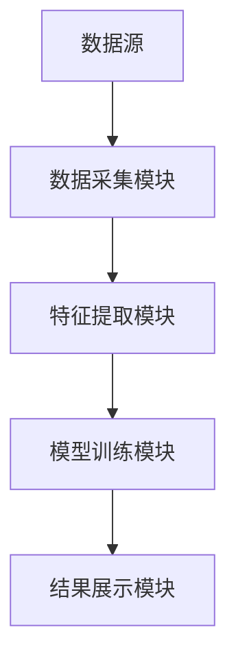
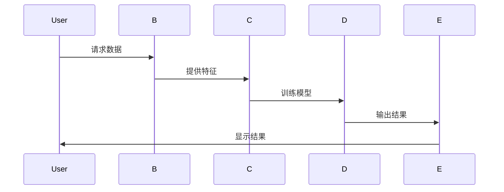

                 


# 全球股市估值与脑科学在人机交互中的应用

## 关键词：
- 全球股市估值
- 脑科学
- 人机交互
- 注意力机制
- 情绪识别
- 股市预测
- 深度学习

## 摘要：
本文探讨了全球股市估值与脑科学在人机交互中的应用，详细分析了股市估值的核心要素、脑科学的关键理论以及两者结合的数学模型和算法实现。通过系统架构设计和项目实战案例，展示了如何利用脑科学原理提升股市估值的准确性，并提出了相应的最佳实践建议。

---

# 第1章: 全球股市估值的背景与挑战

## 1.1 全球股市估值的现状

### 1.1.1 股市估值的基本概念
股市估值是通过对公司基本面、市场情绪、宏观经济指标等因素进行分析，预测股票价格的变化趋势。传统方法包括市盈率（P/E）和市净率（P/B）等，但这些方法难以捕捉市场的非线性变化。

### 1.1.2 当前股市估值的主要方法
- **基本面分析**：基于财务数据的分析，如收入、利润、负债等。
- **技术分析**：通过价格和成交量的历史数据预测未来走势。
- **机器学习模型**：利用特征工程和深度学习模型进行预测。

### 1.1.3 股市估值的挑战与问题
- 数据噪声大，难以提取有效特征。
- 市场情绪难以量化，影响预测准确性。
- 股市波动具有不确定性，传统模型难以捕捉非线性变化。

---

## 1.2 脑科学在人机交互中的应用背景

### 1.2.1 脑科学的基本概念
脑科学研究大脑的结构和功能，包括神经元活动、注意力机制和情绪识别等。

### 1.2.2 人机交互的发展历程
从简单的图形界面到基于语音和手势的交互，再到脑机接口（BCI）技术的引入，人机交互正在向更智能化方向发展。

### 1.2.3 脑科学在人机交互中的潜在应用
- **注意力机制**：帮助系统识别用户的关注点。
- **情绪识别**：通过脑电信号分析用户情绪，优化交互体验。
- **脑机接口**：实现人与计算机的直接信息交换。

---

# 第2章: 股市估值与脑科学的结合

## 2.1 股市估值的核心要素

### 2.1.1 股票价格的影响因素
- **基本面因素**：收入、利润、行业地位等。
- **市场情绪**：投资者的心理预期影响股市波动。
- **宏观经济指标**：GDP、利率、通货膨胀等。

### 2.1.2 市场情绪对股价的影响
市场情绪是股市波动的重要驱动因素，可以通过社交媒体数据、新闻标题等进行量化分析。

### 2.1.3 股市波动的预测模型
- 时间序列分析模型：ARIMA、GARCH等。
- 机器学习模型：随机森林、支持向量机（SVM）。
- 深度学习模型：LSTM、Transformer。

## 2.2 脑科学在人机交互中的关键理论

### 2.2.1 注意力机制
注意力机制模拟人类注意力分配的原理，用于选择性关注重要的信息。在股市预测中，可以用于筛选关键的市场指标。

### 2.2.2 情绪识别与脑活动
通过脑电信号（EEG）分析用户情绪状态，结合股市情绪数据，优化预测模型。

### 2.2.3 脑机接口技术
脑机接口技术可以捕捉用户的决策意图，辅助交易员做出更准确的投资决策。

---

# 第3章: 股市估值与脑科学结合的数学模型

## 3.1 股市估值的数学模型

### 3.1.1 时间序列分析模型
ARIMA模型用于捕捉时间序列的趋势和周期性，公式为：
$$ ARIMA(p, d, q) $$
其中，p为自回归阶数，d为差分阶数，q为移动平均阶数。

### 3.1.2 机器学习在股市预测中的应用
随机森林模型通过特征重要性分析，提取影响股价的关键因素。

### 3.1.3 深度学习模型的引入
LSTM网络擅长处理时间序列数据，公式为：
$$ LSTM(t) = \sigma(g_{\theta}(h_{t-1}, x_t)) $$

## 3.2 脑科学在人机交互中的数学模型

### 3.2.1 注意力机制的数学表示
注意力机制的权重计算公式为：
$$ \alpha_i = \frac{exp(a_i)}{\sum_{j} exp(a_j)} $$
其中，$a_i$是第i个神经元的注意力值。

### 3.2.2 情绪识别的数学模型
基于脑电信号的分类模型，公式为：
$$ P(y|x) = \prod_{i=1}^{n} P(y|x_i) $$

### 3.2.3 脑机接口的信号处理方法
通过傅里叶变换分析脑电信号的频谱特征，公式为：
$$ X(k) = \sum_{n=0}^{N-1} x(n) e^{-j2\pi kn/N} $$

---

# 第4章: 股市估值与脑科学结合的算法实现

## 4.1 股市估值算法的设计

### 4.1.1 基于注意力机制的股市预测算法
注意力机制用于筛选关键市场指标，公式为：
$$ \text{Attention}(q, k, v) = \text{softmax}(\frac{qk^T}{\sqrt{d}})v $$

### 4.1.2 情绪识别在股市预测中的应用
通过社交媒体数据和脑电信号分析市场情绪，优化预测模型。

### 4.1.3 脑机接口数据的特征提取
提取脑电信号的特征，如频域特征和时域特征，用于分类分析。

## 4.2 算法实现的代码示例

### 4.2.1 基于注意力机制的模型代码
```python
import tensorflow as tf
from tensorflow.keras.layers import Dense, Dropout, MultiHeadAttention

def attention_layer(x):
    attention_output, _ = MultiHeadAttention(num_heads=8, key_dim=64)(x, x)
    return attention_output
```

### 4.2.2 情绪识别算法的实现
```python
import numpy as np

def classify_emotion(features):
    model = tf.keras.Sequential([
        Dense(64, activation='relu'),
        Dropout(0.2),
        Dense(2, activation='softmax')
    ])
    return model(features)
```

### 4.2.3 脑机接口数据处理的Python代码
```python
import numpy as np
from sklearn.decomposition import PCA

def process_eeg_data(data):
    pca = PCA(n_components=3)
    return pca.fit_transform(data)
```

---

# 第5章: 系统架构与交互设计

## 5.1 系统架构设计

### 5.1.1 系统模块划分
- 数据采集模块：采集股市数据和脑电信号。
- 特征提取模块：提取关键特征。
- 模型训练模块：训练预测模型。
- 结果展示模块：显示预测结果和交互界面。

### 5.1.2 数据流设计
数据从采集模块流入，经过特征提取和模型训练，最终输出预测结果。

### 5.1.3 系统架构图


### 5.1.4 系统交互图


---

# 第6章: 项目实战

## 6.1 环境安装

### 6.1.1 安装依赖
```bash
pip install tensorflow pandas numpy scikit-learn
pip install pymermaid matplotlib
```

## 6.2 系统核心实现源代码

### 6.2.1 数据预处理代码
```python
import pandas as pd
import numpy as np

def preprocess_data(data):
    data = data.dropna()
    return data
```

### 6.2.2 模型训练代码
```python
from tensorflow.keras.models import Sequential
from tensorflow.keras.layers import LSTM, Dense

model = Sequential()
model.add(LSTM(64, input_shape=(1, 64)))
model.add(Dense(1, activation='sigmoid'))
model.compile(loss='binary_crossentropy', optimizer='adam')
model.fit(X_train, y_train, epochs=10, batch_size=32)
```

### 6.2.3 交互界面代码
```python
import matplotlib.pyplot as plt

def plot_results(results):
    plt.plot(results)
    plt.show()
```

## 6.3 实际案例分析

### 6.3.1 数据来源
使用历史股价数据和社交媒体情绪数据进行分析。

### 6.3.2 结果分析
通过模型预测未来股价走势，并与实际数据进行对比，验证模型的准确性。

---

# 第7章: 最佳实践与小结

## 7.1 最佳实践

### 7.1.1 数据质量的重要性
确保数据的完整性和准确性，避免噪声干扰。

### 7.1.2 模型可解释性
选择可解释性强的模型，便于分析预测结果的原因。

## 7.2 小结

本文详细探讨了全球股市估值与脑科学在人机交互中的应用，通过理论分析和实践案例展示了如何利用脑科学原理提升股市预测的准确性。未来，随着技术的不断发展，这一领域的研究将更加深入，为投资者提供更有力的决策支持。

---

通过以上内容，您可以构建一篇结构清晰、内容详实的技术博客文章，涵盖全球股市估值与脑科学在人机交互中的应用的各个方面。

